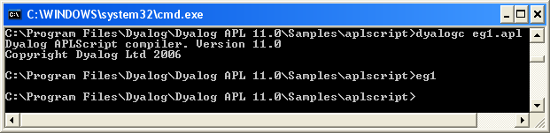
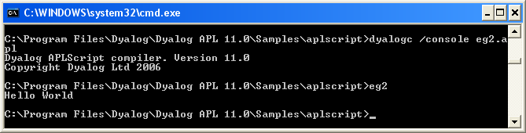

<h1 class="heading"><span class="name">Creating Programs (.exe) with APL Source Files</span></h1>

The following examples, which illustrate how you can create an executable program (**.exe**) directly from an APL source file, can be found in the **[DYALOG]\Samples\bound_exe** directory.

## Example: Simple GUI

The following APL source file (**eg1.apln**) illustrates the simplest possible GUI application that displays a message box containing the string "Hello World":
```apl
:Namespace N
⎕LX←'N.RUN' 
∇RUN;M 
'M'⎕WC'MsgBox' 'A GUI exe' 'Hello World'
⎕DQ'M' 
∇ 
:EndNamespace
```

The code must be contained within `:NameSpace` and `:EndNamespace` statements, and must define a [`⎕LX`](../../language-reference-guide/system-functions/lx/) either in the code itself or as a parameter to the `dyalogc` command.

This is compiled to a Windows executable (**.exe**) using **dyalogc** and run from the same command window (see [](#eg1apln)).

{ #eg1apln }


The resulting executable can be associated with a desktop icon, and will run without a command prompt window. Any default APL output that would normally be displayed in the session window will be ignored.

## Example: Simple Console

The following APL source file (**eg2.apln**) illustrates the simplest possible application that displays the text "Hello World":
```apl
:Namespace N
⎕LX←'N.RUN'
∇RUN
'Hello World'
∇
:EndNamespace
```

The code must be contained within `:NameSpace` and `:EndNamespace` statements, and must define a `⎕LX` either in the code itself or as a parameter to the `dyalogc` command.

This  is compiled to a Windows executable (**.exe**) using **dyalogc** and run from the same command window (see [](#eg2apln)). The `/console` flag instructs the Dyalog .NET Compiler to create a console application that runs from a command prompt. In this case, default APL output that would normally be displayed in the Session window is instead displayed in the command window from which the program was run.

{ #eg2apln }

## Defining Namespaces

At least one namespace must specified in an APL source file. Namespaces are specified in an APL source file using the `:Namespace` and `:EndNamespace` statements. Although you can use [`⎕NS`](../../language-reference-guide/system-functions/ns/) and [`⎕CS`](../../language-reference-guide/system-functions/cs/) within functions inside an APL source file, you should not use these system functions outside function bodies; such use is not prevented, but the results will be unpredictable.

`:Namespace Name` introduces a new namespace relative to the current namespace called `Name`.

`:EndNamespace` terminates the definition of the current namespace. Subsequent statements and function bodies are processed in the context of the original space.

All functions specified between the `:Namespace` and `:EndNamespace` statements are fixed within that namespace. Similarly, all assignments define variables inside that namespace.
