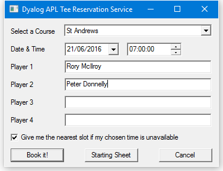
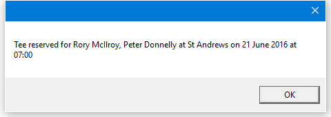
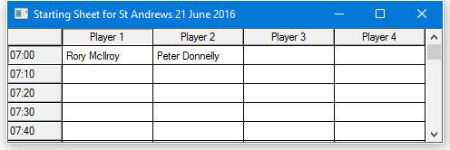
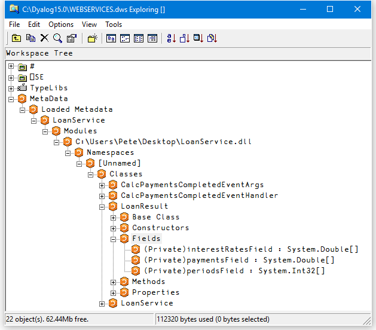
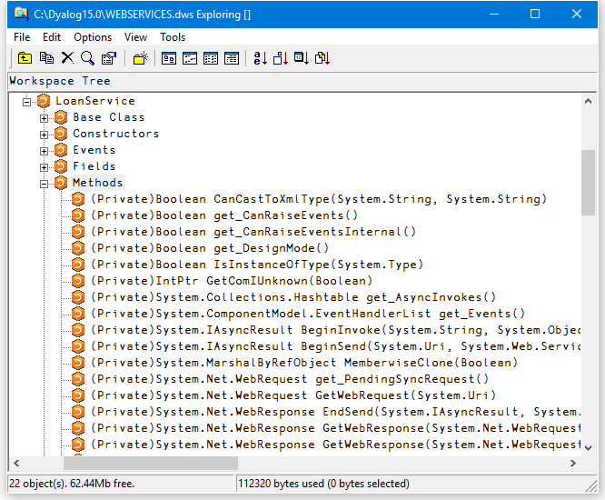

# <span class="name">Calling Web Services</span> {: .heading}

To call a web service, you need a _proxy class_ on the client that exposes the same methods and properties as the web service. The proxy creates the illusion that the web service is present on the client. Client applications create instances of the proxy class, which then communicate with the web service through IIS, using TCP/IP and HTTP/XML protocols.

Microsoft provides a utility called **WSDL.EXE** that queries the metadata (Web Service Definition Language) of a web service and generates C# source code for a matching proxy class.

## The MakeProxy Function

The `MakeProxy` function is provided in the supplied workspace **[DYALOG]\Samples\asp.net\webservices\webservices.dws**.

`MakeProxy` is monadic, and its argument specifies the URL of the web service to which you want to connect. For example, the following expressions uses `MakeProxy` to connect to the LoanService sample web service provided with Dyalog .NET:
```apl
      MakeProxy'http://localhost/dyalog.net/Loan/Loan.asmx'
```

`MakeProxy` runs the Microsoft utility **WSDL.EXE**, passing the URL to it as an argument. The utility then creates a C# source code file in your current directory that contains the code necessary to create a proxy class. The name of the C# file is the name of the web service (as declared in its header line) followed by the extension **.cs**.

`MakeProxy` then calls the C# compiler to compile this file, creating an assembly with the same name, but with a **.dll** extension, in your current directory. This assembly contains a .NET class of the same name.

`MakeProxy` attempts to determine the correct path for **WSDL.EXE** and **CSC.EXE**; different versions of Microsoft.NET or Visual Studio might necessitate having to modify the `MakeProxy` function to locate these tools.

## Using LoanService from Dyalog

The `MakeProxy'http://localhost/dyalog.net/Loan/Loan.asmx'` call creates a C# source code file called **LoanService.cs** and an assembly called **LoanService.dll** in your current directory. The name of the proxy class in **LoanService.dll** is `LoanService`.

You use this proxy class in the same way that you use any .NET class. For example:
```apl
      ⎕USING ←,⊂',.\LoanService.dll
      LN←⎕NEW LoanService
      LN.CalcPayments 100000 20 10 15 2
LoanResult
```

As expected, the result of `CalcPayments` is an object of type `LoanResult`. We will assign this to `LR` and then reference its fields:
```apl
      LR←LN.CalcPayments 100000 20 10 15 2
      LR.Periods
10 11 12 13 14 15 16 17 18 19 20
      LR.InterestRates
2 2.5 3 3.5 4 4.5 5 5.5 6 6.5 7 7.5 8 8.5 9 9.5 10 10.5 ...
      LR.(((⍴InterestRates),⍴Periods)⍴Payments)
920.1345384 844.5907851 781.6836919 728.4970675 682.947 ...
```

The `Payments` field is a vector because it was defined that way. However, as shown above, it is easy to give it the "right" shape.

When you execute the `CalcPayments` method in the proxy class, the class transforms and packages up your arguments into an appropriate SOAP/XML stream, then sends them (using TCP/IP) to the URL that represents the web service wherever that URL is on the internet/intranet. It then decodes the SOAP/XML that comes back, and returns the response as the result of the method.

!!! Info "Information"
    Depending on the speed of your connection, and the logical distance away of the web service itself, calling a web service method can take a significant amount of time irrespective of how much time it takes to execute on its server.

## Using GolfService from Dyalog

The workspace **[DYALOG]\Samples\asp.net\webservices\webservices.dws** contains functions that present a GUI interface to the <code class="language-nonAPL">GolfService</code> web service.

The `GOLF` function accesses <code class="language-nonAPL">GolfService</code> through a proxy class. `GOLF` is called with an argument of `0` or `1`. Use 1 to force `GOLF` to create or rebuild the proxy class, which it does by calling `MakeProxy`. You must use an argument of `1` the first time you call `GOLF`, or if you ever change the `GolfService` APL code.

!!! Info "Information"
    You cannot make the proxy for <code class="language-nonAPL">GolfService</code> unless the web server class has been compiled on the server. At present, the only way to trigger the compilation of **golf.asmx** into a web service is to visit the page once using your preferred browser, as described in [Writing Web Services](writing-web-services/index.md) and its sub-sections.

The first few lines of the function are listed below. If the argument is `1`, line `[2]` makes the proxy class **GolfService.DLL** in the current directory; if not, it is assumed to be there already. Line `[6]` defines `⎕USING` to use it, and line `[7]` creates a new instance assigned to `GS`. Line `[8]` calls the `GetCourses` method, which returns a vector of `GolfCourse` objects. The namespace reference array expansion is used to extract the course codes and names from the `Code` and `Name` fields respectively:
```apl
      ∇ GOLF FORCE;F;DLL;COURSES;COURSECODES;N;GS;⎕USING
[1]    :If FORCE≢0
[2]       DLL←MakeProxy 'http://localhost/dyalog.net/golf/golf.asmx'
[3]    :Else
[4]        DLL←'.\GolfService.dll'
[5]    :EndIf
[6]    ⎕USING←'System'(',',DLL)
[7]    GS←⎕NEW GolfService
[8]    COURSECODES COURSES←↓⍉↑GS.GetCourses.(Code Name)
```

The following image illustrates the user interface provided by `GOLF`. In this example, the user has typed the names of two golfers (one rather more famous than the other).



When the **Book it!** button is pressed, the `BOOK` callback function is triggered:

```apl
     ∇ BOOK;CCODE;YMD;HOUR;MINUTES;FLAG;NAMES;BOOKING;M
[1]    CCODE←⊃F.COURSE.SelItems/COURSECODES
[2]    YMD←3↑F.DATE.(IDNToDate⊃DateTime)
[3]    HOUR MINUTES←2↑1↓F.TIME.DateTime
[4]    FLAG←1=F.Nearest.State
[5]    NAMES←F.(Name1 Name2 Name3 Name4).Text
[6]    BOOKING←GS.MakeBooking CCODE (⎕NEW DateTime (YMD,HOUR MINUTES 0)),FLAG,NAMES
[7]    'M'⎕WC'MsgBox'
[8]    :If BOOKING.OK
[9]        M.Text←'Tee reserved for ',¯2↓⊃,/BOOKING.TeeTime.Players,¨⊂', '
[10]       M.Text,←' at ',BOOKING.Course.Name
[11]       M.Text,←' on ',BOOKING.TeeTime.Time. (ToLongDateString,' at ',ToShortTimeString)
[12]   :Else
[13]       M.Text←BOOKING.(Course.Name,'', TeeTime.Time.(ToLongDateString, ' at ',ToShortTimeString),' ',Message)
[14]   :EndIf
[15]   ⎕DQ'M'
     ∇
```

Line `[6]` calls the `MakeBooking` method of the `GS` object, passing it the data entered by the user. The result, a `Booking` object, is assigned to `BOOKING`. Line `[8]` checks its `OK` field to determine whether the reservation was successful. If it was, lines `[9-11]` display the message box shown below – notice how the various fields are extracted and how the `ToLongDateString` and `ToShortTimeString` methods are employed.



When the **Starting Sheet** button is pressed, the `SS` callback function is triggered:
```apl
    ∇ SS;CCODE;YMD;M;SHEET;OK;COURSE;TEETIME;S;DATA;N
        ;TIMES
[1]    CCODE←⊃F.COURSE.SelItems/COURSECODES
[2]    YMD←3↑F.DATE.(IDNToDate⊃DateTime)
[3]    SHEET←GS.GetStartingSheet CCODE(⎕NEW DateTime YMD)
[4]    :If SHEET.OK
[5]        DATA←↑(SHEET.Slots).Players
[6]        TIMES←(SHEET.Slots).Time
[7]        'S'⎕WC'Form'('Starting Sheet for ', SHEET.Course.Name,' ', SHEET.Date.ToLongDateString) ('Coord' 'Pixel')('Size' 400 480)
[8]        'S.G'⎕WC'Grid'DATA(0 0)(S.Size)
[9]        S.G.RowTitles←TIMES.ToShortTimeString
[10]       S.G.ColTitles←'Player 1' 'Player 2' 'Player 3' 'Player 4'
[11]       S.G.TitleWidth←60
[12]       ⎕DQ'S'
[13]   :Else
[14]       'M'⎕WC'MsgBox'('Starting Sheet for ', SHEET.Course.Name,' ', SHEET.Date.ToLongDateString)('Style' 'Error')
[15]       M.Text←SHEET.Message
[16]       ⎕DQ'M'
[17]   :EndIf
     ∇
```

Line `[3]` calls the `GetStartingSheet` method of the `GS` object. The result, a `StartingSheet` object, is assigned to `SHEET`. Line `[4]` checks its `OK` field to determine whether the call was successful. If it was, lines `[5-12]` display the result in a Grid:



## Exploring Web Services

You can use the Workspace Explorer to browse the proxy class associated with a web service in the same way that you can browse any other .NET assembly. The following screenshots show the <code class="language-nonAPL">Metadata</code> for <code class="language-nonAPL">LoanService</code>, loaded from the **LoanService.dll** proxy.

<code class="language-nonAPL">LoanService</code> was written in an APL source file but it appears and behaves the same as any other .NET class.

The structure of the <code class="language-nonAPL">LoanResult</code> class is:



In addition to <code class="language-nonAPL">CalcPayments</code>, which was written in an APL source file, there are a large number of other methods that have been inherited from the base class. The methods exposed by <code class="language-nonAPL">LoanService</code> are:



## Asynchronous Use

Web services provide both synchronous (client calls the function and waits for a result) and asynchronous operation.

Each method is exposed as a function with the same name (the synchronous version) together with a pair of functions with that name prefixed with `Begin` and `End` respectively.

The `Beginxxx` functions take two additional parameters; a delegate class that represents a callback function, and a state parameter.

To initiate the call, execute the `Beginxxx` method using the standard parameters followed by two objects. The first is an object of type <code class="language-nonAPL">System.AsyncCallback</code>, representing an asynchronous callback, that is, a callback to be invoked when the asynchronous call is complete. The second is an object that is used to supply extra information. See [Using a Callback](#using-a-callback) for information on how callbacks are used. If you are not using a callback, these items should be null object references. You can specify a reference to a null object using the expression `(⎕NS'')`. For example, using the <code class="language-nonAPL">LoanService</code> sample:
```apl
      A←LN.BeginCalcPayments 10000 16 10 12 9(⎕NS'')(⎕NS'')
```

The result is an object of type <code class="language-nonAPL">WebClientAsyncResult</code>:
```apl
      A
System.IAsyncResult ⎕CLASS System.Web.Services.Protocols.WebClientAsyncResult
```

Some time later, you call the `Endxxx` method with this object as a parameter. For example:
```apl
      LN.EndCalcPayments A
LoanResult
```

You can execute several asynchronous calls in parallel:
```apl
      A1←LN.BeginCalcPayments 20000 20 10 15 7(⎕NS'')(⎕NS'')
      A2←LN.BeginCalcPayments 30000 10  8 12 3(⎕NS'')(⎕NS'')
```
```apl
      LN.EndCalcPayments A1
LoanResult
```
```apl
      LN.EndCalcPayments A2
LoanResult
```

### Using a Callback

The simple approach described in [Asynchronous Use](#asynchronous-use) is not always practical. If it can take a significant amount of time for the web service to respond, you might prefer to have the system notify you (using a callback function) when the result from the method is available.

The example function `TestAsyncLoan` in the supplied workspace **[DYALOG]\Samples\asp.net\webservices\webservices.dws** shows how you can do this. It is somewhat artificial, but explains the mechanism that is involved.

`TestAsyncLoan` is a convenience function that calls `AsyncLoan` with suitable arguments. `TestAsyncLoan` takes an argument of `1` or `0` that determines whether a proxy class for <code class="language-nonAPL">LoanService</code> is to be built.
```apl
     ∇ TestAsyncLoan MAKEPROXY
[1]   (⍕MAKEPROXY),' AsyncLoan 10000 10 8 5 3'
[2]   MAKEPROXY AsyncLoan 10000 10 8 5 3
     ∇
```

The `AsyncLoan` function and its callback function `GetLoanResult` are more interesting:
```apl
     ∇ {MAKEPROXY}AsyncLoan ARGS;DLL;SINK;LN;AS;AR
[1]    :If 2≠⎕NC'MAKEPROXY' ⋄ MAKEPROXY←0 ⋄ :EndIf
[2]    :If MAKEPROXY
[3]       DLL←MakeProxy'http://localhost/dyalog.net/loan/ loan.asmx'
[4]    :Else
[5]       DLL←'.\LoanService.dll'
[6]    :EndIf
[7]    ⎕USING←'System'(',',DLL)
[8]    LN←⎕NEW LoanService 
[9]    AS←⎕NEW System.AsyncCallback,⊂⎕OR'GetLoanResult'
[10]   AR←LN.BeginCalcPayments ARGS,AS,LN
[11]   'AsyncLoan waits for async call to complete'
[12]   :While 0=AR.IsCompleted
[13]      ⍞←'.'
[14]   :EndWhile
     ∇
```
```apl
     ∇ GetLoanResult arg;OBJ;LR;RSLT
[1]    'GetLoanResult callback fires ...'
[2]    OBJ←arg.AsyncState
[3]    LR←OBJ.EndCalcPayments arg
[4]    RSLT←LR.(((⍴Periods),(⍴InterestRates))⍴Payments)
[5]    RSLT←((⊂''),LR.Periods),(LR.InterestRates),[1]RSLT
[6]    'Result is'
[7]    ⎕←RSLT
     ∇
```

The effect of running `TestAsyncLoan` is:
```apl
     TestAsyncLoan 0
0 AsyncLoan 10000 10 8 4 3
```
```apl

...AsyncLoan waits for async call to complete...
...GetLoanResult callback fires ...
```
```apl

...Result is
      3           3.5         4
 8  117.2957193 105.7694035  96.5607447 
 9  119.5805173 108.0741442  98.88586746
121.892753  110.409689  101.2451382
```

`AsyncLoan[8]` creates a new instance of the LoanService class called `LN`. The next line creates an object of type <code class="language-nonAPL">System.AsyncCallback</code> called `AS`. This object, which is termed a _delegate_, identifies the callback function that is to be invoked when the asynchronous call to <code class="language-nonAPL">CalcPayments</code> is complete. In this case, the name of the callback function is `GetLoanResult`.

!!! Info "Information"
    `⎕OR` is necessary because the <code class="language-nonAPL">AsyncCallback</code> constructor must be called with a parameter of type <code class="language-nonAPL">System.Object</code>.

`AsyncLoan[10]` calls `BeginCalcPayments` with the parameters for `CalcPayments`, followed by references to `AS` (which identifies the callback) and `LN` (which identifies the object in question). The latter will be in the argument supplied to the `GetLoanResult` callback. `AsyncLoan[12-14]` loop, displaying dots, until the asynchronous call is complete. `GetLoanResult` will be invoked during or immediately after this loop, and will be executed in a different APL thread.

When the `GetLoanResult` callback is invoked, its argument `arg` is an object of type <code class="language-nonAPL">System.Web.Services.Protocols.WebClientAsyncResult</code>. It is a reference to the same object `AR` that was the result returned by `BeginCalcPayments`.

This object has an <code class="language-nonAPL">AsyncState</code> property that references the <code class="language-nonAPL">LoanService</code> object `LN` that was passed as the final parameter to `BeginCalcPayments`. `GetLoanResult[2]` retrieves this object and assigns it to `OBJ`. `GetLoanResult[3]` calls the `EndCalcPayments` method, passing it `arg` as the `AsyncResult` parameter as before. The resulting `LoanResult` object is then formatted and displayed.
