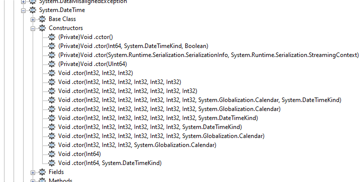
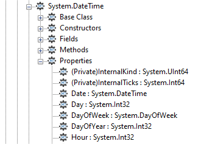
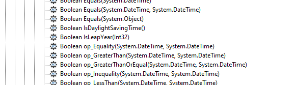
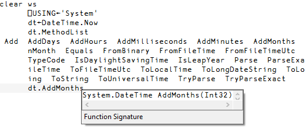
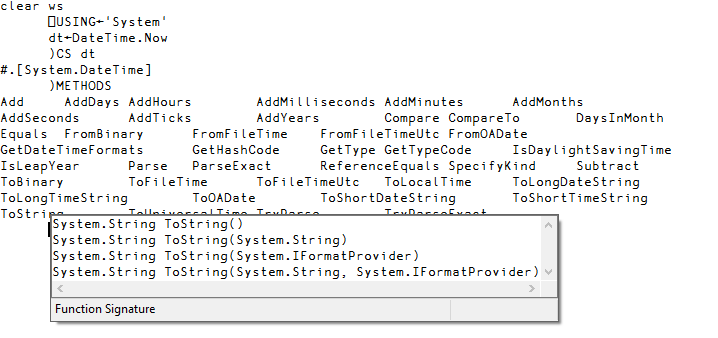

<h1 class="heading"><span class="name">Browsing .NET Classes</span></h1>

Microsoft supplies a tool for browsing .NET Class libraries called **Ildasm.exe** (this can be found in the .NET SDK and is distributed with Microsoft Visual Studio). Dyalog's Workspace Explorer has been extended to perform a similar task  to ILDSAM so that the information is available within the context of the APL environment.

The information that describes .NET classes, which is known as its _Metadata_, is part of the definition of the class and is stored with it. Metadata corresponds to Type Information in COM, which is typically stored in a separate Type Library.

**To gain information about one or more .NET Classes**

1. In the **Tools** menu, select **Explorer...**<br />The **Windows Explorer** panel is displayed.
2. In the **Workspace Tree**, right-click on **MetaData**.
3. Select **Load** from the drop-down list.<br />The **Browse .NET Assembly** window is displayed.
4. Navigate to and select the .NET assembly of interest, and click **Open**.<br />The tree structure for the selected .NET assembly is displayed in the **Workspace Tree**.

The .NET classes provided with the .NET Framework are typically located in **C:\WINDOWS\Microsoft.NET\Framework64\V4.0.30319** (on a 64-bit computer) – the final directory in this path is the version number. The most commonly-used classes of the .NET namespace system are stored in this directory in a .NET assembly called **mscorlib.dll**.

Opening the **mscorlib.dll** assembly displays an extensive hierarchy; its complexity is due to the structure of the Metadata. Within the **mscorlib.dll** assembly, opening **Namespaces** > **System** > **Classes** displays the list of classes contained in the System .NET namespace. Each class can be expanded to display multiple directories containing detailed information about the class. For example:

- the **Constructors** directory includes all of the valid constructors (**.ctor** files) and their parameter sets with which you can create a new instance of the Class (files with a **.cctor** extension and files labelled as "(Private)" can be ignored).
- the **Properties** directory includes all the properties supported by the Class.
- the **Methods** directory lists the methods supported by the Class.

<h4 class="example">Example</h4>

Within the tree structure of the **mscorlib.dll** Assembly, navigate to **Namespaces** > **System** > **Classes** > **System.DateTime**.

Open the **Constructors** directory.



The image above shows the different constructors that are available when creating a new <code class="language-nonAPL">DateTime</code> instance. From these constructors, it can be deduced that <code class="language-nonAPL">DateTime.New</code> can be called with three numeric (<code class="language-nonAPL">Int32</code>) parameters, or six numeric (<code class="language-nonAPL">Int32</code>) parameters, or any of several other options.

This means that the following statement can be used to create a new instance of <code class="language-nonAPL">DateTime</code> (30 April 2001 at 09:30):
```apl
      mydt←⎕NEW DateTime (2001 4 30 9 30 0)

      mydt
30/04/2001 09:30:00
```

Open the **Properties** directory.



The image above shows the different properties and their data type, for example, the <code class="language-nonAPL">DayOfYear</code> property is of type <code class="language-nonAPL">Int32</code>.

A property can be queried by direct reference:
```apl
      mydt.DayOfWeek
Monday
```

The data types of some properties are not simple data types, but are .NET Classes. For example, the data type of the <code class="language-nonAPL">Now</code> property is <code class="language-nonAPL">SystemDateTime</code>. This means that references to the Now property return an object that represents an instance of the <code class="language-nonAPL">System.DateTime</code> object:
```apl
      mydt.Now
07/11/2001 11:30:48
      ⎕TS
2001 11 7 11 30 48 0
```

Open the **Methods** directory.



The image above shows the  data type of the result of the method, followed by the name of the method and the types of its arguments, for example, the <code class="language-nonAPL">IsLeapYear</code> method takes an <code class="language-nonAPL">Int32</code> parameter (year) and returns a <code class="language-nonAPL">Boolean</code> result:
```apl
      mydt.IsLeapYear 2000
1
```

Many of the reported objects are listed as _Private_, which means that they are inaccessible to users of the class and cannot be called or have their value inspected. For more information about classes, see the _Dyalog APL Language Reference Guide_.

## Value Tips for External Functions

Value Tips can be used to view the syntax of external functions. If you hover over the name of an external function, the Value Tip displays its Function Signature.

For example, the following image shows the mouse hovered over the external function `dt.AddMonths`, which reveals that it requires a single integer as its argument.



If an external function provides more than one signature, then they are all shown in the Value Tip. For example, the figure below shows that the function `ToString` has four different overloads).


