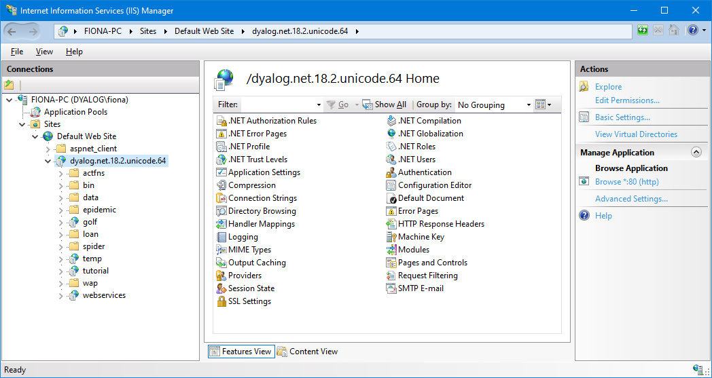
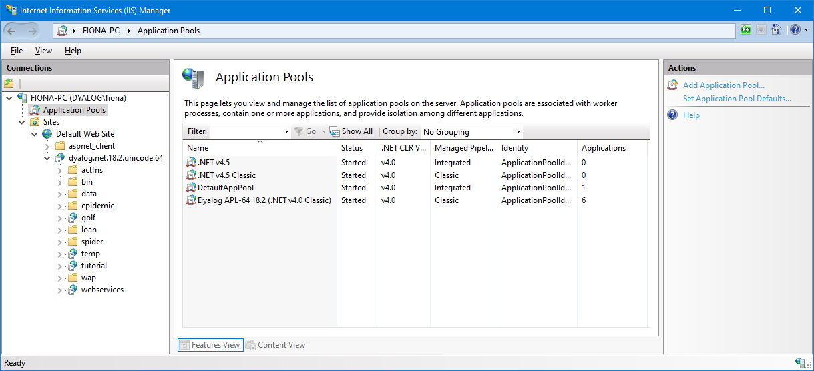

# Dyalog and IIS {: .heading}

Microsoft Internet Information Services (IIS) is a comprehensive web server software package that allows you to publish information on your intranet or the internet. IIS is included with Professional and Server versions of all recent Microsoft Windows operating systems (all you need to add is a network connection to run your own website).

IIS includes Active Server Page (ASP) technology, which permits web pages to be created dynamically by the web server. An ASP file is a character file that contains a mixture of HTML and scripts. When IIS receives a request for an ASP file, it executes the server-side scripts contained in the file to build the web page that is to be sent to the browser. In addition to server-side scripts, ASP files can contain HTML (including related client-side scripts) as well as calls to components that can perform a variety of tasks such as database lookup, calculations, and business logic. Each script inside an ASP page generates a stream of HTML; the server runs the scripts and assembles the resulting HTML into a single stream (web page) that is sent to the browser.

ASP.NET is a new version of ASP and is based upon the Microsoft .NET Framework technology. It offers significantly better performance and a host of new features including support for web services.

## IIS Installation Dependency

During installation, Dyalog registers itself with ASP.NET as an ASP.NET programming language. Among other things, this allows ASP.NET web pages to be written using Dyalog. The Dyalog installation program  also registers the Dyalog asp.net sample applications as IIS _virtual directories_.

It is not practical for the Dyalog **setup.exe** to perform these tasks unless IIS and ASP.NET are already installed. Furthermore, unless IIS and ASP.NET are already installed and activated on the system, the Dyalog sub-directory **Samples/asp.net** will not be copied onto the system, because the samples it contains would be inoperable.

!!! Info "Information"
    If IIS is installed after Dyalog, it is necessary to uninstall and then re-install Dyalog to enable the registration of Dyalog as an ASP.NET programming language to occur, and for the **Samples/asp.net** sub-directory to be copied onto the system and the samples registered as IIS virtual directories.

## IIS Applications, Virtual Directories, and Application Pools

IIS supports the concept of an _application_. An application is a logically-separate service or web site. IIS can run any number of applications concurrently. The files associated with an application are stored in a physical directory on disk, which is linked to an IIS virtual directory. The name of the virtual directory is the name of the application or web site.

The **[DYALOG]\Samples\asp.net** directory and its sub-directories contain sample applications. When installing Dyalog, these are automatically registered as IIS virtual directories, under a common root that has the name  **dyalog.net.&lt;version>.&lt;edition>.&lt;width>**. For example, the 64‑bit Unicode edition of Dyalog version 18.0 will have the common root **dyalog.net.18.0.unicode.64**. This common root is referred to in this documentation as **dyalog.net**.

!!! Legacy "Legacy"
    Prior to Dyalog v11.0, virtual directories were created in the **apl.net** directory.

IIS applications run in _application pools_. An application pool is a group of one or more URLs that are served by the same worker process (or set of worker processes) which are separate from the worker process that services another application pool. This mechanism isolates applications from one another, providing resilience should any one application fail.

Each **dyalog.net** application is associated with an application pool called Dyalog APL xx (.NET v4.0 Classic), where xx is 32 or 64 – this is created (if required) during installation. The term *NET v4.0 Classic* refers to the name of a standard application pool on which it is based, and is not connected to the Classic variant of Dyalog.

When you want to run the web services and web page examples, go to [http://localhost/dyalog.net.18.2.unicode.64/index.htm](http://localhost/dyalog.net.18.2.unicode.64/index.htm) and select from the menu on the left-hand side.

## Internet Information Services (IIS) Manager

Internet Information Services (IIS) Manager is a tool for managing IIS. If you are developing web pages/services, you will use this tool a lot.

Following a successful installation of Dyalog, the **dyalog.net** application should appear in the Internet Information Services (IIS) Manager:

The **golf**, **temp**, **tutorial**, and **webservices** nodes in the **dyalog.net** application represent separate IIS applications.

The dyalog application pool will appear in the list of **Applications Pools**:

