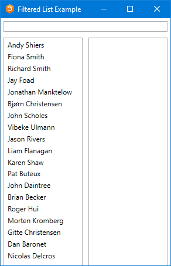
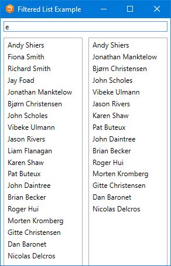
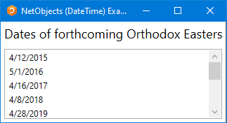
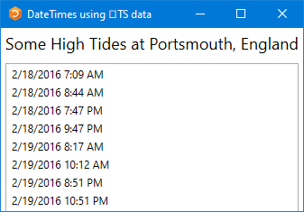
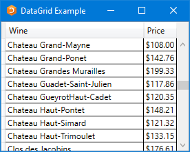
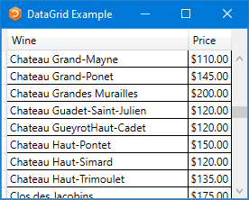
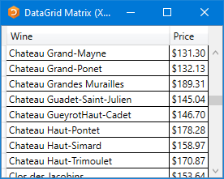
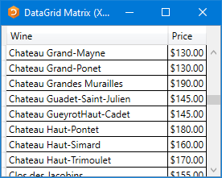

<h1 class="heading"><span class="name">Data Binding</span></h1>

This section provides some simple examples of WPF data binding using Dyalog. Each example builds upon the previous ones, so it is advisable to work through them in order.

The example code on this page is included in the **[DYALOG]\ws\wpfintro.dws** workspace.

## Example 1: Basic Data Binding

This example illustrates data binding using XAML to specify the user interface coupled with an APL function to drive it and handle the data binding.

### The XAML

The XAML describes a <code class="language-nonAPL">Window</code> containing a <code class="language-nonAPL">TextBox</code>.
```xml
<Window
 xmlns="http://schemas.microsoft.com/winfx/2006/xaml/presentation"
 xmlns:x="http://schemas.microsoft.com/winfx/2006/xaml"
 Name="Temp"
 Title="Data Binding (Text)"
 SizeToContent="WidthandHeight">
     <TextBox Name="txt" Width="300" Margin="5"
     Text="{Binding txtSource,Mode=TwoWay,UpdateSourceTrigger=PropertyChanged}"/>
</Window>
```

The data binding expression
```xml
     Text="{Binding txtSource,Mode=TwoWay,UpdateSourceTrigger=PropertyChanged}"/>

```

specifies that the <code class="language-nonAPL">Text</code> property of the <code class="language-nonAPL">TextBox</code> is bound to a value in the Binding Source (which has yet to be defined) whose path is <code class="language-nonAPL">txtSource</code>. The binding mode is set to <code class="language-nonAPL">TwoWay</code>, which means that any change in the <code class="language-nonAPL">TextBox</code> will be reflected in a new value in the Binding Source, and any change in the Binding Source will be reflected in the <code class="language-nonAPL">TextBox</code>. The value in the Binding Source will be updated when the property (in this case the <code class="language-nonAPL">Text</code> property) changes.

### The APL Code

The function `Text` that generates this example is shown below. The argument `txt` is the text to be displayed initially in the TextBox. The variable `XAML_Text` contains the [XAML that describes the user interface](#the-xaml).
```apl
     ∇ Text txt;⎕USING;str;xml;win
[1]    ⎕USING←,⊂'System.Windows.Controls,WPF/PresentationFramework.dll'
[2]    win←LoadXAML XAML
[3]    win.txtBox←win.FindName⊂'txt'
[4]
[5]    ⎕EX'txtSource'
[6]    txtSource←txt
[7]    win.txtBox.DataContext←2015⌶'txtSource'
[8]
[9]    win.Show
     ∇

```

The utility function `LoadXAML` incorporates the 3 lines of code `[5-7]` used to create a WPF window from XAML that were coded in-line in the [Temperature Converter Tutorial](../temperature-converter-tutorial/#the-code-to-display-the-xaml):
```apl
     ∇ win←LoadXAML xaml;⎕USING;str;xml
[1]    ⎕USING←'System.IO'
[2]    ⎕USING,←⊂'System.Windows.Markup'
[3]    ⎕USING,←⊂'System.Xml,system.xml.dll'
[4]    ⎕USING←,⊂'System.Windows.Controls,WPF/PresentationFramework.dll'
[5]    str←⎕NEW StringReader(⊂xaml)
[6]    xml←⎕NEW XmlTextReader str
[7]    win←XamlReader.Load xml
     ∇

```

Line `[1]` defines the .NET search path needed to access the WPF controls:
```apl

[1]    ⎕USING←,⊂'System.Windows.Controls,WPF/PresentationFramework.dll'
```

Lines `[2-3]` use the utility function `LoadXAML` to load a WPF user-interface from the XAML and then use the `FindName` method to obtain a reference to the object named `txt`:
```apl

[2]    win←LoadXAML XAML
[3]    win.txtBox←win.FindName⊂'txt'
```

Lines `[5-6]` initialise a new global variable called `txtSource` to the value of the argument. When using a global variable as a data binding source, it is generally advisable to establish a new variable by first expunging it. This is because its binding type (the exported type of the data bound variable) is stored in the workspace along with its value, and the binding type (were it to be incorrect) cannot be changed once it has been established:
```apl

[5]   ⎕EX'txtSource'
[6]   txtSource←txt
```

Line `[7]`creates a Binding Source object using [`2015⌶`](../../language-reference-guide/primitive-operators/i-beam/create-data-binding-source/) and assigns it to the `DataContext` property of the TextBox object. As it is a character vector, the exported Type for the bound variable `txtSource` is <code class="language-nonAPL">System.String</code>, which is appropriate for the <code class="language-nonAPL">Text</code> property of a <code class="language-nonAPL">TextBox</code>:
```apl

[7]    win.txtBox.DataContext←2015⌶'txtSource'
```

Line `[9]` displays the Window:
```apl

[9]   win.Show
```

Although the APL local variable `win` goes out of scope when the function terminates, the Window remains visible until the user has closed it.

### Testing the Data Binding

The following expressions can be used to explore the effect of data binding:
```apl
      )LOAD wpfintro
      )CS DataBinding.Text
#.DataBinding.Text

```

```apl
      Text 'Hello World'
```


```apl
      txtSource←⌽txtSource
```


Typing into the TextBox changes the value of the bound variable:


```apl
      txtSource
What is in txtSource now?

```

## Example 2: Specified Data Type

This example illustrates the use of the optional left argument to `2015⌶` to specify the data type used to export the value of the bound variable.

### The XAML

The XAML describes the same <code class="language-nonAPL">Window</code> containing a <code class="language-nonAPL">TextBox</code> as in [Example 1](#the-xaml).
```xml
<Window
 xmlns="http://schemas.microsoft.com/winfx/2006/xaml/presentation"
 xmlns:x="http://schemas.microsoft.com/winfx/2006/xaml"
 Name="Temp"
 Title="Data Binding (FontSize)"
 SizeToContent="WidthandHeight">
     <TextBox Name="txt" Text="Hello World" Width="300"
      Margin="5"
      FontSize="{Binding sizeSource,Mode=OneWay}"/>
</Window>

```

This time, the data binding expression
```nonAPL
      FontSize="{Binding sizeSource,Mode=OneWay}"/>
```

specifies that the <code class="language-nonAPL">FontSize</code> property of the <code class="language-nonAPL">TextBox</code> is bound to a value in the Binding Source (which has yet to be defined) whose path is <code class="language-nonAPL">sizeSource</code>. The binding mode is set to <code class="language-nonAPL">OneWay</code>, which means that the <code class="language-nonAPL">FontSize</code> property depends on the data value but the data value does not depend on the <code class="language-nonAPL">FontSize</code> property. If the <code class="language-nonAPL">FontSize</code> changed for any external reason (which is unlikely in the case of <code class="language-nonAPL">FontSize</code>), it would not alter the value in <code class="language-nonAPL">sizeSource</code> to which it is bound.

### The APL Code

The function `FontSize` is almost identical to the function `Text` described in [Example 1](#the-apl-code):
```apl

     ∇ FontSize size;⎕USING;win
[1]    ⎕USING←'System'
[2]    ⎕USING←,⊂'System.Windows.Controls,WPF/PresentationFramework.dll'
[3]    win←LoadXAML XAML
[4]    win.txtBox←win.FindName⊂'txt'
[5]
[6]    ⎕EX'sizeSource'
[7]    sizeSource←size
[8]    win.txtBox.DataContext←Int32(2015⌶)'sizeSource'
[9]
[10]   win.Show
     ∇

```

The key difference is in line `[8]`. Here, the left argument of `(2015⌶)` is `Int32`. This means that the exported Type of the variable `sizeSource` will be <code class="language-nonAPL">Int32</code>. This Type (a 32-bit integer) is required by the <code class="language-nonAPL">FontSize</code> property of a <code class="language-nonAPL">TextBox</code>; no other <code class="language-nonAPL">Type</code> will do. If this is omitted, APL will export the value of the variable using a <code class="language-nonAPL">Type</code> dependent on its internal format (most likely <code class="language-nonAPL">Int16</code>) and the binding will fail:
```apl

[8]    win.txtBox.DataContext←Int32(2015⌶)'sizeSource'
```

### Testing the Data Binding
```apl
      )LOAD wpfintro
      )CS DataBinding.FontSize
#.DataBinding.FontSize
```

```apl
      FontSize 12
```


```apl
      sizeSource
12
      sizeSource←30
```


## Example 3: Specification using APL

This example uses APL code to both build the user interface (instead of using XAML) and handle the data binding. Both the <code class="language-nonAPL">Text</code> and the <code class="language-nonAPL">FontSize</code> properties are bound to APL variables.

### The APL Code
```apl
     ∇ TextFontSize(txt size);⎕USING;win;sink
[1]    ⎕USING←'System'
[2]    ⎕USING,←,⊂'System.Windows.Controls,WPF/PresentationFramework.dll'
[3]    ⎕USING,←⊂'System.Windows.Controls.Primitives,WPF/PresentationFramework.dll'
[4]    ⎕USING,←⊂'System.Windows,WPF/PresentationFramework.dll'
[5]    ⎕USING,←⊂'System.Windows,WPF/PresentationCore.dll'
[6]
[7]   ⍝ Create a Window, DockPanel and TextBox
[8]    win←⎕NEW Window
[9]    win.SizeToContent←SizeToContent.WidthAndHeight
[10]   win.Title←'Data Binding (Text and FontSize)'
[11]   win.txtBox←⎕NEW TextBox
[12]   win.txtBox.Width←350
[13]   win.Content←win.txtBox
[14]
[15]  ⍝ Define data binding from variable "txtSource"
[16]  ⍝ to the Text property of TextBox win.txtBox
[17]   ⎕EX'txtSource'
[18]   txtSource←txt
[19]   win.txtbinding←⎕NEW Data.Binding(⊂'txtSource')
[20]   win.txtbinding.Source←2015⌶'txtSource'
[21]   win.txtbinding.Mode←Data.BindingMode.TwoWay
[22]   win.txtbinding.UpdateSourceTrigger←Data.UpdateSourceTrigger.PropertyChanged
[23]   sink←win.txtBox.SetBinding TextBox.TextProperty win.txtbinding
[24]
[25]  ⍝ Define data binding from variable "sizeSource"
[26]  ⍝ to the FontSize property of TextBox win.txtBox
[27]   ⎕EX'sizeSource'
[28]   sizeSource←size
[29]   win.fntbinding←⎕NEW Data.Binding(⊂'sizeSource')
[30]   win.fntbinding.Source←Int32(2015⌶)'sizeSource'
[31]   win.fntbinding.Mode←Data.BindingMode.OneWay
[32]   sink←win.txtBox.SetBinding TextBox.FontSizeProperty win.fntbinding
[33]
[34]   win.Show
     ∇
```

Apart from the code that creates the controls, the only real difference between this and the examples shown in [Example 1](#the-apl-code) and [Example 2](#the-apl-code_1) is the way that the bindings are handled.

In code (as opposed to using XAML) this is done using explicit `Binding` objects (Binding objects are implicit in all binding operations, but are created declaratively when using XAML). The code for binding the `Text` property to the `txtSource` variable is as follows:
```apl
[19]   win.txtbinding←⎕NEW Data.Binding(⊂'txtSource')
[20]   win.txtbinding.Source←2015⌶'txtSource'
[21]   win.txtbinding.Mode←Data.BindingMode.TwoWay
[22]   win.txtbinding.UpdateSourceTrigger←Data.UpdateSourceTrigger.PropertyChanged
[23]   sink←win.txtBox.SetBinding TextBox.TextProperty win.txtbinding
```

Line `[19]` creates a `Binding` object, passing the constructor the name of the APL variable `txtSource` as the Path to the binding value:
```apl
[19]   win.txtbinding←⎕NEW Data.Binding(⊂'txtSource')
```

Line `[20]` creates a Binding Source object using `2015⌶` as before, but this time assigns it to the `Source` property of the `Binding` object:
```apl
[20]   win.txtbinding.Source←2015⌶'txtSource'
```

Line `[21]` sets the `Mode` property of the `Binding` object to `TwoWay` (a field of the BindingMode Type). As in [Example 1](#the-apl-code), this specifies two-way binding:
```apl
[21]   win.txtbinding.Mode←Data.BindingMode.TwoWay
```
Line `[22]` sets the `UpdateSourceTrigger` property of the `Binding` object to `PropertyChanged` (a field of the <code class="language-nonAPL">UpdateSourceTrigger</code> Type). This causes the value in the Binding Source (in this case, `txtSource`) to be changed whenever the property (in this case, the `Text` property) of the `TextBox` changes. This will occur on every keystroke:
```apl
[22]   win.txtbinding.UpdateSourceTrigger←Data.UpdateSourceTrigger.PropertyChanged
```

(The three types <code class="language-nonAPL">Binding</code>, <code class="language-nonAPL">BindingMode</code>, and <code class="language-nonAPL">UpdateSourceTrigger</code> are located in <code class="language-nonAPL">System.Windows.Data</code>)

The code that establishes the binding between the `sizeSource` variable and the FontSize property is very similar:
```apl
[29]   win.fntbinding←⎕NEW Data.Binding(⊂'sizeSource')
[30]   win.fntbinding.Source←Int32(2015⌶)'sizeSource'
[31]   win.fntbinding.Mode←Data.BindingMode.OneWay
[32]   sink←win.txtBox.SetBinding TextBox.FontSizeProperty win.fntbinding
```

As in [Example 2](#the-apl-code_1), the left-argument to `(2015⌶)` specifies that the exported data type of the `sizeSource` variable is to be <code class="language-nonAPL">Int32</code>.

### Testing the Data Binding
```apl
      )LOAD wpfintro
      )CS DataBinding.TextFontSizeCode
#.DataBinding.TextFontSizeCode
```

```apl
      TextFontSize 'Hello World' 30
```


```apl
      txtSource sizeSource←(⌽txtSource) 18
```


As in previous examples, when the user changes the text, the new text appears in `txtSource`:


```apl
      txtSource
Learn to play the bouzouki!

```

If you want to bind two properties of the same object to two APL variables, it has to be done by writing code as shown in this example, that is, using two separate Binding Source objects. This is because, using XAML, you can only associate a single Binding Source to an object. However, this minor restriction is easily surmounted by using an APL namespace as a Binding Source, as shown in [Example 4](#example-4-ui-specification-using-xaml).

## Example 4: Connected Properties

This example uses XAML to specify the user interface and the main components of the data binding.

### The XAML

The XAML is much the same as in [Example 1](#the-xaml) and [Example 2](#the-xaml_1) except that it connects two properties (<code class="language-nonAPL">Text</code> and <code class="language-nonAPL">FontSize</code>) of the same <code class="language-nonAPL">TextBox</code> to two paths (<code class="language-nonAPL">txtSource</code> and <code class="language-nonAPL">sizeSource</code>).
```xml
<Window
 xmlns="http://schemas.microsoft.com/winfx/2006/xaml/presentation"
 xmlns:x="http://schemas.microsoft.com/winfx/2006/xaml"
 Name="Temp"
 Title="Data Binding (Text and FontSize)"
 SizeToContent="WidthandHeight">
     <TextBox Name="txt" Width="350" Margin="5"
      Text="{Binding txtSource,Mode=TwoWay,UpdateSourceTrigger=PropertyChanged}"
      FontSize="{Binding sizeSource,Mode=OneWay}"/>
</Window>

```

### The APL Code

The function `TextFontSize` is:
```apl
     ∇ TextFontSize(txt size);⎕USING;str;xml;win;options
[1]    ⎕USING←'System'
[2]    ⎕USING,←⊂'System.Windows,WPF/PresentationFramework.dll'
[3]
[4]    win←LoadXAML XAML
[5]
[6]    src←⎕NS''
[7]    src.(txtSource sizeSource)←txt size
[8]    options←2 2⍴'txtSource'String'sizeSource'Int32
[9]
[10]   win.DataContext←options(2015⌶)'src'
[11]
[12]   win.Show
     ∇

```

Lines `[6-7]` create a new namespace `src` containing two variables, `txtSource` and `sizeSource`, which are initialised to the arguments of the function:
```apl
[6]    src←⎕NS''
[7]    src.(txtSource sizeSource)←txt size
```

Line `[8]` creates a local variable named `options` which will be used as the left argument of `(2015⌶)`. It is a 2-column matrix – the first column is a list of the names of the variables that are to be exported by the namespace when used as a Binding Source, and the second column specifies their data types:
```apl
[8]    options←2 2⍴'txtSource'String'sizeSource'Int32
```

Line `[10]` creates a Binding Source object from the namespace `src` and a left argument `options` and assigns it to the `DataContext` property of the Window `win`:
```apl
[10]   win.DataContext←options(2015⌶)'src'
```

An alternative would be to assign it to the `DataContext` property of the `TextBox` object, but this would require one further line of code to identify it. The reason this works is that the `DataContext` property of a `TextBox` (and many other controls) is inherited from its parent `Window`. This feature allows a single Binding Source namespace to be used to specify data bindings between its component variables and any number of properties of any number of controls in the same `Window`.

The left argument  of `(2015⌶)` is optional. Without it, the namespace will export all its variables using default binding types. In this case, because the binding type of `sizeSource` must be specified as <code class="language-nonAPL">Int32</code>, it is necessary to use a left argument, which means specifying all the variables involved.

### Testing the Data Binding
```apl
      )LOAD wpfintro
      )CS DataBinding.TextFontSizeXAML
#.DataBinding.TextFontSizeXAML
```

```apl
      TextFontSize'Hello World' 30
```


```apl
      src.(txtSource sizeSource←(⌽txtSource) 18)
```


When the user changes the text, the new text appears in `txtSource`:


```apl
      src.txtSource
Learn to play the bouzouki!			
```

## Example 5: Vector of Character Vectors

WPF data binding provides the means to bind controls that display lists of items, such as the <code class="language-nonAPL">ListBox</code>, <code class="language-nonAPL">ListView</code>, and <code class="language-nonAPL">TreeView</code> controls, to collections of data. These controls are all based upon the <code class="language-nonAPL">ItemsControl</code> class. To bind an <code class="language-nonAPL">ItemsControl</code> to a collection object, you use its <code class="language-nonAPL">ItemsSource</code> property.

If the right argument of `2015⌶` names a variable, or a namespace containing a variable, that is a vector other than a simple character vector, it returns a Binding Source object that provides the necessary interfaces to bind the variable as a collection to the <code class="language-nonAPL">ItemSource</code> property of an <code class="language-nonAPL">ItemsControl</code>.

The APL variable will normally contain a vector of character vectors, because most <code class="language-nonAPL">ItemsControl</code> objects deal with collections of strings. However, any APL vector other than a simple character vector will be treated in this way.

This example illustrates binding between a variable containing a vector of character vectors and the items of a <code class="language-nonAPL">ListBox</code>.

The <code class="language-nonAPL">ItemsSource</code> property overrides the <code class="language-nonAPL">Items</code> collection as a means to specify the content of the <code class="language-nonAPL">ItemsControl</code>. When the <code class="language-nonAPL">ItemsSource</code> property is set, the Items collection becomes read-only and of fixed size. The <code class="language-nonAPL">ItemsSource</code> property supports OneWay binding by default.

### The XAML

The variable `XAML_FilteredList` contains XAML to specify a <code class="language-nonAPL">Window</code> containing a <code class="language-nonAPL">StackPanel</code>. The <code class="language-nonAPL">StackPanel</code> control is a WPF layout control that organises child controls in a single line, vertically by default. In this example, the <code class="language-nonAPL">StackPanel</code> contains a <code class="language-nonAPL">TextBox</code> and, below it, a <code class="language-nonAPL">WrapPanel</code>, and below that a <code class="language-nonAPL">TextBlock</code>. The <code class="language-nonAPL">WrapPanel</code> is also a layout control that organises its child controls sequentially from left to right. The <code class="language-nonAPL">WrapPanel</code> contains two <code class="language-nonAPL">ListBox</code> controls.
```xml
<Window 
    xmlns="http://schemas.microsoft.com/winfx/2006/xaml/presentation"
    xmlns:x="http://schemas.microsoft.com/winfx/2006/xaml"
    Title="Filtered List Example"
    SizeToContent="WidthAndHeight"
    Topmost="true">
    <StackPanel>
        <TextBox Name="filter" Margin="5"
         Text="{Binding Filter,Mode=TwoWay,UpdateSourceTrigger=PropertyChanged}"/>
        <WrapPanel>
            <ListBox Name="all" Width="135" Height="440" Margin="5" ItemsSource="{Binding DyalogNames}"/>
            <ListBox Name="filtered" Width="135" Height="440" Margin="5" ItemsSource="{Binding FilteredList}"/>
        </WrapPanel>   
        <TextBlock Text="Dyalog WPF Demo" Margin="5"/>
    </StackPanel>
 </Window>

```

### The APL Code

The function `FilteredList` is:
```apl
     ∇ FilteredList;MySource;win;sink
[1]
[2]    MySource←⎕NS''
[3]    MySource.Filter←''
[4]    MySource.FilteredList←0⍴⊂''
[5]    MySource.DyalogNames←DyalogNames
[6]
[7]    win←LoadXAML XAML_FilteredList
[8]    win.DataContext←2015⌶'MySource'
[9]    (win.FindName⊂'filter').onTextChanged←'FilteredList_TextChanged'
[10]   sink←win.ShowDialog
     ∇
```

This uses a namespace `MySource` containing the bound variables `Filter`, `FilteredList`, and `DyalogNames`.

Line `[8]` creates a Binding Source object and assigns it to the `DataContext` property of the Window `win`:
```apl
[8]    win.DataContext←2015⌶'MySource'
```

The `DataContext` property is inherited by all child controls, so they all share the same Binding Source. Their different Paths to different values in the Binding Source are specified in the XAML:

- The <code class="language-nonAPL">Text</code> property of the <code class="language-nonAPL">TextBox</code> called **filter** is bound to the variable <code class="language-nonAPL">Filter</code> by the expression <code class="language-nonAPL">Text="{Binding Filter,...</code>:
    ```nonAPL
    <TextBox Name="filter" Margin="5 Text="{Binding Filter,Mode=TwoWay,
    ```
- The <code class="language-nonAPL">ItemsSource</code> property of the <code class="language-nonAPL">ListBox</code> called **all** is bound to the variable <code class="language-nonAPL">DyalogNames</code> by the expression <code class="language-nonAPL">ItemsSource="{Binding DyalogNames}"</code>:
    ```
    <ListBox Name="all" Width="135" Height="440" Margin="5" ItemsSource="{Binding DyalogNames}"/>
    ```
- The <code class="language-nonAPL">ItemsSource</code> property of the <code class="language-nonAPL">ListBox</code> called **filtered** is bound to the variable <code class="language-nonAPL">FilteredList</code> by the expression <code class="language-nonAPL">ItemsSource="{Binding FilteredList}"</code>:
    ```
    <ListBox Name="filtered" Width="135" Height="440" Margin="5" ItemsSource="{Binding FilteredList}"/>
    ```

### Testing the Data Binding
```apl
      DataBinding.FilteredList.FilteredList
```



If the user types a single character, in this case "e", into the <code class="language-nonAPL">TextBox</code>, this fires a <code class="language-nonAPL">TextChanged</code> event which in turn fires the callback function shown:
```apl
     ∇ FilteredList_TextChanged a;hits
[1]    hits←(⊂MySource.Filter){∨/⍺⍷⍵}¨DyalogNames
[2]    MySource.FilteredList←hits/DyalogNames
     ∇

```

When the callback runs, the variable `MySource.Filter`, which is bound to the <code class="language-nonAPL">Text</code> property of the <code class="language-nonAPL">TextBox</code>, will contain "e". The function calculates a mask `hits`, which identifies which members of the variable `DyalogNames`  contain this string. It then assigns that subset to the variable `MySource.FilteredList`. This is bound to the <code class="language-nonAPL">ItemsSource</code> property of the right-hand <code class="language-nonAPL">ListBox</code>, so the result is:



The list of results can be further reduced by typing additional characters into the TextBox.

## Example 6: Vector of .NET Objects

This example illustrates data binding using a vector of .NET objects, in this case DateTime objects.

### The XAML

The XAML describes a <code class="language-nonAPL">Window</code> containing a <code class="language-nonAPL">StackPanel</code>, inside which is a <code class="language-nonAPL">ListBox</code>:
```xml
<Window 
    xmlns="http://schemas.microsoft.com/winfx/2006/xaml/presentation"
    xmlns:x="http://schemas.microsoft.com/winfx/2006/xaml" Title="NetObjects (DateTime) Example" SizeToContent="WidthAndHeight" >
    <StackPanel>
         <TextBlock Text="Dates of forthcoming Orthodox Easters" FontSize="18" Margin="5"/>
         <ListBox Name="EasterDates" Height="100" Margin="5" />
    </StackPanel>
</Window>
```

### The APL Code

The function `NetObjects` is:
```apl
     ∇ NetObjects;⎕USING;win;dt
[1]    ⎕USING←'System'
[2]    win←LoadXAML XAML
[3]    win.dates←win.FindName⊂'EasterDates'
[4]    dt←{⎕NEW DateTime ⍵}¨Easter
[5]    win.dates.ItemsSource←2015⌶'dt'
[6]    sink←win.ShowDialog
     ∇

```

Line `[3]` uses `FindName` to obtain a ref to the <code class="language-nonAPL">ListBox</code> (defined in the XAML) called `EasterDates`:
```apl

[3]    win.dates←win.FindName⊂'EasterDates'
```

The global variable `Easter` contains a vector of 3-element numeric vectors representing the dates of forthcoming Orthodox Easter Sundays:
```apl
      ↑Easter
2015 4 12
2016 5  1
2017 4 16
2018 4  8
2019 4 28
2020 4 19
2021 5  2
2022 4 24
2023 4 16
2024 5  5

```

Line `[4]` creates a vector of `DateTime` objects from the global variable `Easter`:
```apl

[4]    dt←{⎕NEW DateTime ⍵}¨Easter
```

Then, Line `[5]` creates a binding source object from this array and assigns it to the `ItemsSource` property of the <code class="language-nonAPL">ListBox</code>:
```apl

[5]    win.dates.ItemsSource←2015⌶'dt'
```

### Testing the Data Binding
```apl
      )LOAD wpfintro
      DataBinding.NETObjects.NETObjects

```



## Example 7: Data Conversion

This example is similar to [Example 6](#example-6-vector-of-net-objects) but illustrates how numeric data in `⎕TS` format can be converted to DateTime type.

### The XAML

The XAML describes a <code class="language-nonAPL">Window</code> containing a <code class="language-nonAPL">StackPanel</code>, inside which is a <code class="language-nonAPL">ListBox</code>:

```xml
<Window
  xmlns="http://schemas.microsoft.com/winfx/2006/xaml/presentation"
    xmlns:x="http://schemas.microsoft.com/winfx/2006/xaml" Title="DateTimes using ⎕TS data" SizeToContent="WidthAndHeight" >
    <StackPanel>
         <TextBlock Text="Some High Tides at Portsmouth, England"
          FontSize="18" Margin="5"/>
         <ListBox Name="TideTimes" Height="200" Margin="5" />
    </StackPanel>
</Window>
```

### The APL Code

The function `Tides` is:
```apl
     ∇ Tides;⎕USING;win;dt;Highs
[1]    ⎕USING←'System'
[2]    win←LoadXAML XAML_Tides
[3]    win.times←win.FindName⊂'TideTimes'
[4]    Highs←(⊂2016 2 18),¨(7 9)(8 44)(19 47)(21 47)
[5]    Highs,←(⊂2016 2 19),¨(8 17)(10 12)(20 51)(22 51)
[6]    dt←7↑¨Highs
[7]    win.times.ItemsSource←DateTime(2015⌶)'dt'
[8]    sink←win.ShowDialog
     ∇

```

Line `[3]` uses `FindName` to obtain a ref to the <code class="language-nonAPL">ListBox</code> (defined in the XAML) called `TideTimes`:
```apl

[3]    win.times←win.FindName⊂'TideTimes'
```

Lines `[4-5]` create a vector of integer vectors each of which species the time and date of a high tide at Portsmouth. Line `[6]` extends each to 7-elements, which is required to represent a DateTime object. Line `[7]` creates a binding source object from this array and assigns it to the <code class="language-nonAPL">ItemsSource</code> property of the <code class="language-nonAPL">ListBox</code>. The left argument `DateTime` specifies that the data be cast to that type:
```apl

[7]    win.times.ItemsSource←DateTime(2015⌶)'dt'
```

### Testing the Data Binding
```apl
      )LOAD wpfintro
      DataBinding.NetObjects.Tides
```



## Example 8: Vector of Namespaces

This example illustrates data binding using a vector of namespaces.

Each row in the WPF <code class="language-nonAPL">DataGrid</code> control is represented by an object, and each column as a property of that object. Each row in the <code class="language-nonAPL">DataGrid</code> is bound to an object in the data source, and each column in the <code class="language-nonAPL">DataGrid</code> is bound to a property of the data object.

### The XAML

The XAML describes a <code class="language-nonAPL">Window</code> containing a <code class="language-nonAPL">DockPanel</code>, inside which is a <code class="language-nonAPL">DataGrid</code>:
```xml
 <Window
    xmlns="http://schemas.microsoft.com/winfx/2006/xaml/presentation"
    xmlns:x="http://schemas.microsoft.com/winfx/2006/xaml" Title="DataGrid Example" Height="500" SizeToContent="Width" Topmost="true">
    <DockPanel>
        <DataGrid Name="DG1" ItemsSource="{Binding}" AutoGenerateColumns="False" >
            <DataGrid.Columns>
                <DataGridTextColumn Header="Wine" Binding="{Binding Name}"/>
                <DataGridTextColumn Header="Price" Binding="{Binding Price, StringFormat=C}" />
            </DataGrid.Columns>
        </DataGrid>
    </DockPanel>
 </Window>

```

The phrase <code class="language-nonAPL">ItemsSource="{Binding}"</code> states that the content of the <code class="language-nonAPL">DataGrid</code> is bound to a data source, which in this case will be inherited from the <code class="language-nonAPL">DataContext</code> property of the parent <code class="language-nonAPL">Window</code>.

<code class="language-nonAPL">Binding="{Binding Name}"</code> specifies that the contents of the first column are bound to a <code class="language-nonAPL">Path</code> called <code class="language-nonAPL">Name</code> in the data source.

Similarly, <code class="language-nonAPL">Binding="{Binding Price, StringFormat=C}"</code> specifies that the Path for the second column is **Price** (<code class="language-nonAPL">StringFormat=C</code> specifies the default currency format).

### The APL Code

The function `Grid` is:
```apl
     ∇ Grid;⎕USING;MySource;win
[1]    ⎕USING←'System'
[2]    winelist←⎕NS¨(⍴Wines)⍴⊂''
[3]    winelist.Name←Wines
[4]    winelist.Price←0.01×10000+?(⍴Wines)⍴10000
[5]
[6]    win←LoadXAML XAML
[7]    win.DataContext←2015⌶'winelist'
[8]    win.Show
     ∇
```

The global variable `Wines` contains a vector of character vectors, each of which is the name of a wine. Lines `[2-4]` create `winelist`, a vector of namespaces, of the same length, each of which contains two variables called `Name` and `Price`.

### Testing the Data Binding
```apl
      )LOAD wpfintro
      )CS DataBinding.DataGrid
#.DataBinding.DataGrid
      Grid
```



The prices can be rounded to the nearest $5:
```apl
 winelist.Price←5×⌊0.5+winelist.Price÷5
```



## Example 9: Matrix of Namespaces

This example illustrates data binding using a matrix. It is very similar to [Example 8](#example-8-vector-of-namespaces) except that it uses a matrix instead of a vector of namespaces.

Each row in the WPF <code class="language-nonAPL">DataGrid</code> control is represented by an object, and each column as a property of that object. Each row in the <code class="language-nonAPL">DataGrid</code> is bound to an object in the data source, and each column in the <code class="language-nonAPL">DataGrid</code> is bound to a property of the data object.

### The XAML

The XAML describes a <code class="language-nonAPL">Window</code> containing a <code class="language-nonAPL">DockPanel</code>, inside which is a <code class="language-nonAPL">DataGrid</code>. The XAML is identical to the XAML in [Example 8](#the-xaml_6), except for the window caption:
```xml
 <Window
    xmlns="http://schemas.microsoft.com/winfx/2006/xaml/presentation"
    xmlns:x="http://schemas.microsoft.com/winfx/2006/xaml" Title="DataGrid Matrix Example" Height="500" SizeToContent="Width" Topmost="true">
    <DockPanel>
        <DataGrid Name="DG1" ItemsSource="{Binding}" AutoGenerateColumns="False" >
            <DataGrid.Columns>
                <DataGridTextColumn Header="Wine" Binding="{Binding Name}"/>
                <DataGridTextColumn Header="Price" Binding="{Binding Price, StringFormat=C}" />
            </DataGrid.Columns>
        </DataGrid>
    </DockPanel>
 </Window>

```

The phrase <code class="language-nonAPL">ItemsSource="{Binding}"</code> states that the content of the <code class="language-nonAPL">DataGrid</code> is bound to a data source, which in this case will be inherited from the <code class="language-nonAPL">DataContext</code> property of the parent <code class="language-nonAPL">Window</code>.

<code class="language-nonAPL">Binding="{Binding Name}"</code> specifies that the contents of the first column are bound to a Path called **Name** in the data source.

Similarly, <code class="language-nonAPL">Binding="{Binding Price, StringFormat=C}"</code> specifies that the Path for the second column is **Price** (<code class="language-nonAPL">StringFormat=C</code> specifies the default currency format).

### The APL Code

The function `Grid` is:
```apl
     ∇ Grid;⎕USING;MySource;win;info
[1]    ⎕USING←'System'
[2]    ⎕EX'winelist'
[3]    winelist←Wines,[1.5]0.01×10000+?(⍴Wines)⍴10000
[4]    win←LoadXAML XAML
[5]    info←(⍪'Name' 'Price'),⊂Object
[6]    win.DataContext←info(2015⌶)'winelist'
[7]    win.Show
     ∇

```

As in [Example 8](#the-apl-code_7), the global variable `Wines` contains a vector of character vectors, each of which is the name of a wine. Lines `[2-4]` create a  matrix called `winelist` whose first column contains the names of the wines and whose column their (randomly generated) prices. As this is a global variable, the variable is expunged before being used to remove any previous data binding information that was associated with it.

`Grid[5]`creates the left argument for `(2015⌶)`, which defines the names and data types of the properties which the columns of the matrix `winelist` will be exposed as. In this case, the names of the paths are `Name` and `Price`, and their data types are both `System.Object`; this means that the first column will be exposed as `Name` and the second as `Price`, matching the path names specified in the XAML:
```
<DataGridTextColumn Header="Wine" Binding="{Binding Name}"/>
<DataGridTextColumn Header="Price" Binding="{Binding Price, StringFormat=C}" />
```

### Testing the Data Binding
```apl

      )LOAD wpfintro
      )CS DataBinding.DataGridMatrix
#.DataBinding.DataGridMatrix
      Grid
```



The prices can be rounded to the nearest $5:
```apl
 winelist[;2]←5×⌊0.5+winelist[;2]÷5
```



### Using Code

The same result can be achieved using APL instead of XAML, as illustrated by the function `GridCodeNoFmt` (the function is so-named because this code is insufficient to display the second column in currency format):
```apl
     ∇ GridCodeNoFmt;⎕USING;MySource;win;info;fmt
[1]    ⎕USING←'System'
[2]    ⎕USING,←,⊂'System.Windows.Controls,"WPF/PresentationFramework.dll'
[3]    ⎕USING,←⊂'System.Windows.Controls.Primitives,"WPF/PresentationFramework.dll'
[4]    ⎕USING,←⊂'System.Windows,WPF/PresentationFramework.dll'
[5]    ⎕USING,←⊂'System.Windows,WPF/PresentationCore.dll'
[6]
[7]    ⎕EX'winelist'
[8]    winelist←Wines,[1.5]0.01×10000+?(⍴Wines)⍴10000
[9]    win←⎕NEW Window
[10]   win.Title←'DataGrid Matrix (Code)'
[11]   win.grid←⎕NEW DataGrid
[12]   info←(⍪'Name' 'Price'),⊂Object
[13]   win.grid.ItemsSource←info(2015⌶)'winelist'
[14]   win.grid.Height←500
[15]   win.Content←win.grid
[16]   win.SizeToContent←SizeToContent.WidthAndHeight
[17]   win.Show
     ∇

```

This is because the <code class="language-nonAPL">DataGrid</code> generates its columns automatically with default formatting. To apply special formatting to one or more columns, it is necessary to set the `AutoGenerateColumns` property to `0` and to generate the columns programmatically, as is shown in the second version of the function, `GridCode`:
```apl
     ∇ GridCode;⎕USING;MySource;win;info;fmt
[1]    ⎕USING←'System'
[2]    ⎕USING,←,⊂'System.Windows.Controls,"WPF/PresentationFramework.dll'
[3]    ⎕USING,←⊂'System.Windows.Controls.Primitives,"WPF/PresentationFramework.dll'
[4]    ⎕USING,←⊂'System.Windows,WPF/PresentationFramework.dll'
[5]    ⎕USING,←⊂'System.Windows,WPF/PresentationCore.dll'
[6]
[7]    ⎕EX'winelist'
[8]    winelist←Wines,[1.5]0.01×10000+?(⍴Wines)⍴10000
[9]    win←⎕NEW Window
[10]   win.Title←'DataGrid Matrix (Code with Formatting)'
[11]   win.grid←⎕NEW DataGrid
[12]   info←(⍪'Name' 'Price'),⊂Object
[13]   win.grid.ItemsSource←info(2015⌶)'winelist'
[14]   win.grid.Height←500
[15]   win.grid.AutoGenerateColumns←0
[16]   win.Content←win.grid
[17]   win.SizeToContent←SizeToContent.WidthAndHeight
[18]   ⍝ Add columns and set format
[19]   win.grid.Columns.Add¨'' 'C'{
[20]       col←⎕NEW DataGridTextColumn
[21]       col.Header←⍵
[22]       col.Binding←⎕NEW Data.Binding(⊂⍵)
[23]       col.Binding.StringFormat←,⍺
[24]       col
[25]   }¨'Name' 'Price'
[26]
[27]   win.Show
     ∇
```

In this version of the function, lines `[19-25]` create the two columns `Name` and `Price`, applying currency format to the `Price` column.
