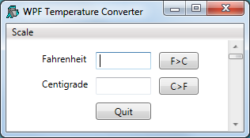
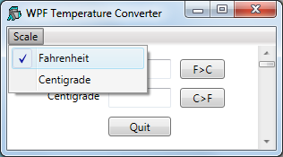

# <span class="name">Temperature Converter Tutorial</span> {: .heading}

This tutorial illustrates how to develop a simple WPF application in Dyalog. It is functionally identical to the GUI tutorial example that illustrates how to develop a GUI application using the built-in Dyalog APL Graphical User Interface provided in the _Dyalog for Microsoft Windows Interface Guide_.

The example is a simple Temperature Converter – a user can enter a temperature value in either Fahrenheit or Centigrade and have it converted to the other scale. This is an elementary example, but illustrates the principles that are involved. The example code is included in the **[DYALOG]\ws\wpfintro.dws** workspace.

No attempt has been made to update the WPF example, in terms of its user interface, from the original version which was developed for Windows 3. This allows a direct comparison to be made between using the WPF and using the built-in Dyalog GUI.

There are two versions provided:

- [Using XAML](#using-xaml) – uses XAML to describe the user interface with code to drive it

- [Using Code](#using-code) – written entirely in APL

## Using XAML

The functions for this example are provided in the workspace **WPFIntro.dws** in the namespace `WPF.UsingXAML`.

To run the example:
```apl
      )LOAD wpfintro
      WPF.UsingXAML.TempConverter
```

Arguably, the easiest way to create a WPF GUI is to define it using XAML. The XAML defines the structure, layout and appearance of the user interface in a very concise manner. It is still necessary to write code to display the XAML and to respond to user actions, but the amount of code involved is minimal.

The XAML for the Temperature Converter is:
```xml
<Window
 xmlns="http://schemas.microsoft.com/winfx/2006/xaml/presentation"
 xmlns:x="http://schemas.microsoft.com/winfx/2006/xaml"
 Name="Temp"
 Title="WPF Temperature Converter"
 SizeToContent="WidthandHeight">
  <DockPanel LastChildFill="False">
    <Menu DockPanel.Dock="Top">
        <MenuItem Header="_Scale">
            <MenuItem Name="mnuFahrenheit" Header="_Fahrenheit" IsCheckable="True" IsChecked="True"/>
            <MenuItem Name="mnuCentigrade" Header="_Centigrade" IsCheckable="True"/>
        </MenuItem>
    </Menu>
    <Grid Width="230" Margin="40,10,10,10">
      <Grid.RowDefinitions>
        <RowDefinition Height="Auto"/>
        <RowDefinition Height="Auto"/>
        <RowDefinition Height="Auto"/>
      </Grid.RowDefinitions>
      <Grid.ColumnDefinitions>
        <ColumnDefinition Width="Auto"/>
        <ColumnDefinition Width="80"/>
        <ColumnDefinition Width="60"/>
      </Grid.ColumnDefinitions>    
    <Label Grid.Row="0" Grid.Column="0" Content="Fahrenheit"/>
    <Label Grid.Row="1" Grid.Column="0" Content="Centigrade"/>
    <TextBox Name="txtFahrenheit" Grid.Row="0" Grid.Column="1" Margin="5"/>
    <TextBox Name="txtCentigrade" Grid.Row="1" Grid.Column="1" Margin="5"/>
    <Button Name="btnF2C" Grid.Row="0" Grid.Column="2" Content="F>C" Margin="5"/>
    <Button Name="btnC2F" Grid.Row="1" Grid.Column="2" Content="C>F" Margin="5"/>
    <Button Name="btnQuit" Grid.Row="2" Grid.Column="1" Content="Quit" Margin="5"/>
    </Grid>
    <ScrollBar Name="scrTemp" DockPanel.Dock="Right"  Width="20" Orientation="Vertical" Minimum="1" Maximum="213">
    </ScrollBar>
  </DockPanel>
</Window>

```



The image above shows the window defined by this XAML. Let us examine the XAML, component by component.

!!! Info "Information"
    The XAML that defines this user interface is at the same time both simple and complex. It is simple because (in this example) it is readily understood. It is complex because the user interface designer must understand precisely how the  various controls and their properties behave and work together. For these details, you should refer to the appropriate documentation and the large number of examples published on the internet.

### Parent and Child Controls

The structure of the GUI is defined by enclosing the child components inside the opening and closing tags of its parent. Therefore:
```xml
<Window
...
  <DockPanel>
  ...
  </DockPanel>
</Window>

```

specifies a <code class="language-nonAPL">Window</code> control that contains a <code class="language-nonAPL">DockPanel</code> control.

Similarly:
```xml
    <Menu>
        <MenuItem ... >
            <MenuItem ... />
            <MenuItem ... />
        </MenuItem>
    </Menu>

```

defines a <code class="language-nonAPL">Menu</code> that contains a <code class="language-nonAPL">MenuItem</code> that itself contains two other <code class="language-nonAPL">MenuItem</code> objects.

### Named and Un-named Controls

Some objects are named, but others are not. For example: <code class="language-nonAPL">TextBox Name="txtFahrenheit"</code> defines a <code class="language-nonAPL">TextBox</code> called <code class="language-nonAPL">txtFahenheit</code>; whereas <code class="language-nonAPL">&lt;DockPanel ...></code> defines an unnamed <code class="language-nonAPL">DockPanel</code> object.

Objects are given names so that they can be referenced from the code that displays content in the user interface or handles the user actions. In this example, the code will read the content of the <code class="language-nonAPL">txtFahrenheit TextBox</code> but has no need to reference the <code class="language-nonAPL">DockPanel</code>.

### The Main Window
```xml
<Window
 xmlns="http://schemas.microsoft.com/winfx/2006/xaml/presentation"
 xmlns:x="http://schemas.microsoft.com/winfx/2006/xaml"
 Name="Temp"
 Title="WPF Temperature Converter"
 SizeToContent="WidthandHeight">
...
</Window>
```

This extract of XAML defines a Window control; a top-level window that is equivalent to a Dyalog APL GUI Form.

The <code class="language-nonAPL">xmlns</code> attributes define the XML namespaces (effectively the vocabulary of the xml scheme) and are mandatory in an XAML document.

The name of the <code class="language-nonAPL">TextBox</code> is <code class="language-nonAPL">Temp</code>, and its caption is **WFP Temperature Converter**. The <code class="language-nonAPL">SizeToContent</code> property is set to "WidthandHeight", which causes the <code class="language-nonAPL">TextBox</code> to automatically size itself to fit its content in both horizontal and vertical directions.

### The DockPanel
```xml
 <DockPanel LastChildFill="False">
...
 </DockPanel>
```

WPF provides a number of _layout controls_. These are containers whose only purpose is to arrange child controls in a particular way, and to dictate how they are re-arranged when the parent window is resized. The <code class="language-nonAPL">DockPanel</code> is one of the simplest of the WPF layout controls.

In this example, the <code class="language-nonAPL">DockPanel</code> is controlling three child windows – a <code class="language-nonAPL">Menu</code>, a <code class="language-nonAPL">Grid</code>, and a <code class="language-nonAPL">ScrollBar</code>.

The attachment of a particular child control is specified by setting its <code class="language-nonAPL">DockPanel.Dock</code> property. By default, the last control added to a <code class="language-nonAPL">DockPanel</code> is stretched to fill the remaining space when the window is expanded. In this example, the requirement is for a fixed-width scrollbar attached to the right edge, so the default is overridden by setting the <code class="language-nonAPL">LastChildFill</code> property to "False".

### The Menu
```nonAPL
    <Menu DockPanel.Dock="Top">
        <MenuItem Header="_Scale">
            <MenuItem Name="mnuFahrenheit" Header="_Fahrenheit" IsCheckable="True" IsChecked="True"/>
            <MenuItem Name="mnuCentigrade" Header="_Centigrade" IsCheckable="True"/>
        </MenuItem>
    </Menu>
```



This XAML extract defines a <code class="language-nonAPL">Menu</code>. Setting <code class="language-nonAPL">Dock</code> to "Top" causes the <code class="language-nonAPL">Menu</code> as a whole to be docked, so that it appears like a menubar along the top of the <code class="language-nonAPL">DockPanel</code>. The <code class="language-nonAPL">Menu</code> contains a single <code class="language-nonAPL">MenuItem</code> labelled **Scale**, which itself contains two sub-items labelled **Fahrenheit** and **Centigrade**. The <code class="language-nonAPL">IsCheckable</code> property specifies whether the user can check the <code class="language-nonAPL">MenuItem</code>, and the <code class="language-nonAPL">IsChecked</code> property sets and reports its checked state. The underscore characters (for example, as in "`_Scale`") identify the following character as a keyboard shortcut.

### The Grid
```nonAPL
    <Grid Width="230" Margin="40,10,10,10">
    ...
    </Grid>
```

The <code class="language-nonAPL">Grid</code> object is another WPF layout control that organises other controls in rows and columns. Here, the XAML defines a <code class="language-nonAPL">Grid</code> with a width of 230, a left margin of 40, and top, right and bottom margins of 10. As there is no explicit unit specified, the system uses the default device-independent unit (px) of 1/96 inches.

The rows and columns of a <code class="language-nonAPL">Grid</code> are defined by collections of <code class="language-nonAPL">RowDefinition</code> and <code class="language-nonAPL">ColumnDefinition</code> objects.

Here the XAML specifies that the Grid</code> contains three rows, each of which has a <code class="language-nonAPL">Height</code> set to "Auto", which means that its height depends upon the height of its content.
```nonAPL
      <Grid.RowDefinitions>
        <RowDefinition Height="Auto"/>
        <RowDefinition Height="Auto"/>
        <RowDefinition Height="Auto"/>
      </Grid.RowDefinitions> 
```

Similarly, there are three columns. The first column (which will contain labels) takes its width from its content, thatis, it will be just wide enough to display the longest label. The other columns for the edit boxes and buttons are specified to be 80px and 60px wide respectively. In this example, the content (<code class="language-nonAPL">TextBox</code> and <code class="language-nonAPL">Button</code> objects) will take their widths from that of the column:
```nonAPL
     <Grid.ColumnDefinitions>
        <ColumnDefinition Width="Auto"/>
        <ColumnDefinition Width="80"/>
        <ColumnDefinition Width="60"/>
      </Grid.ColumnDefinitions> 
```

### The Label Objects (Column 1)
```nonAPL
    <Label Grid.Row="0" Grid.Column="0" Content="Fahrenheit"/>
    <Label Grid.Row="1" Grid.Column="0" Content="Centigrade"/>
```

Here the XAML specifies <code class="language-nonAPL">Label</code> objects <code class="language-nonAPL">Fahrenheit</code> and <code class="language-nonAPL">Centigrade</code>. Because they are defined within the<code class="language-nonAPL">&lt;Grid> ...&lt;/Grid></code> tags, they are child objects of the <code class="language-nonAPL">Grid</code>. It is necessary to specify in which cells they are displayed using their <code class="language-nonAPL">Grid.Row</code> and <code class="language-nonAPL">Grid.Column</code> properties. Cell co‑ordinates have zero origin.

### The TextBox Objects (Column 2)
```nonAPL
    <TextBox Name="txtFahrenheit" Grid.Row="0" Grid.Column="1" Margin="5"/>
    <TextBox Name="txtCentigrade" Grid.Row="1" Grid.Column="1" Margin="5"/>

```

The XAML specifies two <code class="language-nonAPL">TextBox</code> objects called <code class="language-nonAPL">txtFahrenheit</code> and <code class="language-nonAPL">txtCentigrade</code> respectively. Setting <code class="language-nonAPL">Margin</code> to "5" means that a margin of 5px is applied around each edge; otherwise the text boxes would occupy the entire width of the column (80px). The effective width of each <code class="language-nonAPL">TextBox</code> will be 70px (80-2×5).

### The Button Objects (Column 3)
```nonAPL
    <Button Name="btnF2C" Grid.Row="0" Grid.Column="2" Content="F>C" Margin="5"/>
    <Button Name="btnC2F" Grid.Row="1" Grid.Column="2" Content="C>F" Margin="5"/>
    <Button Name="btnQuit" Grid.Row="2" Grid.Column="1" Content="Quit" Margin="5"/>
```

The XAML specifies three named <code class="language-nonAPL">Button</code> controls. The caption on a <code class="language-nonAPL">Button</code> is specified by its <code class="language-nonAPL">Content</code> property.

### The ScrollBar Object

This example uses a <code class="language-nonAPL">ScrollBar</code> that the user can use to scroll to input a value depending upon which of the two menu items (**Fahrenheit** or **Centigrade**) is checked. A <code class="language-nonAPL">ScrollBar</code> is not the ideal choice of control for this type of user interation, but this example is designed to look and behave like the original Dyalog GUI example, which was written for the original version of Dyalog APL for Windows.
```nonAPL
    <ScrollBar Name="scrTemp" DockPanel.Dock="Right"  Width="20" Orientation="Vertical" Minimum="1" Maximum="213">
    </ScrollBar>
```

This XAML snippet defines a <code class="language-nonAPL">ScrollBar</code> called <code class="language-nonAPL">scrTemp</code>.

Setting <code class="language-nonAPL">DockPanel.Dock</code> to "Right" means that it will be docked (aligned) on the right edge of the <code class="language-nonAPL">DockPanel</code>. It will be a vertical scrollbar with a fixed width of 20px and a default height. The range of the <code class="language-nonAPL">ScrollBar</code> is defined by its <code class="language-nonAPL">Minimum</code> and <code class="language-nonAPL">Maximum</code> properties, which are set so that the <code class="language-nonAPL">ScrollBar</code> will specify a value in Fahrenheit.

To cause the <code class="language-nonAPL">ScrollBar</code> to be docked (aligned) along the right edge of the <code class="language-nonAPL">DockPanel</code>, it is necessary to set <code class="language-nonAPL">LastChildFill</code> to "False" (for the <code class="language-nonAPL">DockPanel</code>) and <code class="language-nonAPL">Dock</code> to "Right" (for the <code class="language-nonAPL">ScrollBar</code>), because the value of <code class="language-nonAPL">LastChildFill</code> (default "True") overrides the <code class="language-nonAPL">Dock</code> value of the last defined child of the <code class="language-nonAPL">DockPanel</code>.

### The Code to Display the XAML

The function `TempConverter` contains the code needed to display and operate the user interface whose layout is defined by the XAML:
```apl
     ∇ TempConverter;str;xml;win;txtFahrenheit;txtCentigrade;mnuFahrenheit;mnuCentigrade;btnF2C;btnC2F;btnQuit;scrTemp;sink
[1]    ⎕USING←'System'
[2]    ⎕USING,←⊂'System.IO'
[3]    ⎕USING,←⊂'System.Windows.Markup'
[4]    ⎕USING,←⊂'System.Xml,system.xml.dll'
[5]    ⎕USING,←⊂'System.Windows.Controls.Primitives,WPF/PresentationFramework.dll'
[6]
[7]    str←⎕NEW StringReader(⊂XAML)
[8]    xml←⎕NEW XmlTextReader str
[9]    win←XamlReader.Load xml
[10]
[11]   txtFahrenheit←win.FindName⊂'txtFahrenheit'
[12]   txtCentigrade←win.FindName⊂'txtCentigrade'
[13]   mnuFahrenheit←win.FindName⊂'mnuFahrenheit'
[14]   mnuFahrenheit.onClick←'SET_F'
[15]   mnuCentigrade←win.FindName⊂'mnuCentigrade'
[16]   mnuCentigrade.onClick←'SET_C'
[17]   (btnF2C←win.FindName⊂'btnF2C').onClick←'f2c'
[18]   (btnC2F←win.FindName⊂'btnC2F').onClick←'c2f'
[19]   (btnQuit←win.FindName⊂'btnQuit').onClick←'Quit'
[20]   (scrTemp←win.FindName⊂'scrTemp').onScroll←'F2C'
[21]   sink←win.ShowDialog
     ∇
```

The variable `XAML` (a character vector) contains the XAML described previously.

Apart from the names given to the objects by the XAML and used by the function, the XAML and the code are independent.

Lines `[7-8]` create a `XamlReader` object from the character vector through `StringReader` and `XmlTextReader` objects:
```apl

[7]    str←⎕NEW StringReader(⊂XAML)
[8]    xml←⎕NEW XmlTextReader str
```

Line `[9]` instantiates the XAML content by calling its `Load` method, which returns a reference `win` to the top-level control (in this case a Window) defined therein. The Window is not yet visible:
```apl
[9]    win←XamlReader.Load xml
```

Earlier, it was explained that objects defined by the XAML must be named so that they can be referenced (used) by the code. This is achieved by calling the `FindName` method of the Window, which returns a reference to the specified (named) object. The statements:
```apl

[11]   txtFahrenheit←win.FindName⊂'txtFahrenheit'
[12]   txtCentigrade←win.FindName⊂'txtCentigrade'
```

obtain refs (in this case named `txtFahrenheit` and `txtCentigrade`) to  objects named `txtFahrenheit` and `txtCentigrade`. It is convenient (but not essential) to use the same name for the ref as is used for the control.

Most of the remaining statements obtain refs to the <code class="language-nonAPL">MenuItem</code>, <code class="language-nonAPL">Button</code>, and <code class="language-nonAPL">ScrollBar</code> objects, and attach callback functions to their <code class="language-nonAPL">Click</code> and <code class="language-nonAPL">Scroll</code> events respectively:
```apl
[13]   mnuFahrenheit←win.FindName⊂'mnuFahrenheit'
[14]   mnuFahrenheit.onClick←'SET_F'
[15]   mnuCentigrade←win.FindName⊂'mnuCentigrade'
[16]   mnuCentigrade.onClick←'SET_C'
[17]   (btnF2C←win.FindName⊂'btnF2C').onClick←'f2c'
[18]   (btnC2F←win.FindName⊂'btnC2F').onClick←'c2f'
[19]   (btnQuit←win.FindName⊂'btnQuit').onClick←'Quit'
[20]   (scrTemp←win.FindName⊂'scrTemp').onScroll←'F2C'
```

Finally the code displays the Window and hands it over to the user by calling the `ShowDialog` method of the top-level Window:
```apl

[21]   sink←win.ShowDialog
```

<code class="language-nonAPL">ShowDialog</code> displays the Window _modally_; that is, until it is closed the user can interact only with that Window. It is equivalent to `⎕DQ win` or `win.Wait` in the Dyalog built-in GUI.

### The Callback Functions

The callback functions are given the same names in this example as they are in the basic GUI tutorial in the _Dyalog for Microsoft Windows Interface Guide_, and are remarkably similar.

Callback function `f2c`, which is attached to the `Click` event of the `btnF2C` button (labelled **F>C**), reads the character string in the `txtFahrenheit` <code class="language-nonAPL">TextBox</code>, converts it to a number using `Text2Num`, calculates the equivalent temperature in Centigrade, then displays the result in the ``txtCentigrade`` <code class="language-nonAPL">TextBox</code>:
```apl
     ∇ f2c;value
[1]    ⍝ Callback to convert Fahrenheit to Centigrade
[2]    :If 1=⍴,value←Text2Num txtFahrenheit.Text
[3]        txtCentigrade.Text←2⍕(value-32)×5÷9
[4]    :Else
[5]        txtCentigrade.Text←'invalid'
[6]    :EndIf
     ∇

```

For completeness, the `Text2Num` function is shown below. If the user enters an invalid number, `Text2Num` returns an empty vector and the callback displays the text invalid instead:
```apl
     ∇ num←Text2Num txt;val
[1]    val num←⎕VFI txt
[2]    num←val/num
     ∇

```

The `c2f` function converts from Centigrade to Fahrenheit when the user presses the button labelled **C>F**:
```apl
     ∇ c2f;value
[1]   ⍝ Callback to convert Centigrade to Fahrenheit
[2]    :If 1=⍴,value←Text2Num txtCentigrade.Text
[3]        txtFahrenheit.Text←2⍕32+value÷5÷9
[4]    :Else
[5]        txtFahrenheit.Text←'invalid'
[6]    :EndIf
     ∇

```

The callbacks `F2C` and `C2F`, one of which at a time is attached to the <code class="language-nonAPL">Scroll</code> event of the <code class="language-nonAPL">ScrollBar</code> object are shown below. The argument `Msg` contains two items:

|-----|------|-----------------------------------------------------------------------------|
|`[1]`|Object|a ref to the ScrollBar object                                                |
|`[2]`|Object|a ref to an object of type System.Windows.Controls.Primitives.ScrollEventArgs|

The code uses the <code class="language-nonAPL">NewValue</code> property of the <code class="language-nonAPL">ScrollEventArgs</code> object. An alternative would be to refer to the <code class="language-nonAPL">Value</code> property of the <code class="language-nonAPL">ScrollBar</code> object:
```apl

     ∇ F2C Msg;C;F;val
[1]   ⍝ Callback for Fahrenheit input via scrollbar
[2]    txtFahrenheit.Text←2⍕val←213-(2⊃Msg).NewValue
[3]    txtCentigrade.Text←2⍕(val-32)×5÷9
     ∇

```
```apl

     ∇ C2F Msg;C;F;val
[1]   ⍝ Callback for Centigrade input via scrollbar
[2]    txtCentigrade.Text←2⍕val←101-(2⊃Msg).NewValue
[3]    txtFahrenheit.Text←2⍕32+val÷5÷9
     ∇

```

The callbacks `SET_F` and `SET_C`, which are attached to the <code class="language-nonAPL">Click</code> events of the two <code class="language-nonAPL">MenuItem</code> objects, are:
```apl
     ∇ SET_F
[1]   ⍝ Sets the scrollbar to work in Fahrenheit
[2]    scrTemp.(Minimum Maximum)←1 213
[3]    scrTemp.onScroll←'F2C'
[4]    mnuFahrenheit.IsChecked←1
[5]    mnuCentigrade.IsChecked←0
     ∇
```
```apl

     ∇ SET_C
[1]   ⍝ Sets the scrollbar to work in Centigrade
[2]    scrTemp.(Minimum Maximum)←1 101
[3]    scrTemp.onScroll←'C2F'
[4]    mnuCentigrade.IsChecked←1
[5]    mnuFahrenheit.IsChecked←0
     ∇

```

Finally, the callback function `Quit`, which is attached to the <code class="language-nonAPL">Click</code> event on the **Quit** button, calls the <code class="language-nonAPL">Close</code> method of the window:
```apl
     ∇ Quit arg
[1]    win.Close
     ∇

```

Unlike its equivalent in the Dyalog GUI, it is not appropriate to close the window using the expression `⎕EX 'win'` – this would expunge the ref to the window but have no effect on the window itself.

## Using Code

The functions for this example are provided in the workspace **WPFIntro.dws** in the namespace `WPF.UsingCode`.

To run the example:
```apl
      )LOAD wpfintro
      WPF.UsingCode.TempConverter
```

The function `TempConverter` performs the same task of defining and manipulating the user interface for the Temperature Converter as the [XAML example](#using-xaml). The callback functions it uses are identical.
```apl

     ∇ TempConverter;⎕USING;win;dp;mnu;mnuFahrenheit;mnuCentigrade;gr;tn;rd1;rd2;rd3;rc1;rc2;rc3;l1;l2;txtFahrenheit;txtCentigrade;btnF2C;btnC2F;btnQuit;sink;mnuScale;scrTemp
[1]
[2]    ⎕USING←,⊂'System.Windows.Controls,WPF/PresentationFramework.dll'
[3]    ⎕USING,←⊂'System.Windows.Controls.Primitives,WPF/PresentationFramework.dll'
[4]    ⎕USING,←⊂'System.Windows,WPF/PresentationFramework.dll'
[5]    ⎕USING,←⊂'System.Windows,WPF/PresentationCore.dll'
[6]
[7]    win←⎕NEW Window
[8]    win.SizeToContent←SizeToContent.WidthAndHeight
[9]    win.Title←'WPF Temperature Converter'
[10]
[11]   dp←⎕NEW DockPanel
[12]   dp.LastChildFill←0
[13]
[14]   mnu←⎕NEW Menu
[15]
[16]   mnuScale←⎕NEW MenuItem
[17]   mnuScale.Header←'_Scale'
[18]   sink←mnu.Items.Add mnuScale
[19]
[20]   mnuFahrenheit←⎕NEW MenuItem
[21]   mnuFahrenheit.Header←'Fahrenheit'
[22]   mnuFahrenheit.IsCheckable←1
[23]   mnuFahrenheit.IsChecked←1
[24]   mnuFahrenheit.onClick←'SET_F'
[25]   sink←mnuScale.Items.Add mnuFahrenheit
[26]
[27]   mnuCentigrade←⎕NEW MenuItem
[28]   mnuCentigrade.Header←'_Centigrade'
[29]   mnuCentigrade.IsCheckable←1
[30]   mnuCentigrade.IsChecked←0
[31]   mnuCentigrade.onClick←'SET_C'
[32]   sink←mnuScale.Items.Add mnuCentigrade
[33]
[34]   sink←dp.Children.Add mnu
[35]   dp.SetDock mnu Dock.Top
[36]
[37]   gr←⎕NEW Grid
[38]   gr.Width←230
[39]   gr.Margin←⎕NEW Thickness(40 10 10 10)
[40]
[41]   rd1←⎕NEW RowDefinition
[42]   rd1.Height←GridLength.Auto
[43]   rd2←⎕NEW RowDefinition
[44]   rd2.Height←GridLength.Auto
[45]   rd3←⎕NEW RowDefinition
[46]   rd3.Height←GridLength.Auto
[47]   gr.RowDefinitions.Add¨rd1 rd2 rd3
[48]
[49]   rc1←⎕NEW ColumnDefinition
[50]   rc1.Width←GridLength.Auto
[51]   rc2←⎕NEW ColumnDefinition
[52]   rc2.Width←⎕NEW GridLength 80
[53]   rc3←⎕NEW ColumnDefinition
[54]   rc3.Width←⎕NEW GridLength 60
[55]   gr.ColumnDefinitions.Add¨rc1 rc2 rc3
[56]
[57]   l1←⎕NEW Label
[58]   l1.Content←'Fahrenheit'
[59]   sink←gr.Children.Add l1
[60]   gr.SetRow l1 0
[61]   gr.SetColumn l1 0
[62]
[63]   l2←⎕NEW Label
[64]   l2.Content←'Centigrade'
[65]   sink←gr.Children.Add l2
[66]   gr.SetRow l2 1
[67]   gr.SetColumn l2 0
[68]
[69]   txtFahrenheit←⎕NEW TextBox
[70]   txtFahrenheit.Margin←⎕NEW Thickness 5
[71]   sink←gr.Children.Add txtFahrenheit
[72]   gr.SetRow txtFahrenheit 0
[73]   gr.SetColumn txtFahrenheit 1
[74]
[75]   txtCentigrade←⎕NEW TextBox
[76]   txtCentigrade.Margin←⎕NEW Thickness 5
[77]   sink←gr.Children.Add txtCentigrade
[78]   gr.SetRow txtCentigrade 1
[79]   gr.SetColumn txtCentigrade 1
[80]
[81]   btnF2C←⎕NEW Button
[82]   btnF2C.Content←'F>C'
[83]   btnF2C.Margin←⎕NEW Thickness 5
[84]   btnF2C.onClick←'f2c'
[85]   sink←gr.Children.Add btnF2C
[86]   gr.SetRow btnF2C 0
[87]   gr.SetColumn btnF2C 2
[88]
[89]   btnC2F←⎕NEW Button
[90]   btnC2F.Content←'C>F'
[91]   btnC2F.Margin←⎕NEW Thickness 5
[92]   btnC2F.onClick←'c2f'
[93]   sink←gr.Children.Add btnC2F
[94]   gr.SetRow btnC2F 1
[95]   gr.SetColumn btnC2F 2
[96]
[97]   btnQuit←⎕NEW Button
[98]   btnQuit.Content←'Quit'
[99]   btnQuit.Margin←⎕NEW Thickness 5
[100]  btnQuit.onClick←'Quit'
[101]  sink←gr.Children.Add btnQuit
[102]  gr.SetRow btnQuit 2
[103]  gr.SetColumn btnQuit 1
[104]
[105]  sink←dp.Children.Add gr
[106]
[107]  scrTemp←⎕NEW ScrollBar
[108]  scrTemp.Width←20
[109]  scrTemp.Orientation←Orientation.Vertical
[110]  scrTemp.Minimum←1
[111]  scrTemp.Maximum←213
[112]  scrTemp.onScroll←'F2C'
[113]
[114]  sink←dp.Children.Add scrTemp
[115]  dp.SetDock scrTemp Dock.Right
[116]
[117]  win.Content←dp
[118]
[119]  sink←win.ShowDialog
     ∇
```

Although this approach appears to be more verbose than when using XAML (a 120‑line function compared with a 21-line function and a 44-line block of XAML), each line of code performs only one very simple task, and no attempt has been made to write utility functions to perform the same task for similar controls, as might be done in a real application.

This code can be examined line-by-line.

Lines `[2 5]` define `⎕USING` so that the appropriate .NET assemblies are on the search-path. The <code class="language-nonAPL">ScrollBar</code> control is in <code class="language-nonAPL">System.Windows.Controls.Primitives</code> and not <code class="language-nonAPL">System.Windows.Controls</code> like the others.
```apl

[2]    ⎕USING←,⊂'System.Windows.Controls,WPF/PresentationFramework.dll'
[3]    ⎕USING,←⊂'System.Windows.Controls.Primitives,WPF/PresentationFramework.dll'
[4]    ⎕USING,←⊂'System.Windows,WPF/PresentationFramework.dll'
[5]    ⎕USING,←⊂'System.Windows,WPF/PresentationCore.dll'
```

Lines `[7-9]` create a `Window` and sets its `SizeToContent` and `Title` properties as in the XAML example. However, whereas with XAML the string `SizeToContent="WidthandHeight"` is sufficient, when using code it is necessary to get the Type correct. In this example, the `SizeToContent` property must be set to a specific member (`WidthAndHeight`) of the <code class="language-nonAPL">System.Windows.SizeToContent</code> enumeration. Other members of this Type are `Width`, `Height`, and `Manual` (the default).
```apl
[7]    win←⎕NEW Window
[8]    win.SizeToContent←SizeToContent.WidthAndHeight
[9]    win.Title←'WPF Temperature Converter'
```

Lines `[11-12]` create a `DockPanel` control and set its `LastChildFill` property to `0`. The APL value `0` is used instead of the string "False" that was used in XAML:
```apl

[11]   dp←⎕NEW DockPanel
[12]   dp.LastChildFill←0
```

Line `[14]` creates a `Menu` control:
```apl

[14]   mnu←⎕NEW Menu
```

Lines `[16-18]` create a `MenuItem` control with the caption **Scale**, and then add the control to the `Items` collection of the main Menu using its `Add` method. This illustrates one significant difference between using XAML and code. In XAML, the parent/child relationships between controls are defined by the structure and order of the XML. Using code, child controls must be explicitly added to the appropriate list of child controls managed by the parent:
```apl
[16]   mnuScale←⎕NEW MenuItem
[17]   mnuScale.Header←'_Scale'
[18]   sink←mnu.Items.Add mnuScale
```

Lines `[20-25]` create a `MenuItem` control labelled **Fahrenheit**. The `IsCheckable` and `IsChecked` properties are set to `1`, which is equivalent to "True" in XAML. The callback function `SET_F` is assigned to the `Click` event, exactly as in the XAML version of this example. The last line in this section makes the **Fahrenheit** `MenuItem` a child of the **Scale** `MenuItem`:
```apl

[20]   mnuFahrenheit←⎕NEW MenuItem
[21]   mnuFahrenheit.Header←'Fahrenheit'
[22]   mnuFahrenheit.IsCheckable←1
[23]   mnuFahrenheit.IsChecked←1
[24]   mnuFahrenheit.onClick←'SET_F'
[25]   sink←mnuScale.Items.Add mnuFahrenheit
```

The code used to create the **Centigrade** `MenuItem` is very similar.

Lines `[34-35]` add the top-level menu to the `DockPanel`. For a `DockPanel`, the list of its child controls is represented by its `Children` property. Defining how it is docked is done using code, by the `SetDock` method of the `DockPanel`. This contrasts with the way this is achieved using XAML (<code class="language-nonAPL">DockPanel.Dock="Top"</code>). The argument to `SetDock` is not just a simple string as in XAML, but a member of the <code class="language-nonAPL">System.Windows.Controls.Dock</code> enumeration:
```apl

[34]   sink←dp.Children.Add mnu
[35]   dp.SetDock mnu Dock.Top
```

Lines `[37-39]` create the `Grid` control. Its `Width` property will accept a simple numeric value, but its `Margin` property must be given an instance of a <code class="language-nonAPL">System.Windows.Thickness</code> structure. In this case, the `Thickness` constructor is given a 4-element numeric vector that specifies its Left, Top, Right and Bottom members respectively:
```apl

[37]   gr←⎕NEW Grid
[38]   gr.Width←230
[39]   gr.Margin←⎕NEW Thickness(40 10 10 10)
```

Lines `[41-47]` create instances of 3 `RowDefinition` classes and add them to the `RowDefinitions` collection of the `Grid`. In XAML, the <code class="language-nonAPL">Height</code> can be specified as a string; using code it is necessary to use the correct Type. In this example, `Height` must be specified by a member of the <code class="language-nonAPL">System.Windows.GridLength</code>structure:
```apl
[41]   rd1←⎕NEW RowDefinition
[42]   rd1.Height←GridLength.Auto
[43]   rd2←⎕NEW RowDefinition
[44]   rd2.Height←GridLength.Auto
[45]   rd3←⎕NEW RowDefinition
[46]   rd3.Height←GridLength.Auto
[47]   gr.RowDefinitions.Add¨rd1 rd2 rd3
```

Similarly, lines `[49-55]` create instances of 3 `ColumnDefinition` classes and add them to the `ColumnDefinitions` collection of the `Grid`. The `Width` property will not accept a simple numeric value, it must be a member of the `GridLength` structure. To set the `Width` to `80`, it is  necessary first to create an instance of a `GridLength` structure, giving this value as the argument to its constructor:
```apl
[49]   rc1←⎕NEW ColumnDefinition
[50]   rc1.Width←GridLength.Auto
[51]   rc2←⎕NEW ColumnDefinition
[52]   rc2.Width←⎕NEW GridLength 80
[53]   rc3←⎕NEW ColumnDefinition
[54]   rc3.Width←⎕NEW GridLength 60
[55]   gr.ColumnDefinitions.Add¨rc1 rc2 rc3
```

Lines `[57-61]` create a `Label` control with the caption **Fahrenheit**. To display the `Label` in a `Grid` it is necessary to first add it to the `Children` collection of the `Grid`, and then set its position in the `Grid` using its `SetRow` and `SetColumn` methods. Similar code is used to create and position the second Label:
```apl
[57]   l1←⎕NEW Label
[58]   l1.Content←'Fahrenheit'
[59]   sink←gr.Children.Add l1
[60]   gr.SetRow l1 0
[61]   gr.SetColumn l1 0
```

Lines `[69-73]` create and position a `TextBox` control, in the same way as the `Label` controls. In this case, the constructor for the `Thickness` structure is given a single value that specifies all four of its Left, Top, Right and Bottom members:
```apl

[69]   txtFahrenheit←⎕NEW TextBox
[70]   txtFahrenheit.Margin←⎕NEW Thickness 5
[71]   sink←gr.Children.Add txtFahrenheit
[72]   gr.SetRow txtFahrenheit 0
[73]   gr.SetColumn txtFahrenheit 1
```

Lines `[81-87]` create and position a `Button` control. The callback function `f2c` is attached to the `Click` event in the same way as in the XAML version of this example:
```apl

[81]   btnF2C←⎕NEW Button
[82]   btnF2C.Content←'F>C'
[83]   btnF2C.Margin←⎕NEW Thickness 5
[84]   btnF2C.onClick←'f2c'
[85]   sink←gr.Children.Add btnF2C
[86]   gr.SetRow btnF2C 0
[87]   gr.SetColumn btnF2C 2
```

Line `[105]` adds the `Grid` to the list of `Children` to be managed by the `DockControl`:
```apl
[105]  sink←dp.Children.Add gr
```

Lines `[107-112]` create a `ScrollBar` control. Its `Width`, `Minimum`, and `Maximum` properties all accept simple numeric values. However, its `Orientation` property must be set to a member of the <code class="language-nonAPL">System.Windows.Controls.Orientation</code> enumeration:
```apl

[107]  scrTemp←⎕NEW ScrollBar
[108]  scrTemp.Width←20
[109]  scrTemp.Orientation←Orientation.Vertical
[110]  scrTemp.Minimum←1
[111]  scrTemp.Maximum←213
[112]  scrTemp.onScroll←'F2C'
```

Lines `[114-115]` add the `ScrollBar` to the list of `Children` managed by the `DockPanel`, and use its `SetDock` method to cause it to be right-aligned:
```apl
[114]  sink←dp.Children.Add scrTemp
[115]  dp.SetDock scrTemp Dock.Right
```

Finally, the `DockPanel` is assigned to the `Content` property of the `Window`, and the `Window` displayed. A `Window` can contain just one control:
```apl

[117]  win.Content←dp
[118]
[119]  sink←win.ShowDialog
```
