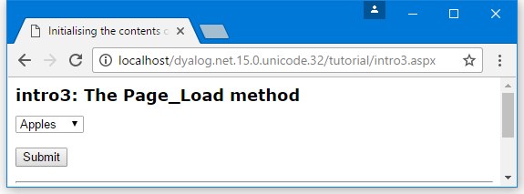
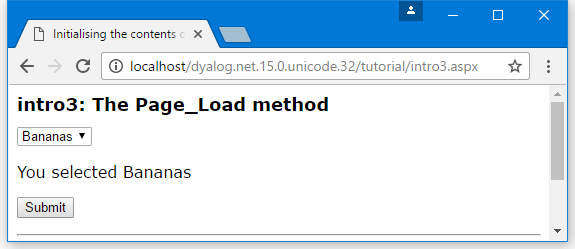

<h1 class="heading"><span class="name">The Page_Load Event</span></h1>

**[DYALOG]\Samples\asp.net\tutorial\intro3.aspx** illustrates how you can dynamically initialise the contents of a web page using the <code class="language-nonAPL">Page_Load</code> event. This example also introduces another type of web control, the <code class="language-nonAPL">DropDownList</code> object.
```nonAPL
<%@Register TagPrefix="tutorial" Namespace="Tutorial" Assembly="tutorial" %>
<script language="Dyalog" runat="server">

∇Page_Load 
:Access Public
list.Items.Add ⊂'Apples'
list.Items.Add ⊂'Oranges'
list.Items.Add ⊂'Bananas'
∇

∇Select (obj ev)
:Access Public
:Signature Select Object obj, EventArgs ev
out.Text←'You selected ',list.SelectedItem.Text
∇
</script>

<html>
<head>
<title>Initialising the contents of the Page using the Page_Load method</title>
<link rel="stylesheet" type="text/css" href="apl.css">
</head>

<body>
<h1>intro3: The Page_Load method</h1>
<form runat="server">
<asp:DropDownList id="list" runat="server"/>
<p><asp:Label id="out" runat="server" /></p>
<asp:Button id="btn" 
	Text="Submit"
	runat="server"
	OnClick="Select"/>
</form>
<tutorial:index runat="server"/>
</body>
</html>

```

This example is intended to be run in the framework of the tutorial; the two lines of code that refer to this framework (they each contain the word "tutorial") should be ignored.

When an ASP.NET web page is loaded, it generates a <code class="language-nonAPL">Page_Load</code> event. You can use this event to perform initialisation by defining a public function called `Page_Load` in your APL source file. This function will automatically be called every time the page is loaded. The `Page_Load` function should be niladic.

If a page employs the technique illustrated in **Intro1.aspx**, whereby the page is continually POSTed back to itself by user interaction, your `Page_Load` function will be run every time the page is loaded and you might not want to repeat the initialisation every time. You can distinguish between the initial load and a subsequent load caused by the post back using the <code class="language-nonAPL">IsPostBack</code> property. This property is inherited from the <code class="language-nonAPL">System.Web.UI.Page</code> class, which is the base class for any **.aspx** page.

The `Page_Load` function in this example checks the value of `IsPostBack`. If `0` (the page is being loaded for the first time) it initialises the contents of the `list` object, adding three items – "Apples", "Oranges", and "Bananas". The explanation for the statement:
```apl
      list.Items.Add ⊂'...'
```

is that the <code class="language-nonAPL">DropDownList</code> web control has an <code class="language-nonAPL">Items</code> property that is a collection of <code class="language-nonAPL">ListItem</code> objects. The collection implements an <code class="language-nonAPL">Add</code> function that takes a <code class="language-nonAPL">String</code> argument that can be used to add an item to the list.

The name of the object `list` is defined by the <code class="language-nonAPL">id="list"</code> attribute of the <code class="language-nonAPL">DropDownList</code> control that is defined in the page layout section of the page.



In this example, the page is processed by a POST back caused by pressing the **Submit** button. As it stands, changing the selection in the `list` object does not cause the text in the `out` object to be changed until the **Submit** button is pressed.



However, you can make this happen automatically by adding the following attributes to the `list` object (see **[DYALOG]\Samples\asp.net\tutorial\intro4.aspx**):
```nonAPL
autoPostback="true"
OnSelectedIndexChanged="Select"
```

<code class="language-nonAPL">autoPostback</code> causes the object to generate HTML that will provoke a post back whenever the selection is changed. When it does so, the <code class="language-nonAPL">OnSelectedIndexChanged</code> event will be generated in the server-side script; this calls `Select`, which causes the text in the `out` object to change.

!!! Info "Information"
    This technique, which can be used with most of the ASP.NET controls (including <code class="language-nonAPL">CheckBox</code>, <code class="language-nonAPL">RadioButton</code> and <code class="language-nonAPL">TextBox</code>), relies on a round trip to the server every time the value of the control changes. It will not perform well except on a fast connection to a lightly loaded server.
