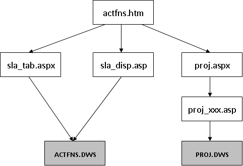
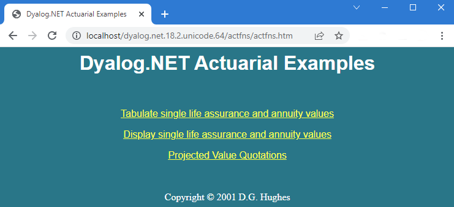
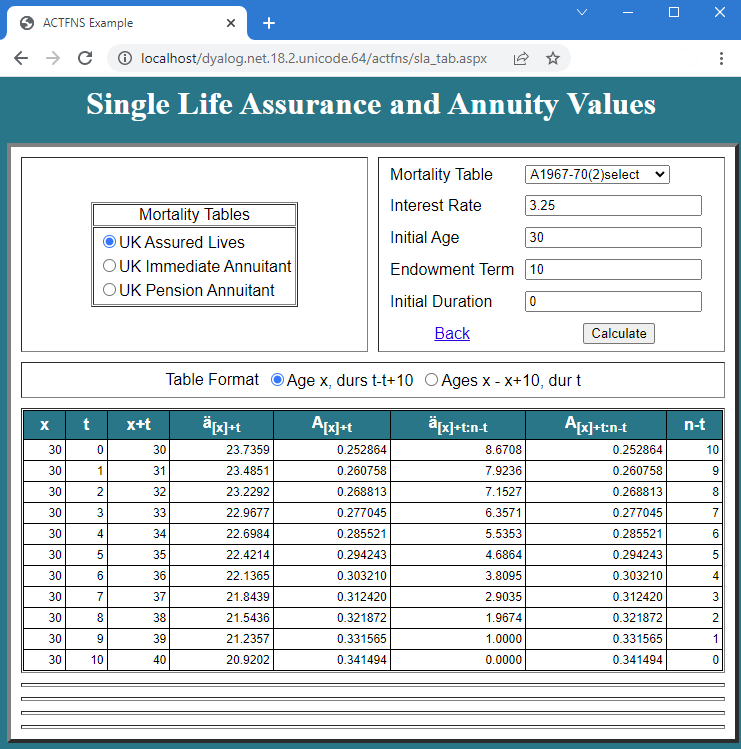

# Workspace Behind {: .heading}

[Code-Behind](code-behind.md) discusses how APL logic can be separated from page layout by placing it in a separate APL Source file which is referred to from the **.aspx** web page. It is also possible to have the code reside in a separate workspace. This allows you to develop web pages using a traditional workspace approach, and it is probably the quickest way to give an HTML front-end to an existing Dyalog application. 

[Code-Behind](code-behind.md) also shows that the **fruit.apl** file defined a new class called <code class="language-nonAPL">FruitSelection</code> that inherits from <code class="language-nonAPL">System.Web.UI.Page</code>. This class contains a `Page_Load` function that (by virtue of its name) overrides the <code class="language-nonAPL">Page_Load</code> method of the underlying base class and will be called every time the web page is loaded or posted back. The `Page_Load` function takes whatever action is required, for example, initialisation. The class also contains a callback function to perform an action when a user presses a button.

A similar technique is employed when the code behind the web page is implemented in a separate workspace. The workspace should contain a class that inherits from <code class="language-nonAPL">System.Web.UI.Page</code>. This class can contain a `Page_Load` function that will be invoked every time the corresponding web page is loaded and as many callback functions as are required to provide the application logic. The workspace is connected to one or more web pages by the <code class="language-nonAPL">Inherits="&lt;classname>"</code> and  <code class="language-nonAPL">src="&lt;workspace>"</code> declarations in the page directive statement that appears at the beginning of the web page script. The **[DYALOG]\Samples\asp.net\actfns** directory contains some examples of Dyalog systems that have been converted to run as web applications using this technique. Dyalog Ltd is grateful to David Hughes, who provided the original workspaces and advised on their conversion.

The two workspaces are called **actfns.dws** and **proj.dws**. The original code used the Dyalog GUI to display an input form, collect and validate the user's input, and calculate and display the results. The original logic supported field level validation, and results were immediately recalculated whenever any field was changed. With some exceptions, this has been changed so that the user must press a button to tell the system to recalculate the results. This approach is more appropriate in an Internet application, especially when connection speed is low. Apart from this change, the applications run approximately as originally designed.

{ #structure }

 illustrates the structure of the web application and the various files involved. The starting page, **actfns.htm**, provides a menu of options that link to various **.aspx** web pages. These pages are linked to one of the two workspaces through the <code class="language-nonAPL">src=""</code> declaration.

The **actfns.htm** start page offers three application choices:

When the first option is selected, the system loads **sla_tab.aspx**. This defines the screen layout in terms of ASP.NET controls, including the <code class="language-nonAPL">DataGrid</code> control for tabulating the results. **sla_tab.aspx** contains the declaration <code class="language-nonAPL">Inherits="actuarial" src="actfns.dws"</code>, so ASP.NET loads the actuarial class from this workspace (using a call to Dyalog). When the page is loaded, it generates a <code class="language-nonAPL">Page_Load</code> event, which calls its <code class="language-nonAPL">Page_Load</code> method. This populates the ASP controls with data; the resulting web page is shown in .

{ #selectionresults }

The mechanisms involved are described in [Converting an Existing Workspace](converting-an-existing-workspace.md).
