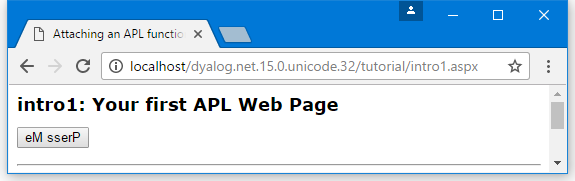

<h1 class="heading"><span class="name">Your First APL Web Page</span></h1>

!!! Info "Information"
    This example includes an outline description of ASP.NET technology. For further information, see the [Microsoft .NET Framework documentation](https://learn.microsoft.com/en-us/dotnet/framework/) and _Beginning ASP.NET using VB.NET_ (Wrox Press Ltd, ISBN 1861005040).

This example produces a web page that displays a button whose text is reversed each time you press it. The code is supplied as **[DYALOG]\Samples\asp.net\tutorial\intro1.aspx**.
```nonAPL
<%@Register TagPrefix="tutorial" Namespace="Tutorial" Assembly="tutorial" %>

<script language="Dyalog" runat="server">
∇Reverse args
:Access public
:Signature Reverse Object,EventArgs
(⊃args).Text←⌽(⊃args).Text
∇
</script>

<html>
<body>
<Form runat=server>
      <asp:Button id="Pressme" 
      Text="Press Me"
      runat="server"
      OnClick="Reverse" 
      />
</form>
<tutorial:index runat="server"/>
</body>
</html>
```

This example is intended to be run in the framework of the tutorial; the two lines of code that refer to this framework (they each contain the word "tutorial") should be ignored.

The page language is defined in the <code class="language-nonAPL">&lt;script></code> section to be <code class="language-nonAPL">"Dyalog"</code>. This is mapped to the Dyalog .NET Compiler using information in the application's **web.config** file or the global IIS configuration file, **machine.config**.

The page layout is described in the section between the <code class="language-nonAPL">&lt;html></code> and <code class="language-nonAPL">&lt;/html></code> tags. This page contains a form in which there is a button labelled (initially) **Press Me**.

Although the <code class="language-nonAPL">Form</code> and <code class="language-nonAPL">Button</code> page elements appear to be simple HTML, they are both types of ASP.NET _intrinsic controls_.

The <code class="language-nonAPL">runat="server"</code> attribute indicates that an HTML element should be parsed and treated as an HTML server control. Instead of being handled as pure text that is to be transmitted to the browser "as is", an HTML server control is effectively compiled into statements that then generate HTML when executed. Furthermore, an HTML server control can be accessed programmatically by code in the script, whereas a pure HTML element cannot. On its own, <code class="language-nonAPL">runat="server"</code> identifies the HTML element as a basic intrinsic control.

When you add <code class="language-nonAPL">runat="server"</code> to a Form, ASP.NET automatically adds other attributes that cause the values of its controls to be POSTed back to the same page. In addition, ASP.NET adds a HIDDEN control to the form and stores state information in it. This means that when the page is reloaded into the browser, the state and contents of some or all of its controls can be maintained without the need for you to write additional code.

The <code class="language-nonAPL">asp:</code> prefix for the button, identifies the control as a _special_ ASP.NET intrinsic control. These are .NET classes in the .NET namespace <code class="language-nonAPL">System.Web.UI.WebControls</code> that expose properties corresponding to the standard attributes that are available for the equivalent HTML element. You manipulate the control as an object; at runtime, it emits HTML that is inserted into the page.

[](#intro1beforebutton) shows the appearance of the web page when it is first loaded.

{ #intro1beforebutton }

The HTML that is transmitted to the browser is:
```nonAPL
<html>
<body>
   <form name="ctrl1" method="post" action="intro1.aspx" id="ctrl1">
      <input type="hidden" name="__VIEWSTATE" value="YTB6NTQ3ODg0MjcyX19feA==5725bd57" />
      <input type="submit" name="Pressme" value="Press Me" id="Pressme" />
   </form>
</body>
</html>

```

As expected, the contents of the <code class="language-nonAPL">&lt;script></code> section are not present. As both the Form and Button are intrinsic controls, ASP.NET has added certain attributes to the HTML that were not specified in the source code.

The button now has the added attribute <code class="language-nonAPL">input type="submit"</code>, which means that pressing the button causes the contents of the Form to be transmitted back to the sever.

The Form now has <code class="language-nonAPL">method="post"</code> and <code class="language-nonAPL">action="intro1.aspx"</code> attributes, which means that, when the Form is submitted, the data is POSTed back to **intro1.aspx** (the page that generated the HTML).

This means that, when the user presses the button, the browser sends back a POST statement, with the contents of the Form, including the value of the HIDDEN field, requesting the browser to load **intro1.aspx**. In the server, ASP.NET reloads the page and processes it again. Due to the stateless nature of HTTP, the server does not know that it is reprocessing the same page, except that it is being executed by a POST command with the hidden data embedded in the Form that it put there the first time around. This is the mechanism by which ASP.NET _remembers_ the state of a page from one invocation to another.

This time, because a POST back is loading the page, and because the **Pressme** button caused the POST, ASP.NET executes the function associated with its <code class="language-nonAPL">onClick</code> attribute, namely the function `Reverse`.

When it is called, the argument supplied to `Reverse` contains two items. The first of these is an object that represents the control that generated the <code class="language-nonAPL">onClick</code> event; the second is an object that represents the event itself. `Reverse` and its argument are very similar to a standard Dyalog callback function.
```apl
∇Reverse args
:Access public
:Signature Reverse Object,EventArgs
(⊃args).Text←⌽(⊃args).Text
∇
```

The code in the `Reverse` function is simple. The expression `(⊃args`) is a namespace reference (ref) to the button, and `(⊃args).Text` refers to its `Text` property whose value is reversed. `Reverse` could just as easily refer to the button by name, and use `Pressme.Text` instead.

[](#intro1afterbutton) shows the appearance of the web page after pressing the button.

{ #intro1afterbutton }

The HTML that is transmitted to the browser is:
```
<html>
<body>
   <form name="ctrl1" method="post" action="intro1.aspx" id="ctrl1">
      <input type="hidden" name="__VIEWSTATE" value="YTB6NTQ3ODg0MjcyX2Ewel9oejV6MXhfY TB6X2h6NXoxeF9hMHphMHpoelRlXHh0X2VNIHNzZ XJQeF9feF9feHhfeHhfeF9feA==45acf576" />
      <input type="submit" name="Pressme" value="eM sserP" id="Pressme" />
   </form>
</body>
</html>

```

Returning to the `Reverse` function, note that the declaration statements at the top of the function are essential to make it callable in this context:
```apl
∇Reverse args
:Access public
:Signature Reverse Object,EventArgs
(⊃args).Text←⌽(⊃args).Text
∇
```

The `Reverse` function must be declared as a public member of the script. This is achieved with the statement `:Access Public`. The .NET runtime will only call the function if it possesses the correct signature, which is derived from its parameters and their types.

The required signature for a method connected to an event, such as the <code class="language-nonAPL">OnClick</code> event of a button, is that it takes two parameters; the first of which is of type <code class="language-nonAPL">System.Object</code> and the second of which is of type <code class="language-nonAPL">System.EventArgs</code>. The `Reverse` function declares its parameters with the statements `:Signature Reverse Object,EventArgs`

!!! Info "Information"
    The parameter declarations do not include the `System` prefix. This is because when the script is compiled the names are resolved using the current value of `⎕USING`. When the code is compiled, the default value for `⎕USING` is automatically defined to contain `System` along with most of the other namespaces that will be used when writing web pages. (Strictly, the first argument is expected to be of type <code class="language-nonAPL">System.Web.UI.WebControls.Button</code>, but as this type inherits ultimately from <code class="language-nonAPL">System.Object</code> the function signature is satisfied.)

If the `Reverse` function is defined with a signature that does not match that expected signature for the `OnClick` callback, the function will not be run. In addition, if the function associated with the `OnClick` statement is not defined as a public method in the code, the page will appear to compile but the `Reverse` function will not get executed.

Unlike web services, there is no requirement for a `:Class` or `:EndClass` statement in the script. This is because a file with an **.aspx** extension implicitly generates a class that inherits from <code class="language-nonAPL">System.Web.UI.Page</code>.
