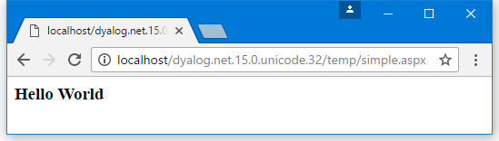

# <span class="name">Example: The SimpleCtl Control</span> {: .heading}

The `SimpleCtl` class is:
```apl
:Class SimpleCtl: Control                       
:Access public                                  
:Using System                                   
:Using System.Collections.Specialized,System.dll
:Using System.Web,System.Web.dll                
:Using System.Web.UI                            
:Using System.Web.UI.WebControls                
:Using System.Web.UI.HtmlControls               
                                                
    ∇ Render output;HTML                        
      :Access public override                 
      :Signature Render  HtmlTextWriter output
      HTML←'<h3>Hello World</h3>'               
      output.WriteLine⊂HTML                     
    ∇                                           
                                                
:EndClass ⍝ SimpleCtl                           

```

The `Render` function supercedes the <code class="language-nonAPL">Render</code> method that `SimpleCtl` has inherited from its base class, <code class="language-nonAPL">System.Web.UI.Control</code>.

The <code class="language-nonAPL">Render</code> method defined by the <code class="language-nonAPL">System.Web.UI.Control</code> base class is <code class="language-nonAPL">void</code> and takes a parameter of type <code class="language-nonAPL">HtmlTextWriter</code>. When the `SimpleCtl` control is referenced in a web page, ASP.NET creates an instance of it and calls its `Render` method because it is a Control and is expected to have one. ASP.NET also supplies an object of type <code class="language-nonAPL">HtmlTextWriter</code> as its parameter. It is not important where this object came from, or what it represents, only that <code class="language-nonAPL">HtmlTextWriter</code> provides a method called <code class="language-nonAPL">WriteLine</code> that can be used to output a text string to the browser – the mechanics of how this happens are handled by the <code class="language-nonAPL">HtmlTextWriter</code> object.

In APL terms, the argument to the `Render` function, `output`, will be a namespace reference, and the function can call its `WriteLine` method with a character vector argument. This argument can contain any valid HTML string and defines the appearance of the SimpleCtl control.

Using the `:Signature` statement, the `Render` function is defined to have the same syntax as the method it overrides, that is, it does not return a result <code class="language-nonAPL">void</code> and takes a single parameter of type <code class="language-nonAPL">HtmlTextWriter</code>. To successfully replace the base class method, the `Render` function must have exactly this `:Signature`.

See [Using the SimpleCtl Control](#using-the-simplectl-control) for information on including the SimpleCtl control in any .NET web page.

## Using the SimpleCtl Control

The SimpleCtl control can now be included in any .NET web page from which **temp.dll** is accessible. The file **[DYALOG]\Samples\asp.net\temp\Simple.aspx**) is one example (it is immaterial that it is written in Dyalog):
```nonAPL
<%@ Register TagPrefix="Dyalog" Namespace="DyalogSamples" Assembly="temp" %>
<html>
<body>
<Dyalog:SimpleCtl runat=server/>
</body>
</html>

```

The first line of the script specifies that any controls referenced later in the script that are prefixed by <code class="language-nonAPL">Dyalog:</code> refer to custom controls in the .NET namespace called <code class="language-nonAPL">DyalogSamples</code>, which is located in the assembly <code class="language-nonAPL">temp.dll</code> in the **bin** subdirectory.


