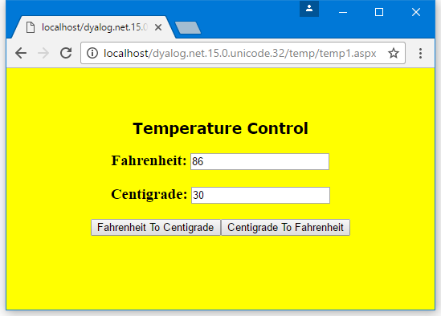

<h1 class="heading"><span class="name">Example: The TemperatureConverterCtl2 Control</span></h1>

[Example: The TemperatureConverterCtl1 Control](example-the-temperatureconverterctl1-control.md) demonstrates how to compose an ASP.NET custom control from other standard controls. This example shows how you can, instead, generate standard form elements on the browser by rendering the HTML for them directly.

For TemperatureConverterCtl1, all the data transfers between the browser and the server, relating to the standard child controls that it contains, are handled automatically by the controls themselves. Rendered controls require more programming as it is the responsibility of the control developer to do the data transfer. The data transfer is managed through two interfaces, called <code class="language-nonAPL">IPostBackDataHandler</code> and <code class="language-nonAPL">IPostBackEventHandler</code>.

The `:Class` statement for TemperatureConverterCtl2 specifies that it provides these interfaces:
```apl
:Class TemperatureConverterCtl2: Control, System.Web.UI.IPostBackDataHandler, System.Web.UI.IPostBackEventHandler
```

## Fahrenheit and Centigrade Values

[Example: The TemperatureConverterCtl1 Control](example-the-temperatureconverterctl1-control.md), the `TemperatureConverterCtl2` control maintains two public properties called `CentigradeValue` and `FahrenheitValue` using using _property get_ (or _accessor_) and _property set_ (or _mutator_) functions.

In this example, the `TemperatureConverterCtl2` control manages the current temperature values in two internal variables named `_CentigradeValue` and `_FahrenheitValue`, which we must initialise:
```apl
      _CentigradeValue←0
      _FahrenheitValue←0
```

The `CentigradeValue`'s `get` function returns the current value of `_CentigradeValue`. Its .NET properties are defined so that it is exported as a _property get_ function for the `CentigradeValue` property, and returns a `Double`:
```apl
       ∇ C←get
        :Access Public
        :Signature Double←get
        C←_CentigradeValue
       ∇

```

The `CentigradeValue`'s `set` function resets the value of `_CentigradeValue` to that of its argument. Its .NET properties are defined so that it is exported as a _property set_ function for the `CentigradeValue` property, and takes a `Double`:
```apl
       ∇ set C
        :Access Public
        :Signature set Double Value
        _CentigradeValue←C.NewValue
       ∇
```

The _property get_ and _property set_ functions for the `FahrenheitValue` property are similarly defined. The `:Signature`s for these functions are similar to those for the `CentigradeValue` functions.

## Rendering the Control

As with [Example: The SimpleCtl Control](example-the-simplectl-control.md), the `TemperatureConverterCtl2` control has a `Render` function that generates the HTML to represent its appearance and, in this case, its behaviour too:
```apl
     ∇ Render output;C;F;BF;CF
[1]    :Access Public override
[2]    :Signature Render HtmlTextWriter output
[3]
[4]    F←'<h3>Fahrenheit <input name='
[5]    F,←UniqueID
[6]    F,←' id=FahrenheitValue type=text value='
[7]    F,←⍕_FahrenheitValue
[8]    F,←'></h3>'
[9]    output.Write⊂F
[10]
[11]   C←'<h3>Centigrade <input name='
[12]   C,←UniqueID
[13]   C,←' id=CentigradeValueKey type=text value='
[14]   C,←⍕_CentigradeValue
[15]   C,←'></h3>'
[16]   output.Write⊂C
[17]
[18]   BF←'<input type=button value=FahrenheitToCentigrade '
[19]   BF,←' onClick="jscript:'
[20]   BF,←Page.GetPostBackEventReference ⎕THIS'FahrenheitToCentigrade'
[21]   BF,←'">'
[22]   output.Write⊂BF
[23]
[24]   CF←'<input type=button value=CentigradeToFahrenheit '
[25]   CF,←' onClick="jscript:'
[26]   CF,←Page.GetPostBackEventReference ⎕THIS'CentigradeToFahrenheit'
[27]   CF,←'">'
[28]   output.Write⊂CF
[29]
[30]   output.WriteLine∘⊂¨'' '<br>' '<br>'
     ∇
```

Similar to the `SimpleCtl` example, the `Render` method will be called by ASP.NET with a parameter that represents an <code class="language-nonAPL">HtmlTextWriter</code> object. This is represented by the APL local name `output`.

Lines `[4-9]` and `[11-16]` generate HTML that defines two text boxes in which the user can enter the Fahrenheit and Centigrade values respectively. Lines `[9 16]` use the <code class="language-nonAPL">Write</code> method of the <code class="language-nonAPL">HtmlTextWriter</code> object to output the HTML.

Lines `[5 12]` obtain the fully qualified identifier for this particular instance of the TemperatureConverterCtl2 control from its <code class="language-nonAPL">UniqueID</code> property. It inherits this property from <code class="language-nonAPL">Control</code>, meaning that it is also a property of the current (APL) namespace.

Lines `[18-22]` and `[24-28]` generate and output the HTML to represent the two buttons that convert from Fahrenheit to Centigrade and from Centigrade to Fahrenheit respectively.

Lines `[19-20]` and `[25-26]` generate HTML that connects the buttons to JavaScript handlers to be executed _by the browser_. The JavaScript causes the browser to execute a postback, that is, send the page contents back to the server. <code class="language-nonAPL">GetPostBackEventReference</code> is a (shared) method provided by the <code class="language-nonAPL">System.Web.UI.Page</code> class that generates a reference to a client-side script function. In this example it is called with two parameters, an object that represents the current instance of the TemperatureConverterCtl2 control, and a string that will be passed to the server to indicate the cause of the postback (that is, which button was pressed). The first parameter is a reference to the current object, which is returned by the system function `⎕THIS`.

The client-side script is generated and inserted into the HTML stream automatically.

To help to understand this process fully, it is instructive to examine the HTML that is generated by these functions – see [Using the TemperatureConverterCtl2 Control on a Page](#using-the-temperatureconverterctl2-control-on-a-page).

## Loading the Posted Data

Once the server-side control has rendered the HTML for the browser, the user is free to type numbers into the text boxes and to press the buttons.

When the user presses a button, the browser runs the client-side JavaScript code that generates a postback to the server.

The `:Class` statement for TemperatureConverterCtl2 specifies that it supports the <code class="language-nonAPL">IPostBackDataHandler</code> interface. This interface must be implemented by controls that want to receive postback data (that is, the contents of Form fields that the user might have entered or changed) <code class="language-nonAPL">IPostBackDataHandler</code> has two methods, <code class="language-nonAPL">LoadPostData</code> and <code class="language-nonAPL">RaisePostDataChangedEvent</code>. <code class="language-nonAPL">LoadPostData</code> is automatically invoked when a postback occurs, and the postback data is supplied as a parameter.

When the postback occurs, the server reloads the original page and, because this is a postback situation and our control has advertised the fact that it implements <code class="language-nonAPL">IPostBackDataHandler</code>, ASP.NET invokes its <code class="language-nonAPL">LoadPostBack</code> method. This method is called with two parameters; the first is a key and the second is a collection of name/value pairs. This contains the names of all the Form fields on the page (there might be others not directly associated with our custom control) and the values that they had when the user pressed the button. The key provides the means to extract the relevant part of this collection. The `LoadPostData` function is:
```apl
     ∇ R←LoadPostData args;postDataKey;values;controlValues;new
[1]    :Signature Boolean←IPostBackDataHandler.LoadPostData String postDataKey,NameValueCollection values
[2]    postDataKey values←args
[3]    controlValues←values[⊂postDataKey]
[4]    new←ParseControlValues controlValues
[5]    R←∨/new=_FahrenheitValue _CentigradeValue
[6]    _FahrenheitValue _CentigradeValue←new
     ∇
```

Line `[2]` obtains the two parameters from the argument and line `[3]` uses the key to extract the appropriate data from the collection. `ControlValues` is a comma-delimited string containing name/value pairs. The function `ParseControlValues` extracts the values from this string, that is, the contents of the Fahrenheit and Centigrade text boxes.

## Postback Events

The result of <code class="language-nonAPL">LoadPostData</code> is Boolean and indicates whether any of the values in a control have changed. If the result is `True` (`1`), then ASP.NET will next call the <code class="language-nonAPL">RaisePostDataChanged</code> method. This method is called with no parameters and only signals that something has changed. The control knows what has changed by comparing the old with the new, as in line `[5]`.

Finally, the page framework calls the <code class="language-nonAPL">RaisePostBackEvent</code> method, passing it a string that identifies the page element that caused the post back.

The objective of these calls is to provide the control with the information it requires to synchronise its internal state with its appearance in the browser.

In this case, we are not interested in which of the two text box values the user has altered; what matters is which of the two buttons (**FarenheitToCentigrade** or **CentigradeToFarenheit**) was pressed. The control therefore uses <code class="language-nonAPL">RaisePostBackEvent</code> rather than <code class="language-nonAPL">RaisePostDataChanged</code> (or <code class="language-nonAPL">LoadPostData</code> itself, which is another option). The reason is that <code class="language-nonAPL">RaisePostBackEvent</code> receives the name of the button as its argument.

In this example, the `RaisePostDataChanged` function does nothing. However, it is essential that the function is provided and that it supports the correct public interface, that is, that it takes no arguments and returns no result (`Void`):
```apl
     ∇ RaisePostDataChangedEvent
[1]  :Access public
[2]  :Signature RaisePostDataChangedEvent
[3]  ⍝ Do nothing
     ∇
```

The `RaisePostBackEvent` function switches on its argument, which is the name of the button that the user pressed, and recalculates `_CentigradeValue` or `_FahrenheitValue` accordingly:
```apl
     ∇ RaisePostBackEvent eventArgument
[1]    :Access public
[2]    :Signature RaisePostBackEvent  String eventArg
[3]    :Select eventArgument
[4]    :Case 'FahrenheitToCentigrade'
[5]        _CentigradeValue←F2C _FahrenheitValue
[6]    :Case 'CentigradeToFahrenheit'
[7]        _FahrenheitValue←C2F _CentigradeValue
[8]    :EndSelect
     ∇
```

Finally, the page framework calls the `OnPreRender` and `Render` functions again, which generates new HTML for the browser.

## Using the TemperatureConverterCtl2 Control on a Page

Providing it has access to the DLL, our custom control can be accessed from any ASP.NET web page.

This example uses a script written in APL, but it could also have been written in VB.NET:
```nonAPL
<%@ Register TagPrefix="Dyalog" Namespace="DyalogSamples" Assembly="TEMP"%>

<html>
<body bgcolor="yellow">
<center>
<h2><font face="Verdana" color="black">Temperature Control</font></h2>
<h3><font face="Verdana" color="black">Server-Side Noncompositional control</font></h3>

<form runat=server>
<Dyalog:TemperatureConverterCtl2 id=TempCvtCtl2 runat=server/>
</form>

</center>
</body>
</html>
```

The HTML that is generated by the control is:
```nonAPL
<html>
<body bgcolor="yellow">
<center>
<h2><font face="Verdana" color="black">Temperature Control</font></h2>
<h4><font face="Verdana" color="black">Server-Side Noncompositional control</font></h4>

<form name="ctrl1" method="post" action="temp2.aspx" id="ctrl1">
<input type="hidden" name="__EVENTTARGET" value="" />
<input type="hidden" name="__EVENTARGUMENT" value="" />
<input type="hidden" name="__VIEWSTATE" value="YTB6MTc3MzAxNzYxM19fX3g=9cfcfa5c" />

<script language="javascript">
<!--
	function __doPostBack(eventTarget, eventArgument) {
		var theform = document.ctrl1
		theform.__EVENTTARGET.value = eventTarget
		theform.__EVENTARGUMENT.value = eventArgument
		theform.submit()
	}
// -->
</script>

<h2>Fahrenheit <input name=TempCvtCtl2 id=FahrenheitValue type=text value=0></h2>
<h2>Centigrade <input name=TempCvtCtl2 id=CentigradeValueKey type=text value=0></h2>
<input type=button value=FahrenheitToCentigrade  onClick="jscript:__doPostBack('TempCvtCtl2','FahrenheitToCentigrade')">
<input type=button value=CentigradeToFahrenheit  onClick="jscript:__doPostBack('TempCvtCtl2','CentigradeToFahrenheit')">
<br>
<br>

</form>

</center>
</body>
</html>
```

The JavaScript function called <code class="language-nonAPL">__doPostBack</code> is generated by the <code class="language-nonAPL">RegisterPostBackScript</code> method called from the `OnPreRender` function. The code that connects the buttons to this function was generated by the <code class="language-nonAPL">GetPostBackEventReference</code> method called from the `Render` function.

[](#ctl2) illustrates what happens when the page is run.

{ #ctl2 }
