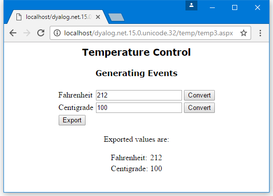

<h1 class="heading"><span class="name">Example: The TemperatureConverterCtl3 Control</span></h1>

In [Example: The SimpleCtl Control](example-the-simplectl-control.md), [Example: The TemperatureConverterCtl1 Control](example-the-temperatureconverterctl1-control.md), and [Example: The TemperatureConverterCtl2 Control](example-the-temperatureconverterctl2-control.md), events generated by controls have been internal events, that is, events that have been detected and processed internally by the control itself.

A separate requirement is to be able to design a custom control that generates external events, that is, events that can be detected and handled by the page that is hosting the control. This example illustrates how to do this.

The `TemperatureConverterCtl3` namespace is a copy of the `TemperatureConverterCtl2` namespace, with some changes.

The first change is that it describes an event that the control is going to generate. This is done using `⎕NQ` inside `TemperatureConverterCtl3`:
```apl
   2 ⎕NQ '' 'SetEventInfo' 'Export'
               (('Double' 'Fahrenheit')
                ('Double' 'Centigrade'))
```

In this case, the name of the event is `Export` and it will report two parameters named `Fahrenheit` and `Centigrade`, which are both of data type `Double`.

This version of the control presents a slightly different appearance to the previous one. The control is wrapped up in an HTML table, with the conversion buttons arranged in a column. These buttons generate internal events that are caught and handled by the control itself. The third row of the table contains an additional button labelled "Export" which will generate the `Export` event when pressed. The `Render` function is:
```apl
     ∇ Render output;TableRow;HTML;SET
[1]    :Access public override
[2]    :Signature Render  HtmlTextWriter output
[3]    TableRow←{
[4]        HTML←'<tr><td>',⍺,'</td><td><input name=',UniqueID
[5]        HTML,←' id=',⍺,'Value type=text '
[6]        HTML,←'value=',(⍕⍵),'></td>'
[7]        HTML,←'<td><input type=button value=Convert'
[8]        HTML,←' onClick="jscript:'
[9]        HTML,←(Page.GetPostBackEventReference ⎕THIS ⍺),'"></td></tr>'
[10]       HTML
[11]   }
[12]
[13]   HTML←''
[14]   HTML←'<table>'
[15]   HTML,←'Fahrenheit'TableRow _FahrenheitValue
[16]   HTML,←'Centigrade'TableRow _CentigradeValue
[17]
[18]   SET←'<tr><td><input type=button value=Export '
[19]   SET,←' onClick="jscript:'
[20]   SET,←Page.GetPostBackEventReference ⎕THIS'Export'
[21]   SET,←'"></td></tr>'
[22]   HTML,←SET,'</table>'
[23]   output.Write⊂HTML
     ∇
```

Line `[18]` causes the **Export** button to generate a Postback event that calls `RaisePostBackEvent` with the argument `'Export'`. So far, this is just an internal event, like the events generated by the conversion buttons.

The `RaisePostBackEvent` propagates this event to the host page:
```apl
     ∇ RaisePostBackEvent eventArgument
[1]    :Signature IPostBackEventHandler.RaisePostBackEvent String eventArg
[2]    :Select eventArgument
[3]    :Case 'Fahrenheit'
[4]        _CentigradeValue←F2C _FahrenheitValue
[5]    :Case 'Centigrade'
[6]        _FahrenheitValue←C2F _CentigradeValue
[7]    :Case 'Export'
[8]        4 ⎕NQ'' 'Export'_FahrenheitValue _CentigradeValue
[9]    :EndSelect
     ∇

```

This is done by the third `:Case` statement, so that when the function is invoked with the argument `'Export'`, it fires an Export event. This is done by line `[8]` using `4 ⎕NQ`. The elements of the right argument are:

|-----|------------------|---------------------------------------------------------------------|
|`[1]`|`''`              |Specifies that the event is generated by this instance of the control|
|`[2]`|`'Export'`        |The name of the event to be generated                                |
|`[3]`|`_FahrenheitValue`|The value of the first parameter, Fahrenheit                         |
|`[4]`|`_CentigradeValue`|The value of the second parameter, Centigrade                        |

The page that is hosting the control then responds to the event as appropriate.

## Hosting the TemperatureConverterCtl3 Control on a Page

This example illustrates an ASP.NET web page that hosts the TemperatureConverterCtl3 custom control and responds to its Export event. The page uses a script written in APL, but it could also have been written in VB.NET.
```nonAPL
<%@ Register TagPrefix="Dyalog" Namespace="DyalogSamples" Assembly="TEMP"%>

<script language="Dyalog" runat="server">
     ∇ ExportCB args;sender;e
[1]    sender e←args
[2]    (Flab Clab).Text←⍕¨e.(Fahrenheit Centigrade)
     ∇
</script>

<html>
<body>
<center>
<h2><font face="Verdana">Temperature Control</font></h2>
<h3><font face="Verdana">Generating Events</font></h3>

<form runat=server>
<Dyalog:TemperatureConverterCtl3 id="TempcvtCtl3" onExport="ExportCB" runat=server/>
</form>

<p>Exported values are:</p>
<table>
<tr><td>Fahrenheit:</td>
    <td><asp:Label id="Flab" Text="" runat="server"> </asp:Label></td>
</tr>
<tr><td>Centigrade:</td>
    <td><asp:Label id="Clab" Text="" runat="server"> </asp:Label></td>
</tr>
</table>
</center>
</body>
</html>
```

In this example, the host page associates a callback function `ExportCB` with the `Export` event. The `ExportCB` callback function is defined within the <code class="language-nonAPL">&lt;script>&lt;/script></code> section of the page – it sets the <code class="language-nonAPL">Text</code> property of two <code class="language-nonAPL">Label</code> controls to display the parameters reported by the event.

[](#ctl3) illustrates what happens when the page is run. The user can independently convert values between the two temperature scales and export these values from the control to the host page by pressing the **Export** button.

{ #ctl3 }
