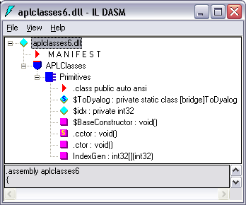
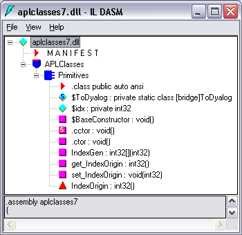

<h1 class="heading"><span class="name">Creating .NET Classes within APL Source Files</span></h1>

New .NET classes can be defined and used within an APL source file. This chapter provides a brief introduction to writing classes, aimed specifically at APL source files – see the _Dyalog APL Language Reference Guide_ for more information on writing classes in Dyalog.

A class is defined by `:Class` and `:EndClass` statements:

- `:Class Name: Type` declares a new class called `Name`, which is based on the base class `Type`, which can be any valid .NET class.

- `:EndClass` terminates a class definition block.

The methods provided by the class are defined as function bodies enclosed within these statements. You can also define sub-classes or nested classes using nested `:Class` and `:EndClass` statements.

A class specified in this way will automatically support the methods, properties and events that it inherits from its base class, together with any new public methods that are specified. However, the new class only inherits a default constructor (which is called with no parameters) and does not inherit all of the other private constructors from its base class. You can define a method to be a constructor using the `:Implements Constructor` declarative comment. Constructor overloading is supported, and you can define any number of different constructor functions in this way, but they must have unique parameter sets for the system to distinguish between them.

You can create and use instances of a class by using the `⎕NEW` system function in statements elsewhere in the APL source file.

## Exporting Functions as Methods

Within a `:Class` definition block, you can define private functions and public functions. A _public_ function is one that is exposed as a method and can be called by a client that creates an instance of your class. Public functions must have a section of _declaration_ statements. Other functions are purely internal to the class and are not directly accessible by a client application.

The declaration statements for public functions perform the same task for APL source as is performed using the .NET Properties dialog box or by executing `SetMethodInfo` in the Dyalog Session prior to creating a .NET assembly. The following declaration statements can be used:

- `:Access Public`<br />Specifies that the function is callable. This statement applies only to a .NET class or to a web page and is not applicable to a web service.

- `:Access WebMethod`<br />Specifies that the function is callable as a web method. This statement applies only to a web service (**.asmx**). The statement is equivalent to:
```apl
:Access Public
:Attribute System.Web.Services.WebMethodAttribute
```

- `:Implements Constructor`<br />Specifies that the function is a constructor for a new .NET class. This function must appear between `:Class` and `:EndClass` statements and this applies only to a web page (**.aspx**). A constructor is called when you execute the `New` method in the class.

- `:Signature result←fn type1 Name1, type2 Name2,...`<br />Declares the result of the method to have a given data type, if any. It also declares parameters to the method to have given data types and names. `Namex` is optional, and can be any well-formed name that identifies the parameter. This name will appear in the metadata and is made available to a client application as information. It is, therefore, sensible to choose meaningful names. The names you allocate to parameters have no other meaning and are not associated with the names of local variables that you might choose to receive them. However, it can be useful to use the same local names as the public names of your parameters.

## Example: Creating A .NET Class Using an APL Source File

The following code illustrates how you may create a .NET Class using an APL source file. The example class is the same as in [Example 1](../tutorial/#example-1). The code (available in **[DYALOG]\Samples\aplclasses\aplclasses6.apln**) is:
```apl
:Namespace APLClasses

:Class Primitives: Object
⎕USING←,⊂'System'
:Access public

∇ R←IndexGen N
:Access Public
:Signature Int32[]←IndexGen Int32 number
R←⍳N
∇
:EndClass

:EndNamespace
```

This code defines a namespace called `APLClasses`. This namespace acts as a container and is there to establish a .NET namespace of the same name within the resulting .NET assembly. Within `APLClasses` is a .NET class called `Primitives` whose base class is <code class="language-nonAPL">System.Object</code>. This class has a single public method named `IndexGen`, which takes a parameter called `number` whose data type is `Int32`, and returns an array of `Int32` as its result.

The following command shows how **aplclasses6.apln** is compiled to a .NET assembly using the <code class="language-nonAPL">/t:library</code> flag.
```nonAPL
APLClasses>dyalogc /t:library aplclasses6.apln
Dyalog Dyalog .NET Compiler 32bit Classic Mode Version 13.0.8690.0
Copyright Dyalog Limited 2011
APLClasses>
```

[](#classes6ildasm) shows a view of the resulting **aplclasses6.dll** using ILDASM.

{ #classes6ildasm }

As with other .NET classes, this .NET class can be called from APL. For example:
```apl
      )CLEAR
clear ws

      ⎕USING←'APLClasses,Samples\APLClasses\aplclasses6.dll'
      APL←⎕NEW Primitives
      APL.IndexGen 10
1 2 3 4 5 6 7 8 9 10
```

## Defining Properties

Properties are defined within `:Property` and `:EndProperty` statements. A property pertains to the class in which it is defined.

Within a `:Property` block, you must define the _accessors_ of the property. The accessors specify the code that is associated with referencing and assigning the value of the property. No other function definitions or statements are allowed inside a `:Property` block.

The accessor used to reference the value of the property is represented by a function called `get` that is defined within the `:Property` block. The accessor used to assign a value to the property is represented by a function called `set` that is defined within the `:Property` block.

The `get` function is used to retrieve the value of the property and must be a niladic result returning function. The data type of its result determines the `Type` of the property. The `set` function is used to change the value of the property and must be a monadic function with no result. The argument to the function will have a data type `Type` specified by the `:Signature` statement. A property that contains a `get` function but no `set` function is effectively a read-only property.

<h4 class="example">Example</h4>

```apl
:Property Name
     ∇ C←get
[1]   :Access public
[2]   :Signature Double←get
[3]    C←...
     ∇
:EndProperty
```

This declares a new property called `Name` whose data type is <code class="language-nonAPL">System.Double</code>. When defining a property, the data type can be any valid .NET type that can be located through `⎕USING`.

The following APL source file (**[DYALOG]\Samples\aplclasses\aplclasses7.apln**) shows how a property called `IndexOrigin` can be added to this example. Within the `:Property` block there are two functions called `get` and `set`; these functions use the previously‑described fixed names and syntax, and are used to reference and assign a new value respectively:
```apl
:Namespace APLClasses

:Class Primitives: Object
⎕USING←,⊂'System'
:Access public

∇ R←IndexGen N
:Access Public
:Signature Int32[]←IndexGen Int32 number
R←⍳N
∇

:Property IndexOrigin
∇io←get
      :Signature Int32←get Int32 number
io←⎕IO
∇

∇set io
      :Signature set Int32 number
:If io∊0 1
    ⎕IO←io
:EndIf
∇

:EndProperty
:EndClass
:EndNamespace
```

[](#classes7ildasm) shows the ILDASM view of the new **aplclasses7.dll**, including the new `IndexOrigin` property.

{ #classes7ildasm }

As with other .NET classes, this .NET class can be called from APL. For example:
```apl
      )CLEAR
clear ws

      ⎕USING←'APLClasses,Samples\APLClasses\APLClasses7.DLL'
      APL←⎕NEW Primitives
      APL.IndexGen 10
1 2 3 4 5 6 7 8 9 10

      APL.IndexOrigin
1

      APL.IndexOrigin←0
      APL.IndexGen 10
0 1 2 3 4 5 6 7 8 9
```

## Indexers

An _indexer_ is a property of a class that enables an instance of that class (an object) to be indexed in the same way as an array, if the host language supports this feature. Languages that support object indexing include C# and Visual Basic. Dyalog also allows indexing to be used on objects. This means that you can define an APL class that exports an indexer, and you can use the indexer from C#, Visual Basic, or Dyalog.

Indexers are defined in the same way as properties, that is, between `:Property Default` and `:EndProperty` statements. There can only be one indexer defined for a class.

!!! Info "Information"
    The `:Property Default` statement in Dyalog is closely modelled on the indexer feature in C# and employs similar syntax. If you use <code class="language-nonAPL">ILDASM</code> to browse a .NET class containing an indexer, you will see the indexer as the _default property_ of that class, which is how it is implemented.
