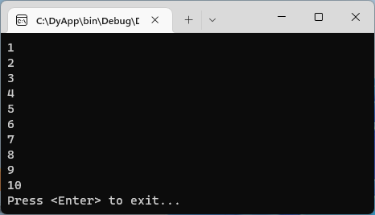
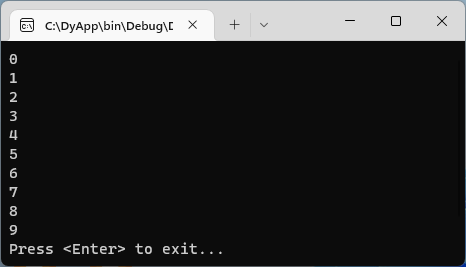
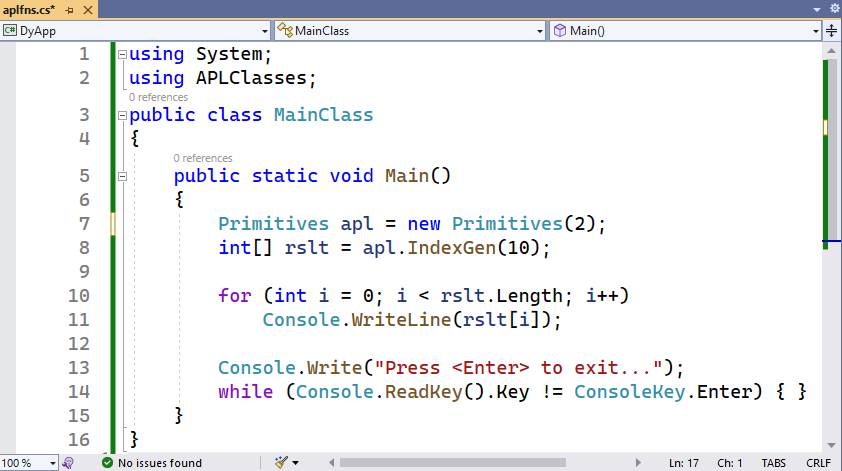
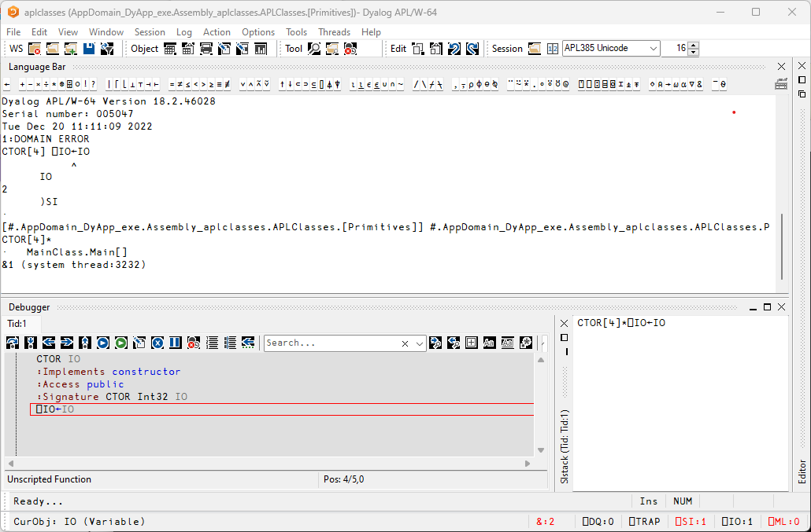
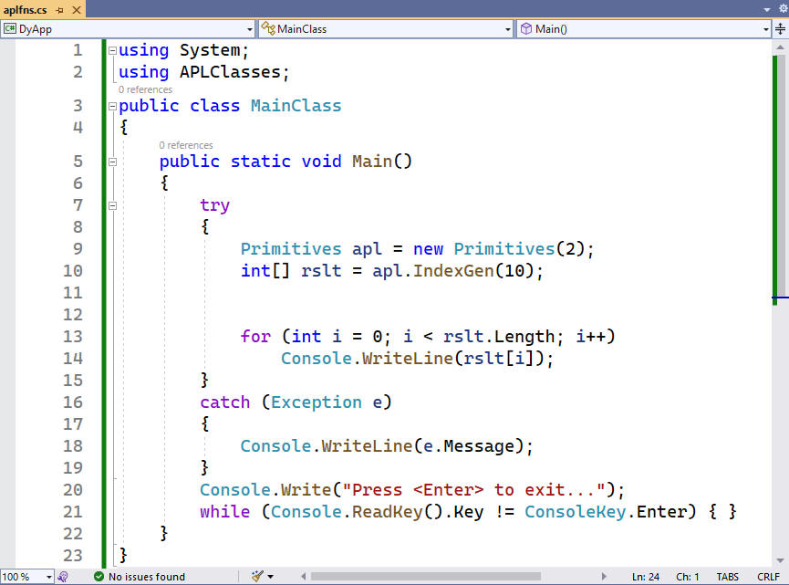
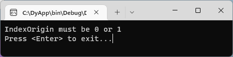
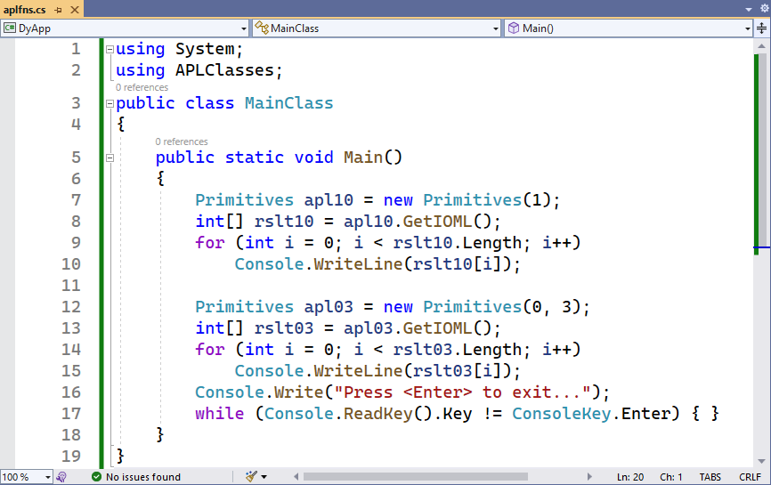
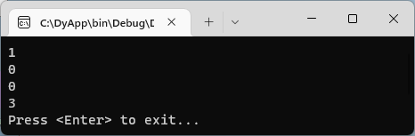
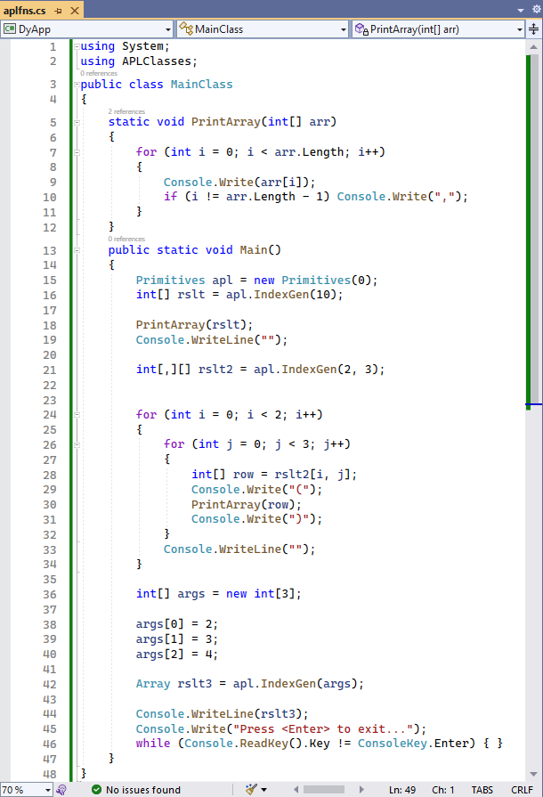
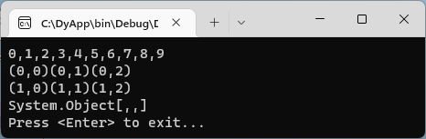

# <span class="name">Tutorial</span> {: .heading}

!!! Legacy "Legacy"
    This tutorial was originally designed (for Dyalog v10.0) to be exercised in a console window, with the user invoking the C# compiler directly using a command-line interface. It was originally envisaged to be run within the **[DYALOG]\Samples\aplclasses\\** directory, but this directory is now read-only. In addition, dependent Dyalog DLLs must now reside in the same directory as the host program. The tutorial has, therefore, been re-factored to use command line tools in a writeable directory.

All the examples in this tutorial are to be executed as simple console applications written in C# in the framework of _Microsoft Visual Studio Professional 2022_ (hereafter referred to as VS); to run this tutorial you should install VS.

Start VS and create a new _C# Console Application (.NET Framework)_ – this creates a project for creating a command-line application. You can chose the name and location; this tutorial chooses the name **DyApp** and the directory **C:\\**, so VS creates a directory called **C:\DyApp** containing several other files and directories.

When the application is executed (in debug mode) by VS it will be run in the application's **bin\Debug** sub‑directory.

!!! Info "Information"
    The Dyalog .NET class, and all the Dyalog DLLs on which it depends, must reside in the same directory as the host program.

First, copy the requisite Dyalog DLLs to the **bin\Debug** sub-directory. These are:

- Development DLL and/or Run-Time DLL (this tutorial uses the Development DLL)
- Bridge DLL
- DyalogNet DLL

For the names of these files corresponding to the version of Dyalog that you are using, see the _Dyalog for Microsoft Windows Installation and Configuration Guide_.

If you are running the 64-bit version of Dyalog, you must ensure that the **Platform target** is set to x64 in VS. To do this, select **Project** > **DyApp Properties**, go to the **Build** section, choose _x64_ from the **Platform target** drop-down list, and **Save** your changes.

Following these steps, the contents of the **C:\DyApp\bin\Debug** sub-directory should be similar to this:
```

20/12/2022  10:12    <DIR>          .
20/12/2022  10:10    <DIR>          ..
13/09/2022  19:19         2,378,752 bridge182-64_unicode.dll
13/09/2022  19:21        12,887,552 dyalog182_64rt_unicode.dll
13/09/2022  19:22        12,887,552 dyalog182_64_unicode.dll
13/09/2022  19:19            19,456 dyalognet.dll
```

The code for all of the examples is provided in the **[DYALOG]\Samples\aplclasses\\** directory:

- **aplclassesN.dws** – workspaces containing the source code for the Dyalog classes

- **aplfnsN.cs** – the corresponding C# source code for hosting the Dyalog classes.

To execute each example, the workspace **aplclassesN.dws** will be exported to the **bin\Debug** sub‑directory as a Microsoft .NET assembly called (in all cases) **aplclasses.dll**.

Each workspace contains a .NET namespace called <code class="language-nonAPL">APLClasses</code> which itself contains a single .NET class called <code class="language-nonAPL">Primitives</code> that exports a single method called <code class="language-nonAPL">IndexGen</code>.

The examples in this tutorial start by replacing the main program in the VS application with imported C# code, executing it, and displaying the results in a simple console window ([Example 1](#example-1)). Subsequent examples edit this code, either directly or by copying and pasting code from the other (supplied) C# source code files.

## Example 1

Load the **aplclasses1.dws** workspace from **[DYALOG]\Samples\aplclasses\aplclasses1**, then view the `Primitives` class:
```apl
      )ED ○APLClasses.Primitives

:Class Primitives
:using System
∇R←IndexGen N
:access public
:signature Int32[]←IndexGen Int32
R←⍳N
∇
:EndClass ⍝ Primitives
```

!!! Info "Information"
    The `○` character before the name `APLClasses.Primitives` instructs the editor to edit a class.

`Primitives` contains one public method/function, called `IndexGen`.

The public characteristics for the exported method are included in the definition of the class and its functions, as specified in the [`:Signature`](../../../programming-reference-guide/defined-functions-and-operators/traditional-functions-and-operators/function-declaration-statements/signature/) statement. This has the following syntax:
```apl
:Signature [rslttype←] name [arg1type [arg1name] [,argNtype [argNname]]*]
```

where:

- `rslttype` is the type of the result returned by the function – in this example, the function returns an array of 32-bit integers

- `name` is the exported name (it can be different from the APL function name but it must be provided) – in the example, the name of the exported method is `IndexGen`

- `argNtype [argNname]` are any arguments are to be supplied, each type-name pair separated from the next by a comma. In this example, the function takes a single integer as its argument.

When the class is fixed, APL will try to find the .NET data types that have been specified for the result and for the parameters. If one or more of the data types are not recognised as available .NET types, then a warning will be displayed in the status window and APL will not fix the class. If you see such a warning, you have either entered an incorrect data type name, or you have not set `:using` correctly, or some other syntax problem has been detected (for example, the function could be missing a terminating `∇`). In this example, the only data type used is `System.Int32`; as `:using System` is included in the definition, `Int32` is correctly located.

The assembly can now be created. This is done in one of the following ways:

- Select **File** > **Export…** – this displays the **Create bound file** dialog box.<br />For this example, set the **File name** to _aplclasses_. The **Runtime application** checkbox allows you to choose to which of the two versions of the Dyalog dynamic link library the assembly will be bound – this example will use the Development version, so the checkbox should be cleared. The **Isolation Mode** drop-down list allows you to choose the [isolation mode](../implementation-details/isolation-mode.md)) – in this example, each host process will have a single workspace. Click **Save**. APL now makes the assembly; as it does this, information is displayed in the **Status** window. If any errors occur during this process, they will be reported in the **Status** window.

- Use the [Bind method](../assemblies-namespaces-and-classes/#the-bind-method.md).

### aplclasses1.cs

The C# source code (**[DYALOG]\Samples\aplclasses\aplclasses1\net\project\Program.cs**) can be used to call the Dyalog.NET class. The <code class="language-nonAPL">using</code> statements specify the names of .NET namespaces to be searched for unqualified class names. The program creates an object called <code class="language-nonAPL">apl</code> of type <code class="language-nonAPL">Primitives</code> by calling the <code class="language-nonAPL">new</code> operator on that class. Then it calls the `IndexGen` method with a parameter of 10.
```nonAPL
      using System;
      using APLClasses;
      public class MainClass
          {
          public static void Main()
              {
                  Primitives apl = new Primitives();
                  int[] rslt = apl.IndexGen(10);
                  for (int i=0;i<rslt.Length;i++)
                  Console.WriteLine(rslt[i]);
               }
          }
```

In VS, select **Project** > **Add Existing Item...** and add **[DYALOG]\Samples\aplclasses\aplfns1.cs**. Use the **Solution Explorer** to rename **aplfns1.cs** to **aplfns.cs** and delete the dummy program **Program.cs** (this prevents there being two <code class="language-nonAPL">Main()</code> entry-points in the application.

Open **aplfns.cs** in the VS code editor (double-click its name in the **Solution Explorer**) and add the following two lines of code:
```nonAPL
      Console.Write("Press <Enter> to exit... ");
      while (Console.ReadKey().Key != ConsoleKey.Enter) { }
```

These allow you to view the contents of the console window before it disappears when the program ends.

<code class="language-nonAPL">APLClasses</code> and <code class="language-nonAPL">Primitives</code> are marked as being in error. This is because VS does not yet know what they are. To resolve this, select **Project** > **Add Reference...**, select the **Browse** tab from the left-hand menu, and click **Browse...**, then navigate to **C:\DyApp\bin\Debug** and add **aplclasses.dll**.

The final code is:


Click **Start** to run the program. The results are displayed in a console window:



## Example 2

In [Example 1](#example-1), APL supplied a default constructor, which was used to create an instance of the `Primitives` class. It was inherited from the base class (<code class="language-nonAPL">System.Object</code>) and called without arguments. This example extends that by adding a constructor that specifies the value of `⎕IO`.

Load the **aplclasses2.dws** workspace from **[DYALOG]\Samples\aplclasses\aplclasses2**, then view the `Primitives` class:
```apl
      ↑⎕SRC APLClasses.Primitives
:Class Primitives                      
:Using System                          
                                       
    ∇ CTOR IO                          
      :Implements constructor          
      :Access public                   
      :Signature CTOR Int32 IO         
      ⎕IO←IO                           
    ∇                                  
                                       
    ∇ R←IndexGen N                     
      :Access public                   
      :Signature Int32[]←IndexGen Int32
      R←⍳N                             
    ∇                                  
                                       
:EndClass ⍝ Primitives                 

```

This version of `Primitives` contains a constructor function called `CTOR` which sets `⎕IO` to the value of its argument. The name of this function is arbitrary.

Using this version, build a new .NET assembly called **aplclasses.dll** by selecting **File** > **Export…** – this displays the **Create bound file** dialog box as before. As in [Example 1](#example-1), set the **File name** to _aplclasses_ and ensure that the **Runtime application** checkbox is cleared.

### aplclasses2.cs

The C# source code (**[DYALOG]\Samples\aplclasses\aplclasses2\net\project\Program.cs**) can be used to call the new version of the Dyalog .NET class:
```nonAPL
      using System;
      using APLClasses;
      public class MainClass
            {
            public static void Main()
                  {
                  Primitives apl = new Primitives(0);
                  int[] rslt = apl.IndexGen(10);

                  for (int i=0;i<rslt.Length;i++)
                  Console.WriteLine(rslt[i]);
                  }
            }
```

The program is the same as in [Example 1](#example-1) except that the code that creates an instance of the <code class="language-nonAPL">Primitives</code> class now specifies an argument; in this example, <code class="language-nonAPL">0</code>. Rather than load **aplfns2.cs** into VS, it is simpler to just make this change directly within the code:

Old:
```nonAPL
[7]    Primitives apl = new Primitives();
```

New:
```nonAPL
[7]    Primitives apl = new Primitives(0);
```

The final code is:


Click **Start** to run the program. The results are displayed in a console window – the amended line numbers show the effect of changing the index origin from 1 (the default) to 0.



## Example 2a

In [Example 2](#example-2), the argument to `CTOR`, the constructor for the <code class="language-nonAPL">Primitives</code> class, was defined to be <code class="language-nonAPL">Int32</code>. This means that .NET will allow a client to specify any integer when it creates an instance of the <code class="language-nonAPL">Primitives</code> class, even if that value is one that will result in an APL `DOMAIN ERROR` when used to set `⎕IO`.

### aplclasses2a.cs

The C# source code (**[DYALOG]\Samples\aplclasses\aplclasses2a\net\project\Program.cs**) can be used to illustrate this.
```
      using System;
      using APLClasses;
      public class MainClass
            {
            public static void Main()
                  {
                  Primitives apl = new Primitives(2);
                  int[] rslt = apl.IndexGen(10);

                  for (int i=0;i<rslt.Length;i++)
                  Console.WriteLine(rslt[i]);
                  }
            }
```

The program is the same as in [Example 2](#example-2) except that the code that creates an instance of the <code class="language-nonAPL">Primitives</code> class now specifies an inappropriate argument; in this example, <code class="language-nonAPL">2</code>. Rather than load **aplfns2a.cs** into VS, it is simpler to make this change directly within the code:

Old:
```nonAPL
[7]    Primitives apl = new Primitives(0);
```

New:
```nonAPL
[7]    Primitives apl = new Primitives(2);
```

The final code is:



Click **Start** to run the program. As we have built the Dyalog .NET class to use the _Development DLL_, the APL Session window appears; it shows that the constructor `CTOR` has stopped with a `DOMAIN ERROR` (see [](#eg3error); the Debugger can be used to debug the problem). Meanwhile, the C# program waits for the call (to create an instance of <code class="language-nonAPL">Primitives</code>) to finish.

{ #eg3error }

In Dyalog, the `)SI` system command provides information about the entire calling stack, including the .NET function calls that are involved. In this example, the `CTOR` function (the constructor for this APL .NET class) is running in APL thread 1, which is associated with the system thread 3232.

This simple error can be corrected by entering:
```apl
      IO←1
      →⎕LC
```

The `CTOR` function now completes, the program continues, and the results are displayed in a console window:


## Example 3

The correct .NET behaviour when an APL function fails with an error is to generate an exception; this example shows how this is achieved.

In the .NET Framework, exceptions are implemented as .NET classes. The base exception is implemented by the <code class="language-nonAPL">System.Exception class</code>, but there are a number of _super classes_, such as <code class="language-nonAPL">System.ArgumentException</code> and <code class="language-nonAPL">System.ArithmeticException</code> that inherit from it.

`⎕SIGNAL` can be used to generate an exception. To do this, its right argument should be `90` and its left argument should be an object of type <code class="language-nonAPL">System.Exception</code> or an object that inherits from <code class="language-nonAPL">System.Exception</code>.

When you create the instance of the <code class="language-nonAPL">Exception</code> class, you can specify a string (which will be its <code class="language-nonAPL">Message</code> property) containing information about the error.

Load the **aplclasses3.dws** workspace from **[DYALOG]\Samples\aplclasses\aplclasses3**, then view its improved (compared with that in [Example 2](#example-2)) `CTOR` constructor function:
```apl
     ∇ CTOR IO;EX
[1]   :Access public
[2]   :Signature CTOR Int32 IO
[3]   :Implements constructor
[4]   :If IO∊0 1
[5]     ⎕IO←IO
[6]   :Else
[7]      EX←⎕NEW ArgumentException,⊂⊂'IndexOrigin must be 0 or  1'
[8]      EX ⎕SIGNAL 90
[9]   :EndIf
     ∇

```

Using this version, build a new .NET assembly called **aplclasses.dll** by selecting **File** > **Export…** – this displays the **Create bound file** dialog box as before. As in [Example 1](#example-1), set the **File name** to _aplclasses_ and ensure that the **Runtime application** checkbox is cleared.

### aplclasses3.cs

The C# source code (**[DYALOG]\Samples\aplclasses\aplclasses3\net\project\Program.cs**) contains code to catch the exception and display the exception message:
```nonAPL
using System;
using APLClasses;
public class MainClass
    {
    public static void Main()
        {
        try
            {
                Primitives apl = new Primitives(2);
                int[] rslt = apl.IndexGen(10);

                for (int i=0;i<rslt.Length;i++)
                Console.WriteLine(rslt[i]);
            }
        catch (Exception e)
            {
                Console.WriteLine(e.Message);
            }
        }
    }	
```

Merge the new code from **aplfns4.cs** into **aplfns.cs** (for example, using copy/paste) to produce the code shown below:



Click **Start** to run the program. The results are displayed in a console window:



## Example 4

This example builds on [Example 3](#example-3), and illustrates how you can implement _constructor overloading_ by establishing several different constructor functions.

For this example, when a client application creates an instance of the `Primitives` class, is should be able to specify either the value of `⎕IO` or the values of both `⎕IO` and `⎕ML`. The simplest way to implement this is to have two public constructor functions, `CTOR1` and `CTOR2`, which call a private constructor function, `CTOR`.

Load the **aplclasses4.dws** workspace from **[DYALOG]\Samples\aplclasses\aplclasses4**; the new version of the `Primitives` class includes the following additions:
```apl
     ∇ CTOR1 IO
[1]    :Implements constructor
[2]    :Access public
[3]    :Signature CTOR1 Int32 IO
[4]    CTOR IO 0
     ∇

     ∇ CTOR2 IOML
[1]    :Implements constructor
[2]    :Access public
[3]    :Signature CTOR2 Int32 IO,Int32 ML
[4]    CTOR IOML
     ∇

     ∇ CTOR IOML;EX
[1]    IO ML←IOML
[2]    :If ~IO∊0 1
[3]        EX←⎕NEW ArgumentException,⊂⊂'IndexOrigin must be 0 or 1'
[4]        EX ⎕SIGNAL 90
[5]    :EndIf
[6]    :If ~ML∊0 1 2 3
[7]        EX←⎕NEW ArgumentException,⊂⊂'MigrationLevel must be 0, 1, 2 or 3'
[8]        EX ⎕SIGNAL 90
[9]    :EndIf
[10]   ⎕IO ⎕ML←IO ML
     ∇ 
```

The `:Signature` statements for these three functions show that `CTOR1` is defined as a constructor that takes a single <code class="language-nonAPL">Int32</code> parameter and `CTOR2` is defined as a constructor that takes two <code class="language-nonAPL">Int32</code> parameters; `CTOR` has no .NET properties defined. In .NET terminology, `CTOR` is not a private constructor but rather an internal function that is invisible to the outside world.

Next, a function called `GetIOML` is defined and exported as a public method. This function returns the current values of `⎕IO` and `⎕ML`:
```apl
     ∇ r←GetIOML
[1]   :access public
[2]   :signature Int32[]←GetIOML
[3]   r←⎕IO ⎕ML
     ∇
```

Using this version, build a new .NET assembly called **aplclasses.dll** by selecting **File** > **Export…** – this displays the **Create bound file** dialog box as before. As in [Example 1](#example-1), set the **File name** to _aplclasses_ and ensure that the **Runtime application** checkbox is cleared.

### aplclasses4.cs

The C# source code (**[DYALOG]\Samples\aplclasses\aplclasses4\net\project\Program.cs**) contains code to invoke the two different constructor functions `CTOR1` and `CTOR2`:
```nonAPL
using System;
using APLClasses;
public class MainClass
	{
	public static void Main()
		{
		Primitives apl10 = new Primitives(1);
		int[] rslt10 = apl10.GetIOML();
		for (int i=0;i<rslt10.Length;i++)
			Console.WriteLine(rslt10[i]);

		Primitives apl03 = new Primitives(0,3);
		int[] rslt03 = apl03.GetIOML();
		for (int i=0;i<rslt03.Length;i++)
			Console.WriteLine(rslt03[i]);
		}
	}
```

This code creates two instances of the <code class="language-nonAPL">Primitives</code> class called <code class="language-nonAPL">apl10</code> and <code class="language-nonAPL">apl03</code>; the first is created with a constructor parameter of <code class="language-nonAPL">(1)</code>, and the second with two constructor parameters <code class="language-nonAPL">(0,3)</code>.

The C# compiler matches the first call with `CTOR1`, because `CTOR1` is defined to accept a single <code class="language-nonAPL">Int32</code> parameter. The second call is matched to `CTOR2`, because `CTOR2` is defined to accept two <code class="language-nonAPL">Int32</code> parameters.

Merge the new code from **aplfns4.cs** into **aplfns.cs** (for example, using copy/paste) to produce the code shown below:



Click **Start** to run the program. The results are displayed in a console window:



## Example 5

This example builds on [Example 4](#example-4), and illustrates how you can implement _method overloading_.

In this example, the requirement is to export three different versions of the `IndexGen` method; one that takes a single number as an argument, one that takes two numbers, and a third that takes any number of numbers. These are represented by three functions called `IndexGen1`, `IndexGen2` and `IndexGen3` respectively. The _index generator_ function (monadic `⍳`) performs all of these operations, therefore the three APL functions are identical. However, their public interfaces, as defined in their `:Signature` statement, are all different. The overloading is achieved by entering the same name for the exported method (`IndexGen`) for each of the three APL functions.

Load the **aplclasses5.dws** workspace from **[DYALOG]\Samples\aplclasses\aplclasses5**; the new version of the `Primitives` class includes three different versions of `IndexGen`. The first is the version we have seen before, which is defined to take a single argument of type `Int32` and to return a 1-dimensional array (vector) of type `Int32`:
```apl
     ∇ R←IndexGen1 N
[1]   :Access public
[2]   :Signature Int32[]←IndexGen Int32 N
[3]    R←⍳N
     ∇
```

The second version is defined to take two arguments of type `Int32` and to return a 2‑dimensional array, each of whose elements is a 1-dimensional array (vector) of type `Int32`:
```apl
     ∇ R←IndexGen2 N
[1]   :Access public
[2]   :Signature Int32[][,]←IndexGen Int32 N1, Int32 N2
[3]    R←⍳N
     ∇
```

Although we could define seven more different versions of the method, taking 3, 4, 5 (and so on) numeric parameters, instead this method is defined more generally to take a single parameter that is a 1-dimemsional array (vector) of numbers, and to return a result of type `Array`. In practice we might use this version alone, but for a C# programmer, this is harder to use than the two other specific cases:
```apl
     ∇ R←IndexGen3 N
[1]   :Access public
[2]   :Signature Array←IndexGen Int32[] N
[3]   R←⍳N
     ∇
```

All these functions use the same descriptive name, `IndexGen`.

Using this version, build a new .NET assembly called **aplclasses.dll** by selecting **File** > **Export…** – this displays the **Create bound file** dialog box as before. As in [Example 1](#example-1), set the **File name** to _aplclasses_ and ensure that the **Runtime application** checkbox is cleared.

### aplclasses5.cs

The C# source code (**[DYALOG]\Samples\aplclasses\aplclasses5\net\project\Program.cs**) contains code to invoke the three different variants of <code class="language-nonAPL">IndexGen</code> in the new **aplclasses.dll**. It uses a local sub-routine <code class="language-nonAPL">PrintArray()</code>:
```nonAPL
      using System;
      using APLClasses;
      public class MainClass
            {
            static void PrintArray(int[] arr)
            {
                  for (int i=0;i<arr.Length;i++)
                      {
                      Console.Write(arr[i]);
                      if (i!=arr.Length-1)
                         Console.Write(",");
                      }
            }
            
            public static void Main()
                  {
                  Primitives apl = new Primitives(0);
                  int[] rslt = apl.IndexGen(10);
                  PrintArray(rslt);
                  Console.WriteLine("");

                  int[,][] rslt2 = apl.IndexGen(2,3);
                  for (int i=0;i<2;i++)
                           {
                           for (int j=0;j<3;j++)
                                    {
                                    int[] row = rslt2[i,j];
                                    Console.Write("(");
                                    PrintArray(row);
                                    Console.Write(")");
                                    }
                  Console.WriteLine("");
                           }

                  int[] args = new int[3];
                  args[0]=2;
                  args[1]=3;
                  args[2]=4;
                  Array rslt3 = apl.IndexGen(args);
                  Console.WriteLine(rslt3);

            }

```

Merge the new code from **aplfns5.cs** into **aplfns.cs** (for example, using copy/paste) to produce the code shown below:



Click **Start** to run the program. The results are displayed in a console window:



A function can have several `:Signature` statements. As the three functions perform exactly the same operation, we can replace them with a single function:
```apl
     ∇ R←IndexGen1 N
[1]   :Access public
[2]   :Signature Int32[]←IndexGen Int32 N
[3]   :Signature Int32[][,]←IndexGen Int32 N1, Int32 N2
[4]   :Signature Array←IndexGen Int32[] N
[5]    R←⍳N
     ∇
```
