# <span class="name">Sample Web Services</span> {: .heading}

The relevant code is supplied in **[DYALOG]\Samples\asp.net**.

## Sample: EG1

This sample is supplied in **[DYALOG]\Samples\asp.net\webservices\eg1.asmx**, which is mapped through an IIS virtual directory to the URL [http://localhost/dyalog.net.18.2.unicode.64/webservices/eg1.asmx](http://localhost/dyalog.net.18.2.unicode.64/webservices/eg1.asmx).
```nonAPL
<%@ WebService Language="Dyalog" Class="APLExample" %>

:Class APLExample: System.Web.Services.WebService
:Using System

 ∇ R←Add args
   :Access WebMethod
   :Signature Int32←Add Int32 arg1,Int32 arg2
   R←+/args
 ∇

:EndClass
```

The `Add` function is exported as a method that takes exactly (and only) two parameters of type `Int32` and returns a result of type `Int32`. This means that `R←+/args` could  be coded as `R←args[1]+args[2]`, because .NET guarantees that a client can only call the method by providing two 32-bit integers as parameters.

### Testing from a Browser

If you connect to a URL that represents a web service, the browser displays a page that provides information about the service and the methods that it contains. In certain cases, the page also contains form fields that let you invoke a method from the browser.

In your preferred browser, navigate to [http://localhost/dyalog.net.15.0.unicode.32/webservices/eg1.asmx](http://localhost/dyalog.net.15.0.unicode.32/webservices/eg1.asmx). The page fabricated by ASP.NET is shown in [](#eg1b1) .

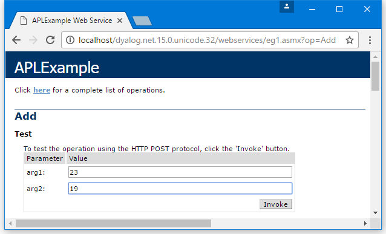{ #eg1b1 }

This shows that the web service is called `APLExample`, and that it exports a single method called `Add` which takes two parameters called `arg1` and `arg2`.

[](#eg1b2) shows the result of entering the values _23_ and _19_ into the form fields and then pressing the **Invoke** button. The method returns an `int` value of _42_. The result is described using XML, which is the language used to invoke a web service and return its result.

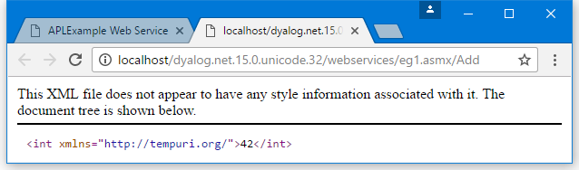{ #eg1b2 }

Accessed in this way from a browser, a web service appears to be behaving like a web server; however, this is not the case. Instead, the browser detects that the target URL is a web service, and invokes an ASP+ page called **DefaultSdlHelpGenerator.aspx** – this inspects the compiled class and returns an HTML view of the web service.

## Sample: LoanService

This sample is supplied in **[DYALOG]\Samples\asp.net\loan\loan.asmx**, which is mapped through an IIS virtual directory to the URL [http://localhost/dyalog.net.15.0.unicode.32/Loan/Loan.asmx](http://localhost/dyalog.net.15.0.unicode.32/Loan/Loan.asmx).

This sample defines a class called `LoanService` that is based on `System.Web.Services.WebService`. The `LoanService` class defines a sub-class called `LoanResult` and a method called `CalcPayments`.
```nonAPL
<%@ WebService Language="Dyalog" Class="LoanService" %>

:Class LoanService: System.Web.Services.WebService
:Using System
    :Class LoanResult
    :Access public
        :Field Public Int32[] Periods
        :Field Public Double[] InterestRates
        :Field Public Double[] Payments
    :EndClass

    ∇ R←CalcPayments X;LoanAmt;LenMax;LenMin;IntrMax;IntrMin;PERIODS;INTEREST;NI;NM
[1]   :Access WebMethod
[2]   :Signature LoanResult←CalcPayments Int32 LoanAmt,Int32 LenMax,Int32 LenMin,Int32 IntrMax,Int32 IntrMin
[3] 
[4]  ⍝ Calculates loan repayments
[5]  ⍝ Argument X specifies:
[6]  ⍝   LoanAmt     Loan amount
[7]  ⍝   LenMax      Maximum loan period
[8]  ⍝   LenMin      Minimum loan period
[9]  ⍝   IntrMax     Maximum interest rate
[10] ⍝   IntrMin     Minimum interest rate
[11]
[12]   LoanAmt LenMax LenMin IntrMax IntrMin←X
[13]   R←⎕NEW LoanResult
[14]   R.Periods←¯1+LenMin+⍳1+LenMax-LenMin
[15]   R.InterestRates←0.5ׯ1+(2×IntrMin)+⍳1+2×IntrMax-IntrMin
[16]   NI←⍴INTEREST←R.InterestRates÷100×12
[17]   NM←⍴PERIODS←R.Periods×12
[18]   R.Payments←,(LoanAmt)×((NI,NM)⍴NM/INTEREST)÷1-1÷(1+INTEREST)∘.*PERIODS
     ∇
:EndClass
```

`CalcPayments` takes five integer parameters (described within the code) and returns an object of type `LoanResult`.

The block of code that defines the sub-class `LoanResult` must be within the `:Class` and `:EndClass` statements of the main class, `LoanService`. You can define any number of internal classes in this way.

The `LoanResult` class only comprises fields, and it does not export any methods or properties. There are also no constructor methods defined, and it relies solely on its default constructor that is inherited from its base class, `System.Object`. The default constructor is called without any parameters and does nothing except create an instance of the class; the fields it contains initialised to zero. In this sample, that is sufficient, as all the fields will be filled in explicitly later.
```apl
    :Class LoanResult
    :Access public
        :Field Public  Int32[] Periods
        :Field Public Double[] InterestRates
        :Field Public Double[] Payments
    :EndClass
```

The `:Class` statement starts the definition of a new class and specifies its name; the `:EndClass` statement terminates it definition.

The three `:Field` declaration statements specify the names and data types of three public fields. The `Public` attributes are necessary to make the fields visible to methods within the `LoanService` class as a whole, as well as to external clients.

The `Periods` field is defined to be an array of integers, and the `InterestRates` field an array of `Double`. Both these arrays are 1‑dimensional, that is, vectors. These will contain the numbers of years and the different interest rates to which the repayments matrix applies.

`Payments` is also defined to be 1‑dimensional even though it is, more naturally, a 2‑dimesional matrix. The reason for this is that web services do not currently support multi-dimensional arrays. This is a .NET restriction and not a Dyalog restriction.

Line `[13]` gets a new instance of the `LoanResult` class by doing `⎕New LoanResult`. It then assigns values to each of the three fields in lines `[14]`, `[15]`, and `[18]`.

### Testing from a Browser

In your prefered browser, navigate to [http://localhost/dyalog.net.15.0.unicode.32/loan/loan.asmx](http://localhost/dyalog.net.15.0.unicode.32/loan/loan.asmx). The page fabricated by ASP.NET is shown in [](#loanb1).

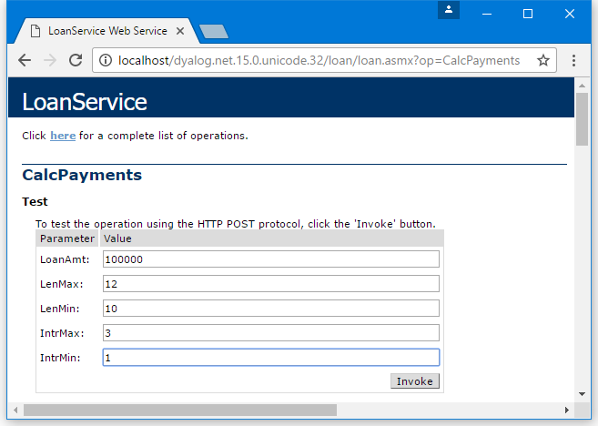{ #loanb1 }

[](#loanb2) shows the result of entering into the form fields and then pressing the **Invoke** button.

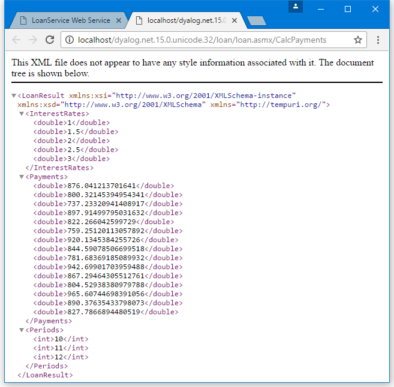{ #loanb2 }

This shows that the result is of type `LoanResult`, and it contains 3 fields – `Payments`, `InterestRates`, and `Periods`. This information was derived by our definition of the `LoanResult` class in the APL Source file.

The `InterestRates` field shows that it contains a vector of floating-point values (`double`) from the minimum rate to the maximum rate that was specified on the input form. This time, the increment is 0.5. Similarly, the `Payments` field contains the calculated repayment values. The `Periods` field contains a vector of integers, from the minimum period to the maximum period that was specified on the input form, in increments of 1.

## Sample: GolfService

This sample is supplied in **[DYALOG]\Samples\asp.net\golf** and is associated with the IIS Virtual Directory **dyalog.net/Golf**. This sample makes extensive use of internal classes to define data structures that are appropriate for a client application, such as C# or VB.

The directory contains a **global.asax** script, which is used to initialise the application.

This sample manages the reservation of tee-times at golf courses. All the data is held in a component file called **golfdata.dcf** in the **[DYALOG]\Samples\asp.net\golf\data** directory. This file can be initialised using the `Golf.INITFILE` function in the **[DYALOG]\Samples\asp.net\webservices\webservices.dws** workspace (you might need to alter the file path first).

Each golf course managed by the application has a unique code (integer) and a name (string). This is handled by defining a class (structure) called `GolfCourse` with two fields, `Code` and `Name`.

`GolfService` provides three methods:

- `GetCourses()` returns a list of Golf Courses (CourseCode and CourseName). The result of this method is an array of `GolfCourse` objects.

- `GetStartingSheet(CourseCode,Date)` returns the starting sheet for a specified golf course on a given day. A starting sheet is a list of starting times with a list of the golfers booked to start their round at that time. The result of this method is a `StartingSheet` object.

- `MakeBooking(CourseCode,TeeTime,GimmeNearest,Name1,Name2,Name3,Name4)` requests a tee reservation at the course specified by `CourseCode`. All parameters are required. `TeeTime` is a `DateTime` object that specifies the requested date and time. `GimmeNearest` is `Boolean` – `1` means request the nearest tee-time to that specified, and `0` means request only the specified tee-time. `Name1-4` are strings specifying the names of up to four players. The result of this method is a `Booking` object.

### Global.asax

The **[DYALOG]\samples\asp.net\golf\data\golfdata.dcf** file needs to be located where it can be modified.

```nonAPL
<script language="Dyalog" runat=server>
 
∇ Application_Start;GOLFID
  :Access Public
  GOLFID←'c:\Dyalog\samples\asp.net\golf\data\golfdata' ⎕FTIE 0
  Application[⊂'GOLFID']←GOLFID
∇

∇ Application_End;GOLFID
  :Access Public
  :Trap 6
     ; GOLFID←Application[⊂'GOLFID']
      ⎕FUNTIE GOLFID
  :EndTrap
∇
</script>
```

The `Application_Start` function is called when the <code class="language-nonAPL">GolfService</code> web service is invoked for the first time. It ties the `golfdata` component file, then stores the tie number in a new item called `GOLFID` in the`Application` object. This item is subsequently available to methods in `GolfService` for the duration of the application.

The `Application_End` function is invoked when the `GolfService` web service terminates. It unties the `golfdata` component file.

This example could be considered slightly weak in that the location of the data file is hard-coded in the application's **Global.asax** file. An alternative is to store this information in the <code class="language-nonAPL">&lt;appsettings></code> section of the appropriate **web.config** file or in the global **machine.config** file. This is preferable if the resource (in this case, a file name) is to be accessed from more than one script. For further information on ASP.NET config files, see the documentation for the .NET Framework SDK.

!!! Info "Information"
    The **golfdata** file can be initialised using the function `Golf.INITFILE` in the **[DYALOG]\Samples\asp.net\webservices\webservices.dws** workspace. The function will prompt you for the path of the file, initialise it, and update the **Global.asax** file accordingly.

#### GolfCourse Class

The `GolfCourse` class is effectively a structure with two fields, `Code` and `Name`. `Code` is an integer code that provides a shorthand way to refer to a specific golf course. `Name` is a <code class="language-nonAPL">String</code> containing its full name.
```apl
:Class GolfCourse
    :Access Public
    :Field Public Int32 Code
    :Field Public String Name
 
    ∇ ctor args
     :Implements Constructor
     :Access public
     :Signature fn Int32, String
      Code Name←args
    ∇
    ∇ ctor_def 
     :Implements Constructor
     :Access public
      ctor ¯1 ''
    ∇
:EndClass
```

The `GolfCourse` class provides two constructors. The first, `ctor_def`, takes no arguments and, therefore, overrides the default constructor that is inherited from <code class="language-nonAPL">System.Object</code>. `ctor_def` calls `ctor` to initialise the instance with a code of  `¯1` and an empty `Name`.

The constructor `ctor` accepts two parameters, `CourseCode` (an integer) and `CourseName` (a string). It assigns these values into the corresponding fields.

Valid ways to create an instance of a `GolfCourse` are:
```apl
      GC←⎕NEW GolfCourse
      GC.(Code Name)←1 'St Andrews'
```

Or, more simply:
```apl
      GC←⎕NEW GolfCourse (1 'St Andrews') 
```

!!! Info "Information"
    The names of constructor functions are not visible outside the class. Constructors are identified by their signatures (the `:Implements Constructor` statement) and not by their names.

#### Slot Class

The `Slot` class is effectively a structure with two fields, `Time` and `Players`. `Time` is a `DateTime` object representing a time that can be reserved on the first tee. `Players` is an array of (up to 4) strings that contains the names of the golfers who have made a reservation to start their round of golf at that time.
```apl
:Class Slot
    :Access Public
    :Field Public DateTime Time
    :Field Public String[] Players

    ∇ ctor1 arg
     :Implements Constructor
     :Access public
     :Signature fn DateTime
      Time←arg
      Players← 0⍴⊂''
    ∇

    ∇ ctor2 args
     :Implements Constructor
     :Access public
     :Signature fn DateTime, String[]
      Time Players←args
    ∇

    ∇ ctor_def
     :Implements Constructor
     :Access public
    ∇
:EndClass
```

This class provides two constructor functions, `ctor1` and `ctor2`. For internal reasons, if a class defines any constructor functions, then it is necessary to provide a dummy default constructor (the form of the constructor that takes no parameters); hence `ctor_def`.

The constructor `ctor1` accepts a single `DateTime` parameter, which it assigns to the `Time` field, and initialises the `Players` field to an empty array.

The constructor `ctor2` accepts two arguments – a specified tee time, and an array of strings that contains golfers' names. It assigns these parameters to `Time` and `Players` respectively.

#### Booking Class

The `Booking` class represents the result of the `MakeBooking` method. It contains four fields – `OK`, `Course`, `TeeTime`, and `Message`.

`OK` is Boolean, and indicates whether an attempt to make a reservation was successful:

- If `OK` is false (`0`), the `Message` field (a string) indicates the reason for failure.

- If `OK` is true (`1`), the `Course` field contains an instance of a `GolfCourse` object, and the `TeeTime` field contains an instance of a `Slot` object. Together, these objects identify the reserved golf course and starting slot. The latter specifies both the starting time and the names of all the golfers who have been allocated that starting time and who will, therefore, play together.

```apl
:Class Booking
    :Access Public
    :Field Public Boolean OK
    :Field Public GolfCourse Course
    :Field Public Slot TeeTime
    :Field Public String Message

    ∇ ctor args
     :Implements Constructor
     :Access public
     :Signature fn Boolean, GolfCourse, Slot, String
      OK Course TeeTime Message←args
    ∇

    ∇ ctor_def
     :Access public
     :Implements Constructor
    ∇
:EndClass
```

This class provides a single constructor method, which must be called with values for all four fields.

#### StartingSheet Class

The `StartingSheet` class represents the result of the `GetStartingSheet` method. It contains five fields – `OK`, `Course`, `Date`, `Slots`, and `Message`.

`OK` is Boolean, and indicates whether a starting sheet is available for the specified course and date:

- If `OK` is false (`0`), the `Message` field (a string) indicates the reason for failure.

- If `OK` is true (`1`) the `Course` field contains an instance of a `GolfCourse` object,  the `Date` field contains the date in question, and the `Slots` field contains an array of `Slot` objects. Each `Slot` object specifies a starting time, and the names of all the golfers who have been allocated that starting time and who will, therefore, play together.

```apl
:Class StartingSheet
    :Access Public
    :Field Public Boolean OK
    :Field Public GolfCourse Course
    :Field Public DateTime Date
    :Field Public Slot[] Slots
    :Field Public String Message

    ∇ ctor args
     :Implements Constructor
     :Access public
     :Signature fn Boolean, GolfCourse, DateTime
      OK Course Date←args
    ∇

    ∇ ctor_def 
     :Implements Constructor
     :Access public
    ∇
:EndClass
```

Like the [`Booking` class](#booking-class), the `StartingSheet` class provides a single constructor method. In this case, the constructor is called with values for just three of the fields; the values of the other fields are expected to be assigned later.

#### GetCourses Function
```apl
     ∇ R←GetCourses;COURSECODES;COURSES;INDEX;GOLFID
[1]   ⍝
[2]   :Access WebMethod
[3]   :Signature GolfCourse[]←fn
[4]
[5]    GOLFID←Application[⊂'GOLFID']
[6]    COURSECODES COURSES INDEX←⎕FREAD GOLFID 1
[7]    R←⎕NEW¨GolfCourse,¨⊂¨↓⍉↑COURSECODES COURSE
     ∇
```

The `GetCourses` function retrieves the tie number of the `GolfData` component file from the `Application` object and reads its first component.

The function then creates a `GolfCourse` object for each of the courses recorded on the file, and returns the array of `GolfCourse` objects as its result.

#### GetStartingSheet Function

The `GetStartingSheet` function retrieves the tie number of the `GolfData` component file from the `Application` object and reads its first component.
```apl
     ∇ R←GetStartingSheet ARGS;CODE;COURSE;DATE;GOLFID;COURSECODES;COURSES;INDEX;COURSEI;IDN;DATES;COMPS;IDATE;TEETIMES;GOLFERS;I;T
[1]   
[2]   :Access WebMethod
[3]   :Signature StartingSheet←fn Int32 CCode, DateTime Date
[4]
[5]    CODE DATE←ARGS
[6]    GOLFID←Application[⊂'GOLFID']
[7]    COURSECODES COURSES INDEX←⎕FREAD GOLFID 1
[8]    COURSEI←COURSECODES⍳CODE
[9]    COURSE←⎕NEW GolfCourse (CODE(COURSEI⊃COURSES,⊂''))
[10]   R←⎕NEW StartingSheet (0 COURSE DATE)
[11]   :If COURSEI>⍴COURSECODES
[12]       R.Message←'Invalid course code'
[13]       :Return
[14]   :EndIf
[15]   IDN←2 ⎕NQ'.' 'DateToIDN',DATE.(Year Month Day)
[16]   DATES COMPS←⎕FREAD GOLFID,COURSEI⊃INDEX
[17]   IDATE←DATES⍳IDN
[18]   :If IDATE>⍴DATES
[19]       R.Message←'No Starting Sheet available'
[20]       :Return
[21]   :EndIf
[22]   TEETIMES GOLFERS←⎕FREAD GOLFID,IDATE⊃COMPS
[23]   R.OK←1
[24]   T←⎕NEW¨DateTime,¨⊂¨(⊂DATE.(Year Month Day)),¨ 3↑¨↓[1]24 60⊤TEETIMES
[25]   R.Slots←⎕NEW¨Slot,¨⊂¨T,∘⊂¨↓GOLFERS
     ∇
```

Line `[10]` creates an instance of a `StartingSheet` object and uses it to initialise the result `R`. The value of the `OK` field is set to zero to indicate failure. It then validates the requested `CourseCode`. If invalid, it sets the `Message` field in the result and returns it. Similarly, it checks to see whether there is a starting sheet on file for the requested date and, if there is not, it sets the `Message` field to indicate this, and returns.

Line `[15]` extracts the `Year`, `Month` and `Day` properties from the requested tee time, a `DateTime` object, and converts them to an IDN. This is used to index the component containing the `starting` sheet for that day.

Line `[23]` sets the `OK` field of the result to `1` (success).

Line `[24]` converts the stored tee times (in minutes) to `DateTime` objects.

Line `[25]` combines the tee times and golfers into a vector of 2-element arrays, and creates a `Slot` object for each of them. The result is assigned to the `Slots` field of the result `R`.

#### MakeBooking Function

The `MakeBooking` function checks that the requested tee-time is available (for the specified number of players) and updates the starting sheet accordingly. The result of the function is a `Booking` object.
```apl
    ∇ R←MakeBooking ARGS;CODE;COURSE;SLOT;TEETIME;GOLFID;COURSECODES;COURSES;INDEX;COURSEI;IDN;DATES;COMPS;IDATE;TEETIMES;GOLFERS;OLD;COMP;HOURS;MINUTES;NEAREST;TIME;NAMES;FREE;FREETIMES;I;J;DIFF
[1]
[2]   :Access WebMethod
[3]   :Signature Booking←Int32 CourseCode,
                         DateTime TeeTime,
                         Boolean GimmeNearest,
                         String Name1,
                         String Name2,
                         String Name3,
                         String Name4
[4] 
[5] 
[6]  ⍝ If GimmeNearest=0, books (or fails) for specified time
[7]  ⍝ If GimmeNearest=1, books (or fails) for nearest to specified time
[8] 
[9]    CODE TEETIME NEAREST←3↑ARGS
[10]   GOLFID←Application[⊂'GOLFID']
[11]   COURSECODES COURSES INDEX←⎕FREAD GOLFID 1
[12]   COURSEI←COURSECODES⍳CODE
[13]   COURSE←⎕NEW GolfCourse,⊂CODE(COURSEI⊃COURSES,⊂'')
[14]   SLOT←⎕NEW Slot TEETIME
[15]   R←⎕NEW Booking (0 COURSE SLOT '')
[16]   :If COURSEI>⍴COURSECODES
[17]       R.Message←'Invalid course code'
[18]       :Return
[19]   :EndIf
[20]   :If TEETIME.Now>TEETIME
[21]       R.Message←'Requested tee-time is in the past'
[22]       :Return
[23]   :EndIf
[24]   :If TEETIME>TEETIME.Now.AddDays 30
[25]       R.Message←'Requested tee-time is more than 30 days from now'
[26]       :Return
[27]   :EndIf
[28]   IDN←2 ⎕NQ'.' 'DateToIDN',TEETIME.(Year Month Day)
[29]   DATES COMPS←⎕FREAD GOLFID,COURSEI⊃INDEX
[30]   IDATE←DATES⍳IDN
[31]   :If IDATE>⍴DATES
[32]       TEETIMES←(60×7)+10ׯ1+⍳1+8×6 ⍝ 10 minute intervals, 07:00 to 15:00
[33]       GOLFERS←((⍴TEETIMES),4)⍴⊂'' ⍝ up to 4 golfers allowed per tee time
[34]       :If 0=OLD←⊃(DATES<2 ⎕NQ'.' 'DateToIDN',3↑⎕TS)/⍳⍴DATES
[35]           COMP←(TEETIMES GOLFERS)⎕FAPPEND GOLFID
[36]           DATES,←IDN
[37]           COMPS,←COMP
[38]           (DATES COMPS)⎕FREPLACE GOLFID,COURSEI⊃INDEX
[39]       :Else
[40]           DATES[OLD]←IDN
[41]           (TEETIMES GOLFERS)⎕FREPLACE GOLFID,COMP←OLD⊃COMPS
[42]           DATES COMPS ⎕FREPLACE GOLFID,COURSEI⊃INDEX
[43]       :EndIf
[44]   :Else
[45]       COMP←IDATE⊃COMPS
[46]       TEETIMES GOLFERS←⎕FREAD GOLFID COMP
[47]   :EndIf
[48]   HOURS MINUTES←TEETIME.(Hour Minute)
[49]   NAMES←(3↓ARGS)~⍬''
[50]   TIME←60⊥HOURS MINUTES
[51]   TIME←10×⌊0.5+TIME÷10 ⍝ Round to nearest 10-minute interval
[52]   :If ~NEAREST
[53]       I←TEETIMES⍳TIME
[54]       :If I>⍴TEETIMES
[55]       :OrIf (⍴NAMES)>⊃,/+/0=⍴¨GOLFERS[I;]
[56]           R.Message←'Not available'
[57]           :Return
[58]       :EndIf
[59]   :Else
[60]       :If ~∨/FREE←(⍴NAMES)≤⊃,/+/0=⍴¨GOLFERS
[61]           R.Message←'Not available'
[62]           :Return
[63]       :EndIf
[64]       FREETIMES←(FREE×TEETIMES)+32767×~FREE
[65]       DIFF←|FREETIMES-TIME
[66]       I←DIFF⍳⌊/DIFF
[67]   :EndIf
[68]   J←(⊃,/0=⍴¨GOLFERS[I;])/⍳4
[69]   GOLFERS[I;(⍴NAMES)↑J]←NAMES
[70]   (TEETIMES GOLFERS)⎕FREPLACE GOLFID COMP
[71]   TEETIME←⎕NEW DateTime,⊂TEETIME.(Year Month Day), 3↑24 60⊤I⊃TEETIMES
[72]   SLOT.Time←TEETIME
[73]   SLOT.Players←(⊃,/0<⍴¨GOLFERS[I;])/GOLFERS[I;]
[74]   R.(OK TeeTime)←1 SLOT
    ∇
```

`MakeBooking` first retrieves the tie number of the `GolfData` component file from the `Application` object and reads its first component.

Lines `[13 14]` create instances of `GolfCourse` and `Slot` objects, which at this stage are not validated. Line`[15]` then initialises the result, `R`, a `Booking` object, that includes these instances. At this stage, `R.OK` is `0`, indicating failure.

Line `[16]` validates the requested `CourseCode`, and, if invalid, sets `R.Message` and returns.

Similarly, lines `[20 23]` check that the requested tee time is within the next 30 days from now. If not, the function assigns the appropriate error message to `R.Message` and returns. These two statements employ the primitive function `>` (rather that the `op_GreaterThan` method) to compare the requested tee time (a `DateTime` object) with a new `DateTime` object that represents `Now` and `Now+30 days` respectively.

Line`[24]` uses the `AddDays` method to create a new `DateTime` object that represents `Now+30 days`. An alternative expression to get `Now+30 days` is:
```apl
      TEETIME.Now+⎕NEW TimeSpan (30 0 0 0)
```

Lines `[28-47]` are concerned with retrieving the appropriate component from the file and initialising it, or re-using an old one if it is not present. Each component represents the starting sheet for a particular course on a particular day.

Lines `[48-63]` check whether the requested slot is available (for the specified number of golfers). If not, it returns an error message as before or, if `GimmeNearest` is `1` (true), it attempts to allocate the slot closest to the requested time.

If an appropriate slot is found, lines `[72 73]` update the `Slot` object with the assigned time and names of the golfers. Line `[74]` then inserts the modified `Slot` object into the result, and sets the `OK` field to `1` (true) to indicate success.

### Testing from a Browser

In your prefered browser, navigate to  [http://localhost/dyalog.net.15.0.unicode.32/Golf/Golf.asmx](http://localhost/dyalog.net.15.0.unicode.32/Golf/Golf.asmx). The page fabricated by ASP.NET is shown in [](#golfb1) – the three methods exposed by `GolfService` are listed.

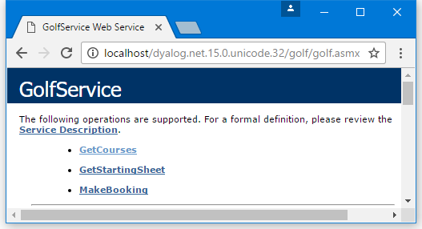{ #golfb1 }

[](#golfb2) shows the result of clicking on **GetCourses**, thereby accessing the `GetCourses` method. The data type of the result is `ArrayOfGolfCourse`, and the data type of each element of the result is `GolfCourse`. The public fields defined for the `GolfCourse` object are clearly named. All this information is derived from the declarations in the **Golf.asmx** script. The `GolfData` component file contains only three golf courses.

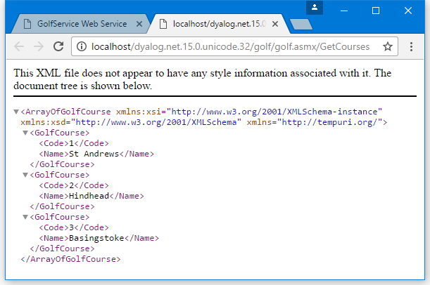{ #golfb2 }

[](#golfb3) shows the result of clicking on **MakeBooking**, thereby accessing the `MakeBooking` method.

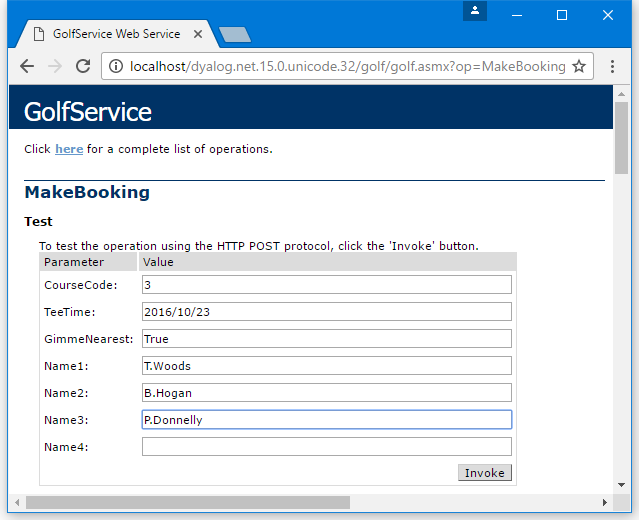{ #golfb3 }

ASP.NET generates a form containing fields that allow the user to invoke the `MakeBooking` method. Notice the way a `TeeTime` value is specified. The `GimmeNearest` parameter is Boolean, so you must enter `True` or `False` – if you enter `0` or `1`, an error is generated and the application does not try to call `MakeBooking`.

When experimenting with adding values to this form, the date entered must be within the next 30 days from today's system date, and the time must be between 07:00 and 15:00 (unless you want to experiment with invalid data to check the error handling).

[](#golfb4) shows the result of invoking `MakeBooking` with this data. All the information about the `Booking` object structure, including the structure of the sub-objects, is provided.

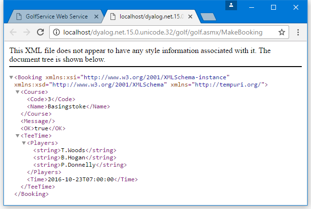{ #golfb4 }

[](#golfb5) shows the result of clicking on **GetStartingSheet**, thereby accessing the `GetStartingSheet` method.

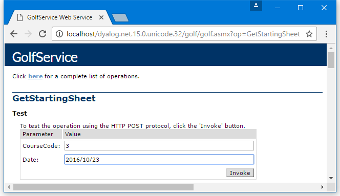{ #golfb5 }

When experimenting with adding values to this form, choose a course and date on which you have made at least one successful booking.

[](#golfb6) shows the result of invoking `GetStartingSheet` with this data. This shows that the result, a `StartingSheet` object, contains an array of `Slot` objects, each of which contains a `Time` field and a `Players` field.

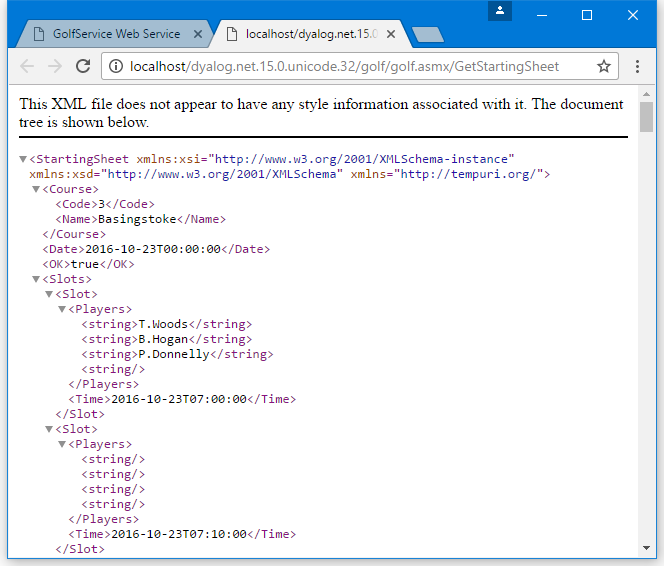{ #golfb6 }

### Using from C&#35;

The **csharp** sub-directory in **[DYALOG]\Samples\asp.net\golf** contains sample files for accessing the <code class="language-nonAPL">GolfService</code> web service from C#. The C# source code in **Golf.cs** is:
```nonAPL
using System;

class MainClass  {

	static void Main(String[] args)
		{
		GolfService golf = new GolfService();
		int nArgs = args.Length;
		Booking booking;

		booking=golf.MakeBooking(
/* Course Code 	  */	1,
/* Desired Tee Time */	DateTime.Parse(args[0]),
/* nearest is OK    */	true,
/* player 1		  */	(nArgs > 1) ? args[1] : "",
/* player 2		  */	(nArgs > 2) ? args[2] : "",
/* player 3		  */	(nArgs > 3) ? args[3] : "",
/* player 4		  */	(nArgs > 4) ? args[4] : ""
			);

		Console.WriteLine(booking.OK);
		Console.WriteLine(booking.TeeTime.Time.ToString());
		foreach (String player in booking.TeeTime.Players)
			Console.WriteLine(player);
		}
}

```

The C# program **[DYALOG]\Samples\asp.net\golf\golf.exe** can be run from a command prompt window. For example:
```nonAPL
csharp>golf 2006-08-07T08:00:00 T.Woods A.Palmer P.Donnelly
True
25/08/2008 08:00:00
T.Woods
A.Palmer
P.Donnelly

csharp>
```

## Sample: EG2

This sample is supplied in **[DYALOG]\Samples\asp.net\webservices\eg2.asmx**, which is mapped through an IIS virtual directory to the URL [http://localhost/dyalog.net/webservices/eg2.asmx](http://localhost/dyalog.net/webservices/eg2.asmx).

In other previous webservice samples ([EG1](#sample-eg1), [LoanService](#sample-loanservice), and [Golfservice](#sample-golfservice)), ASP.NET compiled the APL source file into a .NET class prior to running it. This sample illustrates how you can make a .NET class yourself. In this sample, the web service script is reduced to a single statement that invokes the pre-defined class `APLServices.Example`; the entire file, viewed using Notepad, is shown in [](#eg2notepad).

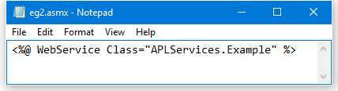{ #eg2notepad }

Given this instruction, ASP.NET will locate the `APLServices.Example` web service by searching the **bin** sub-directory for assemblies. Therefore, to make this work, we need to create a .NET assembly in **[DYALOG]\Samples\asp.net\webservices\bin**. The assembly should contain a .NET namespace named <code class="language-nonAPL">APLServices</code>, which in turn defines a class named <code class="language-nonAPL">Example</code>.

The procedure for creating .NET classes and assemblies in Dyalog was described in [Writing .NET Classes](../../writing-dotnet-classes/) and its sub-sections. The same procedure is performed to make a web service class.

**[DYALOG]\Samples\asp.net\webservices\bin** already contains copies of the dependent Dyalog DLLs that are required to execute the code.

To be able to create an assembly, Dyalog must be started with administration privileges (right-click on the Dyalog icon, and select **Run as administrator**).

In a clear workspace, create a namespace called `APLServices`. This will act as the container corresponding to a .NET namespace in the assembly.
```apl
      )NS APLServices
#.APLServices
```

Within `APLServices`, create a class called `Example` that inherits from <code class="language-nonAPL">System.Web.Services.WebService</code>. This is the web service class.
```apl
      )CS APLServices
#.APLServices
      )ED ○Example

:Class Example: WebService                        
:Using System                                     
:Using System.Web.Services,System.Web.Services.dll
    ∇ R←Add arg                                   
      :Access webmethod                           
      :Signature Int32←Add Int32 arg1, Int32 arg2 
      R←+/arg                                     
    ∇                                             
:EndClass                             
```

Within `APLServices.Example`, the function called `Add` represents the single method to be exported by this web service.

Fix the class, then click **File** > **Save As...** in the menu and save the workspace as **egs.dws** in **[DYALOG]\Samples\asp.net\webservices\bin**.

Select **File** > **Export...** in the  menu, and save the assembly as **eg2.dll** in the same directory.

When you click **Save**, the **Status** window displays the information shown in [](#eg2status) to confirm that the assembly has been created correctly.

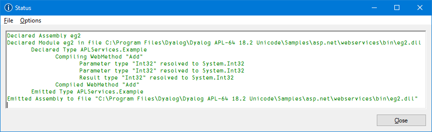{ #eg2status }

### Testing from a Browser

In your prefered browser, navigate to [http://localhost/dyalog.net.15.0.unicode.32/webservices/eg2.asmx](http://localhost/dyalog.net.15.0.unicode.32/webservices/eg2.asmx). The page fabricated by ASP.NET is shown in [](#eg2b1).

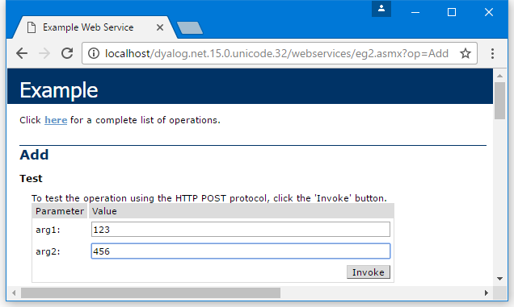{ #eg2b1 }

This shows that the web service is called `Example`, and that it exports a single method called `Add` which takes two parameters called `arg1` and `arg2`.

[](#eg2b1) shows the result of entering the values _123_ and _456_ into the form fields and then pressing the **Invoke** button. The method returns an `int` value of _579_.

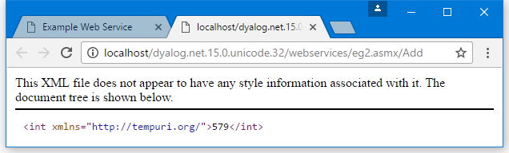{ #eg2b2 }
