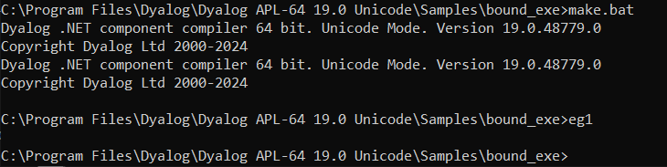
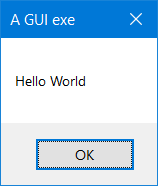
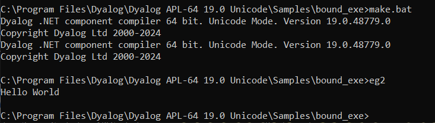

# <span class="name">APL Source Files</span> {: .heading}

APL Source files contain definitions (the "source") of one or more named APL objects, that is, functions, operators, namespaces, classes, interfaces and arrays. They cannot contain anything else. They are not workspace-oriented (although you can call workspaces from them) but are simply character files containing function bodies and expressions. This means that they would be valid right arguments to `2 ⎕FIX`.

APL Source files employ Unicode encoding, so you need a Unicode font with APL symbols, such as APL385 Unicode, to create or view them. They can be viewed and edited using any character-based editor that supports Unicode text files.

!!! windows "Dyalog on Microsoft Windows"
    To enter Dyalog APL symbols into an APL Source file, you need the Dyalog Input Method Editor (IME) or other APL compatible keyboard. The Dyalog IME can be configured from the **Dyalog Configuration** dialog box. You can change the associated **.DIN** file or there are various other options. APL Source files can also be edited using Microsoft Word, although they must be saved as text files without any Word formatting.

APL Source files can be identified by the **.apl** file extension. This can either specify .NET classes or represent an APL application in a text source format (as opposed to a workspace format). Such applications do not necessarily require .NET. The **.apl** file extension can, optionally, be further categorised. For example:

- **.apla** files contain array definitions
- **.aplc** files contain class definitions
- **.aplf** files contain function definitions
- **.apli** files contain interface definitions
- **.apln** files contain namespace definitions
- **.aplo** files contain operator definitions

## The Dyalog .NET Compiler

APL Source files are compiled into executable code by the Dyalog .NET Compiler, which is called **dyalogc.exe**.

!!! Info "Information"
    By default, **dyalogc.exe** compiles to .NET. If the `-framework` option is set, it will instead compile to .NET Framework.
	
!!! Legacy "Legacy"
    For backwards compatibility, the Dyalog .NET Compiler is also distributed on Microsoft Windows with the names identified in the table below.
        
    |&nbsp;|Unicode Edition      |Classic Edition|
    |------|---------------------|---------------|
    |32-Bit| **dyalogc_unicode.exe**   | **dyalogc.exe**    |
    |64-Bit| **dyalogc64_unicode.exe** | **dyalogc64.exe** |

The Dyalog .NET Compiler can be used to:

- compile APL Source files into a workspace (**.dws**) – this can subsequently be run using **dyalog.exe** or **dyalogrt.exe**.
- compile APL Source files into a .NET class (**.dll**) – this can subsequently be used by any other .NET-compatible host language, such as C#.

The script is designed to be run from a command prompt. Navigate to the appropriate directory and type <code class="language-nonAPL">dyalogc /?</code> to query its usage; the following output is displayed (the output displayed here is for Microsoft Windows; the command line options are not all applicable on other platforms):
```nonAPL
c:/Program Files/Dyalog/Dyalog APL-64 19.0 Unicode>dyalogc /?
Dyalog .NET Compiler 64 bit. Unicode Mode. Version 19.0.48745.0
Copyright Dyalog Ltd 2000-2024

dyalogc.exe command line options:

-?                      Usage
-r:<file>               Add reference to assembly
-o[ut]:<file>           Output file name
-res:<file>             Add resource to output file
-icon:<file>            File containing main program icon
-q                      Operate quietly
-v                      Verbose
-v2                     More verbose
-s                      Treat warnings as errors
-nonet                  Creates a binary that does not use Microsoft .NET
-net                    Creates a binary that targets .NET Version >=5
-framework              Creates a binary that targets .NET Framework
-runtime                Build a non-debuggable binary
-t:library              Build .NET library (.dll)
-t:workspace            Build dyalog workspace (.dws)
-t:nativeexe            (Windows only) Build native executable (.exe). Default
-t:standalonenativeexe  (Windows only) Build native executable (.exe). Default
-lx:<text>              (Windows only) Specify entry point (Latent Expression)
-cmdline:<text>         Specify a command line to pass to the interpreter
-nomessages             (.NET Framework only) Process does not use windows messages. Use when creating a process to run under IIS  
-console|c              Creates a console application
-multihost              Support multi-hosted interpreters
-unicode                Creates an application that runs in a Unicode interpreter
-wx:[0|1|3]             Sets ⎕WX for default code
-a:file                 (.NET Framework only) Specifies a JSON file containing attributes to be attached to the binary
-i:Process              (.NET Framework only) Set the isolation mode of a .NET Assembly
-i:Assembly             (.NET Framework only) Set the isolation mode of a .NET Assembly
-i:AppDomain            (.NET Framework only) Set the isolation mode of a .NET Assembly
-i:Local                (.NET Framework only) Set the isolation mode of a .NET Assembly
```

!!! windows "Dyalog on Microsoft Windows"
    The <code class="language-nonAPL">-a</code> option specifies the name of a JSON file that contains assembly information. For example:
    ```nonAPL
    dyalogc.exe -t:library j:/ws/attributetest.dws -a:c:/tmp/atts.json
    ```
    where <code class="language-nonAPL">c:/tmp/atts.json</code> contains:
    ```
    {
    "AssemblyVersion":"1.2.2.2",
    "AssemblyFileVersion":"2.1.1.4",
    "AssemblyProduct":"My Application",
    "AssemblyCompany":"My Company",
    "AssemblyCopyright":"Copyright 2020",
    "AssemblyDescription":"Provides a text description for an assembly.",
    "AssemblyTitle":"My Assembly Title",
    "AssemblyTrademark":"Your Legal Trademarks",
    }
    ```

## Creating an APL Source File

Conceptually, the simplest way to create an APL Source file is with a text editor, although you can use many other tools, for example, Microsoft Visual Studio. It is important to ensure that the file is saved with the [appropriate file extension](apl-source-files.md)).

## Copying Code from the Dyalog  Session

You might find it easy to write APL code using the Dyalog Session's function/class editor, or you might already have code in a workspace that you want to copy into an APL Source file. In either case, you can transfer code from the Session into an appropriate text editor using the clipboard.

When pasting APL code from the Session into a text editor, line numbers can be included; although this is allowed, it is not recommended in APL Source files.

## General Principles of APL Source Files

The layout of an APL Source file differs according to what it defines. However, within the APL Source file, the code layout rules are basically the same.

An APL Source file contains a sequence of function bodies and executable statements that assign values to variables. In addition, the file typically contains statements that are directives to the Dyalog .NET Compiler. These all start with a colon symbol (`:`) in the manner of control structures. For example, the `:Namespace` statement tells the Dyalog .NET Compiler to create, and change into, a new namespace. The `:EndNamespace` statement terminates the definition of the contents of a namespace and changes back from whence it came.

Assignment statements are used to configure system variables, such as [⎕ML](../../language-reference-guide/system-functions/ml/), [`⎕IO`](../../language-reference-guide/system-functions/io/), [`⎕USING`](../../language-reference-guide/system-functions/using/), and arbitrary APL variables. For example:
```apl
      ⎕ML←2
      ⎕IO←0
      ⎕USING∪←⊂'System.Data'

      A←88
      B←'Hello World'

      ⎕CY'MYWS'
```

These statements are extracted from the APL Source file and executed by the Dyalog .NET Compiler in the order in which they appear.

!!! Info "Information"
    The statements are executed at compile time, and not at run-time, and can, therefore, only be used for initialisation.

It is acceptable to execute [`⎕CY`](../../language-reference-guide/system-functions/cy/) to bring functions and variables that are to be incorporated into the code in from a workspace. This is especially useful to import a set of utilities. It is also possible to export these functions as methods of .NET classes if the functions contain the appropriate colon statements.

The Dyalog .NET Compiler will execute any valid APL expression that you include. However, the results might not be useful and could terminate the compiler. For example, it is not sensible to execute statements such as [`⎕LOAD`](../../language-reference-guide/system-functions/load/) or [`⎕OFF`](../../language-reference-guide/system-functions/off/).

Function bodies are defined between opening and closing del (`∇`) characters. These are fixed by the Dyalog .NET Compiler using `⎕FX`. Line numbers and white space formatting are ignored.

## Creating Programs (.exe) with APL Source Files

!!! windows "Dyalog on Microsoft Windows"
    This section is specific to the Microsoft Windows operating system only.

The following examples, which illustrate how you can create an executable program (**.exe**) directly from an APL Source file, can be found in the **[DYALOG]/Samples/bound_exe** directory. The examples require write access to successfully build the samples, therefore Dyalog Ltd recommends copying the **[DYALOG]/Samples/bound_exe** directory to somewhere you have write access.

<h4 class="example">Example: Simple GUI</h4>

The **eg1.apln** APL Source file illustrates the simplest possible GUI application that displays a message box containing the string "Hello World":
```apl
:Namespace N
⎕LX←'N.RUN' 
∇RUN;M 
'M'⎕WC'MsgBox' 'A GUI exe' 'Hello World'
⎕DQ'M' 
∇ 
:EndNamespace
```

The code must be contained within `:NameSpace` and `:EndNamespace` statements, and must define a [`⎕LX`](../../language-reference-guide/system-functions/lx/) either within the APL Source file itself or as a parameter to the <code class="language-nonAPL">dyalogc</code> command. In this example, `⎕LX` is defined within the APL Source file.

This is compiled to a Windows executable (**.exe**) using **make.bat** and run from the same command window.





The resulting executable can be associated with a desktop icon, and will run without a command prompt window. Any default APL output that would normally be displayed in the session window will be ignored.

<h4 class="example">Example: Simple Console</h4>

The **eg2.apln** APL Source file illustrates the simplest possible application that displays the text "Hello World".:
```apl
:Namespace N
⎕LX←'N.RUN'
∇RUN
'Hello World'
∇
:EndNamespace
```

The code must be contained within `:NameSpace` and `:EndNamespace` statements, and must define a `⎕LX` either in the APL Source file itself or as a parameter to the <code class="language-nonAPL">dyalogc</code> command. In this example, `⎕LX` is defined within the APL Source file.

This is compiled to a Windows executable (**.exe**) using **make.bat** and run from the same command window. The `/console` flag in **make.bat** instructs the Dyalog .NET Compiler to create a console application that runs from a command prompt. In this case, default APL output that would normally be displayed in the Session window is instead displayed in the command window from which the program was run.



### Defining Namespaces

At least one namespace must be specified in an APL Source file. Namespaces are specified in an APL Source file using the `:Namespace` and `:EndNamespace` statements. Although you can use [`⎕NS`](../../language-reference-guide/system-functions/ns/) and [`⎕CS`](../../language-reference-guide/system-functions/cs/) within functions inside an APL Source file, you should not use these system functions outside function bodies; such use is not prevented, but the results will be unpredictable.

`:Namespace Name` introduces a new namespace  relative to the current namespace called `Name`.

`:EndNamespace` terminates the definition of the current namespace. Subsequent statements and function bodies are processed in the context of the original space.

All functions specified between the `:Namespace` and `:EndNamespace` statements are fixed within that namespace. Similarly, all assignments define variables inside that namespace.
