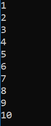
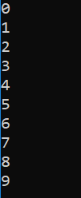
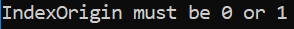
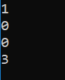
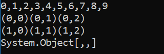

<h1 class="heading"><span class="name">Tutorial</span></h1>

All the examples in this tutorial are to be executed as simple console applications written in C#.

The code for all of the examples is provided in the **[DYALOG]/Samples/aplclasses/** directory:

- **aplclassesN/aplclassesN.dws** – workspaces containing the source code for the Dyalog classes

- **aplclassesN/net/project/Program.cs** – the corresponding C# source code for hosting the Dyalog classes.

Each workspace contains a .NET namespace called <code class="language-nonAPL">APLClasses</code> which itself contains a single .NET class called <code class="language-nonAPL">Primitives</code> that exports a single method called <code class="language-nonAPL">IndexGen</code>. When executing each example, the workspace (**aplclassesN.dws** will be exported to the **/net/project/bin/Debug/net8.0** sub‑directory as a .NET assembly called **aplclassesN.dll**.

!!! Info "Information"
    The examples in the tutorial require write access to successfully build the samples. Dyalog Ltd recommends copying the **[DYALOG]/Samples/aplclasses** directory to somewhere you have write access; in this tutorial that location will be identified as __&lt;your_dir&gt;__.

To compile the C# source code

1. On the command line, navigate to **&lt;your_dir&gt;/aplclassesN/net**.
2. Run **build** (Linux and macOS)/**build.bat** (Microsoft Windows).This invokes the Dyalog script compiler to compile **aplclassesN.dws** to **aplclassesN.dll**, and then invokes the C# compiler to compile the C# source code (**Program.cs**) to produce an executable called **project.exe** in **&lt;your_dir&gt;/aplclassesN/net/project/bin/Debug/net8.0**.

## Example 1

As write access is required to successfully build the samples, this example assumes that you have copied the **[DYALOG]/Samples/aplclasses** directory to __&lt;your_dir&gt;__, where you have write access.

Load the **aplclasses1.dws** workspace from **&lt;your_dir&gt;/aplclasses1**, then view the `Primitives` class:
```apl
      )ED APLClasses.Primitives
:Class Primitives
:using System
∇R←IndexGen N
:access public
:signature Int32[]←IndexGen Int32
R←⍳N
∇
:EndClass ⍝ Primitives
```

`Primitives` contains one public method/function, called `IndexGen`.

The public characteristics for the exported method are included in the definition of the class and its functions, as specified in the [`:Signature`](../../../programming-reference-guide/defined-functions-and-operators/traditional-functions-and-operators/function-declaration-statements/signature/) statement. This has the following syntax:
```apl
:Signature [rslttype←] name [arg1type [arg1name] [,argNtype [argNname]]*]
```

where:

- `rslttype` is the type of the result returned by the function – in this example, the function returns an array of 32-bit integers.
- `name` is the exported name (it can be different from the APL function name but it must be provided) – in the example, the name of the exported method is `IndexGen`.
- `argNtype [argNname]` are any arguments are to be supplied, each type-name pair separated from the next by a comma. In this example, the function takes a single integer as its argument.

When the class is fixed, APL will try to find the .NET data types that have been specified for the result and for the parameters. If one or more of the data types are not recognised as available .NET types, then a warning will be displayed in the status window and APL will not fix the class. If you see such a warning, you might have entered an incorrect data type name, not set `:using` correctly, or some other syntax problem has been detected (for example, the function could be missing a terminating `∇`). In this example, the only data type used is <code class="language-nonAPL">System.Int32</code>; as `:using System` is included in the definition, <code class="language-nonAPL">Int32</code> is correctly located.

!!! Legacy "Legacy"
    In earlier versions of Dyalog, the statements `:Returns` and `:ParameterList` were used instead of `:Signature`. They are still accepted for backwards compatibility reasons, but are considered deprecated.
	
### aplclasses1

The C# source code (**&lt;your_dir&gt;/aplclasses1/net/project/Program.cs**) can be used to call the Dyalog.NET class. The <code class="language-nonAPL">using</code> statements specify the names of .NET namespaces to be searched for unqualified class names. The program creates an object called <code class="language-nonAPL">apl</code> of type <code class="language-nonAPL">Primitives</code> by calling the <code class="language-nonAPL">new</code> operator on that class. Then it calls the <code class="language-nonAPL">IndexGen</code> method with a parameter of <code class="language-nonAPL">10</code>.
```nonAPL
      using System;
      using APLClasses;
      public class MainClass
          {
          public static void Main()
              {
                  Primitives apl = new Primitives();
                  int[] rslt = apl.IndexGen(10);
                  for (int i=0;i<rslt.Length;i++)
                  Console.WriteLine(rslt[i]);
              }
          }
```

To compile the C# source code:

1. On the command line, navigate to **&lt;your_dir&gt;/aplclasses1/net**.
2. Run **build** (Linux and macOS)/**build.bat** (Microsoft Windows).This invokes the Dyalog script compiler to compile **aplclasses1.dws** to **aplclasses1.dll**, and then invokes the C# compiler to compile the C# source code (**Program.cs**) to produce an executable called **project.exe** in **&lt;your_dir&gt;/aplclasses1/net/project/bin/Debug/net8.0**.

The output when the program is run is displayed in a console window:



## Example 2

As write access is required to successfully build the samples, this example assumes that you have copied the **[DYALOG]/Samples/aplclasses** directory to __&lt;your_dir&gt;__, where you have write access.

In [Example 1](#example-1), APL supplied a default constructor, which was used to create an instance of the Primitives class. It was inherited from the base class (`System.Object`) and called without arguments. This example extends that by adding a constructor that specifies the value of `⎕IO`.

Load the **aplclasses2.dws** workspace from **&lt;your_dir&gt;/aplclasses2**, then view the `Primitives` class:
```apl
      ↑⎕SRC APLClasses.Primitives
:Class Primitives                      
:Using System                          
                                       
    ∇ CTOR IO                          
      :Implements constructor          
      :Access public                   
      :Signature CTOR Int32 IO         
      ⎕IO←IO                           
    ∇                                  
                                       
    ∇ R←IndexGen N                     
      :Access public                   
      :Signature Int32[]←IndexGen Int32
      R←⍳N                             
    ∇                                  
                                       
:EndClass ⍝ Primitives                 

```

This version of `Primitives` contains a constructor function called `CTOR` which sets `⎕IO` to the value of its argument. The name of this function is arbitrary.

### aplclasses2

The C# source code (**&lt;your_dir&gt;/aplclasses2/net/project/Program.cs**) can be used to call the new version of the Dyalog .NET class:
```nonAPL
      using System;
      using APLClasses;
      public class MainClass
            {
            public static void Main()
                  {
                  Primitives apl = new Primitives(0);
                  int[] rslt = apl.IndexGen(10);

                  for (int i=0;i<rslt.Length;i++)
                  Console.WriteLine(rslt[i]);
                  }
            }
```

The program is the same as in [Example 1](#example-1), except that the code that creates an instance of the <code class="language-nonAPL">Primitives</code> class now specifies an argument; in this example, <code class="language-nonAPL">0</code>.

To compile the C# source code:

1. On the command line, navigate to **&lt;your_dir&gt;/aplclasses2/net**.
2. Run **build** (Linux and macOS)/**build.bat** (Microsoft Windows).This invokes the Dyalog script compiler to compile **aplclasses2.dws** to **aplclasses2.dll**, and then invokes the C# compiler to compile the C# source code (**Program.cs**) to produce an executable called **project.exe** in **&lt;your_dir&gt;/aplclasses2/net/project/bin/Debug/net8.0**.

The output when the program is run is displayed in a console window: – the amended line numbers show the effect of changing the index origin from 1 (the default) to 0.



## Example 3

As write access is required to successfully build the samples, this example assumes that you have copied the **[DYALOG]/Samples/aplclasses** directory to __&lt;your_dir&gt;__, where you have write access.

The correct .NET behaviour when an APL function fails with an error is to generate an exception; this example shows how this is achieved.

In .NET, exceptions are implemented as .NET classes. The base exception is implemented by the <code class="language-nonAPL">System.Exception</code> class, but there are a number of super classes, such as <code class="language-nonAPL">System.ArgumentException</code> and <code class="language-nonAPL">System.ArithmeticException</code> that inherit from it.

`⎕SIGNAL` can be used to generate an exception. To do this, its right argument should be `90` and its left argument should be an object of type <code class="language-nonAPL">System.Exception</code> or an object that inherits from <code class="language-nonAPL">System.Exception</code>.

When you create the instance of the <code class="language-nonAPL">Exception</code> class, you can specify a string (which will be its <code class="language-nonAPL">Message</code> property) containing information about the error.

Load the **aplclasses3.dws** workspace from **&lt;your_dir&gt;/aplclasses3**, then view its improved (compared with that in [Example 2](#example-2)) `CTOR` constructor function:
```apl
     ∇ CTOR IO;EX
[1]   :Implements constructor
[2]   :Access public
[3]   :Signature CTOR Int32 IO
[4]   :If IO∊0 1
[5]     ⎕IO←IO
[6]   :Else
[7]      EX←⎕NEW ArgumentException,⊂⊂'IndexOrigin must be 0 or 1'
[8]      EX ⎕SIGNAL 90
[9]   :EndIf
     ∇

```

### aplclasses3

The C# source code (**&lt;your_dir&gt;/aplclasses3/net/project/Program.cs**) contains code to catch the exception and display the exception message:
```nonAPL
using System;
using APLClasses;
public class MainClass
    {
    public static void Main()
        {
try
    {
        Primitives apl = new Primitives(2);
        int[] rslt = apl.IndexGen(10);

        for (int i=0;i<rslt.Length;i++)
        Console.WriteLine(rslt[i]);
}
catch (Exception e)
    {
    Console.WriteLine(e.Message);
    }
        }
    }	
```

To compile the C# source code:

1. On the command line, navigate to **&lt;your_dir&gt;/aplclasses3/net**.
2. Run **build** (Linux and macOS)/**build.bat** (Microsoft Windows).This invokes the Dyalog script compiler to compile **aplclasses3.dws** to **aplclasses3.dll**, and then invokes the C# compiler to compile the C# source code (**Program.cs**) to produce an executable called **project.exe** in **&lt;your_dir&gt;/aplclasses3/net/project/bin/Debug/net8.0**.

The output when the program is run is displayed in a console window:



## Example 4

As write access is required to successfully build the samples, this example assumes that you have copied the **[DYALOG]/Samples/aplclasses** directory to __&lt;your_dir&gt;__, where you have write access.

This example builds on [Example 3](#example-3), and illustrates how you can implement constructor overloading by establishing several different constructor functions.

For this example, when a client application creates an instance of the <code class="language-nonAPL">Primitives</code> class, is should be able to specify either the value of `⎕IO` or the values of both `⎕IO` and `⎕ML`. The simplest way to implement this is to have two public constructor functions, `CTOR1` and `CTOR2`, which call a private constructor function, `CTOR`.

Load the **aplclasses4.dws** workspace from **&lt;your_dir&gt;/aplclasses4**; the new version of the `Primitives` class includes the following additions:
```apl

     ∇ CTOR1 IO
[1]    :Implements constructor
[2]    :Access public
[3]    :Signature CTOR1 Int32 IO
[4]    CTOR IO 0
     ∇

     ∇ CTOR2 IOML
[1]    :Implements constructor
[2]    :Access public
[3]    :Signature CTOR2 Int32 IO,Int32 ML
[4]    CTOR IOML
     ∇

     ∇ CTOR IOML;EX
[1]    IO ML←IOML
[2]    :If ~IO∊0 1
[3]        EX←⎕NEW ArgumentException,⊂⊂'IndexOrigin must be 0 or 1'
[4]        EX ⎕SIGNAL 90
[5]    :EndIf
[6]    :If ~ML∊0 1 2 3
[7]        EX←⎕NEW ArgumentException,⊂⊂'MigrationLevel must be 0, 1, 2 or 3'
[8]        EX ⎕SIGNAL 90
[9]    :EndIf
[10]   ⎕IO ⎕ML←IO ML
     ∇ 
```

The `:Signature` statements for these three functions show that `CTOR1` is defined as a constructor that takes a single <code class="language-nonAPL">Int32</code> parameter and `CTOR2` is defined as a constructor that takes two <code class="language-nonAPL">Int32</code> parameters; `CTOR` has no .NET properties defined. In .NET terminology, `CTOR` is not a _private constructor_ but rather an internal function that is invisible to the outside world.

Next, a function called `GetIOML` is defined and exported as a public method. This function returns the current values of `⎕IO` and `⎕ML`:
```apl
     ∇ r←GetIOML
[1]   :access public
[2]   :signature Int32[]←GetIOML
[3]   r←⎕IO ⎕ML
     ∇
```

### aplclasses4

The C# source code (**&lt;your_dir&gt;/aplclasses4/net/project/Program.cs**) contains code to invoke the two different constructor functions `CTOR1` and `CTOR2`:
```nonAPL
using System;
using APLClasses;
public class MainClass
	{
	public static void Main()
		{
		Primitives apl10 = new Primitives(1);
		int[] rslt10 = apl10.GetIOML();
		for (int i=0;i<rslt10.Length;i++)
			Console.WriteLine(rslt10[i]);

		Primitives apl03 = new Primitives(0,3);
		int[] rslt03 = apl03.GetIOML();
		for (int i=0;i<rslt03.Length;i++)
			Console.WriteLine(rslt03[i]);
		}
	}
```

This code creates two instances of the <code class="language-nonAPL">Primitives</code> class called <code class="language-nonAPL">apl10</code> and <code class="language-nonAPL">apl03</code>; the first is created with a constructor parameter of <code class="language-nonAPL">(1)</code>, and the second with two constructor parameters <code class="language-nonAPL">(0,3)</code>.

The C# compiler matches the first call with `CTOR1`, because `CTOR1` is defined to accept a single <code class="language-nonAPL">Int32</code> parameter. The second call is matched to `CTOR2`, because `CTOR2` is defined to accept two <code class="language-nonAPL">Int32</code> parameters.

To compile the C# source code:

1. On the command line, navigate to **&lt;your_dir&gt;/aplclasses4/net**.
2. Run **build** (Linux and macOS)/**build.bat** (Microsoft Windows).This invokes the Dyalog script compiler to compile **aplclasses4.dws** to **aplclasses4.dll**, and then invokes the C# compiler to compile the C# source code (**Program.cs**) to produce an executable called **project.exe** in **&lt;your_dir&gt;/aplclasses4/net/project/bin/Debug/net8.0**.

The output when the program is run is displayed in a console window:



## Example 5

As write access is required to successfully build the samples, this example assumes that you have copied the **[DYALOG]/Samples/aplclasses** directory to __&lt;your_dir&gt;__, where you have write access.

This example builds on [Example 4](#example-4), and illustrates how you can implement method overloading.

In this example, the requirement is to export three different versions of the `IndexGen` method; one that takes a single number as an argument, one that takes two numbers, and a third that takes any number of numbers. These are represented by three functions called `IndexGen1`, `IndexGen2` and `IndexGen3` respectively. The _index generator_ function (monadic `⍳`) performs all of these operations, therefore the three APL functions are identical. However, their public interfaces, as defined in their `:Signature` statement, are all different. The overloading is achieved by entering the same name for the exported method (`IndexGen`) for each of the three APL functions.

Load the **aplclasses5.dws** workspace from **&lt;your_dir&gt;/aplclasses5**; the new version of the `Primitives` class includes three different versions of `IndexGen`. The first is the version we have seen before, which is defined to take a single argument of type <code class="language-nonAPL">Int32</code> and to return a 1-dimensional array (vector) of type <code class="language-nonAPL">Int32</code>:
```apl
     ∇ R←IndexGen1 N
[1]   :Access public
[2]   :Signature Int32[]←IndexGen Int32 N
[3]    R←⍳N
     ∇
```

The second version is defined to take two arguments of type <code class="language-nonAPL">Int32</code> and to return a 2‑dimensional array, each of whose elements is a 1-dimensional array (vector) of type <code class="language-nonAPL">Int32</code>:
```apl
     ∇ R←IndexGen2 N
[1]   :Access public
[2]   :Signature Int32[][,]←IndexGen Int32 N1, Int32 N2
[3]    R←⍳N
     ∇
```

Although we could define seven more different versions of the method, taking 3, 4, 5 (and so on) numeric parameters, instead this method is defined more generally to take a single parameter that is a 1-dimemsional array (vector) of numbers, and to return a result of type <code class="language-nonAPL">Array</code>. In practice we might use this version alone, but for a C# programmer, this is harder to use than the two other specific cases:
```apl
     ∇ R←IndexGen3 N
[1]   :Access public
[2]   :Signature Array←IndexGen Int32[] N
[3]   R←⍳N
     ∇
```

All these functions use the same descriptive name, `IndexGen`.

!!! Info "Information"
    A function can have several `:Signature` statements. As the three functions perform exactly the same operation, we could replace them with a single function:
    ```apl
         ∇ R←IndexGen1 N
    [1]   :Access public
    [2]   :Signature Int32[]←IndexGen Int32 N
    [3]   :Signature Int32[][,]←IndexGen Int32 N1, Int32 N2
    [4]   :Signature Array←IndexGen Int32[] N
    [5]    R←⍳N
         ∇
    ```

### aplclasses5

The C# source code (**&lt;your_dir&gt;/aplclasses5/net/project/Program.cs**) contains code to invoke the three different variants of <code class="language-nonAPL">IndexGen</code> in the new **aplclasses.dll**. It uses a local sub-routine <code class="language-nonAPL">PrintArray()</code>:
```nonAPL
      using System;
      using APLClasses;
      public class MainClass
            {
            static void PrintArray(int[] arr)
            {
                  for (int i=0;i<arr.Length;i++)
                      {
                      Console.Write(arr[i]);
                      if (i!=arr.Length-1)
                         Console.Write(",");
                      }
            }
            
            public static void Main()
                  {
                  Primitives apl = new Primitives(0);
                  int[] rslt = apl.IndexGen(10);
                  PrintArray(rslt);
                  Console.WriteLine("");
                  int[,][] rslt2 = apl.IndexGen(2,3);

                  for (int i=0;i<2;i++)
                           {
                           for (int j=0;j<3;j++)
                                    {
                                    int[] row = rslt2[i,j];
                                    Console.Write("(");
                                    PrintArray(row);
                                    Console.Write(")");
                                    }
                  Console.WriteLine("");
                           }

                  int[] args = new int[3];
                  args[0]=2;
                  args[1]=3;
                  args[2]=4;
                  Array rslt3 = apl.IndexGen(args);
                  Console.WriteLine(rslt3);

            }

```

To compile the C# source code:

1. On the command line, navigate to **&lt;your_dir&gt;/aplclasses5/net**.
2. Run **build** (Linux and macOS)/**build.bat** (Microsoft Windows).This invokes the Dyalog script compiler to compile **aplclasses5.dws** to **aplclasses5.dll**, and then invokes the C# compiler to compile the C# source code (**Program.cs**) to produce an executable called **project.exe** in **&lt;your_dir&gt;/aplclasses5/net/project/bin/Debug/net8.0**.

The output when the program is run is displayed in a console window:


