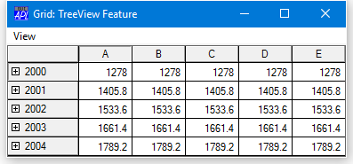
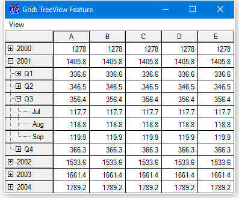
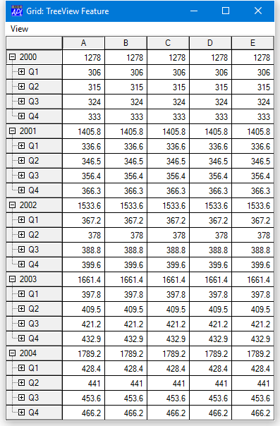
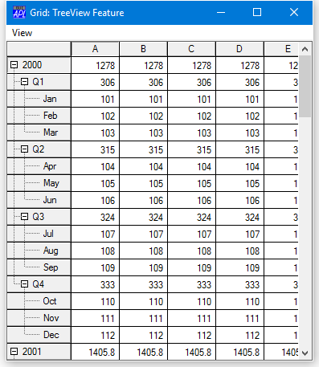

# <span class="name">TreeView Feature</span> {: .heading}

## Introduction

The Grid can display a *TreeView like* interface in the row titles and automatically shows and hides row of data as the user expands and contracts nodes of the tree.

## RowTreeDepth property

The tree structure is specified by the RowTreeDepth property.  This is either a scalar 0 or an integer vector of the same length as the number of rows in the grid. RowTreeDepth is similar to the Depth property of the TreeView object.

Each element of RowTreeDepth specifies the depth of the corresponding row of the Grid. A value of 0 indicates that the row is a top-level row. A value of 1 indicates that the corresponding row is a child of the most recent row whose RowTreeDepth is 0; a value of 2 indicates that the corresponding row is a child of the most recent row whose RowTreeDepth is 1, and so forth.

The picture below illustrates the initial appearance of a Grid with TreeView behaviour. Notice that at first only the top-level rows are displayed.



The tree structure is defined on `TreeGrid[26]`. In this example, the Grid has top-level rows (RowTreeDepth of 0) that contain annual totals. The second-tier rows (RowTreeDepth of 1), contain quarterly totals, while the third-tier rows (RowTreeDepth of 2) contain monthly figures.
```apl
     ∇ TreeGrid;SIZE;YR;YRS;DATA;MDATA;QDATA;YDATA;IX
[1]    SIZE←126 381
[2]    'F'⎕WC'Form' 'Grid: TreeView Feature'
                    ('Coord' 'Pixel')
[3]    F.Size←SIZE
[4]    'F.MB'⎕WC'MenuBar'
[5]    'F.MB.View'⎕WC'Menu' 'View'
[6]    'F.MB.View.Expand1'⎕WC'MenuItem' 'Expand Years'
[7]    'F.MB.View.Expand1'⎕WS'Event' 'Select'
                             '⍎F.G.RowSetVisibleDepth 1'
[8]    'F.MB.View.Expand2'⎕WC'MenuItem' 'Expand All'
[9]    'F.MB.View.Expand2'⎕WS'Event' 'Select'
                             '⍎F.G.RowSetVisibleDepth 2'
[10]   'F.MB.View.Collapse'⎕WC'MenuItem' 'Collapse All'
[11]   'F.MB.View.Collapse'⎕WS'Event' 'Select'
                              '⍎F.G.RowSetVisibleDepth 0'
[12]   'F.G'⎕WC'Grid'('Posn' 0 0)SIZE
[13]   F.G.(TitleWidth CellWidths←80 60)
[14]   YR←'Q1' 'Jan' 'Feb' 'Mar' 'Q2' 'Apr' 'May' 'Jun'
[15]   YR,←'Q3' 'Jul' 'Aug' 'Sep' 'Q4' 'Oct' 'Nov' 'Dec'
[16]   YRS←'2000' '2001' '2002' '2003' '2004'
[17]   F.G.RowTitles←⊃,/(⊂¨YRS),¨⊂YR
[18]   MDATA←12 5⍴5/100+⍳12
[19]   YDATA←+⌿MDATA
[20]   QDATA←(3+/[1]MDATA)[1 4 7 10;]
[21]   MDATA←((⍴YR)⍴0 1 1 1)⍀MDATA
[22]   MDATA[1 5 9 13;]←QDATA
[23]   YDATA←YDATA,[1]MDATA
[24]   DATA←⊃,[1]/1 1.1 1.2 1.3 1.4×⊂YDATA
[25]   F.G.Values←DATA
[26]   F.G.RowTreeDepth←(⍴F.G.RowTitles)⍴0,(⍴YR)⍴1 2 2 2
     ∇
```

When the user clicks on one of the nodes indicated by a "+" symbol, the Grid automatically expands to display the rows at the next level below that node. At the same time, an Expanding event is generated. In the next picture, the user has clicked on the *2001* node and, below that, the *Q3* node.



## RowSetVisibleDepth Method

The Grid provides a RowSetVisibleDepth method that provides *tier-level* control over which rows are displayed.

The value of its argument is an integer that specifies the depth of rows to be displayed. The Grid displays all rows whose RowTreeDepth values are less than or equal to this value. In the example, this method is called by items on the *View* menu.

The next picture shows how the Grid is displayed after choosing *Expand Years* from the *View* menu. Notice that, as specified by `TreeGrid[6]` this menu item simply executes the RowSetVisibleDepth method with an argument of 1.



Similarly, the *Expand All item*  executes RowSetVisibleDepth 2, as specified by `TreeGrid[7]` and this causes the Grid to display all rows up to and including RowTreeDepth of 2 as shown below.



Note that the *Collapse All* item executes RowSetVisibleDepth 0, which causes only the top-level rows to be displayed.

You may open specific nodes by invoking the Expanding event as a method.

Fine control over the appearance of the tree is provided through the RowTreeImages and RowTreeStyle properties. See Object Reference for further details.
