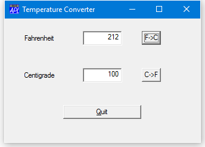

# <span class="name">Using NEW instead of WC</span> {: .heading}

From Version 11 onwards, it is possible to use `⎕NEW` to create Instances of the built-in GUI Classes. The following function illustrates this approach using the Temperature Converter example described previously.
```apl
     ∇ TempConv;TITLE;TEMP
[1]    TITLE←'Temperature Converter'
[2]    TEMP←⎕NEW'Form'(('Caption'TITLE)('Posn'(10 10))
                       ('Size'(30 40)))
[3]
[4]    TEMP.(MB←⎕NEW⊂'MenuBar')
[5]    TEMP.MB.(M←⎕NEW'Menu'(,⊂'Caption' '&Scale'))
[6]    TEMP.MB.M.(C←⎕NEW'MenuItem'
                 (('Caption' '&Centigrade')('Checked' 1)))
[7]    TEMP.MB.M.(F←⎕NEW'MenuItem'
                 (,⊂('Caption' '&Fahrenheit')))
[8]
[9]    TEMP.(LF←⎕NEW'Label'(('Caption' 'Fahrenheit')
                            ('Posn'(10 10))))
[10]   TEMP.(F←⎕NEW'Edit'(('Posn'(10 40))('Size'(⍬ 20))
                          ('FieldType' 'Numeric')))
[11]
[12]   TEMP.(LC←⎕NEW'Label'(('Caption' 'Centigrade')
                            ('Posn'(40 10))))
[13]   TEMP.(C←⎕NEW'Edit'(('Posn'(40 40))('Size'(⍬ 20))
                          ('FieldType' 'Numeric')))
[14]
[15]   TEMP.(F2C←⎕NEW'Button'(('Caption' 'F->C')
                             ('Posn'(10 70))('Default' 1)))
[16]   TEMP.(C2F←⎕NEW'Button'(('Caption' 'C->F')
                              ('Posn'(40 70))))
[17]   TEMP.(Q←⎕NEW'Button'(('Caption' '&Quit')
                            ('Posn'(70 30))('Size'(⍬ 40))
                            ('Cancel' 1)))
[18]
[19]   TEMP.(S←⎕NEW'Scroll'(⊂('Range' 101)))
[20]
[21]   TEMP.MB.M.C.onSelect←'SET_C'
[22]   TEMP.MB.M.F.onSelect←'SET_F'
[23]   TEMP.F2C.onSelect←'f2c'
[24]   TEMP.F.onGotFocus←'SET_DEF'
[25]   TEMP.C2F.onSelect←'c2f'
[26]   TEMP.C.onGotFocus←'SET_DEF'
[27]   TEMP.onClose←'QUIT'
[28]   TEMP.Q.onSelect←'QUIT'
[29]   TEMP.S.onScroll←'c2f_scroll'
[30]
[31]   ⎕DQ'TEMP'
     ∇
```

For brevity, only a couple of the callback functions are shown here.
```apl
     ∇ f2c
[1]    TEMP.C.Value←(TEMP.F.Value-32)×5÷9
     ∇
 
     ∇ c2f_scroll MSG
[1]   ⍝ Callback for Centigrade input via scrollbar
[2]    TEMP.C.Value←101-4⊃MSG
[3]    c2f
     ∇
```


