# <span class="name">The cfiles Workspace</span> {: .heading}

`cfiles.dws` contains a single OLEServer namespace called `CFiles` which implements a basic object-oriented interface to Dyalog APL component files.

This example allows an OLE Client, such as Excel, to read and write APL component files. It is deliberately over-simplified but illustrates how an object hierarchy may be implemented.

The workspace contains the function `Make` which converts the namespaces `CFiles` and `CFiles.File` into OLEServers and defines the COM properties for their methods. All you then have to do is to export it as a COM Server.

The `CFiles` OLEServer namespace contains functions `GetFile` and `OpenFile` and a sub-namespace called `File` which is also an OLEServer. This namespace contains functions `FREAD`, `FREPLACE`, `FAPPEND` and `FSIZE`.

The |`GetFile` function just returns the full pathname of the supplied `samples\ole\test.dcf` component file which may be used to test the OLEServer. The other functions are described in detail later in this section.

To use this Server, an OLE Client requests an instance of the `dyalog.CFiles` object.

To open a component file, an OLE Client calls `OpenFile` with the name of the file as its argument. This function opens the file and returns, not a file tie number as you might expect, but an instance of the `File` namespace which is associated with the file. As far as the client is concerned, this is a subsidiary OLE object of type `dyalog.File`.

To perform file operations, the client invokes the `FREAD`, `FREPLACE`, `FAPPEND` and `FSIZE` methods (functions) of the File object.

A more sophisticated example might expose each component as a subsidiary object too.

## Registering CFiles as an OLE Server

In order to explore the use of an APL OLE Server using the cfiles workspace as an example, you must register the CFiles object on your system.

**On Windows 7 or later, you must start Dyalog APL with Administrator privileges (right-click the desktop icon and choose Run as administrator). This is necessary to register an OLE server.**

`)LOAD` the `cfiles` workspace from the `samples\ole` sub-directory
```apl
      )LOAD cfiles
C:\Program Files (x86)\Dyalog\Dyalog APL 15.0 Unicode\...

To implement this workspace as an OLEServer, run "Make"
Then click File/Export from the Session menu

Make         ⍝ Converts CFiles and CFiles namespaces
             ⍝ to OLEServers
             ⍝ and exports their functions as methods
             ⍝ then renames this ws

You are running as administrator ...

```

```apl
      Make
Making OLEServers ...
... Done
Workspace is now mycfiles with empty ⎕LX

      )OBS
CFiles
      CFiles.Type
OLEServer
```

You should now save your workspace in a personal directory to which you have write access. This will allow you to export CFiles as either an in-process or out-of-process OLE Server.
```apl
      )WSID c:\MyWS\mycfiles.dws
was mycfiles.dws
      )SAVE
c:\MyWS\mycfiles.dws saved Wed Jun  1 13:53:56 2016
```

Then select *Export* from the Session *File* menu and create either an in-process or out-of-process OLE Server.

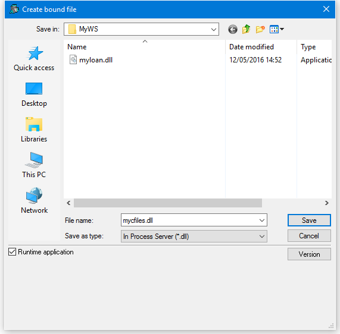

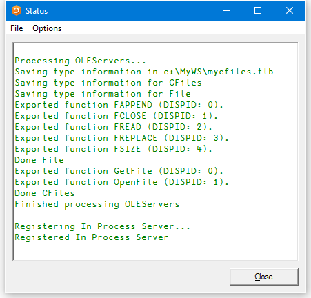

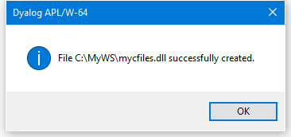

## The GetFile Function
```apl
     ∇ r←GetFile
[1]    r←2 ⎕NQ'.' 'GetEnvironment' 'DYALOG'
[2]    r,←'\samples\ole\test.dcf'
     ∇
```

`GetFile` simply returns the full pathname of the `test.dcf` component file.

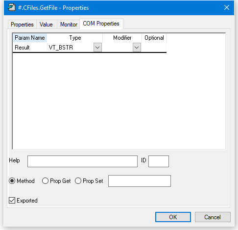

## The OpenFile Function
```apl
     ∇ FILE←OpenFile NAME;F;TIE
[1]   ⍝ Makes a new File object
[2]    TIE←1+⌈/0,⎕FNUMS
[3]    NAME ⎕FSTIE TIE
[4]    File.TieNumber←TIE
[5]    File.Name←NAME
[6]    FILE←⎕OR'File'
     ∇
```

`OpenFile` takes the name of an existing component file and opens it exclusively using `⎕FTIE`.

It returns an instance of the `File` namespace that is associated with the file through the variable `TieNumber`. This is global to the `File` namespace.

`OpenFile[4]`sets the variable `TieNumber` in the `File` namespace to the tie number of the requested file.

`OpenFile[5]`sets the variable `Name` in the `File` namespace to the name of the requested file. This is not actually used.

`OpenFile[6]`creates an instance of the `File` namespace using `⎕OR` and returns it as the result.

Note that there is a separate instance of `File` for every file opened by every OLE Client that is connected. Each knows its own `TieNumber` and `Name`.

The COM Properties dialog box for `OpenFile` is shown below. The function is declared to take a single parameter called *FileName* whose data type is VT_BSTR (a string). The result of the function is of data type VT_DISPATCH. This data type is used to represent an object.

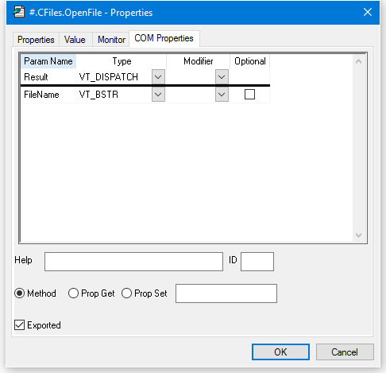

## The FSIZE Function
```apl
     ∇ R←FSIZE
[1]    R←⎕FSIZE TieNumber
     ∇
```

`FSIZE` returns the result of  `⎕FSIZE` for the file associated with the current instance of the File namespace.

The COM Properties dialog box for `FSIZE` is shown below. The function is declared to take no parameters. The result of the function is of data type VT_VARIANT. This data type is used to represent an arbitrary APL array.

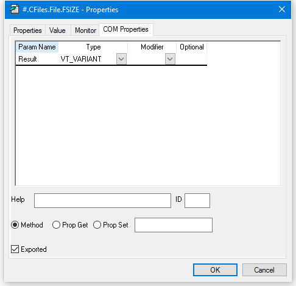

## The FREAD Function
```apl
     ∇ R←FREAD N
[1]    R←⎕FREAD TieNumber,N
     ∇
```

`FREAD` returns the value in the specified component read from the file associated with the current instance of the File namespace.

The COM Properties dialog box for `FREAD` is shown below. The function is declared to take a single parameter called *Component* whose data type is VT_I4 (an integer). The result of the function is of data type VT_VARIANT. This data type is used to represent an arbitrary APL array.

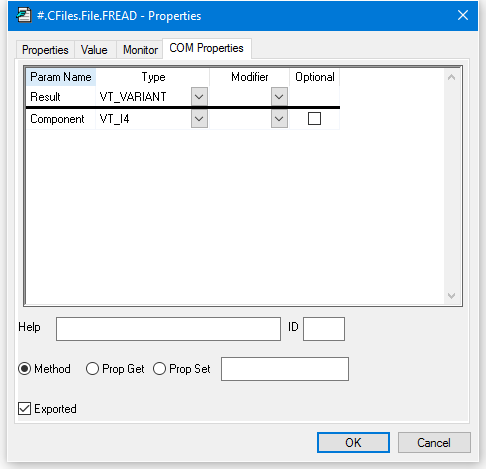

## The FAPPEND Function
```apl
     ∇ R←FAPPEND DATA
[1]    R←DATA ⎕FAPPEND TieNumber
     ∇
```

`FAPPEND` appends a component onto of the file associated with the current instance of the File namespace.

The COM Properties dialog box for `FAPPEND` is shown below. The function is declared to take a single parameter called *Data* whose data type is VT_VARIANT. This data type is used to represent an arbitrary APL array. The result of the function is of data type VT_I4 (an integer).

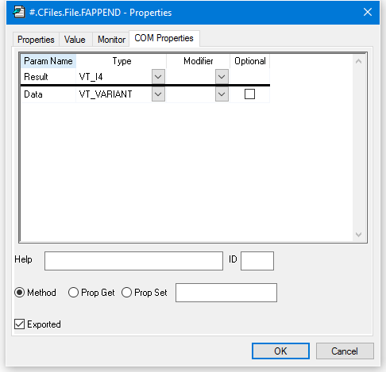

## The FREPLACE Function
```apl
     ∇ FREPLACE ID;I;DATA
[1]    I DATA←ID
[2]    DATA ⎕FREPLACE TieNumber,I
     ∇
```

`FREPLACE` replaces the specified component of the file associated with the current instance of the File namespace.

The COM Properties dialog box for `FREPLACE` is shown below. The function is declared to take two parameters. The first is called *Component* and is of data type VT_I4 (integer). The second parameter is called *Data* and is of data type VT_VARIANT. This data type is used to represent an arbitrary APL array. The result of the function is of data type VT_VOID, which means that the function does not return a result.

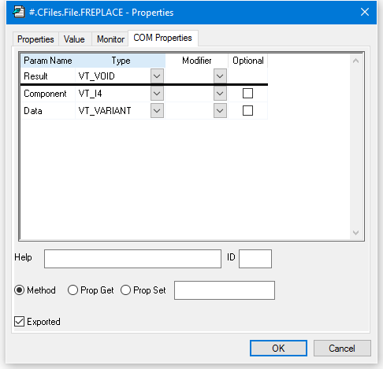

## Using CFiles from Excel

Start Excel and load the spreadsheet `cfiles.xlsm` from the Dyalog APL sub-directory `samples\ole`.

Please note that to simplify the Excel code, only components containing matrices (such as those contained in samples\ole\test.dcf) are handled. Components containing scalars, vectors, higher-rank arrays and complex nested arrays are not supported.

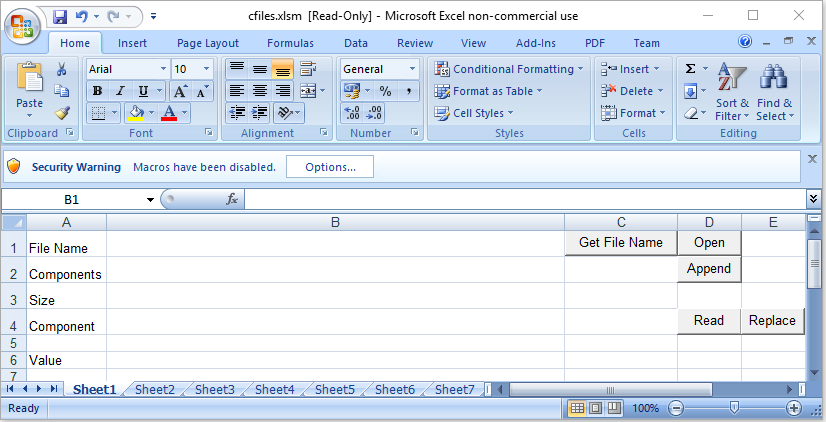

Depending upon your configuration settings, it is likely that the macros in cfiles.xlsm are disabled when the spreadsheet is loaded, as shown above. If so, click the *Options* button and enable them. The security warning is then removed as shown below.

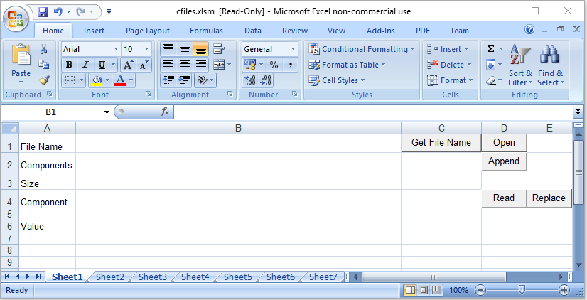

The next step is to enter the name of your component file. A sample file named `test.dcf` is provided in the `samples\ole` sub-directory. To get the pathname of this sample file, click *Get File Name*. The result is shown below:

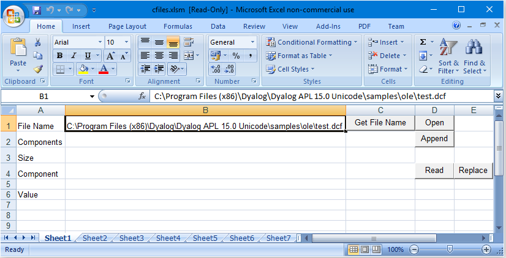

The next step is to open the file by clicking the *Open* button. This runs the FOpen procedure. Note that if this step is critical; otherwise any attempt to read or write to the file will fail. When the file is opened, the size of the file is displayed as shown below.

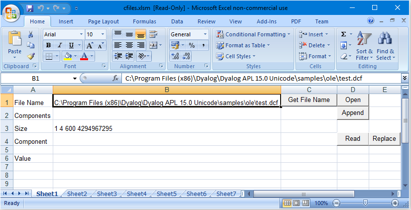

Finally, to read a component, enter the component number, move the input focus to a different cell, and then and click *Read*. This runs the FRead procedure.

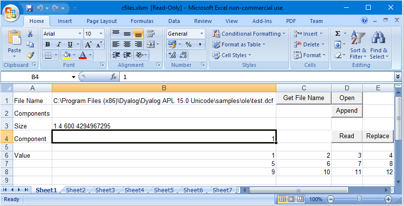

To replace a component, first enter the component number. Then type some data elsewhere on the spreadsheet and select it. Now click *Replace*. This runs the FReplace procedure.

To append a component, enter some data elsewhere on the spreadsheet and select it. Now click *Append*. This runs the FAppend procedure.

## The FOpen Procedure
```apl
Public CF As Object
Public File As Object
 
Dim Data As Variant
 
Sub FOpen()
    Set CF = CreateObject("dyalog.cfiles")
    f = Cells(1, 2).Value
    Set File = CF.OpenFile(f)
    Call FSize
End Sub
```

In the declaration section, the first statement declares a global variable CF to be of data type Object. This variable will be connected to the dyalog.CFiles OLE Server object. The second statement declares a global variable File to be of data type Object. This variable will be connected to the dyalog.File OLE Server object. The third statement declares a global variable Data to be of data type Variant. This is equivalent to a nested array. This variable will be used for the component data.

The statement:
```apl
Set CF = CreateObject("dyalog.cfiles")
```

causes OLE to start Dyalog APL and obtain an instance of the dyalog.CFiles OLE Server object which is then associated with the variable CF. Because this variable is global, the OLE Server remains in memory and available for use.

The statement
```apl
f = Cells(1, 2).Value
```

gets the name of the file to be opened and puts it into the (local) variable f.

Finally, the statement:
```apl
Set File = CF.OpenFile(f)
```

calls the OpenFile function and stores the result (which is an object) in the global variable File.

## The FRead Procedure
```apl
Sub FRead()
    c = Cells(4, 2).Value
    Data = File.FREAD(c)
    For r = 0 To UBound(Data, 1)
        For c = 0 To UBound(Data, 2)
            Cells(r + 6, c + 2).Value = Data(r, c)
        Next c
    Next r
End Sub 
```

The statement:
```apl
c = Cells(4, 2).Value
```

gets the number of the component to be read and stores it in the (local) variable c.

The statement:
```apl
Data = File.FREAD(c)
```

calls the `FREAD` function in the instance of the `File` namespace that is connected to the (global) Excel variable File. The result is stored in the variable Data.

The remaining statements copy the data from Data into the spreadsheet.

## The FReplace Procedure
```apl
Sub FReplace()
    c = Cells(4, 2).Value
    Data = Selection.Value
    Call File.FReplace(c, Data)
    Call Fsize()
End Sub
```

The statement:
```apl
c = Cells(4, 2).Value
```

gets the number of the component to be replaced and stores it in the (local) variable c.

The statement:
```apl
Data = Selection.Value
```

gets the contents of the selected range of cells and stores it in the variable Data. This will be a 2-dimensional matrix.

The statement:
```apl
Call File.FReplace(c, Data)
```

calls the `FREPLACE` function in the instance of the `File` namespace that is connected to the (global) Excel variable File.

## The FAppend Procedure
```apl
Sub FAppend()
    Dim Rslt As Variant
    Data = Selection.Value
    Rslt = File.FAppend(Data)
    Call Fsize()
End Sub
```

The statement:
```apl
Data = Selection.Value
```

gets the contents of the selected range of cells and stores it in the variable Data. This will be a 2-dimensional matrix.

The statement:
```apl
Rslt = File.FAppend(Data)
```

calls the `FAPPEND` function in the instance of the `File` namespace that is connected to the (global) Excel variable File. The result of this function is ignored.
