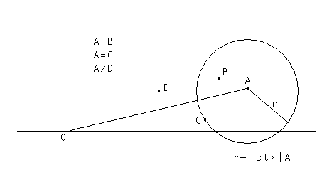

---
search:
  boost: 2
---
<div style="display: none;">
  = equals
</div>


# <span class="name">Equal To</span> <span class="command">R←X=Y</span> {: .heading}


`Y` may be any array. `X` may be any array. `R` is Boolean.


`⎕CT` and `⎕DCT` are  implicit arguments of Equal To.


If `X` and `Y` are refs, then `R` is 1 if they are refs to the same object. If `X` is a ref and `Y` is not, or vice-versa, then `R` is 0.


If `X` and `Y` are character, then `R` is 1 if they are the same character. If `X` is character and `Y` is numeric, or vice-versa, then `R` is 0.


If `X` and `Y` are numeric, then `R` is 1 if `X` and `Y` are within comparison tolerance of each other.


For real numbers `X` and `Y`, `X` is considered equal to `Y` if `(|X-Y)` is not greater than `⎕CT×(|X)⌈|Y`.


For complex numbers `X=Y` is 1 if the magnitude of `X-Y` does not exceed `⎕CT` times the larger of the magnitudes of `X` and `Y`; geometrically, `X=Y` if the number smaller in magnitude lies on or within a circle centred on the one with larger magnitude, having radius `⎕CT` times the larger magnitude.




<h2 class="example">Examples</h2>
```apl
      3=3.1 3 ¯2 ¯3
0 1 0 0
 
      a←2+0j1×⎕CT 
      a
2J1E¯14
      a=2j.00000000000001 2j.0000000000001
1 0
 
      'CAT'='FAT'
0 1 1
 
      'CAT'=1 2 3
0 0 0
 
      'CAT'='C' 2 3
1 0 0
 
      ⎕CT←1E¯10
      1=1.000000000001
1
 
      1=1.0000001
0
 
```


