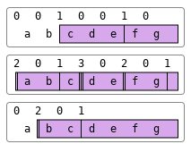

---
search:
  boost: 2
---
<div style="display: none;">
  ⊂
</div>

# <span class="name">Partitioned Enclose</span> <span class="command">(⎕ML&lt;3) R←X⊂\[K\]Y</span> {: .heading}

`Y` may be any array.  `X` must be a simple integer scalar or vector. If `X` is a scalar it is extended to `(≢Y)⍴X`.

The axis specification is optional.  If present, it must be a simple integer scalar or one-element vector.  The value of `K` must be an axis of `Y`.  If absent, the last axis of `Y` is implied.

`R` is a vector of items selected from `Y` by inserting 0 or more dividers, specified by `X`, between its major cells.

Each element of `X` specifies the number of dividers to insert before the corresponding major cell of `Y`. The maximum length of `X` is `1+≢Y`, when the last element of `X` specifies the number of trailing dividers. Note that major cells of `Y` that precede the first divider (identified by the first non-zero element of `X`) are excluded from the result.

The length of `R` is `+/X` (after possible extension).

<h2 class="example">Examples</h2>

```apl
      0 0 1 0 0 1 0⊂'abcdefg'
┌───┬──┐
│cde│fg│
└───┴──┘
      2 0 1 3 0 2 0 1⊂'abcdefg'
┌┬──┬─┬┬┬──┬┬──┬┐
││ab│c│││de││fg││
└┴──┴─┴┴┴──┴┴──┴┘
      0 2 0 1⊂'abcdefg'
┌┬──┬────┐
││bc│defg│
└┴──┴────┘
```

The above examples may be explained pictorially by the diagram below.



## Further Examples
```apl
      1 0 1⊂[1]3 4⍴⍳12
┌───────┬──────────┐
│1 2 3 4│9 10 11 12│
│5 6 7 8│          │
└───────┴──────────┘
      1 0 0 1⊂[2]3 4⍴⍳12
┌───────┬──┐
│1  2  3│ 4│
│5  6  7│ 8│
│9 10 11│12│
└───────┴──┘
```
