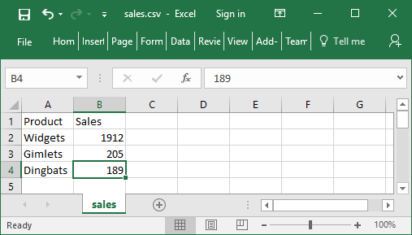
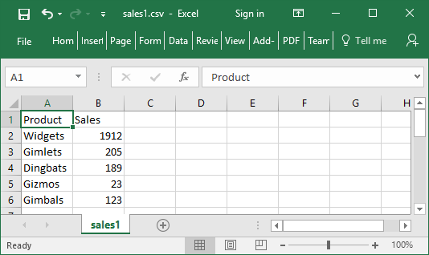

---
search:
  boost: 2
---
<!-- Hidden search keywords -->
<div style="display: none;">
  ⎕CSV CSV
</div>

# <span class="name">Comma Separated Values</span> <span class="command">\{R\}←\{X\} ⎕CSV Y</span> {: .heading}

This function imports and exports Comma Separated Value (CSV) data.

Monadic `⎕CSV` imports data from a CSV file or converts data from CSV format to an internal format. Dyadic `⎕CSV` exports data to a CSV file or converts data from internal format to a CSV format.

## Internal Format

Arrays that result from importing CSV data or arrays that are suitable for exporting as CSV data are represented by 3 possible structures:

- A table (a matrix whose elements are character vectors or scalars, or numbers).
- A vector, each of whose items contain field (column) values. Character field values are character matrices; numeric field values are numeric vectors.
- A vector, each of whose items contain field (column) values. Character field values are vectors of character vectors; numeric field values are numeric vectors.

Note that when importing CSV data, all fields are assumed to be character fields unless otherwise specified (see *Column Types* below). A field that contains only "numbers" will not be converted to numeric data unless specified as being numeric.

## MetaCharacters

Some characters in a CSV file are metacharacters that define the structure of the data; for example, the field separator character between fields. Characters that are not metacharacters are literal characters. The variant options QuoteChar, EscapeChar, and DoubleQuote make it possible to interpret metacharacters as literal characters, and thus permit fields to contain field separator characters, leading and trailing spaces, and line-endings.

Fixed-width fields do not require these options and they are ignored if fixed-width fields are being processed.

# Monadic `⎕CSV`

`R←⎕CSV Y`

`Y` is an array that specifies just the source of the CSV data (see below) or a 1,2,3 or 4-element vector containing:

|-----|---------------------------|
|`[1]`|Source of CSV Data         |
|`[2]`|Description of the CSV data|
|`[3]`|Column Types               |
|`[4]`|Header Row Indicator       |

*Source* may be one of:

- a character vector or scalar containing a file name
- a native tie number
- a character vector or scalar containing CSV data with embedded newline characters. To avoid this source being interpreted as a file name, `Y[2]` must be specified as `'S'`. 
- a vector of character vectors and/or scalars containing CSV data with implicit newlines after each character vector or scalar

*Description*

If `Y[1]` is a file name or tie number *Description* may be one of:

- a character vector specifying the file encoding such as `'UTF-8'` (see [File Encodings](nget.md)).
- a 256-element numeric vector that maps each possible byte value (0-255) to a Unicode code point (1st element = Unicode code point corresponding to byte value 0, and so on). ¯1 indicates that the corresponding byte value is not mapped to any character. Apart from ¯1, no value may appear in the table more than once.

If omitted or empty, the file encoding is deduced (see below).

If `Y[1]` is a character array containing CSV data *Description* is a character scalar `'S'` (simple) or `'N'` (nested). The default is `'N'`

*Column Types*

This is a scalar numeric code or vector of numeric codes that specifies the field types from the list below. If *Column Types* is zilde or omitted, the default is 1 (all fields are character).

|---|---|
|`0`|The field is ignored.|
|`1`|The field contains character data.|
|`2`|The field is to be interpreted as being numeric. Empty cells and cells which cannot be converted to numeric values are not tolerated and cause an error to be signalled.|
|`3`|The field is to be interpreted as being numeric but invalid numeric values are tolerated. Empty fields and fields which cannot be converted to numeric values are replaced with the Fill variant option (default 0).|
|`4`|The field is to be interpreted numeric data but invalid numeric data is tolerated. Empty fields and fields which cannot be converted to numeric values are returned instead as character data; this type is disallowed when variant option Invert is set to 1.|
|`5`|The field is to be interpreted as being numeric but empty fields are tolerated and are replaced with the Fill variant option (default 0). Non-empty cells which cannot be converted to numeric values are not tolerated and cause an error to be signalled.|

Note that if *Column Types* is specified by a scalar 4, all numeric data in all fields will be converted to numbers.

*Header Row Indicator*

This is a Boolean value (default 0) to specify whether or not the first record in a CSV file is a list of column labels. If *Header Row Indicator* is 1, the first record (the *header row*) is treated differently from other records. It is assumed to contain character data (labels) regardless of `Y[3]` and is returned separately in the result.

## Variant options

Monadic `⎕CSV` may be applied using the  Variant operator with the following options. The Principal option is Invert.

|Name       |Meaning                                     |Default|
|-----------|--------------------------------------------|-------|
|Decimal    |The decimal mark in numeric fields - one of `'.'` or `','` |   `'.'`|
|DoubleQuote|A Boolean that indicates whether (`1`) or not (`0`) a quote character within a quoted field is represented by two consecutive quote characters     |`1`    |
|EscapeChar |The escape character, which may be specified as an empty character vector (meaning none is defined) or a character scalar                |`''`   |
|Fill       |The numeric value substituted for invalid numeric data in  columns of type 3   |`0`    |
|Invert     |A number specifying how the CSV data should be returned. Possible values are:<ul><li>`0` – A table (a matrix whose elements are character vectors or scalars or numbers).</li><li>`1` – A vector, each of whose items contain field (column) values. Character field values are character matrices; numeric field values are numeric vectors.</li><li>`2` – A vector, each of whose items contain field (column) values. Character field values are vectors of character vectors; numeric field values are numeric vectors.</li></ul>    |`0`    |
|QuoteChar  |The field quote character (delimiter), which may be specified as an empty character vector (meaning none is defined) or a character scalar                 |`"`    |
|Ragged     |A Boolean specifying whether records with varying numbers  of fields are allowed; see notes below                                                          |`0`    |
|Records    |The maximum number of records to process or 0 for no limit.                    |`0`    |
|Separator  |The field separator, any single character. If Widths is other than `⍬`, Separator is ignored.                                                            |`','`  |
|Thousands  |The thousands separator in numeric fields, which can be specified as an empty character vector (meaning no separator is defined) or a character scalar   |`''`   |
|Trim       |A Boolean specifying whether undelimited/unescaped whitespace is trimmed at the beginning and end of fields            |`1`    |
|Widths     |A vector of numeric values describing the width (in characters) of the corresponding columns in the CSV source, or `⍬` for variable width delimited fields|`⍬`    |

The Separator, QuoteChar, and EscapeChar characters, when defined, must be different.

Other options defined for export are also accepted but ignored.

### QuoteChar, EscapeChar, and DoubleQuote Options

If EscapeChar is set then any character may be prefixed by the escape character. The escape character is typically defined as `'\'`. The escape character immediately followed by the character `c` is the literal character `c` even if `c` alone would have been a metacharacter.

If QuoteChar is set then fields may be delimited by the specified quote character. Within quoted fields all characters except the quote character, and the escape character if defined, are literal characters.

If DoubleQuote is set to 1 then two consecutive quote characters within a quoted field are interpreted as the single literal quote character.

## Result

The result `R` contains the imported data.

If `Y[4]` does not specify that the data contains a header then `R` contains the entire data in the form specified by the Invert variant option.

If `Y[4]` does specify that the data contains a header then `R` is a 2-element vector where:

- `R[1]` is the imported data excluding the header.
- `R[2]` is a vector of character vectors containing the header record.

<h2 class="example">Examples</h2>


```apl
      ⊃⎕NGET CSVFile←'c:\Dyalog16.0\sales.csv'
┌→───────────────────────────────────────────────┐
│Product,Sales                                   │
│             Widgets,1912                       │
│                         Gimlets,205            │
│                                    Dingbats,189│
│                                                │
└────────────────────────────────────────────────┘

      ⎕CSV CSVFile
┌→───────────────────┐
↓ ┌→──────┐  ┌→────┐ │
│ │Product│  │Sales│ │
│ └───────┘  └─────┘ │
│ ┌→──────┐  ┌→───┐  │
│ │Widgets│  │1912│  │
│ └───────┘  └────┘  │
│ ┌→──────┐  ┌→──┐   │
│ │Gimlets│  │205│   │
│ └───────┘  └───┘   │
│ ┌→───────┐ ┌→──┐   │
│ │Dingbats│ │189│   │
│ └────────┘ └───┘   │
└∊───────────────────┘

      ⎕CSV CSVFile'' ⍬ 1 ⍝ Header row
┌→────────────────────────────────────────────┐
│ ┌→──────────────────┐ ┌→──────────────────┐ │
│ ↓ ┌→──────┐  ┌→───┐ │ │ ┌→──────┐ ┌→────┐ │ │
│ │ │Widgets│  │1912│ │ │ │Product│ │Sales│ │ │
│ │ └───────┘  └────┘ │ │ └───────┘ └─────┘ │ │
│ │ ┌→──────┐  ┌→──┐  │ └∊──────────────────┘ │
│ │ │Gimlets│  │205│  │                       │
│ │ └───────┘  └───┘  │                       │
│ │ ┌→───────┐ ┌→──┐  │                       │
│ │ │Dingbats│ │189│  │                       │
│ │ └────────┘ └───┘  │                       │
│ └∊──────────────────┘                       │
└∊────────────────────────────────────────────┘

      ⎕CSV CSVFile''(1 2)1 ⍝ Fields are Char, Num
┌→──────────────────────────────────────────┐
│ ┌→────────────────┐ ┌→──────────────────┐ │
│ ↓ ┌→──────┐       │ │ ┌→──────┐ ┌→────┐ │ │
│ │ │Widgets│  1912 │ │ │Product│ │Sales│ │ │
│ │ └───────┘       │ │ └───────┘ └─────┘ │ │
│ │ ┌→──────┐       │ └∊──────────────────┘ │
│ │ │Gimlets│  205  │                       │
│ │ └───────┘       │                       │
│ │ ┌→───────┐      │                       │
│ │ │Dingbats│ 189  │                       │
│ │ └────────┘      │                       │
│ └∊────────────────┘                       │
└∊──────────────────────────────────────────┘

      (⎕CSV⍠'Invert' 1)CSVFile'' (1 2) 1    ⍝ Invert 1
┌→────────────────────────────────────────────────────┐
│ ┌→──────────────────────────┐ ┌→──────────────────┐ │
│ │ ┌→───────┐ ┌→───────────┐ │ │ ┌→──────┐ ┌→────┐ │ │
│ │ ↓Widgets │ │1912 205 189│ │ │ │Product│ │Sales│ │ │
│ │ │Gimlets │ └~───────────┘ │ │ └───────┘ └─────┘ │ │
│ │ │Dingbats│                │ └∊──────────────────┘ │
│ │ └────────┘                │                       │
│ └∊──────────────────────────┘                       │
└∊────────────────────────────────────────────────────┘

      ⊃(⎕CSV⍠'Invert' 2)CSVFile'' (1 2) 1    ⍝ Invert 2
┌→──────────────────────────────────────────────────┐
│ ┌→───────────────────────────────┐ ┌→───────────┐ │
│ │ ┌→──────┐ ┌→──────┐ ┌→───────┐ │ │1912 205 189│ │
│ │ │Widgets│ │Gimlets│ │Dingbats│ │ └~───────────┘ │
│ │ └───────┘ └───────┘ └────────┘ │                │
│ └∊───────────────────────────────┘                │
└∊──────────────────────────────────────────────────┘

```

## Notes

- When `Y` specifies just the source of the CSV data, it does not need to be enclosed or ravelled to create a 1-element vector.
- `Y[2]`, the description of the source, distinguishes an otherwise ambiguous character vector source (which could contain either CSV data or a file name). The other source forms are unambiguous but the description, when given, must still match the given source type.
- Tab-separated fields may be imported by specifying `'Separator' (⎕UCS 9)`.
- Fields containing embedded new lines are supported (they must, of course, appear in quotes or be prefixed by the escape character). On import, line endings are always converted to a single line feed character.
- If Ragged is not set then all records must have the same number of fields (character delimited format) or same number of characters (fixed width field format).
- If Ragged is set:
- The expected number of columns must be specified using the Widths variant option and/or the column types in `Y[3]`.
- In character delimited format, all processed records are implicitly extended or truncated as required so that they contain the expected number of fields; implicitly added fields will be empty.
- In fixed width format, all processed records are implicitly extended with spaces or truncated as required so that they contain as many characters as are specified in the Widths option declaration.

### File handling

Data may be read from a named file or a tied native file. A tied native file may be read in sections by repeatedly invoking `⎕CSV` for a specified maximum number of records (specified by the Records variant) until no more data is read.

In all cases the files must contain text using one of the supported encodings (see [File Encodings](nget.md)). The method used to determine the file encoding is as follows:

- If a Byte Order Mark (BOM) is encountered at the start of the file, it is used regardless of `Y[2]` (if specified). Note, however, that the BOM can only be encountered if the file is read from the start - specifically, if a native file is read in sections, any BOM present will only be encountered when the first section is read.
- Otherwise, the file will be read and decoded according to the file encoding in `Y[2]` if specified.
- Otherwise: 	Native files will be decoded as if `'UTF-8'` had been specified. 	Files specified by name will be examined and the likely file encoding will be deduced using the same heuristics performed by `⎕NGET`.
- Native files will be decoded as if `'UTF-8'` had been specified.
- Files specified by name will be examined and the likely file encoding will be deduced using the same heuristics performed by `⎕NGET`.

Note that:

- native files are read from the current file position. On successful completion, the file position will be at the first unprocessed character (end of file if the Records variant option is not specified). If an error is signalled the file position is undefined.
- the result does not report the file encoding or line ending type as it does with `⎕NGET`. If this information is required then it must be obtained by other means.

# Dyadic `⎕CSV`

`{R}←X ⎕CSV Y`

The left argument `X` is either:

- a matrix or a vector of vectors/matrices containing the data to be converted to CSV format.
- or a 2-element vector containing a matrix or vector of vectors/matrices containing the data to be converted to CSV format, and a vector of character vectors containing the header record.

`Y` is a 1 or 2-element vector containing:

|-----|---------------------------------------|
|`[1]`|Destination of CSV Data (see below)    |
|`[2]`|Description of the CSV data (see below)|

*Destination* - may be one of:

- a character vector or scalar containing a file name
- a native tie number
- an empty character vector, indicating that the CSV data is to be returned in the result `R`

*Description*

If `Y[1]` is a file name or tie number, *Description* may be:

- a character vector specifying the file encoding such as `'UTF-8'` (see [File Encodings](nget.md)).
- a 256-element numeric vector that maps each possible byte value (0-255) to a Unicode code point (1st element = Unicode code point corresponding to byte value 0, and so on). ¯1 indicates that the corresponding byte value is not mapped to any character. Apart from ¯1, no value may appear in the table more than once.

If `Y[1]` is empty, *Description* may be a character scalar `'S'` (simple) or `'N'` (nested). If omitted, the default is `'S'`

## Variant options

Dyadic `⎕CSV` may be applied using the _variant_ operator with the following options.

|Name|Meaning|Default|
|---|---|---|
|Decimal|the decimal mark in numeric fields - one of `'.'` or `','`|`'.'`|
|DoubleQuote|A Boolean which indicates whether (`1`) or not (`0`) a quote character within a quoted field is represented by two consecutive quote characters|`1`|
|EscapeChar|The escape character, which may be specified as an empty character vector (meaning none is defined) or a character scalar|`0`|
|ForceQuotes|A number specifying the degree to which quotes are applied around fields even if not strictly required. Possible values are:<ul><li>`0` – add only if required</li><li>`1` – add to all fields containing character data and to fields containing numeric data if required</li><li>`2` – add to all fields even if not required</li></ul>If ForceQuotes is a scalar, the value applies to all columns; if it is a vector of values then each value applies to the corresponding column.|`0`|
|IfExists|a character vector `'Error'` or `'Replace'` which specifies, when creating a named file which already exists, whether to overwrite it ( `'Replace'` ) or signal an error ( `'Error'` )|`'Error'`|
|LineEnding|the line ending sequence - see [Line separators:](nget.md)|(13 10) on Windows; 10 on other platforms|
|QuoteChar|The field quote character (delimiter), which may be specified as an empty character vector (meaning none is defined) or a character scalar|`"`|
|Separator|the field separator, any single character. If Widths is other than `⍬` , Separator is ignored.|`','`|
|Thousands|the thousands separator in numeric fields, which can be specified as an empty character vector (meaning no separator is defined) or a character scalar|`''`|
|Trim|a Boolean specifying whether whitespace is trimmed at the beginning and end of character fields|`1`|
|Widths|a vector of numeric values describing the width (in characters) of the corresponding columns in the CSV source, or `⍬` for variable width delimited fields|`⍬`|

The Separator, QuoteChar, and EscapeChar characters, when defined, must be different. Other options defined for import are also accepted but ignored.

The Overwrite variant option (Boolean) from Version 16.0 remains supported but is deprecated in favour of IfExists.

### QuoteChar, EscapeChar, and DoubleQuote options

- The CSV text will be generated such that it can be read back according to the corresponding rules for import.
- If these options do not permit this (for example, a field contains the quote character and neither DoubleQuote or EscapeChar are set) an error is signalled.
- Quoting and Escaping is used as conservatively as possible.
- If both QuoteChar and EscapeChar are set, quoting is favoured.

If `Y` specifies that the CSV data is written to a file then `R` is the number of bytes (not characters) written, and is shy.

Otherwise, `R` is the CSV data in the format specified in Y, and is not shy.

<h3 class="example">Examples</h3>
```apl
       CSVFile←'c:\Dyalog16.0\sales.csv'
       ⎕←DATA HDR←⎕CSV CSVFile''(1 2)1
┌→──────────────────────────────────────────┐
│ ┌→────────────────┐ ┌→──────────────────┐ │
│ ↓ ┌→──────┐       │ │ ┌→──────┐ ┌→────┐ │ │
│ │ │Widgets│  1912 │ │ │Product│ │Sales│ │ │
│ │ └───────┘       │ │ └───────┘ └─────┘ │ │
│ │ ┌→──────┐       │ └∊──────────────────┘ │
│ │ │Gimlets│  205  │                       │
│ │ └───────┘       │                       │
│ │ ┌→───────┐      │                       │
│ │ │Dingbats│ 189  │                       │
│ │ └────────┘      │                       │
│ └∊────────────────┘                       │
└∊──────────────────────────────────────────┘

     DATA⍪←'Gizmos' 23
      DATA HDR ⎕CSV''
┌→────────────┐
│Product,Sales│
│             │
│Widgets,1912 │
│             │
│Gimlets,205  │
│             │
│Dingbats,189 │
│             │
│Gizmos,23    │
│             │
│             │
└─────────────┘

       CSVFile1←'c:\Dyalog16.0\sales1.csv'
       ⎕←DATA HDR ⎕CSV CSVFile1
  
67
       DATA⍪←'Gimbals' 123
       ⎕←DATA HDR ⎕CSV CSVFile1
FILE NAME ERROR: Unable to create file ("The file exists.")
       ⎕←DATA HDR ⎕CSV CSVFile1
      ∧
       ⎕←DATA HDR(⎕CSV⍠'IfExists' 'Replace')CSVFile1
  
80 

```



## Notes

- When `Y` contains only the destination of the CSV data (that is, omits the description in its second element) it does not have to be enclosed to form a single element vector.
- Native files are written from the current file position. On successful completion, the file position will be at the end of the written data. If an error is signalled the amount of data written is undefined.
- If the file encoding specifies that a BOM is required and output is to a native file, it will only be written if the file position is initially at 0 - that is, the start of the file is being written.
- When fixed width fields are written, character data shorter than the specified width is padded with spaces to the right and character data longer than the specified width signals an error. Numeric data is converted to character data as far as possible so that it fits into the specified width. If this is not possible, an error is signalled.
- Tab-separated fields may be exported by specifying `'Separator' (⎕UCS 9)`.
- Fields containing a single embedded new line are supported. On export, line feed characters are mapped back to the defined line ending sequence.
