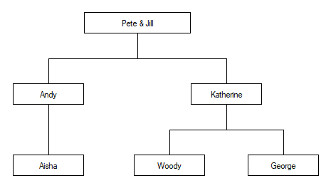

---
search:
  boost: 2
---

# Fix Script

```apl
{R}←{X}⎕FIX Y
```
[Key to notation](../key-to-notation.md)

`⎕FIX` establishes Namespaces, Classes, Interfaces and functions from the script specified by `Y` in the workspace.

In this section, the term *namespace* covers scripted Namespaces, Classes and Interfaces.

`Y` can be a simple character vector, or  a vector of character vectors or character scalars. The value of `X` determines what `Y` can contain.

If `Y` is a simple character vector, it must start with `file://`, followed by the name of a file which must exist. The contents of the file must follow the same rules that apply to `Y` when `Y` is a vector of character vectors or scalars. The file name can be relative or absolute; when considering cross-platform portability, using "/" as the directory delimiter is recommended, although "\" is also valid under Windows.

If specified, `X` must be a numeric scalar. It can currently take the value `0`, `1` or `2`. If not specified, the value is assumed to be `1`.

If `X` is `0`, `Y` must specify a single valid *namespace* which might or might not be named, or a file containing such a definition. If so, the [shy](../../programming-reference-guide/introduction/results.md#shy-results) result `R` contains a reference to the *namespace*. Even if the *namespace* is named, it is not established *per se*, although it will exist for as long as at least one reference to it exists.

If `X` is `1`, `Y` must specify a single valid *namespace* which might or might not be named, or a file containing such a definition.  If so, the shy result `R` contains a reference to the *namespace*. If `Y` contains the definition of a named *namespace*, the *namespace* is established in the workspace.

If `X` is `2`, `Y` is either a character vector containing the name of a script file, or a vector of character vectors that represents a script.

`Y` can specify a series of **named** *namespaces* or function definitions,   or a combination of functions and namespaces.

- If the script contains more than one item,  tradfn definitions must be delimited by `∇`symbols.
- Derived and assigned functions can be specified only within namespaces.

In this case,  the shy result `R` is a vector of character vectors, containing the names of all of the objects that have been established in the workspace; the order of the names in `R` is not defined. Currently `2 ⎕FIX` is not certain to be an atomic operation, although this might change in future versions.

## Example 1

In the first example, the Class specified by `Y` is *named* (`MyClass`) but the result of `⎕FIX` is discarded. The end-result is that `MyClass` is established in the workspace as a Class.
```apl
      ⎕←⎕FIX ':Class MyClass' ':EndClass'
#.MyClass
```

## Example 2

In the second example, the Class specified by `Y` is *named* (`MyClass`) and the result of `⎕FIX` is assigned to a different name (`MYREF`). The end-result is that a Class named `MyClass` is established in the workspace, and `MYREF` is a reference to it.
```apl
      MYREF←⎕FIX ':Class MyClass' ':EndClass'
      )CLASSES
MyClass MYREF
      ⎕NC'MyClass' 'MYREF'
9.4 9.4
      MYREF
#.MyClass
      MYREF≡MyClass
1
```

## Example 3

In the third example, the left-argument of `0` causes the named Class `MyClass` to be visible only via the reference to it (`MYREF`). It is there, but hidden.
```apl
      MYREF←0 ⎕FIX ':Class MyClass' ':EndClass'
      )CLASSES
MYREF
      MYREF
#.MyClass
```

## Example 4

The fourth example illustrates the use of un-named Classes.
```apl
      src←':Class' '∇Make n'
      src,←'Access Public' 'Implements Constructor'
      src,←'⎕DF n' '∇' ':EndClass'
      MYREF←⎕FIX src
      )CLASSES
MYREF
      MYINST←⎕NEW MYREF'Pete'
      MYINST
Pete
```

## Example 5

In the final example, the left argument of `2` allows a script containing multiple objects to be fixed:

```apl

      src←':Namespace andys' '∇foo' '2' '∇'
      src,←':EndNamespace' 'dfn←{⍺ ⍵}' '∇r←tfn'
      src,←'r←33' '∇' ':Class c1' '∇goo' '1'
      src,←'∇' ':EndClass'
      ≢⎕←2⎕FIX src
 c1  tfn  dfn  andys 
4

```

## Restrictions

`⎕FIX` is unable to fix a namespace from `Y` when `Y` specifies a multi-line dfn which is preceded by a `⋄` (diamond separator).
```apl
      ⎕FIX':Namespace iaK' 'a←1 ⋄ adfn←{' '⍵' ' }' ':EndNamespace'
DOMAIN ERROR: There were errors processing the script
      ⎕FIX':Namespace iaK' 'a←1 ⋄ adfn←{' '⍵' ' }' ':EndNamespace'
      ∧

```

!!! note "Legacy"
    Before Dyalog v20.0, it was possible to define dfns with unmatched parentheses and brackets. These are now rejected. TradFns will continue to fix as before, but subtle differences in how the code behaves might not be backwards-compatible and could have unexpected results.

## Variant Options

`⎕FIX` supports four variant options, `Quiet`, `FixWithErrors`, `AllowLateBinding`, and `InjectReferences`, specified using the _variant_ operator [`⍠`](../primitive-operators/variant.md), summarised in [](#variantoptionsforfix), and described in detail beneath it. These options apply only to namespaces and classes specified by the script. There is no principal option.

Table: Variant options for `⎕FIX` { #variantoptionsforfix }

|Variant Option|Valid Values|Default|Effect|
|---|---|---|---|
|[`Quiet`](#variant-option-quiet)|`0` or `1`|`0`|Whether script errors are shown in the Status Window.|
|[`FixWithErrors`](#variant-option-fixwitherrors)|`0`, `1`, or `2`|`1`|Whether namespaces and classes containing errors are fixed.|
|[`AllowLateBinding`](#variant-option-allowlatebinding)|`0` or `1`|`1`|Whether a Class with an undefined Base class is fixed.|
|[`InjectReferences`](#variant-option-injectreferences)|`'All'`, `'InClasses'` or `'None'`|`'InClasses'`|How internal references are inserted to implement lexical scope.|

### Variant Option: `Quiet`

Controls whether script errors are reported in the Status Window.

|---|------------------------------------------------------------------------------|
|`0` <small>(default)</small>|If the script contains errors, these are displayed in the Status Window.      |
|`1`|If the script contains errors, the errors are not shown  in the Status Window.|

### Variant Option: `FixWithErrors`

Controls whether namespaces and classes that contain errors are fixed.

|---|-----------------------------------------------------------------------------------------------------------------------------------------------------------------------|
|`0`|If the script contains errors, `⎕FIX` fails with `DOMAIN ERROR`.                                                                                                      |
|`1` <small>(default)</small>|`⎕FIX` fixes all the namespaces and classes in the script regardless of any errors they might contain.                                                                   |
|`2`|If the script contains errors, `⎕FIX` displays a message box prompting the user to choose whether or not to fix all the offending namespaces and classes in the script.|

### Variant Option: `AllowLateBinding`

Controls whether a Class whose Base class is not yet defined can be fixed.

|---|---------------------------------------------------------------------------------------------------------------------|
|`0`|`⎕FIX` will only fix a Class whose Base class (if specified) is defined in the script or is present in the workspace.|
|`1` <small>(default)</small>|`⎕FIX` will fix a Class whose Base class is neither defined in the script nor present in the workspace.            |

### Variant Option: `InjectReferences`

Controls how internal references are inserted to implement lexical scope.

|-----------|-----------------------------------------------------------------------------------------------------------------------------------------------------|
|`'All'`    |In order to implement lexical scope, `⎕FIX` will insert internal references into all objects in the script.                                          |
|`'InClasses'` <small>(default)</small>|To implement lexical scope, `⎕FIX` will insert internal references only into Classes and sub-classes in the script, but not into namespaces.|
|`'None'`   |No internal references are inserted and lexical scope does not apply.                                                                                |

See [Lexical Scope in Scripts](../../earlier-release-notes/release-notes-v19-0/introduction/lexical-scope-in-scripts.md).

The following examples illustrate how different values of the `InjectReferences` option affect the scope of objects in scripts. The examples are based on the following family tree:



Two scripts are defined to map this tree onto a structure of Classes and Namespaces. In this scheme, female family members are represented by Classes and male family members by Namespaces.

So the scripted tree for `Pete` has a parent Namespace:
```apl
:Namespace Pete
    :Namespace Andy
        :Class Aisha
        :Access Public
        :Endclass
    :EndNamespace

    :Class Katherine
    :Access Public
        :Namespace Woody
        :EndNamespace
        :Namespace George
        :EndNamespace
    :EndClass
:EndNamespace
```

While the scripted tree for `Jill` has a parent Class:
```apl
:Class Jill
:Access Public
    :Namespace Andy
        :Class Aisha
        :Access Public
        :Endclass
    :EndNamespace

    :Class Katherine
    :Access Public
        :Namespace Woody
        :EndNamespace
        :Namespace George
        :EndNamespace
    :EndClass
:EndClass
```

Using the `Pete` Namespace, after executing the expression:
```apl
      2(⎕FIX⍠'InjectReferences' 'All')⎕SRC Pete
```

- Code in `Pete` can refer to `Aisha`    , `Andy`     , `George`   , `Katherine`, and `Woody`
- Code in `Andy` can refer to `Aisha`    and `Katherine`
- ... and so forth.

But after executing:
```apl
      2(⎕FIX⍠'InjectReferences' 'InClasses')⎕SRC Pete
```

- Code in `Pete` can refer only to `Andy` and  `Katherine`
- Code in `Andy` can refer only to `Aisha`
- ... and so forth.

The following tables show which objects in Namespace `Pete` can *see* (that is, refer to) which other objects representing members of the family, in each case; `All`, `InClasses` and `None`.

|'All'    |Pete  |Andy  |Aisha |Katherine|Woody |George|
|---------|------|------|------|---------|------|------|
|Pete     |&nbsp;|✔     |✔     |✔        |✔     |✔     |
|Andy     |&nbsp;|&nbsp;|✔     |✔        |&nbsp;|&nbsp;|
|Aisha    |✔     |✔     |✔     |&nbsp;   |&nbsp;|&nbsp;|
|Katherine|✔     |✔     |&nbsp;|✔        |✔     |✔     |
|Woody    |&nbsp;|&nbsp;|&nbsp;|&nbsp;   |&nbsp;|✔     |
|George   |&nbsp;|&nbsp;|&nbsp;|&nbsp;   |✔     |&nbsp;|

|'InClasses'|Pete  |Andy  |Aisha |Katherine|Woody |George|
|-----------|------|------|------|---------|------|------|
|Pete       |&nbsp;|✔     |&nbsp;|✔        |&nbsp;|&nbsp;|
|Andy       |&nbsp;|&nbsp;|✔     |&nbsp;   |&nbsp;|&nbsp;|
|Aisha      |✔     |✔     |✔     |&nbsp;   |&nbsp;|&nbsp;|
|Katherine  |✔     |✔     |&nbsp;|✔        |✔     |✔     |
|Woody      |&nbsp;|&nbsp;|&nbsp;|&nbsp;   |&nbsp;|&nbsp;|
|George     |&nbsp;|&nbsp;|&nbsp;|&nbsp;   |&nbsp;|&nbsp;|

|'None'   |Pete  |Andy  |Aisha |Katherine|Woody |George|
|---------|------|------|------|---------|------|------|
|Pete     |&nbsp;|✔     |&nbsp;|✔        |&nbsp;|&nbsp;|
|Andy     |&nbsp;|&nbsp;|✔     |&nbsp;   |&nbsp;|&nbsp;|
|Aisha    |&nbsp;|&nbsp;|&nbsp;|&nbsp;   |&nbsp;|&nbsp;|
|Katherine|&nbsp;|&nbsp;|&nbsp;|&nbsp;   |&nbsp;|&nbsp;|
|Woody    |&nbsp;|&nbsp;|&nbsp;|&nbsp;   |&nbsp;|&nbsp;|
|George   |&nbsp;|&nbsp;|&nbsp;|&nbsp;   |&nbsp;|&nbsp;|

Whilst the next set of tables show the same for Class `Jill`.

|'All'    |Jill  |Andy  |Aisha |Katherine|Woody |George|
|---------|------|------|------|---------|------|------|
|Jill     |✔     |✔     |✔     |✔        |✔     |✔     |
|Andy     |&nbsp;|&nbsp;|✔     |✔        |&nbsp;|&nbsp;|
|Aisha    |✔     |✔     |✔     |&nbsp;   |&nbsp;|&nbsp;|
|Katherine|✔     |✔     |&nbsp;|✔        |✔     |✔     |
|Woody    |&nbsp;|&nbsp;|&nbsp;|&nbsp;   |&nbsp;|✔     |
|George   |&nbsp;|&nbsp;|&nbsp;|&nbsp;   |✔     |&nbsp;|

|'InClasses'|Jill  |Andy  |Aisha |Katherine|Woody |George|
|-----------|------|------|------|---------|------|------|
|Jill       |✔     |✔     |✔     |✔        |✔     |✔     |
|Andy       |&nbsp;|&nbsp;|✔     |&nbsp;   |&nbsp;|&nbsp;|
|Aisha      |✔     |✔     |✔     |&nbsp;   |&nbsp;|&nbsp;|
|Katherine  |✔     |✔     |&nbsp;|✔        |✔     |✔     |
|Woody      |&nbsp;|&nbsp;|&nbsp;|&nbsp;   |&nbsp;|&nbsp;|
|George     |&nbsp;|&nbsp;|&nbsp;|&nbsp;   |&nbsp;|&nbsp;|

|'None'   |Jill  |Andy  |Aisha |Katherine|Woody |George|
|---------|------|------|------|---------|------|------|
|Jill     |&nbsp;|&nbsp;|&nbsp;|&nbsp;   |&nbsp;|&nbsp;|
|Andy     |&nbsp;|&nbsp;|✔     |&nbsp;   |&nbsp;|&nbsp;|
|Aisha    |&nbsp;|&nbsp;|&nbsp;|&nbsp;   |&nbsp;|&nbsp;|
|Katherine|&nbsp;|&nbsp;|&nbsp;|&nbsp;   |&nbsp;|&nbsp;|
|Woody    |&nbsp;|&nbsp;|&nbsp;|&nbsp;   |&nbsp;|&nbsp;|
|George   |&nbsp;|&nbsp;|&nbsp;|&nbsp;   |&nbsp;|&nbsp;|

<!-- Hidden search keywords -->
<div style="display: none;">
  ⎕FIX FIX
</div>
