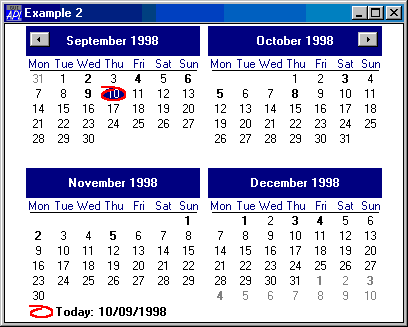

---
search:
  exclude: true
---

# <span class="name">Calendar</span> <span class="right">Example 2</span> {: .heading}


```apl
'F'⎕WC'Form' 'Example 2'('Size' 50 50)
'F.C'⎕WC'Calendar'('Size' 100 100)
```





