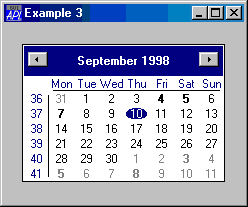

---
search:
  exclude: true
---

# <span class="name">Calendar</span> <span class="right">Example 3</span> {: .heading}


```apl
'F'⎕WC'Form' 'Example 3'('Size' 30 30)
'F.C'⎕WC'Calendar'('CircleToday' 0)('HasToday' 0)('WeekNumbers' 1)
```





