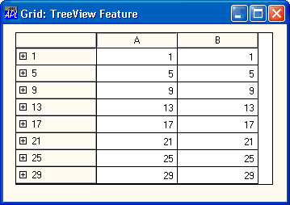
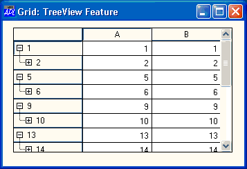
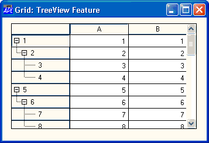

# RowSetVisibleDepth

Method 173

This method is used to set the maximum visible depth of data in rows of a [Grid](../objects/grid.md).

The argument to RowSetVisibleDepth is a numeric scalar as follows

|-----|-----|-------|
|`[1]`|Depth|integer|

All rows in the grid that have a value of [RowTreeDepth](../properties/rowtreedepth.md) less than or equal to *Depth* are expanded. Rows with a value of [RowTreeDepth](../properties/rowtreedepth.md) greater than *Depth* are collapsed.

[Expanding](./expanding.md) and [Retracting](./retracting.md) events are not generated when this method is called.

## Examples
```apl
      'F'⎕WC'Form' 'Grid: TreeView Feature'
      'F.G'⎕WC'Grid'(30 2⍴2/⍳30)
      F.G.RowTreeDepth←30⍴0 1 2 2
```


```apl
      F.G.RowSetVisibleDepth 1
```



```apl
      F.G.RowSetVisibleDepth 99
```



## Application

Objects: [Grid](../objects/grid.md)
