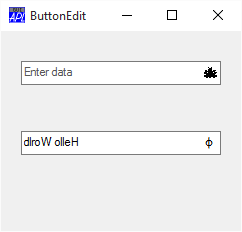

# ButtonEdit

Object

Allows user to enter or edit data.

The ButtonEdit object combines a single-line input field with a customisable button. It provides the same user and programmer interfaces as an [Edit](edit.md) object (Style `'Single'`).

The appearance of the button, which is displayed to the right of the input field, is determined by the [ImageListObj](../properties/imagelistobj.md) property. When clicked, the object generates a [DropDown](../methodorevents/dropdown.md) event. There is no default processing for this event; it is up to the programmer to take the appropriate action via a callback function.

The following picture illustrates two ButtonEdit objects
```apl
     ∇ Example;BK;White;dyalog
[1]    dyalog←2 ⎕NQ'.' 'GetEnvironment' 'Dyalog'
[2]    'F'⎕WC'Form' 'ButtonEdit'('Coord' 'Pixel')('Size' 200 240)
[3]    'F'⎕WS'Coord' 'Pixel'
[4]    'F.IL1'⎕WC'ImageList'('Size' 16 16)('Masked' 1)
[5]    'F.IL1.Time'⎕WC'Icon'(dyalog,'\ws\arachnid.ico')
[6]    'F.BE1'⎕WC'ButtonEdit' ''(30 20)(⍬ 200)
[7]    F.BE1.(Cue ShowCueWhenFocused)←'Enter data' 1
[8]    F.BE1.(ImageListObj ImageIndex)←F.IL1 1
[9]
[10]   'F.fnt'⎕WC'Font' 'APL385 Unicode' 16
[11]   BK←16 16⍴256⊥White←255 255 255
[12]   'F.Rotate'⎕WC'Bitmap'('CBits'BK)('MaskCol'White)
[13]   'F.Rotate.'⎕WC'Text' '⌽'(0 3)('FontObj'F.fnt)
[14]   BK←F.Rotate.CBits
[15]   'F.IL1.'⎕WC'Bitmap'('CBits'BK)('MaskCol'White)
[16]   'F.BE2'⎕WC'ButtonEdit' 'Hello World'(100 20)(⍬ 200)
[17]   F.BE2.(ImageListObj ImageIndex)←F.IL1 2
[18]   F.BE2.onDropDown←'Rotate'
     ∇

     ∇ Rotate msg
[1]    (⊃msg).Text←⌽(⊃msg).Text
     ∇

```



!!! Info "Information"
    For full functionality (in particular, for the [Cue](../properties/cue.md) property to apply), the ButtonEdit object requires that [Native Look and Feel](../miscellaneous/windows-xp-look-and-feel.md) is enabled.

## Application

Parents: [ActiveXControl](../objects/activexcontrol.md), [Form](../objects/form.md), [Group](../objects/group.md), [PropertyPage](../objects/propertypage.md), [SubForm](../objects/subform.md)

Children: [Circle](../objects/circle.md), [Ellipse](../objects/ellipse.md), [Font](../objects/font.md), [ImageList](../objects/imagelist.md), [Marker](../objects/marker.md), [Poly](../objects/poly.md), [Rect](../objects/rect.md), [Text](../objects/text.md), [Timer](../objects/timer.md)

Properties (default order): [Type](../properties/type.md), [Text](../properties/text.md), [Posn](../properties/posn.md), [Size](../properties/size.md), [Style](../properties/style.md), [Coord](../properties/coord.md), [Align](../properties/align.md), [Border](../properties/border.md), [Justify](../properties/justify.md), [Active](../properties/active.md), [Visible](../properties/visible.md), [Event](../properties/event.md), [ImageListObj](../properties/imagelistobj.md), [SelText](../properties/seltext.md), [Sizeable](../properties/sizeable.md), [Dragable](../properties/dragable.md), [FontObj](../properties/fontobj.md), [FCol](../properties/fcol.md), [BCol](../properties/bcol.md), [CursorObj](../properties/cursorobj.md), [AutoConf](../properties/autoconf.md), [Data](../properties/data.md), [Attach](../properties/attach.md), [EdgeStyle](../properties/edgestyle.md), [Handle](../properties/handle.md), [Hint](../properties/hint.md), [HintObj](../properties/hintobj.md), [Tip](../properties/tip.md), [TipObj](../properties/tipobj.md), [FieldType](../properties/fieldtype.md), [MaxLength](../properties/maxlength.md), [Decimals](../properties/decimals.md), [Password](../properties/password.md), [ValidIfEmpty](../properties/validifempty.md), [ReadOnly](../properties/readonly.md), [FormatString](../properties/formatstring.md), [Changed](../properties/changed.md), [Value](../properties/value.md), [Translate](../properties/translate.md), [Accelerator](../properties/accelerator.md), [AcceptFiles](../properties/acceptfiles.md), [KeepOnClose](../properties/keeponclose.md), [Transparent](../properties/transparent.md), [ImageIndex](../properties/imageindex.md), [Redraw](../properties/redraw.md), [TabIndex](../properties/tabindex.md), [Cue](../properties/cue.md), [ShowCueWhenFocused](../properties/showcuewhenfocused.md), [HasClearButton](../properties/hasclearbutton.md), [MethodList](../properties/methodlist.md), [ChildList](../properties/childlist.md), [EventList](../properties/eventlist.md), [PropList](../properties/proplist.md)

Properties (alphabetical order): [Accelerator](../properties/accelerator.md), [AcceptFiles](../properties/acceptfiles.md), [Active](../properties/active.md), [Align](../properties/align.md), [Attach](../properties/attach.md), [AutoConf](../properties/autoconf.md), [BCol](../properties/bcol.md), [Border](../properties/border.md), [Changed](../properties/changed.md), [ChildList](../properties/childlist.md), [Coord](../properties/coord.md), [Cue](../properties/cue.md), [CursorObj](../properties/cursorobj.md), [Data](../properties/data.md), [Decimals](../properties/decimals.md), [Dragable](../properties/dragable.md), [EdgeStyle](../properties/edgestyle.md), [Event](../properties/event.md), [EventList](../properties/eventlist.md), [FCol](../properties/fcol.md), [FieldType](../properties/fieldtype.md), [FontObj](../properties/fontobj.md), [FormatString](../properties/formatstring.md), [Handle](../properties/handle.md), [HasClearButton](../properties/hasclearbutton.md), [Hint](../properties/hint.md), [HintObj](../properties/hintobj.md), [ImageIndex](../properties/imageindex.md), [ImageListObj](../properties/imagelistobj.md), [Justify](../properties/justify.md), [KeepOnClose](../properties/keeponclose.md), [MaxLength](../properties/maxlength.md), [MethodList](../properties/methodlist.md), [Password](../properties/password.md), [Posn](../properties/posn.md), [PropList](../properties/proplist.md), [ReadOnly](../properties/readonly.md), [Redraw](../properties/redraw.md), [SelText](../properties/seltext.md), [ShowCueWhenFocused](../properties/showcuewhenfocused.md), [Size](../properties/size.md), [Sizeable](../properties/sizeable.md), [Style](../properties/style.md), [TabIndex](../properties/tabindex.md), [Text](../properties/text.md), [Tip](../properties/tip.md), [TipObj](../properties/tipobj.md), [Translate](../properties/translate.md), [Transparent](../properties/transparent.md), [Type](../properties/type.md), [ValidIfEmpty](../properties/validifempty.md), [Value](../properties/value.md), [Visible](../properties/visible.md)

Methods: [Animate](../methodorevents/animate.md), [ChooseFont](../methodorevents/choosefont.md), [Detach](../methodorevents/detach.md), [GetFocus](../methodorevents/getfocus.md), [GetFocusObj](../methodorevents/getfocusobj.md), [GetTextSize](../methodorevents/gettextsize.md)

Events: [BadValue](../methodorevents/badvalue.md), [Change](../methodorevents/change.md), [Close](../methodorevents/close.md), [Configure](../methodorevents/configure.md), [ContextMenu](../methodorevents/contextmenu.md), [Create](../methodorevents/create.md), [DragDrop](../methodorevents/dragdrop.md), [DropDown](../methodorevents/dropdown.md), [DropFiles](../methodorevents/dropfiles.md), [DropObjects](../methodorevents/dropobjects.md), [Expose](../methodorevents/expose.md), [FontCancel](../methodorevents/fontcancel.md), [FontOK](../methodorevents/fontok.md), [GesturePan](../methodorevents/gesturepan.md), [GesturePressAndTap](../methodorevents/gesturepressandtap.md), [GestureRotate](../methodorevents/gesturerotate.md), [GestureTwoFingerTap](../methodorevents/gesturetwofingertap.md), [GestureZoom](../methodorevents/gesturezoom.md), [GotFocus](../methodorevents/gotfocus.md), [Help](../methodorevents/help.md), [KeyError](../methodorevents/keyerror.md), [KeyPress](../methodorevents/keypress.md), [LostFocus](../methodorevents/lostfocus.md), [MouseDblClick](../methodorevents/mousedblclick.md), [MouseDown](../methodorevents/mousedown.md), [MouseEnter](../methodorevents/mouseenter.md), [MouseLeave](../methodorevents/mouseleave.md), [MouseMove](../methodorevents/mousemove.md), [MouseUp](../methodorevents/mouseup.md), [MouseWheel](../methodorevents/mousewheel.md), [Select](../methodorevents/select.md)
