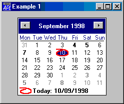
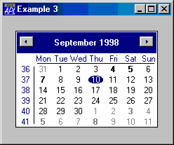

# Calendar

Object

The Calendar object provides an interface to the Month Calendar Control

The Calendar object displays a calendar and allows the user to select a date or range of dates. The following illustration shows a default Calendar object.



The Calendar object will display as many full months as it can fit into the area specified by its Size property as shown below. The minimum size required to encompass a single month may be obtained using the [GetMinSize](../methodorevents/getminsize.md) method.
```apl
'F'⎕WC'Form' 'Example 2'('Size' 50 50)
'F.C'⎕WC'Calendar'('Size' 100 100)
```


The [Today](../properties/today.md) property is an [IDN](../miscellaneous/international-day-number.md) that specifies the current day. Its default value is today's date, that is, the local date set on your computer.

The [CircleToday](../properties/circletoday.md) property is either 0 or 1 (the default) and specifies whether or not the Today date is circled when the Calendar object is showing the corresponding month.

The [HasToday](../properties/hastoday.md) property is either 0 or 1 (the default) and specifies whether or not the Today date is displayed (using the Windows short date format) in the bottom left of the Calendar object.

The [WeekNumbers](../properties/weeknumbers.md) property is either 0 (the default) or 1 and specifies whether or not the Calendar displays week numbers.

The following example shows a Calendar with both [CircleToday](../properties/circletoday.md) and [HasToday](../properties/hastoday.md) set to 0 and [WeekNumbers](../properties/weeknumbers.md) set to 1.
```apl
'F'⎕WC'Form' 'Example 3'('Size' 30 30)
'F.C'⎕WC'Calendar'('CircleToday' 0)('HasToday' 0)('WeekNumbers' 1)
```



The [FirstDay](../properties/firstday.md) property is an integer whose value is in the range 0-6. [FirstDay](../properties/firstday.md) specifies the day that is considered to be the first day of the week and which appears first in the Calendar. The default value for [FirstDay](../properties/firstday.md) depends upon your International Settings.

The [MinDate](../properties/mindate.md) and [MaxDate](../properties/maxdate.md) properties are integers that specify the minimum and maximum [IDN](../miscellaneous/international-day-number.md) values that the user may display and select in the Calendar object. By default these properties specify the entire range of dates that the Windows Month Calendar control can provide.

The [MonthDelta](../properties/monthdelta.md) property specifies the number of months by which the Calendar object scrolls when the user clicks its scroll buttons. The default is empty (zilde) which implies the number of months currently shown.

The [Style](../properties/style.md) property may be either `'Single'` (the default) or '`Multi'`. If [Style](../properties/style.md) is `'Single'`, the user may select a single date. If [Style](../properties/style.md) is '`Multi'`, the user may select a contiguous range of dates. In this case, the maximum number of contiguous days that can be selected is defined by the [MaxSelCount](../properties/maxselcount.md) property which is an integer whose default value is 7.

The [SelDate](../properties/seldate.md) property is a 2-element integer vector of [IDN](../miscellaneous/international-day-number.md) values that identifies the first and last dates that are currently selected.

When the user selects one or more dates, the Calendar object generates a [SelDateChange](../methodorevents/seldatechange.md) event. This event is also generated when the Calendar object is scrolled, and the selection changes automatically to another month.

The Calendar displays day numbers using either the normal or the bold font attribute and you may specify which attribute is to be used for each day shown. However, the Calendar object does not store this information beyond the month or months currently displayed.

When the Calendar control scrolls (and potentially at other times), it generates a [GetDayStates](../methodorevents/getdaystates.md) event that, in effect, asks you (the APL program) to tell it which (if any) of the dates that are about to be shown should be displayed in bold.

If you wish *any* dates to be displayed using the bold font attribute, you must attach a callback function to the [GetDayStates](../methodorevents/getdaystates.md) event which returns this information in its result. By default, all dates are displayed using the normal font attribute, so you only need a callback function if you want any dates to be displayed in bold.

You may also set the font attribute for particular days in the range currently displayed by calling [GetDayStates](../methodorevents/getdaystates.md) as a method.

The [CalendarCols](../properties/calendarcols.md) property specifies the colours used for various elements in the Calendar object.

You can convert dates between [IDN](../miscellaneous/international-day-number.md) and `⎕TS` representations using the [IDNToDate](../methodorevents/idntodate.md) and [DateToIDN](../methodorevents/datetoidn.md) methods. These methods apply to **all** objects, not just to the Calendar object itself.

The [GetVisibleRange](../methodorevents/getvisiblerange.md) method reports the range of dates that is currently visible in the Calendar object.

## Application

Parents: [ActiveXControl](../objects/activexcontrol.md), [Form](../objects/form.md), [Group](../objects/group.md), [PropertyPage](../objects/propertypage.md), [SubForm](../objects/subform.md), [ToolBar](../objects/toolbar.md)

Children: [Cursor](../objects/cursor.md), [Font](../objects/font.md), [Menu](../objects/menu.md), [MsgBox](../objects/msgbox.md), [TCPSocket](../objects/tcpsocket.md), [Timer](../objects/timer.md)

Properties (default order): [Type](../properties/type.md), [Posn](../properties/posn.md), [Size](../properties/size.md), [Style](../properties/style.md), [Coord](../properties/coord.md), [Border](../properties/border.md), [Active](../properties/active.md), [Visible](../properties/visible.md), [Event](../properties/event.md), [FirstDay](../properties/firstday.md), [MaxSelCount](../properties/maxselcount.md), [SelDate](../properties/seldate.md), [MinDate](../properties/mindate.md), [MaxDate](../properties/maxdate.md), [CalendarCols](../properties/calendarcols.md), [Today](../properties/today.md), [HasToday](../properties/hastoday.md), [CircleToday](../properties/circletoday.md), [WeekNumbers](../properties/weeknumbers.md), [MonthDelta](../properties/monthdelta.md), [Sizeable](../properties/sizeable.md), [Dragable](../properties/dragable.md), [FontObj](../properties/fontobj.md), [CursorObj](../properties/cursorobj.md), [AutoConf](../properties/autoconf.md), [Data](../properties/data.md), [Attach](../properties/attach.md), [EdgeStyle](../properties/edgestyle.md), [Handle](../properties/handle.md), [Hint](../properties/hint.md), [HintObj](../properties/hintobj.md), [Tip](../properties/tip.md), [TipObj](../properties/tipobj.md), [Accelerator](../properties/accelerator.md), [KeepOnClose](../properties/keeponclose.md), [Redraw](../properties/redraw.md), [TabIndex](../properties/tabindex.md), [MethodList](../properties/methodlist.md), [ChildList](../properties/childlist.md), [EventList](../properties/eventlist.md), [PropList](../properties/proplist.md)

Properties (alphabetical order): [Accelerator](../properties/accelerator.md), [Active](../properties/active.md), [Attach](../properties/attach.md), [AutoConf](../properties/autoconf.md), [Border](../properties/border.md), [CalendarCols](../properties/calendarcols.md), [ChildList](../properties/childlist.md), [CircleToday](../properties/circletoday.md), [Coord](../properties/coord.md), [CursorObj](../properties/cursorobj.md), [Data](../properties/data.md), [Dragable](../properties/dragable.md), [EdgeStyle](../properties/edgestyle.md), [Event](../properties/event.md), [EventList](../properties/eventlist.md), [FirstDay](../properties/firstday.md), [FontObj](../properties/fontobj.md), [Handle](../properties/handle.md), [HasToday](../properties/hastoday.md), [Hint](../properties/hint.md), [HintObj](../properties/hintobj.md), [KeepOnClose](../properties/keeponclose.md), [MaxDate](../properties/maxdate.md), [MaxSelCount](../properties/maxselcount.md), [MethodList](../properties/methodlist.md), [MinDate](../properties/mindate.md), [MonthDelta](../properties/monthdelta.md), [Posn](../properties/posn.md), [PropList](../properties/proplist.md), [Redraw](../properties/redraw.md), [SelDate](../properties/seldate.md), [Size](../properties/size.md), [Sizeable](../properties/sizeable.md), [Style](../properties/style.md), [TabIndex](../properties/tabindex.md), [Tip](../properties/tip.md), [TipObj](../properties/tipobj.md), [Today](../properties/today.md), [Type](../properties/type.md), [Visible](../properties/visible.md), [WeekNumbers](../properties/weeknumbers.md)

Methods: [Animate](../methodorevents/animate.md), [ChooseFont](../methodorevents/choosefont.md), [DateToIDN](../methodorevents/datetoidn.md), [Detach](../methodorevents/detach.md), [GetFocus](../methodorevents/getfocus.md), [GetFocusObj](../methodorevents/getfocusobj.md), [GetMinSize](../methodorevents/getminsize.md), [GetTextSize](../methodorevents/gettextsize.md), [GetVisibleRange](../methodorevents/getvisiblerange.md), [IDNToDate](../methodorevents/idntodate.md)

Events: [CalendarDblClick](../methodorevents/calendardblclick.md), [CalendarDown](../methodorevents/calendardown.md), [CalendarMove](../methodorevents/calendarmove.md), [CalendarUp](../methodorevents/calendarup.md), [Close](../methodorevents/close.md), [Configure](../methodorevents/configure.md), [ContextMenu](../methodorevents/contextmenu.md), [Create](../methodorevents/create.md), [DragDrop](../methodorevents/dragdrop.md), [DropFiles](../methodorevents/dropfiles.md), [DropObjects](../methodorevents/dropobjects.md), [Expose](../methodorevents/expose.md), [FontCancel](../methodorevents/fontcancel.md), [FontOK](../methodorevents/fontok.md), [GesturePan](../methodorevents/gesturepan.md), [GesturePressAndTap](../methodorevents/gesturepressandtap.md), [GestureRotate](../methodorevents/gesturerotate.md), [GestureTwoFingerTap](../methodorevents/gesturetwofingertap.md), [GestureZoom](../methodorevents/gesturezoom.md), [GetDayStates](../methodorevents/getdaystates.md), [GotFocus](../methodorevents/gotfocus.md), [Help](../methodorevents/help.md), [KeyPress](../methodorevents/keypress.md), [LostFocus](../methodorevents/lostfocus.md), [MouseDblClick](../methodorevents/mousedblclick.md), [MouseDown](../methodorevents/mousedown.md), [MouseEnter](../methodorevents/mouseenter.md), [MouseLeave](../methodorevents/mouseleave.md), [MouseMove](../methodorevents/mousemove.md), [MouseUp](../methodorevents/mouseup.md), [MouseWheel](../methodorevents/mousewheel.md), [SelDateChange](../methodorevents/seldatechange.md), [Select](../methodorevents/select.md)
