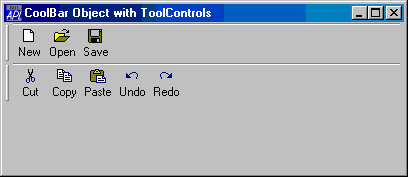
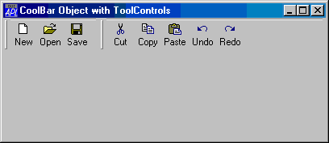
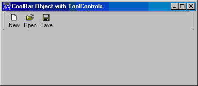
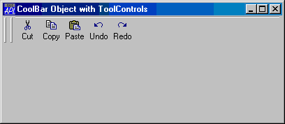

# CoolBar

Object

The CoolBar object acts as a container for CoolBand objects.

The CoolBar and [CoolBand](coolband.md) objects provide
an interface to Windows *Rebar Controls*

A CoolBar contains one or more bands ([CoolBand](coolband.md) objects). Each band can have any combination of a gripper bar, a bitmap, a text
label, and a single child object.

Using the gripper bars, the user may drag bands from one row to another,
resize bands in the same row, and maximise or minimise bands in a row.

The following example illustrates a CoolBar
containing 2 CoolBands each of which is displaying a ToolControl object.

```apl
'F'⎕WC'Form' 'CoolBar Object with ToolControls'('Size' 25 50)
'F.IL'⎕WC'ImageList'('Masked' 0)('MapCols' 1)
'F.IL.'⎕WC'Bitmap'('ComCtl32' 120)⍝ STD_SMALL

'F.CB'⎕WC'CoolBar'

:With 'F.CB.C1'⎕WC'CoolBand'
    'TB'⎕WC'ToolControl'('ImageListObj' '#.F.IL')
    'TB.B1'⎕WC'ToolButton' 'New'('ImageIndex' 7)
    'TB.B2'⎕WC'ToolButton' 'Open'('ImageIndex' 8)
    'TB.B3'⎕WC'ToolButton' 'Save'('ImageIndex' 9)
:EndWith

:With 'F.CB.C2'⎕WC'CoolBand'
    'TB'⎕WC'ToolControl'('ImageListObj' '#.F.IL')
    'TB.B1'⎕WC'ToolButton' 'Cut'('ImageIndex' 1)
    'TB.B2'⎕WC'ToolButton' 'Copy'('ImageIndex' 2)
    'TB.B3'⎕WC'ToolButton' 'Paste'('ImageIndex' 3)
    'TB.B4'⎕WC'ToolButton' 'Undo'('ImageIndex' 4)
    'TB.B5'⎕WC'ToolButton' 'Redo'('ImageIndex' 5)
:EndWith
```



The CoolBar allows the user to organise the CoolBands within it as required. The next three pictures illustrate this feature.



after user has moved band 2 into row 1



after user has maximised band 1



after user has maximised band 2

The second example illustrates a CoolBar
containing 3 CoolBands displaying an Edit, Combo and multi-line Edit
respectively.
```apl
'F'⎕WC'Form' 'CoolBar Object with simple controls'('Size' 25 40)
'F'⎕WS'Coord' 'Pixel'

'F.CB'⎕WC'CoolBar'

:With 'F.CB.C1'⎕WC'CoolBand'
    'E1'⎕WC'Edit' 'Edit1'
:EndWith

:With 'F.CB.C2'⎕WC'CoolBand'
    'C1'⎕WC'Combo'('One' 'Two' 'Three')('SelItems' 0 1 0)
:EndWith

:With 'F.CB.C3'⎕WC'CoolBand'
    'E2'⎕WC'Edit'(3 5⍴'Edit2')('Style' 'Multi')
:EndWith
```


The [VariableHeight](../properties/variableheight.md) property
specifies whether or not the CoolBar displays bands in different rows at the
minimum required height (the default), or all the same height.

The [BandBorders](../properties/bandborders.md) property specifies
whether or not narrow lines are drawn to separate adjacent bands. The default is
0 (no lines).

The [DblClickToggle](../properties/dblclicktoggle.md) property
specifies whether or not the user must single-click (the default) or
double-click to toggle a child [CoolBand](coolband.md) between its maximised and minimised state.

The [FixedOrder](../properties/fixedorder.md) property specifies
whether or not the CoolBar displays [CoolBands](coolband.md) in the same order. If [FixedOrder](../properties/fixedorder.md) is 1,
the user may move bands to different rows, but the band order is static. The
default is 0. When the user moves a CoolBand within a CoolBar, its
Index and (potentially) [NewLine](../properties/newline.md) properties
change to reflect its new position.

If you wish to display pictures in one or more of the [CoolBands](coolband.md) owned by a CoolBar, you do so by setting the [ImageListObj](../properties/imagelistobj.md) property to the name of an [ImageList](imagelist.md) object
which contains the pictures. Pictures are allocated to individual [CoolBands](coolband.md) via their ImageIndex properties.

## Application

Parents: [ActiveXControl](../objects/activexcontrol.md), [Form](../objects/form.md)

Children: [CoolBand](../objects/coolband.md), [ImageList](../objects/imagelist.md), [Menu](../objects/menu.md), [Timer](../objects/timer.md)

Properties (default order): [Type](../properties/type.md), [Posn](../properties/posn.md), [Size](../properties/size.md), [Align](../properties/align.md), [Event](../properties/event.md), [ImageListObj](../properties/imagelistobj.md), [FCol](../properties/fcol.md), [BCol](../properties/bcol.md), [CursorObj](../properties/cursorobj.md), [Data](../properties/data.md), [Attach](../properties/attach.md), [Handle](../properties/handle.md), [KeepOnClose](../properties/keeponclose.md), [BandBorders](../properties/bandborders.md), [DblClickToggle](../properties/dblclicktoggle.md), [FixedOrder](../properties/fixedorder.md), [VariableHeight](../properties/variableheight.md), [DockChildren](../properties/dockchildren.md), [Redraw](../properties/redraw.md), [MethodList](../properties/methodlist.md), [ChildList](../properties/childlist.md), [EventList](../properties/eventlist.md), [PropList](../properties/proplist.md)

Properties (alphabetical order): [Align](../properties/align.md), [Attach](../properties/attach.md), [BandBorders](../properties/bandborders.md), [BCol](../properties/bcol.md), [ChildList](../properties/childlist.md), [CursorObj](../properties/cursorobj.md), [Data](../properties/data.md), [DblClickToggle](../properties/dblclicktoggle.md), [DockChildren](../properties/dockchildren.md), [Event](../properties/event.md), [EventList](../properties/eventlist.md), [FCol](../properties/fcol.md), [FixedOrder](../properties/fixedorder.md), [Handle](../properties/handle.md), [ImageListObj](../properties/imagelistobj.md), [KeepOnClose](../properties/keeponclose.md), [MethodList](../properties/methodlist.md), [Posn](../properties/posn.md), [PropList](../properties/proplist.md), [Redraw](../properties/redraw.md), [Size](../properties/size.md), [Type](../properties/type.md), [VariableHeight](../properties/variableheight.md)

Methods: [Animate](../methodorevents/animate.md), [Detach](../methodorevents/detach.md), [GetFocus](../methodorevents/getfocus.md), [GetFocusObj](../methodorevents/getfocusobj.md), [GetTextSize](../methodorevents/gettextsize.md)

Events: [Close](../methodorevents/close.md), [Configure](../methodorevents/configure.md), [ContextMenu](../methodorevents/contextmenu.md), [Create](../methodorevents/create.md), [DockAccept](../methodorevents/dockaccept.md), [DockCancel](../methodorevents/dockcancel.md), [DockEnd](../methodorevents/dockend.md), [DockMove](../methodorevents/dockmove.md), [DockRequest](../methodorevents/dockrequest.md), [DockStart](../methodorevents/dockstart.md), [DragDrop](../methodorevents/dragdrop.md), [DropFiles](../methodorevents/dropfiles.md), [DropObjects](../methodorevents/dropobjects.md), [Expose](../methodorevents/expose.md), [Help](../methodorevents/help.md)
