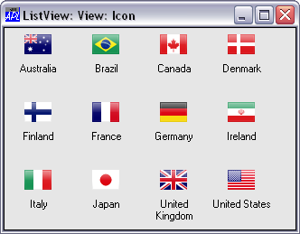
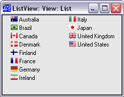
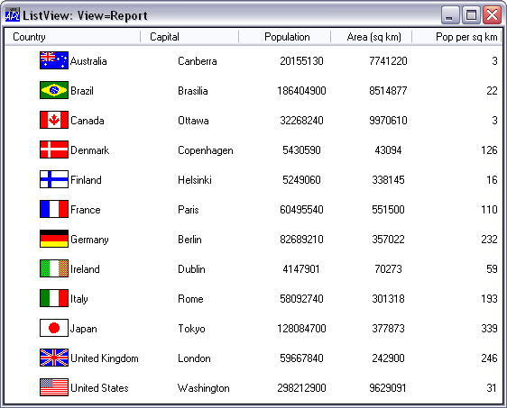
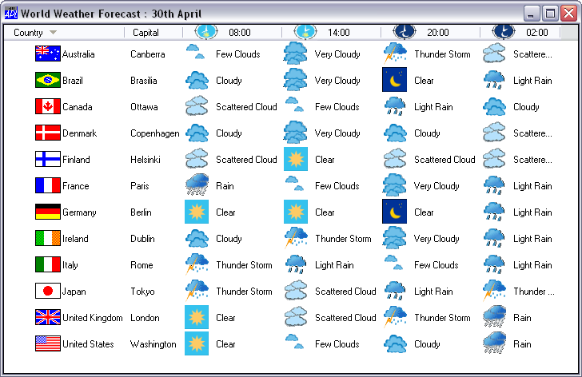
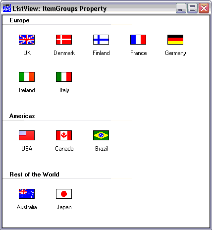

# ListView

Object

The ListView object displays a collection of items.

The ListView object is a window that displays a collection of items, each item consisting of an icon and a label. The ListView provides several ways of
arranging items and displaying individual items. For example, additional information about each item can be displayed in columns to the right of the icon
and label. An example of the use of a ListView object is the "My Computer" Windows utility.

The Items property is a vector of character vectors that specifies the labels for the items displayed by the ListView. The [ImageListObj](../properties/imagelistobj.md) property specifies the names of two [ImageList](imagelist.md) objects that define two sets of icons; a large icon (32x32 pixel) set and a
small icon (16x16 pixel) set. Alternatively, [ImageListObj](../properties/imagelistobj.md) may be empty (no icons displayed) or contain just the name of a single large icon [ImageList](imagelist.md).

The [View](../properties/view.md) property contains a character vector that determines how the items are displayed. It can have one of the following values: `'Icon'` (the default), `'SmallIcon'`, `'List'`, or `'Report'`. When View is `'Icon'` or `'SmallIcon'`, the items are arranged *row-wise* with large or small icons as appropriate. In these views, setting the [Align](../properties/align.md) property to `'Left'` left-aligns the items along the left side of the object. When View is set to `'List'`, the items are arranged *column-wise* using small icons. Examples of `'Icon'` and `'List'` views are illustrated below.

When View is set to `'Report'`, the items are displayed in a single column using small icons but with the matrix specified by [ReportInfo](../properties/reportinfo.md) displayed alongside. In this format, the Boolean [Header](../properties/header.md) property determines whether or not the object also provides column headings. Its default value is 1. The column headings themselves are specified by the ColTitles property. Their alignment (and the alignment of the data in the columns beneath them) is defined by the [ColTitleAlign](../properties/coltitlealign.md) property.

The appearance of the column titles is further controlled by the [ColTitle3D](../properties/coltitle3d.md) property. This is a Boolean value (default 1) which specifies whether or not the column titles have a 3-dimensional (plinth) appearance. [Header](../properties/header.md) and [ColTitle3D](../properties/coltitle3d.md) may only be set when the object is created using `⎕WC` and may not subsequently be changed by `⎕WS`.

In `'Report'` View, columns may be resized by the user dragging the bars between the titles, or under program control using the SetColSize event. A `'Report'` view example is illustrated below.

The [DragItems](../properties/dragitems.md) property is Boolean and specifies whether or not the user may drag an item from one position to another. Its default value is 1 (dragging is enabled).

The [AutoArrange](../properties/autoarrange.md) property is Boolean and specifies whether or not the items are automatically re-arranged whenever an
item is repositioned by the user or moved under program control. Its default value is 0.

The [EditLabels](../properties/editlabels.md) is a Boolean property (default 0) that determines whether or not the user may edit the labels which
are specified by the Items property.

The [Style](../properties/style.md) property may be `'Single'`, which specifies that only one item may be selected at a time, or `'Multi'` which permits multiple selections to be made. The default is `'Multi'`.

The [CheckBoxes](../properties/checkboxes.md) property is Boolean and specifies whether or not check boxes are drawn to the left of items. Its
default value is 0.

The [GridLines](../properties/gridlines.md) property is Boolean and specifies whether or not grid lines are drawn between items. This applies only
when View is `'Report'`. Its default value is 0.

In `'Report'` View, the [ReportImageIndex](../properties/reportimageindex.md) property specify images to be displayed alongside each item, and overrides the images specified by [ImageListObj](../properties/imagelistobj.md). The [HeaderImageList](../properties/headerimagelist.md) and [HeaderImageIndex](../properties/headerimageindex.md)  properties specify images to be displayed alongside each column title.

The following example illustrates the use of these properties.

The [ReportBCol](../properties/reportbcol.md) property specifies each item's background colour.

The [FullRowSelect](../properties/fullrowselect.md) property is Boolean and specifies whether or not the entire row is highlighted to indicate
selected items. This applies only when View is `'Report'`. Its default value is 0.

The [ItemGroups](../properties/itemgroups.md) and [ItemGroupMetrics](../properties/itemgroupmetrics.md) properties allow you to display items in groups as illustrated below.

!!! Info "Information"
    This feature only applies if [Native Look and Feel](../miscellaneous/windows-xp-look-and-feel.md) is enabled.

## Application

Parents: [ActiveXControl](../objects/activexcontrol.md), [CoolBand](../objects/coolband.md), [Form](../objects/form.md), [Group](../objects/group.md), [PropertyPage](../objects/propertypage.md), [SubForm](../objects/subform.md), [ToolBar](../objects/toolbar.md), [ToolControl](../objects/toolcontrol.md)

Children: [Bitmap](../objects/bitmap.md), [Circle](../objects/circle.md), [Cursor](../objects/cursor.md), [Ellipse](../objects/ellipse.md), [Font](../objects/font.md), [Icon](../objects/icon.md), [ImageList](../objects/imagelist.md), [Marker](../objects/marker.md), [Poly](../objects/poly.md), [Rect](../objects/rect.md), [Text](../objects/text.md), [Timer](../objects/timer.md)

Properties (default order): [Type](../properties/type.md), [Items](../properties/items.md), [Posn](../properties/posn.md), [Size](../properties/size.md), [Style](../properties/style.md), [Coord](../properties/coord.md), [Align](../properties/align.md), [Border](../properties/border.md), [Active](../properties/active.md), [Visible](../properties/visible.md), [Event](../properties/event.md), [DragItems](../properties/dragitems.md), [View](../properties/view.md), [AutoArrange](../properties/autoarrange.md), [Header](../properties/header.md), [Wrap](../properties/wrap.md), [EditLabels](../properties/editlabels.md), [ImageListObj](../properties/imagelistobj.md), [ReportInfo](../properties/reportinfo.md), [ColTitles](../properties/coltitles.md), [ImageIndex](../properties/imageindex.md), [ReportImageIndex](../properties/reportimageindex.md), [ReportBCol](../properties/reportbcol.md), [HeaderImageList](../properties/headerimagelist.md), [HeaderImageIndex](../properties/headerimageindex.md), [VScroll](../properties/vscroll.md), [HScroll](../properties/hscroll.md), [SelItems](../properties/selitems.md), [Sizeable](../properties/sizeable.md), [Dragable](../properties/dragable.md), [FontObj](../properties/fontobj.md), [FCol](../properties/fcol.md), [BCol](../properties/bcol.md), [CursorObj](../properties/cursorobj.md), [AutoConf](../properties/autoconf.md), [Data](../properties/data.md), [Attach](../properties/attach.md), [EdgeStyle](../properties/edgestyle.md), [Handle](../properties/handle.md), [Hint](../properties/hint.md), [HintObj](../properties/hintobj.md), [Tip](../properties/tip.md), [TipObj](../properties/tipobj.md), [ColTitleAlign](../properties/coltitlealign.md), [ColTitle3D](../properties/coltitle3d.md), [Translate](../properties/translate.md), [Accelerator](../properties/accelerator.md), [AcceptFiles](../properties/acceptfiles.md), [KeepOnClose](../properties/keeponclose.md), [CheckBoxes](../properties/checkboxes.md), [FullRowSelect](../properties/fullrowselect.md), [GridLines](../properties/gridlines.md), [Redraw](../properties/redraw.md), [TabIndex](../properties/tabindex.md), [AlwaysShowSelection](../properties/alwaysshowselection.md), [ItemGroups](../properties/itemgroups.md), [ItemGroupMetrics](../properties/itemgroupmetrics.md), [MethodList](../properties/methodlist.md), [ChildList](../properties/childlist.md), [EventList](../properties/eventlist.md), [PropList](../properties/proplist.md)

Properties (alphabetical order): [Accelerator](../properties/accelerator.md), [AcceptFiles](../properties/acceptfiles.md), [Active](../properties/active.md), [Align](../properties/align.md), [AlwaysShowSelection](../properties/alwaysshowselection.md), [Attach](../properties/attach.md), [AutoArrange](../properties/autoarrange.md), [AutoConf](../properties/autoconf.md), [BCol](../properties/bcol.md), [Border](../properties/border.md), [CheckBoxes](../properties/checkboxes.md), [ChildList](../properties/childlist.md), [ColTitle3D](../properties/coltitle3d.md), [ColTitleAlign](../properties/coltitlealign.md), [ColTitles](../properties/coltitles.md), [Coord](../properties/coord.md), [CursorObj](../properties/cursorobj.md), [Data](../properties/data.md), [Dragable](../properties/dragable.md), [DragItems](../properties/dragitems.md), [EdgeStyle](../properties/edgestyle.md), [EditLabels](../properties/editlabels.md), [Event](../properties/event.md), [EventList](../properties/eventlist.md), [FCol](../properties/fcol.md), [FontObj](../properties/fontobj.md), [FullRowSelect](../properties/fullrowselect.md), [GridLines](../properties/gridlines.md), [Handle](../properties/handle.md), [Header](../properties/header.md), [HeaderImageIndex](../properties/headerimageindex.md), [HeaderImageList](../properties/headerimagelist.md), [Hint](../properties/hint.md), [HintObj](../properties/hintobj.md), [HScroll](../properties/hscroll.md), [ImageIndex](../properties/imageindex.md), [ImageListObj](../properties/imagelistobj.md), [ItemGroupMetrics](../properties/itemgroupmetrics.md), [ItemGroups](../properties/itemgroups.md), [Items](../properties/items.md), [KeepOnClose](../properties/keeponclose.md), [MethodList](../properties/methodlist.md), [Posn](../properties/posn.md), [PropList](../properties/proplist.md), [Redraw](../properties/redraw.md), [ReportBCol](../properties/reportbcol.md), [ReportImageIndex](../properties/reportimageindex.md), [ReportInfo](../properties/reportinfo.md), [SelItems](../properties/selitems.md), [Size](../properties/size.md), [Sizeable](../properties/sizeable.md), [Style](../properties/style.md), [TabIndex](../properties/tabindex.md), [Tip](../properties/tip.md), [TipObj](../properties/tipobj.md), [Translate](../properties/translate.md), [Type](../properties/type.md), [View](../properties/view.md), [Visible](../properties/visible.md), [VScroll](../properties/vscroll.md), [Wrap](../properties/wrap.md)

Methods: [Animate](../methodorevents/animate.md), [ChooseFont](../methodorevents/choosefont.md), [Detach](../methodorevents/detach.md), [GetFocus](../methodorevents/getfocus.md), [GetFocusObj](../methodorevents/getfocusobj.md), [GetItemPosition](../methodorevents/getitemposition.md), [GetItemState](../methodorevents/getitemstate.md), [GetTextSize](../methodorevents/gettextsize.md), [SetItemState](../methodorevents/setitemstate.md)

Events: [BeginEditLabel](../methodorevents/begineditlabel.md), [Close](../methodorevents/close.md), [ColumnClick](../methodorevents/columnclick.md), [Configure](../methodorevents/configure.md), [ContextMenu](../methodorevents/contextmenu.md), [Create](../methodorevents/create.md), [DragDrop](../methodorevents/dragdrop.md), [DropFiles](../methodorevents/dropfiles.md), [DropObjects](../methodorevents/dropobjects.md), [EndEditLabel](../methodorevents/endeditlabel.md), [Expose](../methodorevents/expose.md), [FontCancel](../methodorevents/fontcancel.md), [FontOK](../methodorevents/fontok.md), [GesturePan](../methodorevents/gesturepan.md), [GesturePressAndTap](../methodorevents/gesturepressandtap.md), [GestureRotate](../methodorevents/gesturerotate.md), [GestureTwoFingerTap](../methodorevents/gesturetwofingertap.md), [GestureZoom](../methodorevents/gesturezoom.md), [GetTipText](../methodorevents/gettiptext.md), [GotFocus](../methodorevents/gotfocus.md), [Help](../methodorevents/help.md), [ItemDblClick](../methodorevents/itemdblclick.md), [ItemDown](../methodorevents/itemdown.md), [ItemUp](../methodorevents/itemup.md), [KeyPress](../methodorevents/keypress.md), [LostFocus](../methodorevents/lostfocus.md), [MouseDblClick](../methodorevents/mousedblclick.md), [MouseDown](../methodorevents/mousedown.md), [MouseEnter](../methodorevents/mouseenter.md), [MouseLeave](../methodorevents/mouseleave.md), [MouseMove](../methodorevents/mousemove.md), [MouseUp](../methodorevents/mouseup.md), [MouseWheel](../methodorevents/mousewheel.md), [Select](../methodorevents/select.md), [SetColSize](../methodorevents/setcolsize.md), [SetItemPosition](../methodorevents/setitemposition.md)
