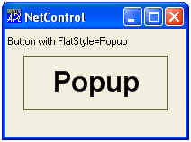
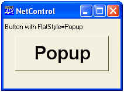
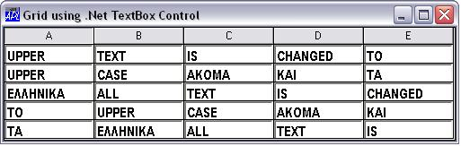

# <span class="name">NetControl</span> <span class="right">Object</span> {: .heading}


|---------------------------------------|---------------------------------------|----------------------------------------|
|[Parents](../parentlists/netcontrol.md)|[Children](../childlists/netcontrol.md)|[Properties](../proplists/netcontrol.md)|


**Purpose:** The NetControl object provides the means to instantiate a .NET control         in the Dyalog GUI.

**Description**


In principle, you may use the NetControl to embed any class that derives from System.Windows.Forms.Control (from system.windows.forms.dll), including derived classes written in Dyalog APL.


To load a particular .NET control, the appropriate .NET Assembly must be specified in `⎕USING`; otherwise the expression will cause a `LIMIT ERROR`. For example, to load one of the standard .NET controls:
```apl
⎕USING,←⊂'System.Windows.Forms,system.windows.forms.dll'
```


The [ ClassName](../properties/classname.md) property specifies the name of the .NET control to be instantiated and to which the new object named by the left argument of `⎕WC` is to be connected.
[ ClassName](../properties/classname.md) may only be specified by `⎕WC`.


Once you have created an instance of a particular NetControl, the properties, events and methods it supports may be obtained using `⎕NL`. These are the properties, events and methods defined for the control by its author. The "Dyalog" properties listed above, are not reported by
`⎕NL`, but take precedence over (that is, mask) any members of the same name that may be exposed by the class itself.


The following example illustrates the use of the Button class. In this case, the FlatStyle property of the button is set to "Popup". This gives the button a flat appearance until the mouse is hovered over it, when its appearance it changes to 3-dimensional.
```apl
       ⎕USING←'System'
       ⎕USING,←⊂'System.Windows.Forms,system.windows.forms.dll'
       ⎕USING,←⊂'System.Drawing,system.drawing.dll'
       an←⎕NEW FontFamily(⊂'Arial')
       myfont←⎕NEW Font(an 24 FontStyle.Bold GraphicsUnit.Point)

       'f'⎕WC'Form'('Coord' 'Pixel')('Size' 120 200)
       f.Caption←'NetControl'
       'f.l'⎕WC'Label' 'Button with FlatStyle=Popup'(2 2)

       'f.b'⎕WC'NetControl' 'Button'('Size' 60 160)

       f.b.⎕NL ¯2
AutoSizeMode DialogResult AutoEllipsis AutoSize BackColor FlatStyle FlatAppearance...

       f.b.⎕NL ¯3
BeginInvoke BringToFront Contains CreateControl CreateGraphics CreateObjRef Dispose DoDragDrop...

       f.b.⎕NL¯8
DoubleClick MouseDoubleClick AutoSizeChanged ImeModeChanged BackColorChanged...

       f.b.Text←'Popup'
       f.b.Font←myfont

       f.b.(FlatStyle←FlatStyle.Popup)

```


|Normal appearance (Flat)              |Appearance when mouse over            |
|--------------------------------------|--------------------------------------|
|||


In most cases, you may use a NetControl in the cells of a [ Grid](grid.md) object. Unless you specify otherwise, using the
[ InputProperties](../properties/inputproperties.md) property of the [ Grid](grid.md), the default property of the NetControl will be associated with the corresponding element of Values. The following example illustrates the use of a TextBox control. In this example, the CharacterCasing property of the TextBox is set to Upper, causing all text to be converted to upper-case.
```apl
       ⎕USING←'System'
       ⎕USING,←⊂'System.Windows.Forms,system.windows.forms.dll'
       ⎕USING,←⊂'System.Drawing,system.drawing.dll'
       an←⎕NEW FontFamily(⊂'Arial Narrow')
       myfont←⎕NEW Font(an 11 FontStyle.Bold GraphicsUnit.Point)
       'f'⎕WC'Form'('Coord' 'Pixel')('Size' 130 500)
       f.Caption←'Grid using .NET TextBox Control'
       'f.g'⎕WC'Grid'('Posn' 0 0)f.Size
       f.g.(ShowInput TitleWidth)←1 0
       'f.g.tb'⎕WC'NetControl' 'TextBox'
       f.g.tb.Font←myfont
       f.g.tb.(CharacterCasing←CharacterCasing.Upper)
       f.g.Input←'f.g.tb'
       wds←'All' 'TeXt' 'Is' 'Changed' 'to' 'Upper' 'casE'
       wds,←'ακομα' 'kai' 'τα' 'Ελληνικα'
       f.g.Values←5 5⍴wds
```





Implementation note: The instance of the .NET control is actually placed inside an instance of the .NET class System.Windows.Forms.ContainerControl. This ContainerControl is then embedded in the Dyalog parent, such as a
[Form](form.md). This "extra level" should have no effect on how the control is used or on how it behaves.


