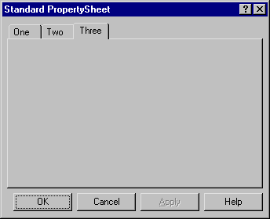
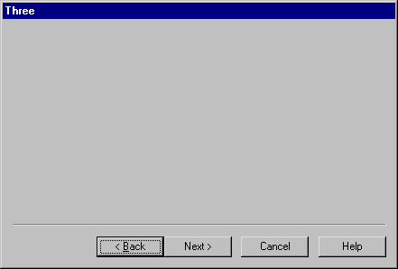

# PropertySheet

Object

The PropertySheet object represents a standard multi-page dialog box.

There are two different kinds of PropertySheet which you select using the Style property. This may only be set when the PropertySheet is created using `⎕WC` and Style may not subsequently be changed using `⎕WS`.

If Style is Standard (the default), the PropertySheet displays a set of pages (each represented by a [PropertyPage](propertypage.md)) as a set of tabbed forms as illustrated below. The user selects the current page by clicking on the appropriate tab. This Style allows the user to select any page at any time and does not oblige the user to visit any but the first page you choose to display. This Style is useful for displaying groups of options or settings that the user may change.

If Style is Wizard, the PropertySheet displays its pages in succession starting with the first. The user steps from one to another using the Next and Back buttons and may be forced to visit all the pages in a prescribed order. This Style is useful for data entry or for asking the user to make a series of choices.

The Caption property specifies the text written in the window title bar, but only applies if the Style is Standard. The title bar text of a Wizard PropertySheet is specified by the Caption of the current [PropertyPage](propertypage.md).

The HasApply and HasHelp properties are Boolean and specify whether or not the PropertySheet has "Apply" and "Help" buttons respectively. These properties may only be set when the object is created using `⎕WC`. They both have default values of 1.

The FontObj and EdgeStyle properties have no effect on the appearance of the PropertySheet itself, but may be used to define the default appearance of its children.

## Application

Parents: [ActiveXControl](../objects/activexcontrol.md), [Form](../objects/form.md), [OLEServer](../objects/oleserver.md), [Root](../objects/root.md), [SubForm](../objects/subform.md), [TCPSocket](../objects/tcpsocket.md)

Children: [Bitmap](../objects/bitmap.md), [BrowseBox](../objects/browsebox.md), [Circle](../objects/circle.md), [Clipboard](../objects/clipboard.md), [Cursor](../objects/cursor.md), [Ellipse](../objects/ellipse.md), [FileBox](../objects/filebox.md), [Font](../objects/font.md), [Icon](../objects/icon.md), [Locator](../objects/locator.md), [Marker](../objects/marker.md), [Metafile](../objects/metafile.md), [MsgBox](../objects/msgbox.md), [Poly](../objects/poly.md), [Printer](../objects/printer.md), [PropertyPage](../objects/propertypage.md), [Rect](../objects/rect.md), [Text](../objects/text.md), [Timer](../objects/timer.md), [TipField](../objects/tipfield.md)

Properties (default order): [Type](../properties/type.md), [Caption](../properties/caption.md), [Posn](../properties/posn.md), [Size](../properties/size.md), [Style](../properties/style.md), [Coord](../properties/coord.md), [Active](../properties/active.md), [Visible](../properties/visible.md), [Event](../properties/event.md), [HasApply](../properties/hasapply.md), [HasHelp](../properties/hashelp.md), [PageActive](../properties/pageactive.md), [PageActiveObject](../properties/pageactiveobject.md), [HelpButton](../properties/helpbutton.md), [FontObj](../properties/fontobj.md), [OnTop](../properties/ontop.md), [Data](../properties/data.md), [EdgeStyle](../properties/edgestyle.md), [Handle](../properties/handle.md), [Hint](../properties/hint.md), [HintObj](../properties/hintobj.md), [Tip](../properties/tip.md), [TipObj](../properties/tipobj.md), [Translate](../properties/translate.md), [KeepOnClose](../properties/keeponclose.md), [MethodList](../properties/methodlist.md), [ChildList](../properties/childlist.md), [EventList](../properties/eventlist.md), [PropList](../properties/proplist.md)

Properties (alphabetical order): [Active](../properties/active.md), [Caption](../properties/caption.md), [ChildList](../properties/childlist.md), [Coord](../properties/coord.md), [Data](../properties/data.md), [EdgeStyle](../properties/edgestyle.md), [Event](../properties/event.md), [EventList](../properties/eventlist.md), [FontObj](../properties/fontobj.md), [Handle](../properties/handle.md), [HasApply](../properties/hasapply.md), [HasHelp](../properties/hashelp.md), [HelpButton](../properties/helpbutton.md), [Hint](../properties/hint.md), [HintObj](../properties/hintobj.md), [KeepOnClose](../properties/keeponclose.md), [MethodList](../properties/methodlist.md), [OnTop](../properties/ontop.md), [PageActive](../properties/pageactive.md), [PageActiveObject](../properties/pageactiveobject.md), [Posn](../properties/posn.md), [PropList](../properties/proplist.md), [Size](../properties/size.md), [Style](../properties/style.md), [Tip](../properties/tip.md), [TipObj](../properties/tipobj.md), [Translate](../properties/translate.md), [Type](../properties/type.md), [Visible](../properties/visible.md)

Methods: [CancelToClose](../methodorevents/canceltoclose.md), [ChooseFont](../methodorevents/choosefont.md), [Detach](../methodorevents/detach.md), [GetFocus](../methodorevents/getfocus.md), [GetFocusObj](../methodorevents/getfocusobj.md), [SetFinishText](../methodorevents/setfinishtext.md), [SetWizard](../methodorevents/setwizard.md), [Wait](../methodorevents/wait.md)

Events: [Close](../methodorevents/close.md), [Create](../methodorevents/create.md), [FontCancel](../methodorevents/fontcancel.md), [FontOK](../methodorevents/fontok.md)
