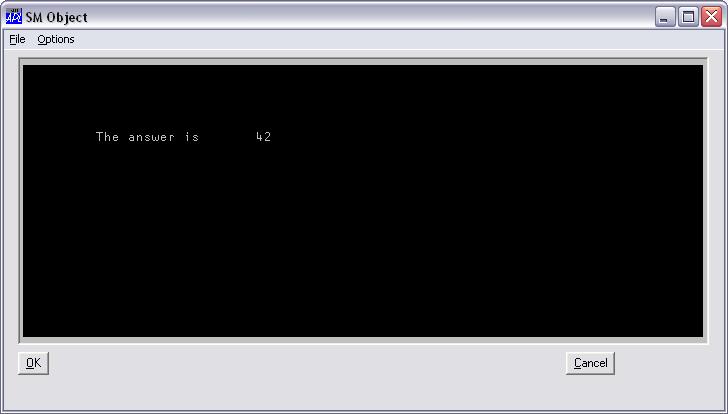

# SM

Object

Defines a window for `⎕SM` / `⎕SR` .

This object defines a window for `⎕SM`/`⎕SR` and allows you to combine the functionality of `⎕SM`/`⎕SR` with the "windows" GUI. For example, you can define a [Form](form.md) with a [MenuBar](menubar.md) at the top and a `⎕SM` window beneath it, with perhaps some [Button](button.md)s alongside.

To allow the user to interact with both `⎕SM` and other top-level objects, you must specify the names of these objects in the right argument of `⎕SR`. Thus the statement:
```apl
      CTX ← KEYS CTX ⎕SR 1 2 3 'Form1'
```

allows the user to interact with fields (rows) 1-3 of `⎕SM` **and** with the object `'Form1'` and its children. Callback functions associated with events in `'Form1'` will be executed automatically by `⎕SR`. If an enabled event without a callback occurs, the event will be placed on [`⎕DQ`](../../language-reference-guide/system-functions/dq.md)'s internal queue and `⎕SR` will terminate. The nature of the termination (that is, that it was caused by an event in an object) is reported by the value 131072 (2*17) in the fourth element of `⎕SR`'s result. The specific event ([Configure](../methodorevents/configure.md), [MouseUp](../methodorevents/mouseup.md), etc.) is however not reported. It is therefore generally preferable to use callbacks.

The [Posn](../properties/posn.md), [Size](../properties/size.md) and [Coord](../properties/coord.md) properties allow you to specify the position and size of the window occupied by `⎕SM` within its parent [Form](form.md). However, the `⎕SM` window is automatically sized to be an exact number of characters in height and width, which is reported in `⎕SD`.

The [Border](../properties/border.md) property may be used to specify a border around the outside of the `⎕SM` window. It is a number with the value 0 (no border) or 1 (1 pixel border). The default is 0. The [EdgeStyle](../properties/edgestyle.md) property may be used to give the object a 3-dimensional appearance. Its default value is `'Recess'`. The area within the SM object that is defined by `⎕SM` is necessarily a multiple of the character size. The region between this area and the outer edges of the object is coloured by the background colour specified by [BCol](../properties/bcol.md), or may be filled with a bitmap specified by [Picture](../properties/picture.md).

If the user resizes the [Form](form.md) which contains the SM object, the SM object will generate a [Configure](../methodorevents/configure.md) event if enabled. If the [Configure](../methodorevents/configure.md) event is not enabled, `⎕SR` will terminate with a `RESIZE` error which can be trapped using `⎕TRAP`. Either method can be used to reformat `⎕SM` as appropriate.

The [MouseDown](../methodorevents/mousedown.md) event can be used to bring up a pop-up menu. However, mouse events are not reported over `⎕SM` fields because `⎕SR` uses these to position the cursor.

The illustration shown below was produced as follows :
```apl
      'TEST'      ⎕WC 'Form' 'SM Object' (60 10)(40 50)
      'TEST.MB'   ⎕WC 'MenuBar'
      'TEST.MB.F' ⎕WC 'Menu' '&File'
      'TEST.MB.O' ⎕WC 'Menu' '&Options'
      'TEST.B1'   ⎕WC 'Button' '&OK' (84 2)
      'TEST.B2'   ⎕WC 'Button' '&Cancel' (84 78)
      'TEST.S'    ⎕WC 'SM'(2 2)(80 96)('BCol'192 192 192)
      ⎕SM←↑('The answer is' 5 10)(42 5 30)
```



## Application

Parents: [Form](../objects/form.md), [Group](../objects/group.md), [PropertyPage](../objects/propertypage.md), [SubForm](../objects/subform.md), [ToolBar](../objects/toolbar.md), [ToolControl](../objects/toolcontrol.md)

Children: [Cursor](../objects/cursor.md), [Timer](../objects/timer.md)

Properties (default order): [Type](../properties/type.md), [Posn](../properties/posn.md), [Size](../properties/size.md), [Coord](../properties/coord.md), [Border](../properties/border.md), [Visible](../properties/visible.md), [Event](../properties/event.md), [Sizeable](../properties/sizeable.md), [Dragable](../properties/dragable.md), [BCol](../properties/bcol.md), [Picture](../properties/picture.md), [CursorObj](../properties/cursorobj.md), [AutoConf](../properties/autoconf.md), [Data](../properties/data.md), [Attach](../properties/attach.md), [EdgeStyle](../properties/edgestyle.md), [Handle](../properties/handle.md), [Hint](../properties/hint.md), [HintObj](../properties/hintobj.md), [Tip](../properties/tip.md), [TipObj](../properties/tipobj.md), [AcceptFiles](../properties/acceptfiles.md), [KeepOnClose](../properties/keeponclose.md), [Redraw](../properties/redraw.md), [TabIndex](../properties/tabindex.md), [MethodList](../properties/methodlist.md), [ChildList](../properties/childlist.md), [EventList](../properties/eventlist.md), [PropList](../properties/proplist.md)

Properties (alphabetical order): [AcceptFiles](../properties/acceptfiles.md), [Attach](../properties/attach.md), [AutoConf](../properties/autoconf.md), [BCol](../properties/bcol.md), [Border](../properties/border.md), [ChildList](../properties/childlist.md), [Coord](../properties/coord.md), [CursorObj](../properties/cursorobj.md), [Data](../properties/data.md), [Dragable](../properties/dragable.md), [EdgeStyle](../properties/edgestyle.md), [Event](../properties/event.md), [EventList](../properties/eventlist.md), [Handle](../properties/handle.md), [Hint](../properties/hint.md), [HintObj](../properties/hintobj.md), [KeepOnClose](../properties/keeponclose.md), [MethodList](../properties/methodlist.md), [Picture](../properties/picture.md), [Posn](../properties/posn.md), [PropList](../properties/proplist.md), [Redraw](../properties/redraw.md), [Size](../properties/size.md), [Sizeable](../properties/sizeable.md), [TabIndex](../properties/tabindex.md), [Tip](../properties/tip.md), [TipObj](../properties/tipobj.md), [Type](../properties/type.md), [Visible](../properties/visible.md)

Methods: [Animate](../methodorevents/animate.md), [Detach](../methodorevents/detach.md), [GetFocus](../methodorevents/getfocus.md), [GetFocusObj](../methodorevents/getfocusobj.md), [GetTextSize](../methodorevents/gettextsize.md)

Events: [Close](../methodorevents/close.md), [Configure](../methodorevents/configure.md), [Create](../methodorevents/create.md), [DragDrop](../methodorevents/dragdrop.md), [Help](../methodorevents/help.md), [MouseDblClick](../methodorevents/mousedblclick.md), [MouseDown](../methodorevents/mousedown.md), [MouseEnter](../methodorevents/mouseenter.md), [MouseLeave](../methodorevents/mouseleave.md), [MouseUp](../methodorevents/mouseup.md)
