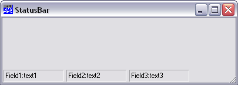

# StatusBar

Object

This object is used to manage [StatusField](statusfield.md) objects which display  information for the user.

The StatusBar is a container object that manages [StatusField](statusfield.md)s. [StatusField](statusfield.md) objects display textual information and are typically used for help messages and for monitoring the status of an application. They can also be used to automatically report the status of the Caps Lock, Num Lock, Scroll Lock, and Insert keys.
 
```apl
'TEST'⎕WC'Form' 'StatusBar' ('EdgeStyle' 'Default') 
'TEST.SB'⎕WC'StatusBar'
'TEST.SB.S1'⎕WC'StatusField' 'Field1:' 'text1'
'TEST.SB.S2'⎕WC'StatusField' 'Field2:' 'text2'
'TEST.SB.S3'⎕WC'StatusField' 'Field3:' 'text3'

```



The [Align](../properties/align.md) property determines to which side of the parent [Form](form.md) or [SubForm](subform.md) the StatusBar is attached. By default, a StatusBar is positioned along the lower edge of the [Form](form.md) ([Align ](../properties/align.md)`'Bottom')`.  Using the [Align](../properties/align.md), [Posn](../properties/posn.md) and [Size](../properties/size.md) properties you may create StatusBars in different positions and with differing sizes if you wish. The [Align](../properties/align.md) property controls how the StatusBar reacts to its parent [Form](form.md) being resized. If [Align](../properties/align.md) is `'Top'` or `'Bottom'`, the StatusBar remains fixed in height but stretches and shrinks sideways with the [Form](form.md). If [Align](../properties/align.md) is `'Left'` or `'Right'`, the StatusBar remains fixed in width and stretches and shrinks vertically with the [Form](form.md).

By default a StatusBar has a Button Face colour background and the value of its [EdgeStyle](../properties/edgestyle.md) property is `'Default'`. This gives it the appearance shown above.

Unless you specify the position and size of its children, a StatusBar automatically manages their geometry. The first [StatusField](statusfield.md) is positioned just inside its top left corner. If [Align](../properties/align.md) is `'Top'` or `'Bottom'`, the next [StatusField](statusfield.md) is positioned alongside the first but with a small gap between them. Subsequent [StatusField](statusfield.md)s are added in a similar fashion. If [Align](../properties/align.md) is `'Left'` or `'Right'`, the second and subsequent [StatusField](statusfield.md)s are added below the first with a similar gap between them. In either case you can position and size the [StatusField](statusfield.md)s explicitly if you wish.

If you attempt to add a [StatusField](statusfield.md) that would extend beyond the right edge ([Align ](../properties/align.md)`'Top'` or `'Bottom'`) or bottom edge ([Align](../properties/align.md) `'Left'` or `'Right'`) the behaviour depends upon the value of [HScroll](../properties/hscroll.md) or [VScroll](../properties/vscroll.md). If [HScroll](../properties/hscroll.md) is 0 (the default) and [Align](../properties/align.md) is `'Top'` or `'Bottom'`, the [StatusField](statusfield.md) is added below the first one, thereby starting a new row. If [VScroll](../properties/vscroll.md) is 0 (the default) and [Align](../properties/align.md) is `'Left'` or `'Right'`, it is added to the right of the first one thereby starting a new column. If [HScroll](../properties/hscroll.md) or [VScroll](../properties/vscroll.md) is `¯1` or `¯2`, the new [StatusField](statusfield.md) is simply positioned in the same row or column and may be scrolled into view using a mini scrollbar. A value for [HScroll](../properties/hscroll.md) or [VScroll](../properties/vscroll.md) of `¯1` causes the mini scrollbar to be permanently present in the [Scroll](scroll.md) Bar. A value of `¯2` causes it to appear only when required.

[VScroll](../properties/vscroll.md) and [HScroll](../properties/hscroll.md) may only be set when the object is created and may not subsequently be changed.

## Application

Parents: [ActiveXControl](../objects/activexcontrol.md), [CoolBand](../objects/coolband.md), [Form](../objects/form.md), [SubForm](../objects/subform.md)

Children: [Bitmap](../objects/bitmap.md), [BrowseBox](../objects/browsebox.md), [Circle](../objects/circle.md), [Cursor](../objects/cursor.md), [Ellipse](../objects/ellipse.md), [FileBox](../objects/filebox.md), [Font](../objects/font.md), [Icon](../objects/icon.md), [Image](../objects/image.md), [Marker](../objects/marker.md), [Poly](../objects/poly.md), [ProgressBar](../objects/progressbar.md), [Rect](../objects/rect.md), [StatusField](../objects/statusfield.md), [Text](../objects/text.md), [Timer](../objects/timer.md)

Properties (default order): [Type](../properties/type.md), [Posn](../properties/posn.md), [Size](../properties/size.md), [Coord](../properties/coord.md), [Align](../properties/align.md), [Border](../properties/border.md), [Active](../properties/active.md), [Visible](../properties/visible.md), [Event](../properties/event.md), [VScroll](../properties/vscroll.md), [HScroll](../properties/hscroll.md), [Sizeable](../properties/sizeable.md), [FontObj](../properties/fontobj.md), [FCol](../properties/fcol.md), [BCol](../properties/bcol.md), [Picture](../properties/picture.md), [CursorObj](../properties/cursorobj.md), [AutoConf](../properties/autoconf.md), [YRange](../properties/yrange.md), [XRange](../properties/xrange.md), [Data](../properties/data.md), [Attach](../properties/attach.md), [TextSize](../properties/textsize.md), [EdgeStyle](../properties/edgestyle.md), [Handle](../properties/handle.md), [Hint](../properties/hint.md), [HintObj](../properties/hintobj.md), [Tip](../properties/tip.md), [TipObj](../properties/tipobj.md), [Translate](../properties/translate.md), [Accelerator](../properties/accelerator.md), [AcceptFiles](../properties/acceptfiles.md), [KeepOnClose](../properties/keeponclose.md), [Redraw](../properties/redraw.md), [TabIndex](../properties/tabindex.md), [MethodList](../properties/methodlist.md), [ChildList](../properties/childlist.md), [EventList](../properties/eventlist.md), [PropList](../properties/proplist.md)

Properties (alphabetical order): [Accelerator](../properties/accelerator.md), [AcceptFiles](../properties/acceptfiles.md), [Active](../properties/active.md), [Align](../properties/align.md), [Attach](../properties/attach.md), [AutoConf](../properties/autoconf.md), [BCol](../properties/bcol.md), [Border](../properties/border.md), [ChildList](../properties/childlist.md), [Coord](../properties/coord.md), [CursorObj](../properties/cursorobj.md), [Data](../properties/data.md), [EdgeStyle](../properties/edgestyle.md), [Event](../properties/event.md), [EventList](../properties/eventlist.md), [FCol](../properties/fcol.md), [FontObj](../properties/fontobj.md), [Handle](../properties/handle.md), [Hint](../properties/hint.md), [HintObj](../properties/hintobj.md), [HScroll](../properties/hscroll.md), [KeepOnClose](../properties/keeponclose.md), [MethodList](../properties/methodlist.md), [Picture](../properties/picture.md), [Posn](../properties/posn.md), [PropList](../properties/proplist.md), [Redraw](../properties/redraw.md), [Size](../properties/size.md), [Sizeable](../properties/sizeable.md), [TabIndex](../properties/tabindex.md), [TextSize](../properties/textsize.md), [Tip](../properties/tip.md), [TipObj](../properties/tipobj.md), [Translate](../properties/translate.md), [Type](../properties/type.md), [Visible](../properties/visible.md), [VScroll](../properties/vscroll.md), [XRange](../properties/xrange.md), [YRange](../properties/yrange.md)

Methods: [Animate](../methodorevents/animate.md), [ChooseFont](../methodorevents/choosefont.md), [Detach](../methodorevents/detach.md), [GetFocus](../methodorevents/getfocus.md), [GetFocusObj](../methodorevents/getfocusobj.md), [GetTextSize](../methodorevents/gettextsize.md)

Events: [Close](../methodorevents/close.md), [Configure](../methodorevents/configure.md), [ContextMenu](../methodorevents/contextmenu.md), [Create](../methodorevents/create.md), [DragDrop](../methodorevents/dragdrop.md), [DropFiles](../methodorevents/dropfiles.md), [DropObjects](../methodorevents/dropobjects.md), [Expose](../methodorevents/expose.md), [FontCancel](../methodorevents/fontcancel.md), [FontOK](../methodorevents/fontok.md), [Help](../methodorevents/help.md), [MouseDblClick](../methodorevents/mousedblclick.md), [MouseDown](../methodorevents/mousedown.md), [MouseEnter](../methodorevents/mouseenter.md), [MouseLeave](../methodorevents/mouseleave.md), [MouseMove](../methodorevents/mousemove.md), [MouseUp](../methodorevents/mouseup.md), [MouseWheel](../methodorevents/mousewheel.md), [Select](../methodorevents/select.md)
