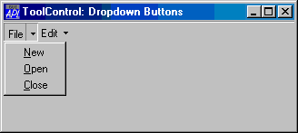

# ToolButton

Object

The ToolButton object represents a selectable button in a [ToolControl](toolcontrol.md) object.

A ToolButton displays a text string, defined by its [Caption](../properties/caption.md) property, and an image defined by its [ImageIndex](../properties/imageindex.md) property. Apart from these characteristics, the appearance of a ToolButton is controlled by its parent [ToolControl](toolcontrol.md) object.

[ImageIndex](../properties/imageindex.md) is an index into an [ImageList](imagelist.md) which contains a set of icons or bitmaps. The [ImageList](imagelist.md) itself is named by the [ImageListObj](../properties/imagelistobj.md) property of the parent [ToolControl](toolcontrol.md).

Typically, you will create up to three [ImageLists](imagelist.md) as children of the [ToolControl](toolcontrol.md). These will be used to specify the pictures of the ToolButton objects in their normal, highlighted (sometimes termed *hot*) and inactive states respectively. The set of images in each [ImageList](imagelist.md) is then defined by creating unnamed [Bitmap](bitmap.md) or [Icon](icon.md) objects as children. Finally, when you create each ToolButton you specify [ImageIndex](../properties/imageindex.md), selecting the three pictures which represent the three possible states of the button.

If you specify only a single [ImageList](imagelist.md), the *picture* on the ToolButton will be the same in all three states.

The behaviour and appearance of a ToolButton is further defined by its [Style](../properties/style.md) property, which may be `'Push'`, `'Check'`, `'Radio'`, `'Separator'` or `'DropDown'`.

Push buttons are used to generate actions and pop in and out when clicked. Radio and Check buttons are used to select options and have two states, normal (out) and selected (in). Their [State](../properties/state.md) property is 0 when the button is in its normal (unselected state) or 1 when it is selected.

A group of adjacent ToolButtons with [Style ](../properties/style.md)`'Radio'` defines a set in which only one of the ToolButtons may be selected at any one time. The act of selecting one will automatically deselect any other. A group of Radio buttons must be separated from Check buttons or other groups of Radio buttons by ToolButtons of another [Style](../properties/style.md).

A ToolButton with [Style ](../properties/style.md)`'Separator '`has no [Caption](../properties/caption.md) or picture, but appears as a vertical line and is used to separate groups of buttons.

A ToolButton with [Style ](../properties/style.md)`'DropDown'` has an associated popup [Menu](menu.md) object which is named by its [Popup](../properties/popup.md) property. There are two cases to consider.

If the [ShowDropDown](../properties/showdropdown.md) property of the parent [ToolControl](toolcontrol.md) is 0, clicking the ToolButton causes the popup menu to appear. In this case, the ToolButton itself does not itself generate a [Select](../methodorevents/select.md) event; you must rely on the user selecting a [MenuItem](menuitem.md) to specify a particular action.

If the [ShowDropDown](../properties/showdropdown.md) property of the parent [ToolControl](toolcontrol.md) is 1, clicking the dropdown button causes the popup menu to appear; clicking the ToolButton itself generates a Select event, but does not display the popup menu.

The following example illustrates the use of DropDown buttons:
```apl
'F'⎕WC'Form' 'ToolControl: Dropdown Buttons'('Size' 20 40)
'F.TB'⎕WC'ToolControl'('ShowDropDown' 1)

:With 'F.FMENU'⎕WC'Menu' ⍝ Popup File menu
    'NEW'⎕WC'MenuItem' '&New'
    'OPEN'⎕WC'MenuItem' '&Open'
    'CLOSE'⎕WC'MenuItem' '&Close'
:EndWith

:With 'F.EMENU'⎕WC'Menu' ⍝ Popup File menu
    'CUT'⎕WC'MenuItem' 'Cu&t'
    'COPY'⎕WC'MenuItem' '&Copy'
    'PASTE'⎕WC'MenuItem' '&Paste'
:EndWith

'F.TB.B1'⎕WC'ToolButton' 'File'('Style' 'DropDown')('Popup' 'F.FMENU')
'F.TB.B2'⎕WC'ToolButton' 'Edit'('Style' 'DropDown')('Popup' 'F.EMENU')
```



## Application

Parents: [ToolControl](../objects/toolcontrol.md)

Children: [Bitmap](../objects/bitmap.md), [Timer](../objects/timer.md)

Properties (default order): [Type](../properties/type.md), [Caption](../properties/caption.md), [Posn](../properties/posn.md), [Size](../properties/size.md), [Style](../properties/style.md), [State](../properties/state.md), [Active](../properties/active.md), [Visible](../properties/visible.md), [Event](../properties/event.md), [ImageIndex](../properties/imageindex.md), [Data](../properties/data.md), [Hint](../properties/hint.md), [HintObj](../properties/hintobj.md), [Tip](../properties/tip.md), [Accelerator](../properties/accelerator.md), [Popup](../properties/popup.md), [KeepOnClose](../properties/keeponclose.md), [MethodList](../properties/methodlist.md), [ChildList](../properties/childlist.md), [EventList](../properties/eventlist.md), [PropList](../properties/proplist.md)

Properties (alphabetical order): [Accelerator](../properties/accelerator.md), [Active](../properties/active.md), [Caption](../properties/caption.md), [ChildList](../properties/childlist.md), [Data](../properties/data.md), [Event](../properties/event.md), [EventList](../properties/eventlist.md), [Hint](../properties/hint.md), [HintObj](../properties/hintobj.md), [ImageIndex](../properties/imageindex.md), [KeepOnClose](../properties/keeponclose.md), [MethodList](../properties/methodlist.md), [Popup](../properties/popup.md), [Posn](../properties/posn.md), [PropList](../properties/proplist.md), [Size](../properties/size.md), [State](../properties/state.md), [Style](../properties/style.md), [Tip](../properties/tip.md), [Type](../properties/type.md), [Visible](../properties/visible.md)

Methods: [Detach](../methodorevents/detach.md)

Events: [Close](../methodorevents/close.md), [Create](../methodorevents/create.md), [Help](../methodorevents/help.md), [MouseDblClick](../methodorevents/mousedblclick.md), [MouseDown](../methodorevents/mousedown.md), [MouseMove](../methodorevents/mousemove.md), [MouseUp](../methodorevents/mouseup.md), [Select](../methodorevents/select.md)
