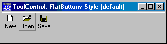
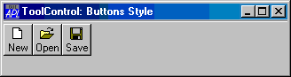
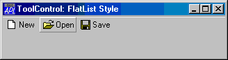
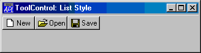
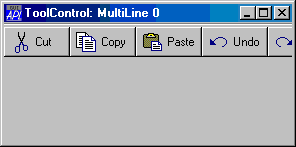
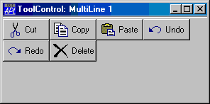
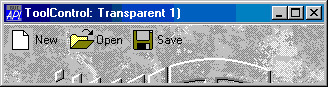
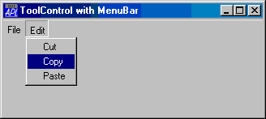

# ToolControl

Object

The ToolControl object provides an interface to the native Windows ToolBar control and supersedes the Dyalog APL [ToolBar](toolbar.md) object.

The tools on a ToolControl are normally represented by [ToolButton](toolbutton.md) objects, but the ToolControl may also act as a parent for other objects, including a [MenuBar](menubar.md) (see below).

Unlike the [ToolBar](toolbar.md), the ToolControl fully determines the positioning of its children automatically and this is governed by their order of creation. The Posn property of any child of a ToolControl is therefore read-only. Furthermore, the height of objects in a ToolControl may be no greater than that of a [ToolButton](toolbutton.md) in the same ToolControl. This in turn is governed by the sizes of the [FontObj](../properties/fontobj.md) and [ImageList](imagelist.md) in use in that ToolControl. ToolControl objects should be used in preference to [ToolBar](toolbar.md) objects.

If a ToolControl is the child of a [Form](form.md), its position and orientation is defined by its [Align](../properties/align.md) property. This property is ignored if the ToolControl is the child of a [CoolBand](coolband.md).

The overall appearance of the [ToolButton](toolbutton.md) objects displayed by the ToolControl is defined by the [Style](../properties/style.md) property of the ToolControl itself, rather than by individual [ToolButtons](toolbutton.md). This may be `'Buttons'`, `'FlatButtons'`, `'List'` or `'FlatList'`.
```apl
'F'⎕WC'Form' 'ToolControl: FlatButtons Style (default)'('Size' 10 40)
'F.TB'⎕WC'ToolControl'

'F.TB.IL'⎕WC'ImageList'('Masked' 0)
'F.TB.IL.'⎕WC'Bitmap'('Comctl32' 120)
'F.TB'⎕WS'ImageListObj' 'F.TB.IL'

'F.TB.B1'⎕WC'ToolButton' 'New'('ImageIndex' 7)
'F.TB.B2'⎕WC'ToolButton' 'Open'('ImageIndex' 8)
'F.TB.B3'⎕WC'ToolButton' 'Save'('ImageIndex' 9)
```




```apl
'F.TB'⎕WC'ToolControl'('Style' 'Buttons')
```


```apl
'F.TB'⎕WC'ToolControl'('Style' 'FlatList')
```


```apl
'F.TB'⎕WC'ToolControl'('Style' 'List')
```

The presence or absence of a recessed line drawn above, below, to the left of, or to the right of the ToolControl is controlled by the [Divider](../properties/divider.md) property whose default is 1 (show divider).

The [MultiLine](../properties/multiline.md) property specifies whether or not [ToolButtons](toolbutton.md) (and other controls) are arranged in several rows (or columns) when there are more than will otherwise fit. If [MultiLine](../properties/multiline.md) is 0 (the default), the ToolControl object clips its children and the user must resize it to bring more objects into view.
```apl
'F'⎕WC'Form' 'ToolControl: MultiLine 0'('Size' 20 36)
'F.TB'⎕WC'ToolControl'('Style' 'List')

'F.TB.IL'⎕WC'ImageList'('Masked' 0)('Size' 24 24)
'F.TB.IL.'⎕WC'Bitmap'('ComCtl32' 121)⍝ STD_LARGE
'F.TB'⎕WS'ImageListObj' 'F.TB.IL'

'F.TB.B1'⎕WC'ToolButton' 'Cut'('ImageIndex' 1)
'F.TB.B2'⎕WC'ToolButton' 'Copy'('ImageIndex' 2)
'F.TB.B3'⎕WC'ToolButton' 'Paste'('ImageIndex' 3)
'F.TB.B4'⎕WC'ToolButton' 'Undo'('ImageIndex' 4)
'F.TB.B5'⎕WC'ToolButton' 'Redo'('ImageIndex' 5)
'F.TB.B6'⎕WC'ToolButton' 'Delete'('ImageIndex' 6)
```




```apl
'F.TB'⎕WC'ToolControl'('MultiLine' 1)('Style' 'List')
```

The [Transparent](../properties/transparent.md) property specifies whether or not the ToolControl is transparent. If so, the visual effect is as if the [ToolButtons](toolbutton.md) (and other controls) were drawn directly on the parent Form as illustrated below:
```apl
'F'⎕WC'Form' 'ToolControl: Transparent 1)'('Size' 10 40)
'F.BM'⎕WC'Bitmap' 'C:\WINDOWS\WINLOGO'
'F'⎕WS'Picture' 'F.BM' 1

'F.TB'⎕WC'ToolControl'('Transparent' 1)('Style' 'FlatList')
'F.TB.IL'⎕WC'ImageList'('Masked' 0)('Size' 24 24)
'F.TB.IL.'⎕WC'Bitmap'('ComCtl32' 121)⍝ STD_LARGE
'F.TB'⎕WS'ImageListObj' 'F.TB.IL'

'F.TB.B1'⎕WC'ToolButton' 'New'('ImageIndex' 7)
'F.TB.B2'⎕WC'ToolButton' 'Open'('ImageIndex' 8)
'F.TB.B3'⎕WC'ToolButton' 'Save'('ImageIndex' 9)
```



The [ShowCaptions](../properties/showcaptions.md) property specifies whether or not the captions of [ToolButton](toolbutton.md) objects are drawn. Its default value is 1 (draw captions). [ToolButtons](toolbutton.md) drawn without captions occupy much less space and [ShowCaptions](../properties/showcaptions.md) provides a quick way to turn captions on/off for user customisation.

The [ShowDropDown](../properties/showdropdown.md) property specifies whether or not a drop-down menu symbol is drawn alongside [ToolButtons](toolbutton.md) which have [Style ](../properties/style.md)`'DropDown'`. [ShowDropDown](../properties/showdropdown.md) also affects the behaviour of such [ToolButton](toolbutton.md) objects when clicked.

The [ButtonsAcceptFocus](../properties/buttonsacceptfocus.md) property determines how the ToolControl responds to the Tab and cursor movement keys.

As a special case, the ToolControl may contain a [MenuBar](menubar.md) as its **only** child. In this case, Dyalog APL causes the menu items to be drawn as buttons as shown below.

Although nothing is done to prevent it, the use of other objects in a ToolControl containing a [MenuBar](menubar.md), is not supported.
```apl
'F'⎕WC'Form' 'ToolControl with MenuBar'('Size' 20 40)
'F.TB'⎕WC'ToolControl'

:With 'F.TB.MB'⎕WC'MenuBar'
    :With 'File'⎕WC'Menu' 'File'
        'New'⎕WC'MenuItem' 'New'
        'Open'⎕WC'MenuItem' 'Open'
        'Close'⎕WC'MenuItem' 'Close'
    :EndWith

    :With 'Edit'⎕WC'Menu' 'Edit'
        'Cut'⎕WC'MenuItem' 'Cut'
        'Copy'⎕WC'MenuItem' 'Copy'
        'Paste'⎕WC'MenuItem' 'Paste'
    :EndWith

:EndWith
```



## Application

Parents: [ActiveXControl](../objects/activexcontrol.md), [CoolBand](../objects/coolband.md), [Form](../objects/form.md), [SubForm](../objects/subform.md)

Children: [Bitmap](../objects/bitmap.md), [BrowseBox](../objects/browsebox.md), [Button](../objects/button.md), [Combo](../objects/combo.md), [ComboEx](../objects/comboex.md), [Cursor](../objects/cursor.md), [Edit](../objects/edit.md), [FileBox](../objects/filebox.md), [Font](../objects/font.md), [Group](../objects/group.md), [Icon](../objects/icon.md), [Image](../objects/image.md), [ImageList](../objects/imagelist.md), [Label](../objects/label.md), [List](../objects/list.md), [ListView](../objects/listview.md), [Locator](../objects/locator.md), [Menu](../objects/menu.md), [MenuBar](../objects/menubar.md), [Metafile](../objects/metafile.md), [MsgBox](../objects/msgbox.md), [OCXClass](../objects/ocxclass.md), [ProgressBar](../objects/progressbar.md), [RichEdit](../objects/richedit.md), [Scroll](../objects/scroll.md), [SM](../objects/sm.md), [Spinner](../objects/spinner.md), [Static](../objects/static.md), [SubForm](../objects/subform.md), [Timer](../objects/timer.md), [ToolButton](../objects/toolbutton.md), [TrackBar](../objects/trackbar.md), [TreeView](../objects/treeview.md), [UpDown](../objects/updown.md)

Properties (default order): [Type](../properties/type.md), [Posn](../properties/posn.md), [Size](../properties/size.md), [Style](../properties/style.md), [Align](../properties/align.md), [Visible](../properties/visible.md), [Event](../properties/event.md), [ImageListObj](../properties/imagelistobj.md), [FontObj](../properties/fontobj.md), [Data](../properties/data.md), [Attach](../properties/attach.md), [Handle](../properties/handle.md), [KeepOnClose](../properties/keeponclose.md), [MultiLine](../properties/multiline.md), [Transparent](../properties/transparent.md), [Divider](../properties/divider.md), [ShowCaptions](../properties/showcaptions.md), [ShowDropDown](../properties/showdropdown.md), [Dockable](../properties/dockable.md), [UndocksToRoot](../properties/undockstoroot.md), [Redraw](../properties/redraw.md), [ButtonsAcceptFocus](../properties/buttonsacceptfocus.md), [MethodList](../properties/methodlist.md), [ChildList](../properties/childlist.md), [EventList](../properties/eventlist.md), [PropList](../properties/proplist.md)

Properties (alphabetical order): [Align](../properties/align.md), [Attach](../properties/attach.md), [ButtonsAcceptFocus](../properties/buttonsacceptfocus.md), [ChildList](../properties/childlist.md), [Data](../properties/data.md), [Divider](../properties/divider.md), [Dockable](../properties/dockable.md), [Event](../properties/event.md), [EventList](../properties/eventlist.md), [FontObj](../properties/fontobj.md), [Handle](../properties/handle.md), [ImageListObj](../properties/imagelistobj.md), [KeepOnClose](../properties/keeponclose.md), [MethodList](../properties/methodlist.md), [MultiLine](../properties/multiline.md), [Posn](../properties/posn.md), [PropList](../properties/proplist.md), [Redraw](../properties/redraw.md), [ShowCaptions](../properties/showcaptions.md), [ShowDropDown](../properties/showdropdown.md), [Size](../properties/size.md), [Style](../properties/style.md), [Transparent](../properties/transparent.md), [Type](../properties/type.md), [UndocksToRoot](../properties/undockstoroot.md), [Visible](../properties/visible.md)

Methods: [Animate](../methodorevents/animate.md), [Detach](../methodorevents/detach.md), [GetFocus](../methodorevents/getfocus.md), [GetFocusObj](../methodorevents/getfocusobj.md), [GetTextSize](../methodorevents/gettextsize.md)

Events: [Close](../methodorevents/close.md), [Configure](../methodorevents/configure.md), [ContextMenu](../methodorevents/contextmenu.md), [Create](../methodorevents/create.md), [DockAccept](../methodorevents/dockaccept.md), [DockCancel](../methodorevents/dockcancel.md), [DockEnd](../methodorevents/dockend.md), [DockMove](../methodorevents/dockmove.md), [DockRequest](../methodorevents/dockrequest.md), [DockStart](../methodorevents/dockstart.md), [DragDrop](../methodorevents/dragdrop.md), [DropFiles](../methodorevents/dropfiles.md), [DropObjects](../methodorevents/dropobjects.md), [Expose](../methodorevents/expose.md), [Help](../methodorevents/help.md), [MouseDblClick](../methodorevents/mousedblclick.md), [MouseDown](../methodorevents/mousedown.md), [MouseEnter](../methodorevents/mouseenter.md), [MouseLeave](../methodorevents/mouseleave.md), [MouseMove](../methodorevents/mousemove.md), [MouseUp](../methodorevents/mouseup.md), [MouseWheel](../methodorevents/mousewheel.md)
