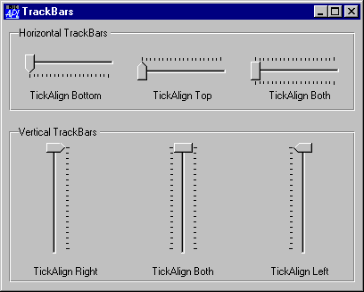

# TrackBar

Object

The TrackBar object is a slider control that allows the user to enter a value by positioning a pointer (thumb) on a scale.

The TrackBar object consists of a window which contains a slider bar, a thumb, and a set of tick marks. The slider in a TrackBar moves in increments that you specify when you create it. For example, if you specify that the TrackBar should have a range of five, the slider can only occupy six positions: a position at the left side of the TrackBar and one position for each increment in the range. Typically, each of these positions is identified by a tick mark. TrackBars can have either a vertical or horizontal orientation. They can have tick marks on either side, both sides, or neither. A selection of different TrackBars is illustrated below.

The position and size of the container window are defined by the [Posn](../properties/posn.md) and [Size](../properties/size.md) properties. Its appearance is defined by the [EdgeStyle](../properties/edgestyle.md), [Border](../properties/border.md) and [BCol](../properties/bcol.md) properties. The defaults are `('EdgeStyle' 'None')`, `('Border' 0)` and `('BCol' 0)`. The default background colour `('BCol' 0)` obtains either the standard Window Background colour, or grey to match the colour of the parent object if it has a 3-dimensional appearance.

The orientation of a TrackBar is determined by the [HScroll](../properties/hscroll.md) and [VScroll](../properties/vscroll.md) properties. A horizontal TrackBar is obtained by setting [HScroll](../properties/hscroll.md) to `¯1` and [VScroll](../properties/vscroll.md) to 0. This is the default. A vertical TrackBar is obtained by setting [VScroll](../properties/vscroll.md) to `¯1` and [HScroll](../properties/hscroll.md) to 0.

[VScroll](../properties/vscroll.md) and [HScroll](../properties/hscroll.md) may only be set when the object is created and may not subsequently be changed.

The [ShowThumb](../properties/showthumb.md) property determines whether or not the thumb is visible. Its default value is 1. You may toggle this property dynamically using `⎕WS`.

The TrackBar optionally displays tick marks at the two ends of the slider bar and spaced out along it. This behaviour is determined by the [HasTicks](../properties/hasticks.md) property which may be 1 (the default) or 0 and may be set *only* when the object is created by `⎕WC`.

If [HasTicks](../properties/hasticks.md) is 1, the position and frequency of the tick marks is determined by the [TickAlign](../properties/tickalign.md) and [TickSpacing](../properties/tickspacing.md) properties. [TickAlign](../properties/tickalign.md) can only be set when the TrackBar is created with `⎕WC` and cannot be altered using `⎕WS`.

The slider and tick marks in a horizontal TrackBar are drawn along the top of the enclosing window. The slider and tick marks in a vertical TrackBar are drawn along the left edge of the window. The position and size of the slider and the thumb may be obtained from the [TrackRect](../properties/trackrect.md) and [ThumbRect](../properties/thumbrect.md) properties which report these values in pixels. These are *read-only* properties and cannot not be set with `⎕WC` or `⎕WS`.

The value of the TrackBar is determined by its [Thumb](../properties/thumb.md) property which is an *integer* that may be set with `⎕WS` or retrieved with `⎕WG`. The [Limits](../properties/limits.md) property specifies the minimum and maximum values of Thumb corresponding to its position at the two ends of the slider bar. The [Step](../properties/step.md) property is a 2-element integer vector defining the small and large increments by which the Thumb moves. A small step is obtained by pressing a cursor movement key; a large step is achieved by clicking the left mouse button either side of the thumb or by pressing Page Up and Page Down. The user may also drag the thumb to a new position or move it directly to either end of the slider by pressing Home or End.

An alternative form of the TrackBar is obtained by setting the [Style](../properties/style.md) property to `'Selection'`. This may only be done when the object is created using `⎕WC`. This style of TrackBar has a slider that is represented by a recessed thick white rectangle instead of a solid black line. Furthermore, you can select a range of values within the TrackBar by setting the [SelRange](../properties/selrange.md) property. This causes the TrackBar to display a solid blue bar within the white slider and to show the corresponding tick marks as small triangles. There is no way for the user to change [SelRange](../properties/selrange.md) directly; you can only do this using `⎕WS`.

In addition to the normal mouse events, the TrackBar generates a [Scroll](../methodorevents/scroll.md) and [ThumbDrag](../methodorevents/thumbdrag.md) event. The [Scroll](../methodorevents/scroll.md) event is the same event that is generated by a Scroll object and is reported when the user repositions the thumb. If enabled, the [ThumbDrag](../methodorevents/thumbdrag.md) event is reported continuously as the user drags the thumb with the mouse and may be used to synchronise the display of a corresponding value in another object.

## Application

Parents: [ActiveXControl](../objects/activexcontrol.md), [CoolBand](../objects/coolband.md), [Form](../objects/form.md), [Grid](../objects/grid.md), [Group](../objects/group.md), [PropertyPage](../objects/propertypage.md), [SubForm](../objects/subform.md), [ToolBar](../objects/toolbar.md), [ToolControl](../objects/toolcontrol.md)

Children: [Bitmap](../objects/bitmap.md), [Circle](../objects/circle.md), [Cursor](../objects/cursor.md), [Ellipse](../objects/ellipse.md), [Font](../objects/font.md), [Icon](../objects/icon.md), [Marker](../objects/marker.md), [Poly](../objects/poly.md), [Rect](../objects/rect.md), [Text](../objects/text.md), [Timer](../objects/timer.md)

Properties (default order): [Type](../properties/type.md), [Posn](../properties/posn.md), [Size](../properties/size.md), [Style](../properties/style.md), [Coord](../properties/coord.md), [Border](../properties/border.md), [Active](../properties/active.md), [Visible](../properties/visible.md), [Event](../properties/event.md), [Thumb](../properties/thumb.md), [Step](../properties/step.md), [VScroll](../properties/vscroll.md), [HScroll](../properties/hscroll.md), [Limits](../properties/limits.md), [SelRange](../properties/selrange.md), [Sizeable](../properties/sizeable.md), [Dragable](../properties/dragable.md), [FontObj](../properties/fontobj.md), [BCol](../properties/bcol.md), [CursorObj](../properties/cursorobj.md), [AutoConf](../properties/autoconf.md), [Data](../properties/data.md), [Attach](../properties/attach.md), [EdgeStyle](../properties/edgestyle.md), [Handle](../properties/handle.md), [Hint](../properties/hint.md), [HintObj](../properties/hintobj.md), [Tip](../properties/tip.md), [TipObj](../properties/tipobj.md), [Translate](../properties/translate.md), [Accelerator](../properties/accelerator.md), [TickAlign](../properties/tickalign.md), [TickSpacing](../properties/tickspacing.md), [HasTicks](../properties/hasticks.md), [ShowThumb](../properties/showthumb.md), [TrackRect](../properties/trackrect.md), [ThumbRect](../properties/thumbrect.md), [AcceptFiles](../properties/acceptfiles.md), [KeepOnClose](../properties/keeponclose.md), [Redraw](../properties/redraw.md), [TabIndex](../properties/tabindex.md), [MethodList](../properties/methodlist.md), [ChildList](../properties/childlist.md), [EventList](../properties/eventlist.md), [PropList](../properties/proplist.md)

Properties (alphabetical order): [Accelerator](../properties/accelerator.md), [AcceptFiles](../properties/acceptfiles.md), [Active](../properties/active.md), [Attach](../properties/attach.md), [AutoConf](../properties/autoconf.md), [BCol](../properties/bcol.md), [Border](../properties/border.md), [ChildList](../properties/childlist.md), [Coord](../properties/coord.md), [CursorObj](../properties/cursorobj.md), [Data](../properties/data.md), [Dragable](../properties/dragable.md), [EdgeStyle](../properties/edgestyle.md), [Event](../properties/event.md), [EventList](../properties/eventlist.md), [FontObj](../properties/fontobj.md), [Handle](../properties/handle.md), [HasTicks](../properties/hasticks.md), [Hint](../properties/hint.md), [HintObj](../properties/hintobj.md), [HScroll](../properties/hscroll.md), [KeepOnClose](../properties/keeponclose.md), [Limits](../properties/limits.md), [MethodList](../properties/methodlist.md), [Posn](../properties/posn.md), [PropList](../properties/proplist.md), [Redraw](../properties/redraw.md), [SelRange](../properties/selrange.md), [ShowThumb](../properties/showthumb.md), [Size](../properties/size.md), [Sizeable](../properties/sizeable.md), [Step](../properties/step.md), [Style](../properties/style.md), [TabIndex](../properties/tabindex.md), [Thumb](../properties/thumb.md), [ThumbRect](../properties/thumbrect.md), [TickAlign](../properties/tickalign.md), [TickSpacing](../properties/tickspacing.md), [Tip](../properties/tip.md), [TipObj](../properties/tipobj.md), [TrackRect](../properties/trackrect.md), [Translate](../properties/translate.md), [Type](../properties/type.md), [Visible](../properties/visible.md), [VScroll](../properties/vscroll.md)

Methods: [Animate](../methodorevents/animate.md), [Detach](../methodorevents/detach.md), [GetFocus](../methodorevents/getfocus.md), [GetFocusObj](../methodorevents/getfocusobj.md), [GetTextSize](../methodorevents/gettextsize.md)

Events: [Close](../methodorevents/close.md), [Configure](../methodorevents/configure.md), [ContextMenu](../methodorevents/contextmenu.md), [Create](../methodorevents/create.md), [DragDrop](../methodorevents/dragdrop.md), [DropFiles](../methodorevents/dropfiles.md), [DropObjects](../methodorevents/dropobjects.md), [Expose](../methodorevents/expose.md), [GotFocus](../methodorevents/gotfocus.md), [Help](../methodorevents/help.md), [KeyPress](../methodorevents/keypress.md), [LostFocus](../methodorevents/lostfocus.md), [MouseDown](../methodorevents/mousedown.md), [MouseMove](../methodorevents/mousemove.md), [MouseUp](../methodorevents/mouseup.md), [Scroll](../methodorevents/scroll.md), [Select](../methodorevents/select.md), [ThumbDrag](../methodorevents/thumbdrag.md)
