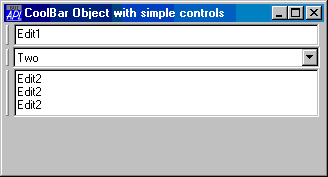
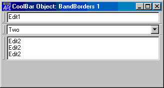

# BandBorders

Property

The BandBorders property specifies whether or not narrow lines are drawn to separate adjacent bands in a [CoolBar](../objects/coolbar.md).

BandBorders is a single number with the value 0 (no lines) or 1 (lines are displayed); the default is 0.

The effect of BandBorders is illustrated below.

## Application

Objects: [CoolBar](../objects/coolbar.md)
