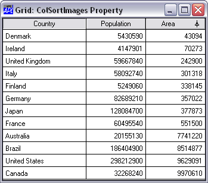

# <span class="name">ColSortImages</span> <span class="right">Property</span> {: .heading}


**Applies To:** [Grid](../objects/grid.md)

**Description**


The ColSortImages property identifies the names of, or refs to, up to three [Bitmap](../objects/bitmap.md) objects that are used to specify the sort images for a [Grid](../objects/grid.md) object.


If ColSortImages is not specified, default images are used.


The [Bitmap](../objects/bitmap.md) specified by the 1st element of ColSortImages is used to display columns that are sorted down.


The [Bitmap](../objects/bitmap.md) specified by the 2nd element of ColSortImages is used to display columns that are unsorted.


The [Bitmap](../objects/bitmap.md) specified by the 3rd element of ColSortImages is used to display columns that are sorted up.
```apl

 'F'⎕WC'Form' 'Grid: ColSortImages Property'
 F.(Coord Size)←'Pixel'(313 341)
 'F.fnt'⎕WC'Font' 'APL385 Unicode' 16
 F.FontObj←F.fnt
 BK←16 16⍴256⊥White←255 255 255

 'F.gu'⎕WC'Bitmap'('CBits'BK)('MaskCol'White)
 'F.gu.'⎕WC'Text' '⍋'(0 3)
 'F.gd'⎕WC'Bitmap'('CBits'BK)('MaskCol'White)
 'F.gd.'⎕WC'Text' '⍒'(0 3)

 'F.G'⎕WC'Grid'('Posn' 0 0)F.Size
 F.G.Values←#.(COUNTRIES,POPULATION,[1.5]AREA)
 F.G.ColTitles←'Country' 'Population' 'Area'
 F.G.CellWidths←140 100 100
 F.G.TitleWidth←0

 F.G.ColSortImages←'F.gd' '' 'F.gu'
 F.G.(Values←Values[⍋Values[;3];])

 F.G.ColSorted 3 1
```





