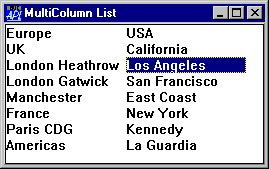

# MultiColumn

Property

MultiColumn is Boolean and specifies whether or not a List object displays its items in a single column (0, the default) or in multiple columns (1). MultiColumn may only be set by `⎕WC` and cannot be changed using `⎕WS` after the object has been created. A MultiColumn List uses the minimum number of columns that are required to make the items fit within it and reconfigures itself automatically when resized.

The following example illustrates its use.
```apl
      'F'⎕WC'Form' 'MultiColumn List'('Size' 23 32)
      'F.L'⎕WC'LIST' AIRPORTS (0 0)(100 100)('MultiColumn' 1)
```



## Application

Objects: [List](../objects/list.md)
