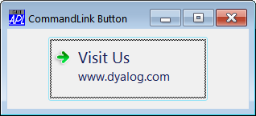

# Note

Property

The Note property applies only to a [Button](../objects/button.md) whose Style is `'CommandLink'`.

It is a character vector (by default empty) that specifies text to be displayed below the [Caption](caption.md).

## Example
```apl
'F'⎕WC'Form' 'CommandLink Button'
'F.clb'⎕WC'Button' 'Visit Us'('Style' 'CommandLink')  
F.clb.Size←80 200
F.clb.Note←'www.dyalog.com'
 
```



## Application

Objects: [Button](../objects/button.md)
