# The Configuration Dialog Box

The **Configuration** dialog box is displayed from the Session by selecting **Configure** from the **Options** menu. It presents many of the interpreter's [configuration parameters](../configuration-parameters/configuration-parameters.md), grouped into tabs; changing a setting and clicking *OK* updates the corresponding parameter. Each tab is described in its own section.

Some tabs are present only in the Unicode edition or only in the Classic edition, as noted in their headings.

## General Tab

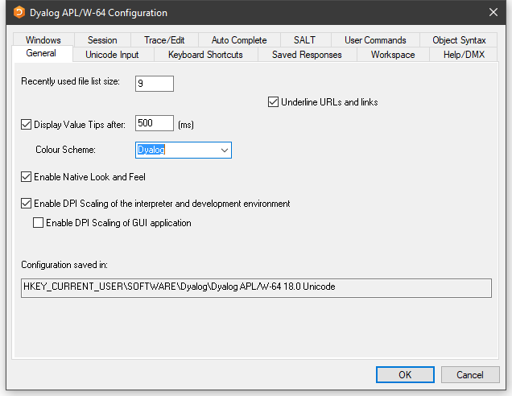

Table: Configuration dialog box – General tab

|Label|Parameter|Description|
|---|---|---|
|Recently used file list size|[File_Stack_Size](../configuration-parameters/file-stack-size.md)|Specifies the number of the most recently used workspaces displayed in the File menu|
|Underline URLs and links|[URLHighlight](../configuration-parameters/urlhighlight.md)|Specifies whether URLs and links are highlighted in Session and Edit windows|
|Display Value Tips|[Enabled](../configuration-parameters/valuetips/enabled.md)|Specifies whether Value Tips are enabled|
|Display Value Tips after|[Delay](../configuration-parameters/valuetips/delay.md)|Specifies the delay before APL displays a Value Tip|
|Colour Scheme|[ColourScheme](../configuration-parameters/valuetips/colourscheme.md)|Specifies the colour scheme used to display Value Tips|
|Enable DPI Scaling of the interpreter and development environment|[AutoDPI](../configuration-parameters/autodpi.md)|Enables or disables DPI scaling for the APL Session|
|Enable DPI scaling of GUI application|[Dyalog_Pixel_Type](../configuration-parameters/dyalog-pixel-type.md)|Determines whether Coord `'Pixel'` is treated as ScaledPixel or RealPixel|
|Configuration saved in|[IniFile](../configuration-parameters/inifile.md)|Specifies the full pathname of the registry folder used by APL|

## Unicode Input Tab (Unicode)

Unicode Edition can optionally select your APL keyboard each time you start APL. To choose this option, select one of your installed APL keyboards, enable the **Activate selected keyboard** checkbox, then click *OK*.

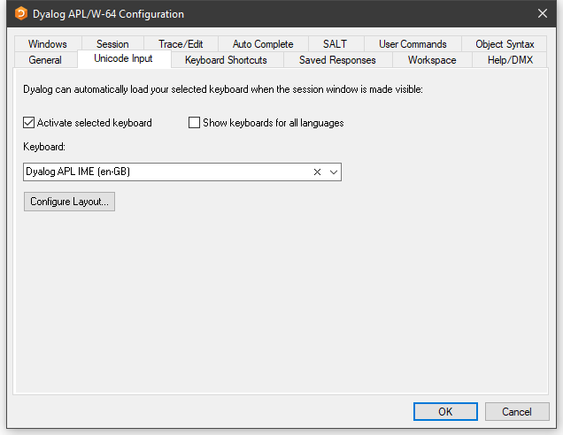

Table: Configuration dialog box – Unicode Input tab

|Label|Parameter|Description|
|---|---|---|
|Activate selected keyboard|[InitialKeyboardLayoutInUse](../configuration-parameters/initialkeyboardlayoutinuse.md)|If checked, the specified APL keyboard is activated on start-up|
|Show keyboards for all Languages|[InitialKeyboardLayoutShowAll](../configuration-parameters/initialkeyboardlayoutshowall.md)|If checked, all installed keyboards are displayed. Otherwise, only Dyalog keyboards are shown|
|Keyboard|[InitialKeyboardLayout](../configuration-parameters/initialkeyboardlayout.md)|The APL keyboard to be selected|
|Configure Layout|&nbsp;|Displays the [Input Method Editor Properties dialog box](#input-method-editor-properties-dialog-box)|

### Input Method Editor Properties Dialog Box

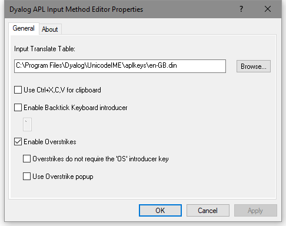

Table: Configuration dialog box – Unicode Input tab (Input Method Editor Properties dialog box)

|Label|Parameter|Description|
|---|---|---|
|Use Ctrl+X,C,V for clipboard|[UseXCV](../configuration-parameters/usexcv.md)|Specifies whether the commonly used keystrokes for copy, cut, and paste are recognised as such|
|Enable Backtick Keyboard introducer|&nbsp;|Enables the *Backtick* keyboard, in which the backtick character introduces APL glyphs. See [Backtick Keyboard](../../windows-ui-guide/ime-configuration.md#backtick-keyboard)|
|Enable Overstrikes|[ResolveOverstrikes](../configuration-parameters/resolveoverstrikes.md)|1 = enable overstrikes. 0 = disable overstrikes|
|Overstrikes do not require the OS introducer key|&nbsp;|1 = IME identifies overstrike operation automatically 0 = IME requires the **&lt;OS&gt;** key (default <kbd>Ctrl</kbd>+<kbd>Bksp</kbd>) to signal an overstrike operation|
|Use Overstrike popup|[OverstrikesPopup](../configuration-parameters/overstrikespopup.md)|1 = enable the overstrike popup. 0 = disable the overstrike popup|

## Input Tab (Classic)

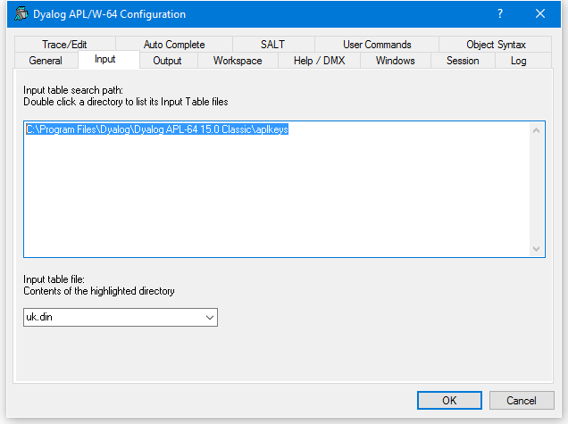

Table: Configuration dialog box – Input tab

|Label                  |Parameter                                           |Description|
|-----------------------|----------------------------------------------------|------------------------------------------------------------------|
|Input table search path|[APLKeys](../configuration-parameters/aplkeys.md)|A list of directories to be searched for the specified input table|
|Input table file       |[APLK](../configuration-parameters/aplk.md)      |The name of the input table file (**.DIN**)|

## Output Tab (Classic)

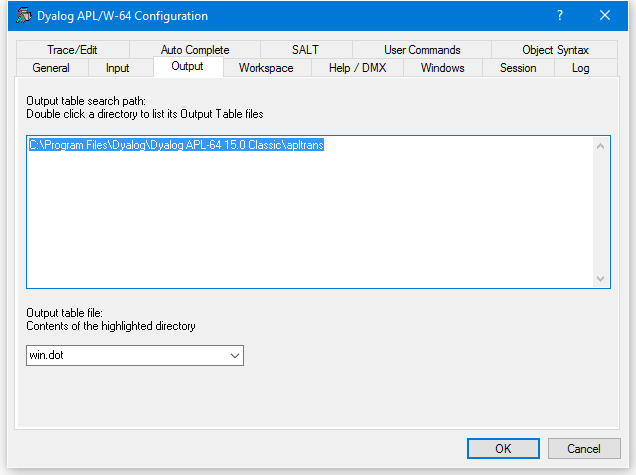

Table: Configuration dialog box – Output tab

|Label                   |Parameter                                             |Description|
|------------------------|------------------------------------------------------|-------------------------------------------------------------------|
|Output table search path|[APLTrans](../configuration-parameters/apltrans.md)|A list of directories to be searched for the specified output table|
|Output table file       |[APLT](../configuration-parameters/aplt.md)        |The name of the output table file (.DOT)|

## Keyboard Shortcuts Tab

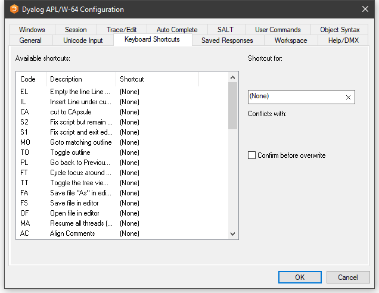

To alter the keystroke associated with a particular action, simply select the action required and press the keystroke. For example, to change the keystroke associated with the action **&lt;UA&gt;** (undo all changes) from (None) to <kbd>Ctrl</kbd>+<kbd>Shift</kbd>+<kbd>u</kbd>, simply select the corresponding row in the list and press <kbd>Ctrl</kbd>+<kbd>Shift</kbd>+<kbd>u</kbd>. If **Confirm before Overwrite** is checked, you will be prompted to confirm or cancel before each and every change is written back to the registry.

Clicking on the column headings sorts on that column; shift and mouse click will sort in reverse order.

## Saved Responses Tab

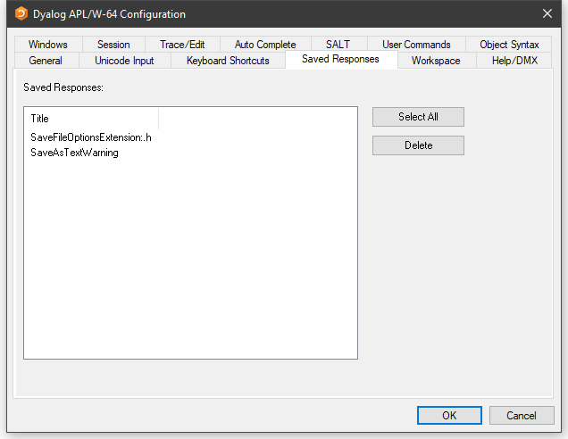

The **Saved Responses** tab of the **Configuration** dialog is used to remove preferences that the user has previously established.

In this example, the user has at some point chosen to save a text file with a `.h` extension as text in the workspace and, by checking the option **Save this response for all files with a ".h" extension**, saved this as a preference for all such text files. Similarly, the user has checked the option **Do not show this message again** when responding to the warning dialog **Saving as text will ...**.

If the user wants to reverse these decisions, even temporarily, it is necessary to select the corresponding option /preference name(s) and click *Delete*. The names are intended to be self-explanatory and are not listed here.

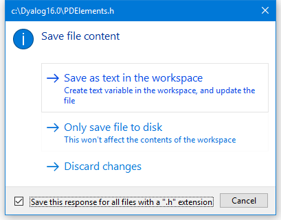

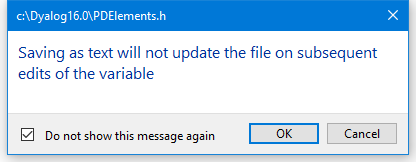

## Workspace Tab

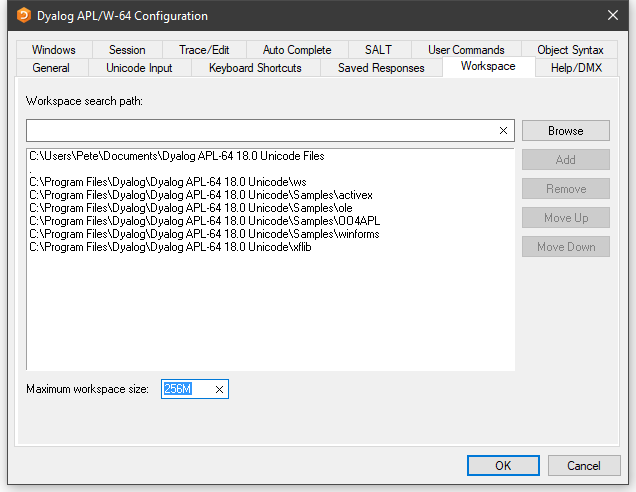

Table: Configuration dialog box – Workspace tab

|Label                 |Parameter                                         |Description|
|----------------------|--------------------------------------------------|-------------------------------------------------------------------------------------------------|
|Workspace search path |[WSPath](../configuration-parameters/wspath.md)|A list of directories to be searched for the specified workspace when the user executes `)LOAD`|
|Maximum workspace size|[MaxWS](../configuration-parameters/maxws.md)  |The maximum size of the workspace|

## Help/DMX Tab

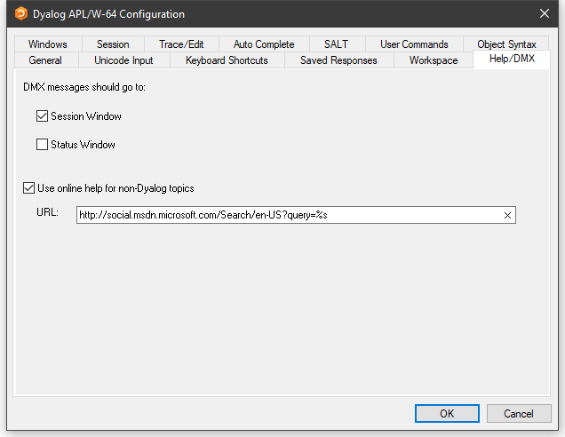

Table: Configuration dialog box – Help/DMX tab

|Label|Parameter|Description|
|---|---|---|
|DMX messages should go to|[DMXOutputOnError](../configuration-parameters/dmxoutputonerror.md)|If checked, these boxes cause APL to display [`⎕DMX`](../../language-reference-guide/system-functions/dmx.md) messages in the corresponding window(s)|
|Use Microsoft's documentation centre for non-Dyalog topics|[UseExternalHelpURL](../configuration-parameters/useexternalhelpurl.md)|If this option is checked, APL will look for help for external objects at Microsoft's documentation centre, which is identified by the specified URL|
|URL|[ExternalHelpURL](../configuration-parameters/externalhelpurl.md)|The URL for the documentation centre|

## Windows Tab

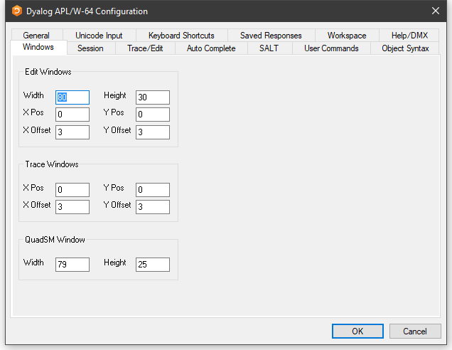

Table: Configuration dialog box – Windows tab (Edit Windows panel)

|Label   |Parameter                                                       |Description|
|--------|----------------------------------------------------------------|---------------------------------------------------------------------------------------------------------------------|
|Width   |[Edit_Cols](../configuration-parameters/edit-cols.md)        |The maximum number of rows displayed in a new edit window|
|Height  |[Edit_Rows](../configuration-parameters/edit-rows.md)        |The maximum number of columns displayed in a new edit window|
|X Pos   |[Edit_First_X](../configuration-parameters/edit-first-x.md)  |The initial horizontal position in characters of the first edit window|
|Y Pos   |[Edit_First_Y](../configuration-parameters/edit-first-y.md)  |The initial vertical position in characters of the first edit window|
|X Offset|[Edit_Offset_X](../configuration-parameters/edit-offset-x.md)|The initial horizontal position in characters of the second and subsequent edit windows relative to the previous one|
|Y Offset|[Edit_Offset_Y](../configuration-parameters/edit-offset-y.md)|The initial vertical position in characters of the second and subsequent edit windows relative to the previous one|

Table: Configuration dialog box – Windows tab (Trace Windows panel)

|Label   |Parameter                                                         |Description|
|--------|------------------------------------------------------------------|----------------------------------------------------------------------------------------------------------------------|
|X Pos   |[Trace_First_X](../configuration-parameters/trace-first-x.md)  |The initial horizontal position in characters of the first trace window|
|Y Pos   |[Trace_First_Y](../configuration-parameters/trace-first-y.md)  |The initial vertical position in characters of the first trace window|
|X Offset|[Trace_Offset_X](../configuration-parameters/trace-offset-x.md)|The initial horizontal position in characters of the second and subsequent trace windows relative to the previous one|
|Y Offset|[Trace_Offset_Y](../configuration-parameters/trace-offset-y.md)|The initial vertical position in characters of the second and subsequent trace windows relative to the previous one|

Table: Configuration dialog box – Windows tab (QuadSM Window panel)

|Label |Parameter                                           |Description|
|------|----------------------------------------------------|--------------------------------------------|
|Width |[SM_Cols](../configuration-parameters/sm-cols.md)|The width of the [`⎕SM`](../../language-reference-guide/system-functions/sm.md) window|
|Height|[SM_Rows](../configuration-parameters/sm-rows.md)|The height of the `⎕SM` window|

## Session Tab

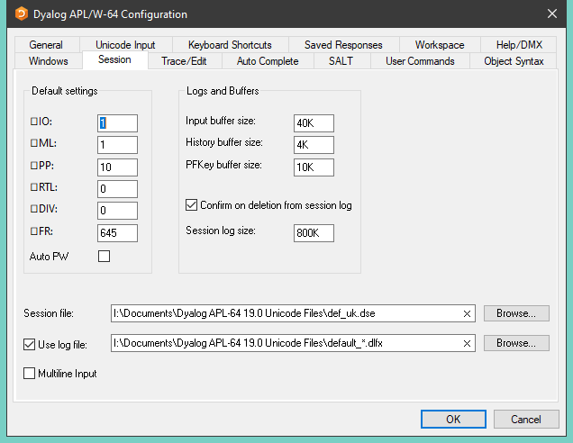

Table: Configuration dialog box – Session tab

|Label|Parameter|Description|
|---|---|---|
|[`⎕IO`](../../language-reference-guide/system-functions/io.md)|[Default_IO](../configuration-parameters/default-io.md)|The default value of `⎕IO` in a `clear ws`|
|[`⎕ML`](../../language-reference-guide/system-functions/ml.md)|[Default_ML](../configuration-parameters/default-ml.md)|The default value of `⎕ML` in a `clear ws`|
|[`⎕PP`](../../language-reference-guide/system-functions/pp.md)|[Default_PP](../configuration-parameters/default-pp.md)|The default value of `⎕PP` in a `clear ws`|
|[`⎕RTL`](../../language-reference-guide/system-functions/rtl.md)|[Default_RTL](../configuration-parameters/default-rtl.md)|The default value of `⎕RTL` in a `clear ws`|
|[`⎕DIV`](../../language-reference-guide/system-functions/div.md)|[Default_DIV](../configuration-parameters/default-div.md)|The default value of `⎕DIV` in a `clear ws`|
|[`⎕WX`](../../language-reference-guide/system-functions/wx.md)|[Default_WX](../configuration-parameters/default-wx.md)|The default value of `⎕WX` in a `clear ws`|
|Auto PW|[Auto_PW](../configuration-parameters/auto-pw.md)|If checked, the value of [`⎕PW`](../../language-reference-guide/system-functions/pw.md) is dynamic and depends on the width of the Session Window|
|Input buffer size|[Input_Size](../configuration-parameters/input-size.md)|The size of the buffer used to store marked lines (lines awaiting execution) in the Session|
|History size|[History_Size](../configuration-parameters/history-size.md)|The size of the buffer used to store previously entered (input) lines in the Session|
|PFKey buffer size|[PFKey_Size](../configuration-parameters/pfkey-size.md)|The size of the buffer used to store PFKey definitions ( [`⎕PFKEY`](../../language-reference-guide/system-functions/pfkey.md) )|
|Confirm on Deletion from Session log|[Confirm_Session_Delete](../configuration-parameters/confirm-session-delete.md)|Specifies whether you are prompted to confirm the deletion of a line from the Session (and Session log)|
|Session log size|[Log_Size](../configuration-parameters/log-size.md)|The size of the Session log buffer|
|Session file|[Session_File](../configuration-parameters/session-file.md)|The name of the Session file in which the definition of your session ( [`⎕SE`](../../language-reference-guide/system-functions/se.md) ) is stored|
|Use log file|[Log_File_InUse](../configuration-parameters/log-file-inuse.md)|Specifies whether the Session log is saved in a session log file|
|Use log file|[Log_File](../configuration-parameters/log-file.md)|The full pathname of the Session log file|
|Multiline Input|[Dyalog_LineEditor_Mode](../configuration-parameters/dyalog-lineeditor-mode.md)|Specifies whether multi-line input is enabled in the Session|

The size-related values in the Session tab are specified as an integer value followed by one of K, M, G, T, P, or E. Where no character is included, the default is K (kilobytes).

## Trace/Edit Tab

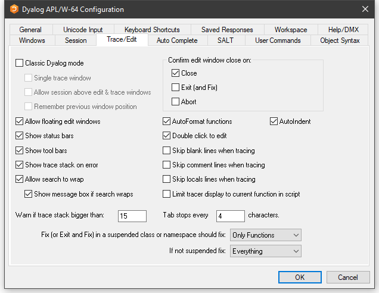

Table: Configuration dialog box – Trace/Edit tab

|Label|Parameter|Description|
|---|---|---|
|Allow floating edit windows|[DockableEditWindows](../configuration-parameters/dockableeditwindows.md)|Allows individual Edit windows to be undocked from (and re-docked in) the main Edit window|
|Show status bars|[StatusOnEdit](../configuration-parameters/statusonedit.md)|Specifies whether status bars are displayed along the bottom of individual Edit windows|
|Show tool bars|[ToolBarsOnEdit](../configuration-parameters/toolbarsonedit.md)|Specifies whether tool bars are displayed along the top of individual Edit windows|
|Show trace stack on error|[Trace_On_Error](../configuration-parameters/trace-on-error.md)|Specifies whether the Tracer is automatically invoked when an error or stop occurs in a defined function|
|Allow search to wrap|[WrapSearch](../configuration-parameters/wrapsearch.md)|Specifies whether Search/Replace in the Editor stops at the top or bottom of the text, or continues from the start or end as appropriate|
|Show message box if text wraps|[WrapSearchMsgBox](../configuration-parameters/wrapsearchmsgbox.md)|Specifies whether a message box is displayed to inform the user when the search wraps|
|Warn if trace stack bigger than|[Trace_Level_Warn](../configuration-parameters/trace-level-warn.md)|Specifies the maximum stack size for automatic deployment of the Tracer|
|Confirm edit window close on Close|[Confirm_Close](../configuration-parameters/confirm-close.md)|Specifies whether a confirmation dialog box is displayed if the user alters the contents of an edit window then closes it without saving|
|Confirm edit window close on Edit (and Fix)|[Confirm_Fix](../configuration-parameters/confirm-fix.md)|Specifies whether a confirmation dialog box is displayed if the user alters the contents of an edit window then saves it using **Fix** or **Exit**|
|Confirm edit window close on Abort|[Confirm_Abort](../configuration-parameters/confirm-abort.md)|Specifies whether a confirmation dialog box is displayed if the user alters the contents of an edit window then aborts the edit session|
|Autoformat functions|[AutoFormat](../configuration-parameters/autoformat.md)|Selects automatic indentation for control structures when function is opened for editing|
|Autoindent|[AutoIndent](../configuration-parameters/autoindent.md)|Selects semi-automatic indentation for control structures while editing|
|Double-click to Edit|[DoubleClickEdit](../configuration-parameters/doubleclickedit.md)|Specifies whether double-clicking  over a name invokes the editor|
|Skip blank lines when tracing|[SkipLines](../configuration-parameters/skiplines.md)|If enabled, this causes the Tracer to automatically skip blank lines|
|Skip comment lines when tracing|[SkipLines](../configuration-parameters/skiplines.md)|If enabled, this causes the Tracer to automatically skip comment lines|
|Skip locals lines when tracing|[SkipLines](../configuration-parameters/skiplines.md)|If enabled, this causes the Tracer to automatically skip locals lines|
|Limit tracer display to current function in script|[AddClassHeaders](../configuration-parameters/addclassheaders.md)|When Tracing the execution of a function in a script, the Tracer displays either just the first line of the script and the function in question (option enabled), or the entire script (option disabled)|
|Paste text as Unicode (Classic Edition only)|[UnicodeToClipboard](../configuration-parameters/unicodetoclipboard.md)|Specifies whether text transferred to and from the Windows clipboard is to be treated as Unicode|
|Tab stops every|[TabStops](../configuration-parameters/tabstops.md)|The number of spaces inserted by pressing <kbd>Tab</kbd> in an edit window|
|Exit and fix ...|[InitFullScriptSusp](../configuration-parameters/initfullscriptsusp.md)|See [Fixing Scripts](#fixing-scripts)|
|If not ...|[InitFullScriptNormal](../configuration-parameters/initfullscriptnormal.md)|See [Fixing Scripts](#fixing-scripts)|

### Fixing Scripts

When using the Editor to edit  a script such as a Class or Namespace you can specify whether, when you Fix the script and Exit  the Editor, just the functions in the script are re-fixed, or whether the whole script is re-executed, thereby re-initialising any Fields or variables defined within.

These two actions always appear in the Editor File menu, but you can specify which is associated with the **&lt;EP&gt;** <kbd>Esc</kbd> key by selecting the appropriate option in the drop-downs labelled:

- Exit and save changes **&lt;EP&gt;** in a suspended class or namespace should fix:
- If not suspended fix:

In both cases, you can select either **Only Functions** or **Everything**.

The label for the corresponding items on the Editor File menu (see [The File Menu (editing a script)](../../windows-ui-guide/editor.md#the-file-menu-editing-a-script)) will change according to which behaviour applies. If you specify a keystroke for **&lt;S1&gt;** in the **Keyboard Shortcuts** tab, this will be associated with the unselected action.

## Auto Complete Tab

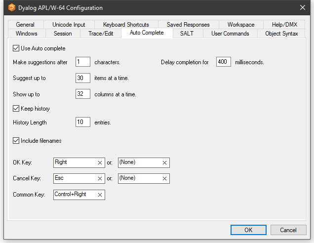

To enter values in the **OK Key** and **Cancel Key** fields, click on the field with the mouse and then press the desired keystroke.

Table: Configuration dialog box – Auto Complete tab

|Label|Parameter|Description|
|---|---|---|
|Use Auto Complete|[Enabled](../configuration-parameters/autocomplete/enabled.md)|Specifies whether Auto Completion is enabled|
|Make suggestions after|[PrefixSize](../configuration-parameters/autocomplete/prefixsize.md)|Specifies the number of characters you must enter before Auto Completion begins to make suggestions|
|Delay completion for|[KeyboardInputDelay](../configuration-parameters/keyboardinputdelay.md)|Specifies the delay in milliseconds before Auto Completion begins to make suggestions|
|Suggest up to|[Rows](../configuration-parameters/autocomplete/rows.md)|Specifies the maximum number of rows (height) in the AutoComplete pop-up suggestions box|
|Show up to|[Cols](../configuration-parameters/autocomplete/cols.md)|Specifies the maximum number of columns (width) in the AutoComplete pop-up suggestion box|
|Keep History|[History](../configuration-parameters/autocomplete/history.md)|Specifies whether AutoComplete maintains a list of previous AutoCompletions|
|History Length|[HistorySize](../configuration-parameters/autocomplete/historysize.md)|Specifies the number of previous AutoCompletions that are maintained|
|Include filenames|[ShowFiles](../configuration-parameters/autocomplete/showfiles.md)|Specifies whether AutoCompletion suggests directory and file names for `)LOAD`, `)COPY`, and `)DROP` system commands|
|OK Key|[CompleteKey1](../configuration-parameters/autocomplete/completekey1.md) [CompleteKey2](../configuration-parameters/autocomplete/completekey2.md)|Specifies two possible keys that can be used to select the current option from the Auto Complete suggestion box|
|Cancel Key|[CancelKey1](../configuration-parameters/autocomplete/cancelkey1.md) [CancelKey2](../configuration-parameters/autocomplete/cancelkey2.md)|Specifies two possible keys that can be used to cancel (hide) the Auto Complete suggestion box|
|Common Key|[CommonKey1](../configuration-parameters/autocomplete/commonkey1.md)|Specifies the key that will auto-complete the *common prefix*|

## SALT Tab

SALT is the Simple APL Library Toolkit, a simple source code management system for Classes and script-based Namespaces. SPICE uses SALT to manage development tools that "plug in" to the Dyalog session.

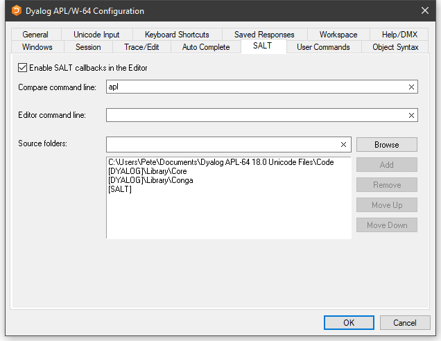

Table: Configuration dialog box – SALT tab

|Label|Parameter|Description|
|---|---|---|
|Enable Salt|AddSALT|Specifies whether SALT is enabled|
|Compare command line:|CompareCMD|The command line for a third-party file comparison tool to be used to compare two versions of a file|
|Editor command line:|Editor|Name of the program to be used to edit script files (default "Notepad")|
|Source folders:|SourceFolder|Sets the SALT working directory; a list of folders to be searched for source code. Include "." on a separate line to include source files from the current working directory|

## User Commands Tab

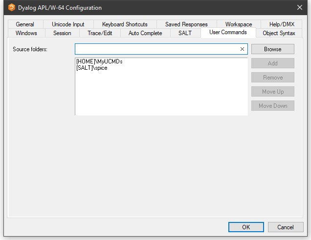

This page is used to specify and organise a list of folders that contain user command files. When you issue a user command, these folders will be searched for the source of the command in the order in which they appear in this list.

Table: Configuration dialog box – User Commands tab

|Label         |Parameter         |Description|
|--------------|------------------|---------------------------------------------------------------------------------------------|
|Source Folders|SALT\CommandFolder|Use this field to add folders to the list of folders that will be searched for User Commands|

## Object Syntax Tab

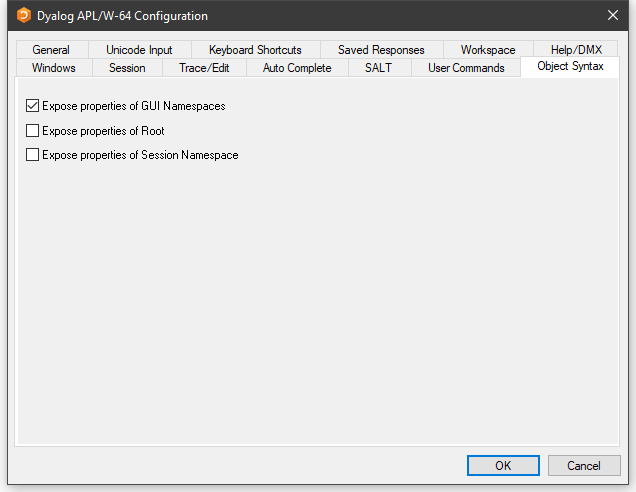

The **Object Syntax** tab of the **Configuration** dialog is used to set your *default preferences* for Object Syntax. Use **Options/Object Syntax** to change the settings for the current workspace.

Table: Configuration dialog box – Object Syntax tab

|Label|Parameter|Description|
|---|---|---|
|Expose properties of GUI Namespaces|[Default_WX](../configuration-parameters/default-wx.md)|Specifies the value of `⎕WX` in a clear workspace|
|Expose properties of Root|[PropertyExposeRoot](../configuration-parameters/propertyexposeroot.md)|Specifies whether the names of properties, methods, and events of the Root object are exposed|
|Expose properties of Session Namespace|[PropertyExposeSE](../configuration-parameters/propertyexposese.md)|Specifies whether the names of properties, methods, and events of the Session object are exposed|
