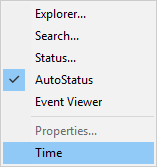
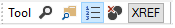

# <span class="name">Configuring the Session</span> {: .heading}

As supplied, your default session will have a menu bar, a tool bar and a status bar. There are many ways in which you may configure this set-up, including the following:

You may select a different APL font or character size.

You may alter the appearance of the menus by changing the Caption properties of the various Menu and MenuItem objects. For example, you may prefer the menus to appear in your own language.

You may alter the structure of the menus. For example, you may wish to create a *Search* menu directly on the menu bar rather than having *Find and Replace* as part of the *Edit* menu.

You may add new Menu and MenuItem objects to the menu bar, or new Button objects to the tool bar, that execute APL functions or expressions for you. You can store the code inside the `⎕SE` namespace so that it is remains available when you switch from one workspace to another.

You may add other objects to the tool bar to allow you to provide input for your functions or to display output. For example, you may display a Combo object that offers you a selection of names applicable to a particular task.

You may add additional toolbars.

You may remove objects too; for example, you can remove fields from the StatusBar or even delete it entirely. Indeed, you may dispense with the menu bar and/or tool bar as well.

This section illustrates how you can configure your session using worked examples. The examples are by no means exhaustive, but are designed to demonstrate the principles. Please note that the structure and names of the objects used in these examples may not be identical to your default session as supplied. Before you attempt to change your session, please check the structure and the object names using `⎕WN` and `⎕WG`. The supplied session was created using the function BUILD_SESSION in the workspace BUILDSE. If you wish to make substantial changes to your session, you may find it most convenient to edit the functions in this workspace, re-run BUILD_SESSION, and then save it.

Please note that these examples assume that *Expose Session Properties* is enabled.

## Changing the Font

The APL session font is defined by the Font property of `⎕SE`. To change the font **permanently**, you should select a different Font and/or size of Font using the combo and spinner boxes on the Session toolbar, and **save your Session**.

Classic Edition is distributed with bitmap fonts suitable for use on your screen, and TrueType fonts for your printer. You *can* use the TrueType font on the screen, but it is less attractive than the bitmap fonts at low resolutions. The bitmap fonts come in two sizes (16 x 8 and 22 x 11) and two weights (normal and bold). You may select other sizes, so long as the height is a multiple of 16 or 22. The scaling is performed automatically by Windows.

## Changing Menu Appearance

The name of the Session MenuBar is '`⎕SE.mb`'. To simplify the specification of object names, we will first change space to the MenuBar itself:
```apl
      )CS ⎕SE.mb
⎕SE.mb
```

The names of the Menu objects owned by the MenuBar are given by the expression:
```apl
      'Menu' ⎕WN ''
file  edit  view  windows  session  log  action  options  tools  threads  help
```

The current caption on the file menu is:
```apl
    file.Caption
&File
```

To change the Caption to Workspace:
```apl
    file.Caption←'Workspace'
```

To change the colour of the *New* option in the *File* menu to red:
```apl
    file.clear.FCol←255 0 0
```

## Reorganising the Menu Structure

This example shows how you may alter the structure of the session menus by adding a *Search* menu to the menu bar to provide access to the *Find* and *Find/Replace* dialog boxes and removing these options from the *Edit* menu.

To simplify the process, we will first change space into the MenuBar object itself:
```apl
      )CS ⎕SE.mb
⎕SE.mb
```

Then we can begin by adding the *Search* menu. You can specify where the new menu is to be added using its Posn property. In this case, *Search* will be added at position 3 (after *Edit*).
```apl
      'search'⎕WC 'Menu' '&Search' 3
```

Next we will remove the Find and Replace MenuItem objects from the *Edit* menu. Their names can be obtained from `⎕WN`:
```apl
      'MenuItem'⎕WN'edit'
edit.prev  edit.next  edit.clear  edit.copy  edit.paste  
edit.find  edit.replace
```

It is worth noting that these MenuItems perform their actions because their Event property is set to execute the system operations `[Find]` and `[Replace]` respectively when they are selected.
```apl
      edit.find.Event
  Select  [Find]  
      edit.replace.Event
  Select  [Replace]
```

The following statement removes them from the *Edit* menu:
```apl
      ⎕EX¨'edit.find' 'edit.replace'
```

and the following statements add them to the *Search* menu:
```apl
      'search.find' ⎕WC 'MenuItem' '&Find'
                        ('Event' 'Select' '[Find]')
      'search.replace' ⎕WC 'MenuItem' '&Replace'
                        ('Event' 'Select' '[Replace]')
```

## Adding your own MenuItem

This example shows how you can add a menu item that executes an APL expression. In this case we will do something very simple; namely add a *Time* option to the Tools menu which will execute `⎕TS`. Notice that the statement also defines a Hint. This will be displayed when you select the option, prior to releasing the mouse button to action it.

Once again, we will start by changing space into the *Tools* menu itself
```apl
      )CS ⎕SE.mb.tools
⎕SE.mb.tools
```

Then we will define a new MenuItem to perform the action we require:
```apl
      'ts'⎕WC'MenuItem' '&Time'
             ('Event' 'Select' '⍎⎕TS')
             ('Hint' 'Display Timestamp')
```

The `⍎` symbol is very important and distinguishes an expression to be executed immediately, as in this case, from a callback function. The resulting *Tools* menu now appears as follows:



A customised Tools menu

Selecting *Time* produces the following output in the session:
```apl
      2007 12 10 17 10 2 0
```

## Adding your own Tool Button

This example shows how you can add a button to the session tool bar that executes an APL function called `XREF`.

`XREF` analyses the function whose name is under the cursor, listing the names of the other functions that it calls  in a Form.
```apl
     ∇ XREF;REFS;FN
[1]    :If 0<⍴FN←'⎕SE'⎕WG'CurObj'
[2]    :AndIf 3=⎕NC FN
[3]        REFS←⎕REFS('⎕SE'⎕WG'CurSpace'),'.',FN
[4]        REFS←(↓REFS)~¨' '
[5]        REFS←(3.1=⎕NC REFS)/REFS
[6]        REFS←REFS~⊂FN
[7]        :If 0<⍴REFS
[8]            'F'⎕WC'Form'('Functions called by ',FN)
[9]            F.FontObj←⎕SE.FontObj
[10]           'F.L'⎕WC'List'REFS(0 0)(100 100)
[11]       :EndIf
[12]   :EndIf
     ∇

```

`XREF[1]` gets the value of the CurObj property of `⎕SE` which reports the name under the cursor.

`XREF[3]` prefixes this name by  its pathname which comes from the CurSpace property which reports the user's current namespace.

To make this function available from a Session tool button, we need to do a number of things. Firstly, we must install the function in `⎕SE` so that it is always there, regardless of the current active workspace. This is easily achieved using the Explorer or `⎕NS`.
```apl
      '⎕SE' ⎕NS 'XREF'
```

Next we will add a new button to the tool bar in the *Tools* CoolBand. Ideally we would use a suitable bitmap, but to simplify the example, we will use a standard text button:
```apl
      )CS ⎕SE.cbtop.bandtb3.tb
⎕SE.cbtop.bandtb3.tb
 
      'xref' ⎕WC 'Button' 'XREF'
      'xref' ⎕WS 'Event' 'Select' '⍎⎕SE.XREF'
```



Adding a tool button

All that remains is to save the new Session.
