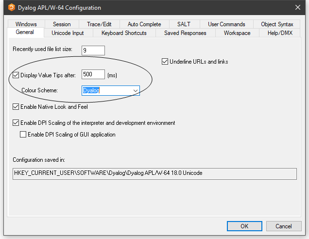

# Configuring Value Tips

You may enable/disable Value Tips and select other options from the *General* tab of the *Configuration* dialog box as shown below.

You may experiment by changing the value of the delay before which Value Tips are displayed, until you find a comfortable setting.

The colour scheme used to display the Value Tip for a function does not need to be the same colour scheme as you use for the function editor.

